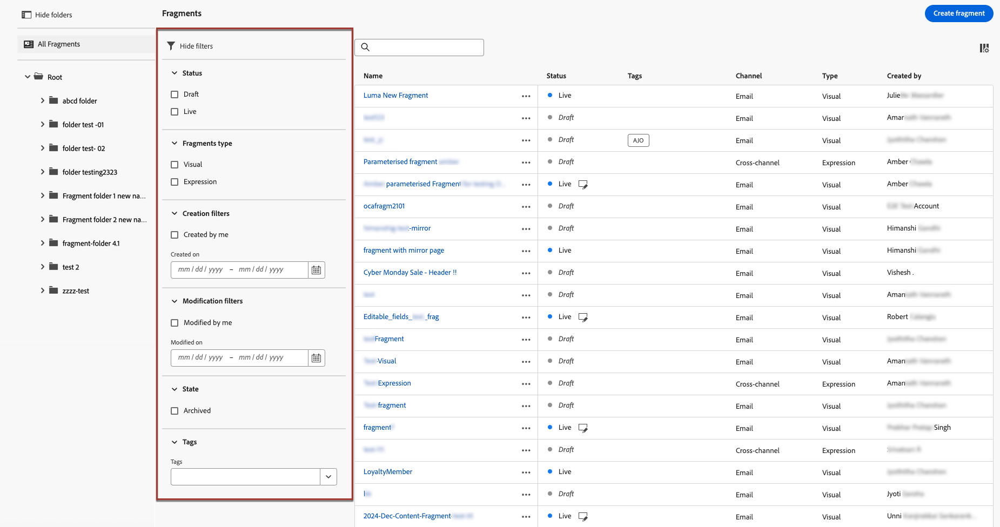

# Trabajo con fragmentos {#fragments}

>[!CONTEXTUALHELP]
>id="ajo_create_fragment"
>title="Definir sus propios fragmentos"
>abstract="Cree y administre fragmentos independientes para que el contenido se pueda reutilizar en varios recorridos y campañas."
>additional-url="https://experienceleague.adobe.com/docs/journey-optimizer/using/content-management/reusable-content/fragments.html#create-fragments" text="Creación de fragmentos"

Un fragmento es un componente reutilizable al que se puede hacer referencia en uno o varios correos electrónicos [!DNL Journey Optimizer] campañas y recorridos.

Esta funcionalidad permite crear previamente varios bloques de contenido personalizados que los usuarios de marketing pueden utilizar para ensamblar rápidamente el contenido del correo electrónico en un proceso de diseño mejorado.

➡️ [Aprenda a administrar, crear y utilizar fragmentos en estos vídeos](#video-fragments)

Para aprovechar al máximo los fragmentos:

* Cree sus propios fragmentos. Puede crear fragmentos visuales o fragmentos de expresiones. [Más información](#create-fragments)

* Utilícelos tantas veces como sea necesario en el contenido. Consulte [Añadir fragmentos visuales](../email/use-visual-fragments.md) y [Aprovechamiento de fragmentos de expresiones](../personalization/use-expression-fragments.md)

## Antes de empezar {#fragment-prerequisites}

Para crear, editar y archivar fragmentos, debe tener el **[!DNL Manage Library Items]** permiso incluido en el **[!DNL Content Library Manager]** perfil del producto. [Más información](../administration/ootb-product-profiles.md#content-library-manager)

En esta versión, se aplican las siguientes limitaciones:

* Los fragmentos visuales solo están disponibles para el canal de correo electrónico

* Los fragmentos de expresiones no están disponibles para los canales web y en la aplicación

## Acceso y administración de fragmentos {#access-manage-fragments}

Para acceder a la lista de fragmentos, seleccione **[!UICONTROL Gestión de contenido]** > **[!UICONTROL Fragmentos]** en el menú de la izquierda.

Todos los fragmentos creados en la zona protegida actual: o bien [desde el **[!UICONTROL Fragmentos]** menú](#create-fragments), ya sea con la variable [Guardar como fragmento](#save-as-fragment) opción - se muestran.

Puede filtrar fragmentos según sus características:

* Tipo: **[!UICONTROL Visual]** o **[!UICONTROL Expresión]**
* Etiquetas
* Fecha de creación o modificación

Puede elegir mostrar todos los fragmentos o solo los elementos que el usuario actual ha creado o modificado.

También puede mostrar el **[!UICONTROL Archivado]** fragmentos. [Más información](#archive-fragments)

Desde el **[!UICONTROL Más acciones]** junto a cada fragmento, puede hacer lo siguiente:

* Duplique un fragmento.

* Utilice el **[!UICONTROL Explorar referencias]** para ver los recorridos, campañas o plantillas donde se utiliza. [Más información](#explore-references)

* Copie un fragmento en otra zona protegida. <!--Learn more?-->

* Archivar un fragmento. [Más información](#archive-fragments)

* Edición del contenido de un fragmento [etiquetas](../start/search-filter-categorize.md#tags).

### Editar fragmentos {#edit-fragments}

Para editar un fragmento, siga los pasos a continuación.

1. Haga clic en el elemento que desee en **[!UICONTROL Fragmentos]** lista.
1. En las propiedades del fragmento, puede hacer lo siguiente [explorar referencias](#explore-references), [administrar su acceso](../administration/object-based-access.md)y actualice los detalles del fragmento, incluido lo siguiente [etiquetas](../start/search-filter-categorize.md#tags).

   

1. Seleccione el botón correspondiente para editar el contenido como lo haría al crear un fragmento desde cero. [Más información](#create-from-scratch)

>[!NOTE]
>
>Al editar un fragmento, los cambios se propagan automáticamente a todo el contenido mediante ese fragmento, excepto al contenido utilizado en **[!UICONTROL Activo]** recorridos o campañas. También puede interrumpir la herencia del fragmento original. Obtenga más información en la [Añadir fragmentos visuales a los correos electrónicos](../email/use-visual-fragments.md#break-inheritance) y [Aprovechamiento de fragmentos de expresiones](../personalization/use-expression-fragments.md#break-inheritance) secciones.

### Explorar referencias {#explore-references}

Puede mostrar la lista de los recorridos, campañas y plantillas de contenido que están utilizando actualmente un fragmento.

Para ello, seleccione **[!UICONTROL Explorar referencias]** ya sea desde el **[!UICONTROL Más acciones]** en la lista de fragmentos o en la pantalla de propiedades del fragmento.

Seleccione una pestaña para alternar entre recorridos, campañas, plantillas y fragmentos. Puede ver su estado y hacer clic en un nombre para redirigirlo al elemento correspondiente donde se hace referencia al fragmento.

>[!NOTE]
>
>Si el fragmento se utiliza en un recorrido, campaña o plantilla que tenga una etiqueta que le impida acceder a él, verá un mensaje de alerta sobre la pestaña seleccionada. [Obtenga más información sobre el Control de acceso de nivel de objeto (OLAC)](../administration/object-based-access.md)

### Archivar fragmentos {#archive-fragments}

Puede limpiar la lista de fragmentos de los elementos que ya no son relevantes para su marca.

Para ello, haga clic en el **[!UICONTROL Más acciones]** junto al fragmento deseado y seleccione. **[!UICONTROL Archivar]**. Desaparecerá de la lista de fragmentos, lo que impide que los usuarios lo utilicen en futuros correos electrónicos o plantillas.

>[!NOTE]
>
>Si archiva un fragmento que se utiliza en un contenido, <!--it will remain in the email or template, but you won't be able to select it from the fragment list to edit it-->dicho contenido no se verá afectado.

Para desarchivar un fragmento, filtre por la **[!UICONTROL Archivado]** elementos y seleccione **[!UICONTROL Desarchivar]** desde el **[!UICONTROL Más acciones]** menú. Ahora vuelve a ser accesible desde la lista de fragmentos y se puede utilizar en cualquier correo electrónico o plantilla.

## Creación de fragmentos {#create-fragments}

Existen dos formas de crear fragmentos:

* Cree un fragmento desde cero utilizando **[!UICONTROL Fragmentos]** menú específico. [Descubra cómo](#create-from-scratch)

* Al diseñar contenido, guarde una parte del contenido como fragmento. [Descubra cómo](#save-as-fragment)

Una vez guardado, el fragmento está disponible para utilizarlo en un recorrido, una campaña o una plantilla. Tanto si se crea desde cero como a partir de contenido existente, ahora puede utilizar este fragmento al crear cualquier contenido dentro de [!DNL Journey Optimizer]. Consulte [Añadir fragmentos visuales](../email/use-visual-fragments.md) y [Aprovechamiento de fragmentos de expresiones](../personalization/use-expression-fragments.md)

### Crear desde cero {#create-from-scratch}

Para crear un fragmento desde cero, siga los pasos a continuación.

1. [Acceso a la lista de fragmentos](#access-manage-fragments) a través de **[!UICONTROL Gestión de contenido]** > **[!UICONTROL Fragmentos]** menú izquierdo.

1. Seleccionar **[!UICONTROL Crear fragmento]**.

1. Complete los detalles del fragmento, es decir, el nombre y la descripción (si es necesario).

   

1. Seleccione el tipo de fragmento: [Fragmento visual](#create-visual-fragment) o [Fragmento de expresión](#create-expression-fragment).

1. Para asignar etiquetas de uso de datos personalizadas o principales al fragmento, seleccione **[!UICONTROL Administrar acceso]**. [Obtenga más información sobre el Control de acceso de nivel de objeto (OLAC)](../administration/object-based-access.md).

1. Seleccione o cree etiquetas de Adobe Experience Platform en **[!UICONTROL Etiquetas]** para categorizar el fragmento y mejorar la búsqueda. [Más información](../start/search-filter-categorize.md#tags)

1. Haga clic en **[!UICONTROL Crear]**.

### Crear un fragmento visual {#create-visual-fragment}

>[!CONTEXTUALHELP]
>id="ajo_create_visual_fragment"
>title="Seleccionar el tipo visual"
>abstract="Cree un fragmento visual independiente para que el contenido se pueda reutilizar en un correo electrónico dentro de un recorrido, una campaña o una plantilla de contenido."
>additional-url="https://experienceleague.adobe.com/docs/journey-optimizer/using/email/design-email/add-content/use-visual-fragments.html" text="Añadir fragmentos visuales a los correos electrónicos"

1. [Crear un fragmento](#create-from-scratch) desde el **[!UICONTROL Gestión de contenido]** > **[!UICONTROL Fragmentos]** menú de la izquierda y seleccione **[!UICONTROL Fragmento visual]** escriba.

   >[!NOTE]
   >
   >Actualmente solo para fragmentos visuales la variable **Correo electrónico** El canal es compatible.

1. El [Diseñador de correo electrónico](../email/get-started-email-design.md) muestra. Edite el contenido según sea necesario, del mismo modo que lo haría para cualquier correo electrónico dentro de un recorrido o una campaña.

   >[!NOTE]
   >
   >Puede añadir campos de personalización y contenido dinámico, pero los atributos contextuales no son compatibles con los fragmentos.

   

1. Cuando el fragmento esté listo, haga clic en **[!UICONTROL Guardar]**. Se añade a [lista de fragmentos](#access-manage-fragments).

1. Si es necesario, haga clic en la flecha situada junto al nombre del fragmento para volver al **[!UICONTROL Detalles]** y editarlo en pantalla.

   

Este fragmento ya está listo para utilizarse al crear cualquier [email](../email/get-started-email-design.md) o [plantilla de contenido](content-templates.md) dentro [!DNL Journey Optimizer]. [Descubra cómo](../email/use-visual-fragments.md)

### Creación de un fragmento de expresión {#create-expression-fragment}

>[!CONTEXTUALHELP]
>id="ajo_create_expression_fragment"
>title="Seleccione el tipo de expresión"
>abstract="Cree un fragmento de expresión independiente para que el contenido se pueda reutilizar en varios recorridos y campañas. Al utilizar el Editor de expresiones, puede aprovechar todos los fragmentos de expresiones que se han creado en la zona protegida actual."
>additional-url="https://experienceleague.adobe.com/docs/journey-optimizer/using/content-management/personalization/expression-editor/use-expression-fragments.html" text="Aprovechamiento de fragmentos de expresiones"

1. [Crear un fragmento](#create-from-scratch) desde el **[!UICONTROL Gestión de contenido]** > **[!UICONTROL Fragmentos]** menú de la izquierda y seleccione **[!UICONTROL Fragmento de expresión]** escriba.

1. Seleccione el tipo de código que desea utilizar: **[!UICONTROL HTML]**, **[!UICONTROL JSON]** o **[!UICONTROL Texto]**.

   

   <!--Expression fragments can be used in any channel.-->

1. Haga clic en **[!UICONTROL Crear]**. Se abre el Editor de expresiones.

1. Puede aprovechar las [!DNL Journey Optimizer] Editor de expresiones con todas sus capacidades de personalización y creación. [Más información](../personalization/personalization-build-expressions.md)

   

1. Cuando el fragmento esté listo, haga clic en **[!UICONTROL Guardar]**. Se añade a [lista de fragmentos](#access-manage-fragments).

1. Si es necesario, haga clic en la flecha situada junto al nombre del fragmento para volver al **[!UICONTROL Detalles]** y editarlo en pantalla.

Este fragmento ya está listo para utilizarse al crear contenido dentro de [!DNL Journey Optimizer] Editor de expresiones. [Descubra cómo](../personalization/use-expression-fragments.md)

## Guardar como fragmento {#save-as-fragment}

Al editar contenido en [!DNL Journey Optimizer], puede guardar todo o parte del contenido como fragmento para su reutilización futura.

### Guardar como fragmento visual {#save-as-visual-fragment}

Al diseñar una [plantilla de contenido](content-templates.md) o un [email](../email/get-started-email-design.md) en una campaña o un recorrido, puede guardar una parte del contenido como fragmento visual. Para realizar esto, siga los pasos a continuación.

1. En el [Diseñador de correo electrónico](../email/get-started-email-design.md), haga clic en los puntos suspensivos en la parte superior derecha de la pantalla.

1. Seleccionar **[!UICONTROL Guardar como fragmento]** en el menú desplegable.

   

1. El **[!UICONTROL Guardar como fragmento]** se muestra. Seleccione los elementos que desee incluir en el fragmento, incluidos los campos de personalización y el contenido dinámico. Tenga en cuenta que los atributos contextuales no son compatibles con los fragmentos.

   >[!CAUTION]
   >
   >Sólo se pueden seleccionar secciones adyacentes entre sí. No puede seleccionar una estructura vacía u otro fragmento.

   

1. Haga clic en **[!UICONTROL Crear]**. Complete los detalles del fragmento, es decir, el nombre y la descripción (si es necesario).

1. Para asignar etiquetas de uso de datos personalizadas o principales al fragmento, seleccione **[!UICONTROL Administrar acceso]**. [Obtenga más información sobre el Control de acceso de nivel de objeto (OLAC)](../administration/object-based-access.md).

1. Seleccione o cree etiquetas de Adobe Experience Platform en **Etiquetas** para categorizar la plantilla y mejorar la búsqueda. [Más información](../start/search-filter-categorize.md#tags)

1. Clic **[!UICONTROL Crear]** otra vez. El fragmento se guardará en y se agregará a [lista de fragmentos](#access-manage-fragments), accesible desde el [!DNL Journey Optimizer] menú específico.

   Se convierte en un fragmento independiente que se puede [accedido](#access-manage-fragments), [editado](#edit-fragments) y [archivado](#archive-fragments) como cualquier otro elemento de esa lista.

Ahora puede utilizar este fragmento al crear cualquier [email](../email/get-started-email-design.md) o [plantilla de contenido](content-templates.md) dentro [!DNL Journey Optimizer]. [Descubra cómo](../email/use-visual-fragments.md)

>[!NOTE]
>
>Cualquier cambio en ese nuevo fragmento no se propaga al correo electrónico o a la plantilla de los que proviene. Del mismo modo, cuando el contenido original se edita dentro de ese correo electrónico o plantilla, el nuevo fragmento no se modifica.

### Guardar como fragmento de expresión {#save-as-expression-fragment}

>[!CONTEXTUALHELP]
>id="ajo_perso_library"
>title="Guardar como fragmento de expresión"
>abstract="El Editor de expresiones de [!DNL Journey Optimizer] permite guardar contenido como fragmentos de expresiones. Estas expresiones están disponibles para crear contenido personalizado."

El Editor de expresiones de [!DNL Journey Optimizer] permite guardar contenido como fragmentos de expresiones. Estas expresiones están disponibles para crear contenido personalizado.

Para guardar contenido como un fragmento de expresión, siga los pasos a continuación.

1. En el [Editor de expresiones](../personalization/personalization-build-expressions.md) interfaz, cree una expresión y haga clic en **[!UICONTROL Guardar como fragmento]**.

1. En el panel derecho, escriba un nombre y una descripción para la expresión con el fin de ayudar a los usuarios a encontrarla más fácilmente.

   

1. Clic **[!UICONTROL Guardar fragmento]**.

   <!--An expression fragment cannot be nested inside another fragment.-->

1. El fragmento de expresión se añade a [lista de fragmentos](#access-manage-fragments). Ahora puede utilizarlo para crear contenido personalizado.

>[!NOTE]
>
>Las expresiones no pueden superar los 200 KB.

## Vídeo explicativo {#video-fragments}

Aprenda a administrar, crear y utilizar fragmentos visuales en [!DNL Journey Optimizer].

>[!VIDEO](https://video.tv.adobe.com/v/3419932/?quality=12)

Obtenga información sobre cómo administrar, crear y utilizar fragmentos de expresiones en [!DNL Journey Optimizer].

>[!VIDEO](https://video.tv.adobe.com/v/3424587/?quality=12)
