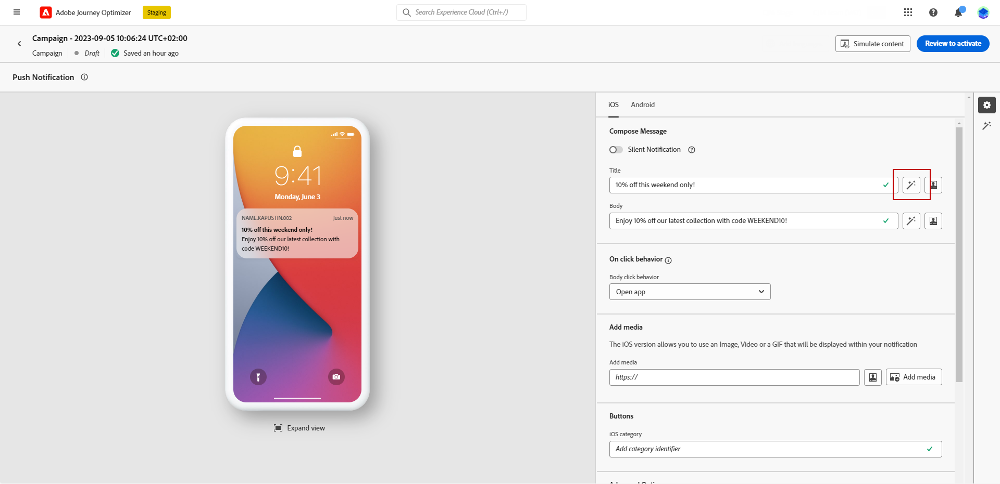
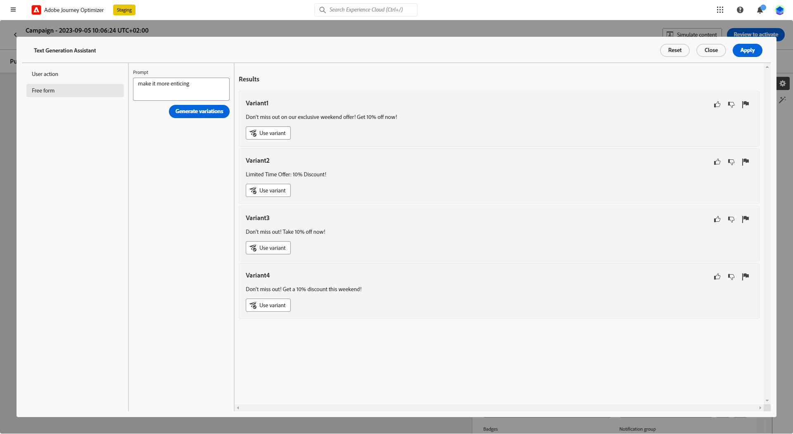

# Generación de contenido con el asistente de contenido {#title-content-assistant}

>[!BEGINSHADEBOX]

**Tabla de contenido**

* [Introducción al Asistente de contenido](gs-generative.md)
* **[Generación de contenido con el asistente de contenido](generative-content.md)**
* [Generación de imágenes con el Asistente de contenido](generative-image.md)

>[!ENDSHADEBOX]

Una vez que haya creado y personalizado los mensajes, lleve el contenido al siguiente nivel con el asistente de contenido.

Al aprovechar el Asistente de contenido, tiene la oportunidad de optimizar el impacto del mensaje experimentando con contenido diferente. Cada variante se considera un Tratamiento único, para medir y comparar qué contenido genera de forma eficaz más clics.

En este ejemplo en particular, aprenda a enviar una atractiva notificación push mediante Experimento de contenido. Siga estos pasos:

1. Después de crear y configurar la campaña de notificaciones push, haga clic en **[!UICONTROL Creación de contenido]**.

1. Utilice el asistente de generación para cambiar el **[!UICONTROL Título]**.

   Junto a su **[!UICONTROL Header]** , haga clic en **[!UICONTROL Editar con el asistente de generación de texto]**.

   

1. Desde el **[!UICONTROL Acción del usuario]** , seleccione la opción **[!UICONTROL Ajuste del texto]**:

   * **[!UICONTROL Resumir]**: utilice esta opción para acortar un texto y mantener lo esencial.

   * **[!UICONTROL Elaborado]**: utilice esta opción para ampliar el contenido con variantes creativas adicionales del asistente de contenido.

   

1. Elija el tono de sus variantes con la variable **[!UICONTROL Cambiar el tono de voz]** menú.

1. Desde el **[!UICONTROL Forma libre]** , también puede proporcionar un mensaje para ajustar mejor los resultados.

   

1. Cuando encuentre la variante adecuada, haga clic en **[!UICONTROL Variante de usuario]** entonces **[!UICONTROL Aplicar]**.

   

1. Después de personalizar el **[!UICONTROL Cuerpo]** de la notificación push, seleccione **[!UICONTROL Mostrar asistente de contenido]**.

   Aquí, ya hay disponible una lista de variaciones que utilizan el contenido original.

   

1. Ajuste el contenido describiendo lo que desea generar.

   Habilite la **[!UICONTROL Mejorar con contenido actual]** para que el asistente de contenido personalice el nuevo contenido en función del mensaje, el nombre de la campaña y la audiencia seleccionada.

1. Clic **[!UICONTROL Reemplazar]** para cambiar el contenido o seleccionar varios **[!UICONTROL Variante]** para crear **[!UICONTROL Tratamientos]** para su Experimentación y haga clic en **Agregar tratamiento(s) X**.

   

1. Acceda a la **[!UICONTROL Configuración del experimento]** o **[!UICONTROL Acciones]** para personalizar aún más el experimento. [Más información](../campaigns/content-experiment.md)

   

1. Después de definir el contenido del mensaje, haga clic en **[!UICONTROL Simular contenido]** para controlar el procesamiento y comprobar la configuración de personalización con perfiles de prueba. [Más información](../content-management/preview-test.md)

1. Cuando el experimento de contenido esté listo, puede hacer clic en en la página de resumen de la campaña **[!UICONTROL Revisar para activar]** para mostrar un resumen de la campaña. Las alertas se muestran si algún parámetro es incorrecto o falta.

1. Antes de iniciar la campaña, compruebe que todas las configuraciones sean correctas y haga clic en **[!UICONTROL Activar]**.

Después de configurar correctamente la experimentación y la campaña, puede realizar un seguimiento de la campaña en el informe de campaña. [Más información](../reports/campaign-global-report.md#experimentation-report)
