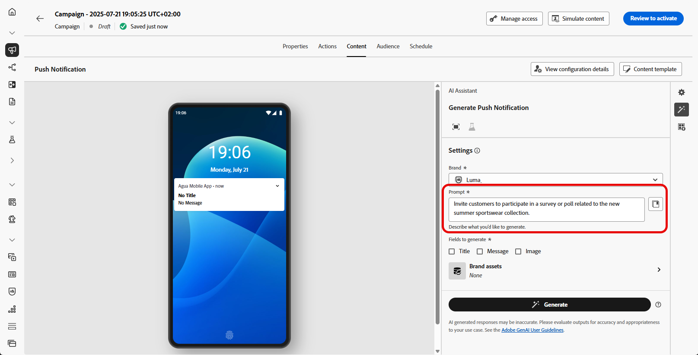

# Generar contenido completo con el asistente de IA {#generative-full-content}

>[!IMPORTANT]
>
>Antes de empezar a usar esta capacidad, lea las [Mecanismos de protecciones y limitaciones](gs-generative.md#generative-guardrails) relacionadas.
> 
>
>Debe aceptar un [acuerdo de usuario](https://www.adobe.com/legal/licenses-terms/adobe-dx-gen-ai-user-guidelines.html) para poder usar el Asistente de IA en Journey Optimizer. Para obtener más información, contacte con su representante de Adobe.

Utilice el asistente de IA en Journey Optimizer para generar experiencias de contenido completas en el correo electrónico, la web, las páginas de aterrizaje y los canales de notificaciones push. El asistente de IA le ayuda a optimizar el impacto de sus envíos mediante la creación de contenido completo que resuene en su audiencia.

## Para canales de correo electrónico y web {#email-web-channels}

El asistente de IA puede producir experiencias de contenido completas para sus campañas de correo electrónico, páginas web y páginas de aterrizaje, lo que genera texto e imágenes. Esta sólida funcionalidad le ayuda a crear contenido atractivo y de marca que se conecta con su audiencia en todos los puntos de contacto digitales.

### Acceso y configuración {#access-configure}

Antes de empezar a crear contenido con el asistente de IA, debe configurar la campaña o el recorrido y abrir el editor de contenido. Siga los pasos a continuación para preparar su espacio de trabajo y acceder al panel Asistente de IA.

1. Cree y configure su campaña o recorrido:
   * **Correo electrónico**: Después de crear y configurar tu campaña de correo electrónico, haz clic en **[!UICONTROL Editar contenido]**. [Más información](../campaigns/create-campaign.md)
   * **Web**: después de crear y configurar la página web, haga clic en **[!UICONTROL Editar página web]**. [Más información](../web/create-web.md)
   * **Página de aterrizaje**: después de crear y configurar la página de aterrizaje, haga clic en **[!UICONTROL Abrir diseñador]**. [Más información](../landing-pages/create-lp.md)

1. En el menú de la derecha, selecciona **[!UICONTROL Asistente de IA]** (o **[!UICONTROL Mostrar asistente de contenido]** para la web).

   {zoomable="yes"}

### Generar contenido {#generate-content}

Con el Asistente de IA abierto, ahora puede configurar los ajustes de generación para crear contenido que coincida con sus objetivos de marca y campaña. Personalice los parámetros de texto e imagen, añada recursos de marca y proporcione indicadores para guiar la IA en la generación de variaciones relevantes para su audiencia.

1. Seleccione su **[!UICONTROL marca]** para asegurarse de que el contenido generado por IA se ajuste a las especificaciones de su marca. [Más información](brands.md) sobre marcas.

1. Ajuste el contenido describiendo lo que desea generar en el campo **[!UICONTROL Preguntar]**.

   Si está buscando ayuda para crear su mensaje, acceda a la **[!UICONTROL Biblioteca de mensajes]**, que proporciona una amplia gama de ideas para mejorar sus campañas. [Más información sobre las prácticas recomendadas para los mensajes](ai-assistant-prompting-guide.md)

   {zoomable="yes"}

1. **Para correos electrónicos**, puede alternar las opciones **[!UICONTROL Línea de asunto]** y **[!UICONTROL Encabezado previo]** para incluirlas en la generación de variante.

1. Adapte el mensaje con la opción **[!UICONTROL Configuración de texto]**:

   * **[!UICONTROL Estrategia de comunicación]**: elige el estilo de comunicación más adecuado para el texto generado.
   * **[!UICONTROL Idiomas]**: elige el idioma del contenido generado.
   * **[!UICONTROL Tono]**: el tono debería interesar a su audiencia. Tanto si desea sonar informativo, lúdico o persuasivo, el asistente de IA puede adaptar el mensaje en consecuencia.

     {zoomable="yes"}

1. Elija su **[!UICONTROL configuración de imagen]**:

   * **[!UICONTROL Tipo de contenido]**: Esto categoriza la naturaleza del elemento visual, distinguiendo entre diferentes formas de representación visual como fotografías, gráficos o arte.
   * **[!UICONTROL Intensidad visual]**: puede controlar el impacto de la imagen ajustando su intensidad. Un ajuste inferior (2) creará una apariencia más suave y restringida, mientras que un ajuste superior (10) hará que la imagen sea más vibrante y visualmente potente.
   * **[!UICONTROL Color y tono]**: El aspecto general de los colores de una imagen y el estado de ánimo o atmósfera que transmite.
   * **[!UICONTROL Iluminación]**: hace referencia al relámpago presente en una imagen, que da forma a su atmósfera y resalta elementos específicos.
   * **[!UICONTROL Composición]**: hace referencia a la disposición de elementos dentro del marco de una imagen

     {zoomable="yes"}

1. En el menú **[!UICONTROL Contenido de referencia]**, haga clic en **[!UICONTROL Cargar archivo]** para agregar cualquier recurso de marca que contenga contenido que pueda proporcionar un asistente de IA de contexto adicional o seleccione uno cargado anteriormente.

   Los archivos cargados anteriormente están disponibles en la lista desplegable **[!UICONTROL Contenido de referencia cargado]**. Simplemente, cambie los recursos que desee incluir en la generación.

   {zoomable="yes"}

1. Una vez que la solicitud esté lista, haga clic en **[!UICONTROL Generar]**.

### Refinamiento y finalización {#refine-finalize}

Después de generar variaciones de contenido, puede ajustar los resultados para asegurarse de que cumplan con sus requisitos exactos. Revise la alineación de la marca, ajuste el tono y el idioma, y prepare el contenido para su activación en la campaña o el recorrido.

1. Después de la generación, examine **[!UICONTROL Variaciones]**.

1. Haga clic en el icono de porcentaje para ver su **[!UICONTROL puntuación de alineación de marca]** e identificar cualquier desalineación con su marca.

   Más información sobre [puntuación de alineación de marca](brands-score.md).

   {zoomable="yes"}

1. Haz clic en **[!UICONTROL Vista previa]** para ver una versión en pantalla completa de la variación seleccionada o en **[!UICONTROL Aplicar]** para reemplazar el contenido actual.

1. Vaya a la opción **[!UICONTROL Refinar]** en la ventana de **[!UICONTROL vista previa]** para obtener acceso a características de personalización adicionales:

   * **[!UICONTROL Reformular]**: vuelva a escribir el mensaje conservando su significado. Esta opción le ayuda a generar frases alternativas, mejorar el flujo o ajustar el estilo sin cambiar el mensaje principal.

   * **[!UICONTROL Use un lenguaje más sencillo]**: aproveche el Asistente para IA a fin de simplificar su lenguaje y garantizar la claridad y accesibilidad para una audiencia más amplia.

   * **[!UICONTROL Traducir]**: Simplifique su idioma para garantizar la claridad y accesibilidad para una audiencia más amplia.

   * **[!UICONTROL Cambiar tono]**: Ajuste el tono del mensaje para que coincida mejor con su estilo de comunicación, es decir, para que sea más amable, profesional, urgente o inspirador.

   * **[!UICONTROL Cambiar estrategia de comunicación]**: modifique el enfoque de mensajería en función de sus objetivos, como crear urgencia o enfatizar atractivo interesante.

     {zoomable="yes"}

1. Abra la pestaña **[!UICONTROL Alineación de marca]** para ver cómo se ajusta su contenido a las [directrices de marca](brands.md).

1. Haga clic en **[!UICONTROL Seleccionar]** cuando encuentre el contenido apropiado.

   También puede habilitar el experimento para el contenido. [Más información](generative-experimentation.md)

1. Inserte campos de personalización para personalizar el contenido en función de los datos de perfiles. A continuación, haga clic en el botón **[!UICONTROL Simular contenido]** para controlar la renderización y compruebe la configuración de personalización con perfiles de prueba. [Más información](../personalization/personalize.md)

1. Revise y active el contenido:
   * **Correo electrónico**: Una vez definido el contenido, la audiencia y la programación, ya puede preparar su campaña de correo electrónico. [Más información](../campaigns/review-activate-campaign.md)
   * **Web**: Una vez que haya definido la configuración de su campaña web y editado el contenido como desee, puede revisar y activar su campaña web. [Más información](../web/create-web.md#activate-web-campaign)
   * **Página de aterrizaje**: Una vez que la página de aterrizaje esté lista, puede publicarla para que esté disponible para usarla en un mensaje. [Más información](../landing-pages/create-lp.md#publish-landing-page)

## Para canales móviles {#mobile-channels}

AI Assistant también admite la generación de contenido para notificaciones push móviles, lo que le permite crear títulos, mensajes e imágenes atractivos para sus aplicaciones móviles. Esto le ayuda a mantener una comunicación coherente y de alta calidad en todos los puntos de contacto de los clientes, incluido el móvil.

### Acceso y configuración {#mobile-access-configure}

Para utilizar el asistente de IA para notificaciones push, primero configure la campaña push y abra el editor de contenido. Los pasos siguientes le guiarán a través de la preparación de su campaña y el acceso a las herramientas del asistente de IA.

1. Después de crear y configurar su campaña de notificaciones push, haga clic en **[!UICONTROL Editar contenido]**.

   Para obtener más información sobre cómo configurar su campaña de notificaciones push, consulte [esta página](../push/create-push.md).

1. Complete **[!UICONTROL detalles básicos]** para su campaña. Una vez finalizado, haga clic en **[!UICONTROL Editar contenido]**.

1. Personalice la notificación push según sea necesario. [Más información](../push/design-push.md)

1. Acceda al menú **[!UICONTROL Mostrar asistente de IA]**.

   {zoomable="yes"}

### Generar contenido {#mobile-generate-content}

Una vez que haya accedido al asistente de IA para notificaciones push, puede configurar los ajustes de generación para crear contenido móvil atractivo. Defina sus preferencias de texto e imagen, seleccione recursos de marca y utilice mensajes para generar variaciones de notificaciones push que involucren a los usuarios móviles.

1. Habilite la opción **[!UICONTROL Usar contenido original]** para el asistente de IA a fin de personalizar el nuevo contenido en función del contenido seleccionado.

1. Seleccione su **[!UICONTROL marca]** para asegurarse de que el contenido generado por IA se ajuste a las especificaciones de su marca. [Más información](brands.md) sobre marcas.

   Tenga en cuenta que la función Marcas se presenta como una versión beta privada y estará disponible de forma progresiva para todos los clientes en futuras versiones.

1. Ajuste el contenido describiendo lo que desea generar en el campo **[!UICONTROL Preguntar]**.

   Si está buscando ayuda para crear su mensaje, acceda a la **[!UICONTROL Biblioteca de mensajes]**, que proporciona una amplia gama de ideas para mejorar sus campañas.

   {zoomable="yes"}

1. Elija el campo que desea generar: **[!UICONTROL Título]**, **[!UICONTROL Mensaje]** o **[!UICONTROL Imagen]**.

1. Adapte el mensaje con la opción **[!UICONTROL Configuración de texto]**:

   * **[!UICONTROL Estrategia de comunicación]**: elige el estilo de comunicación más adecuado para el texto generado.
   * **[!UICONTROL Idiomas]**: elige el idioma del contenido generado.
   * **[!UICONTROL Tono]**: el tono de las notificaciones push debería interesar a la audiencia. Tanto si desea sonar informativo, lúdico o persuasivo, el asistente de IA puede adaptar el mensaje en consecuencia.

     {zoomable="yes"}

1. Elija su **[!UICONTROL configuración de imagen]**:

   * **[!UICONTROL Tipo de contenido]**: Esto categoriza la naturaleza del elemento visual, distinguiendo entre diferentes formas de representación visual como fotografías, gráficos o arte.
   * **[!UICONTROL Intensidad visual]**: puede controlar el impacto de la imagen ajustando su intensidad. Un ajuste inferior (2) creará una apariencia más suave y restringida, mientras que un ajuste superior (10) hará que la imagen sea más vibrante y visualmente potente.
   * **[!UICONTROL Color y tono]**: El aspecto general de los colores de una imagen y el estado de ánimo o atmósfera que transmite.
   * **[!UICONTROL Iluminación]**: hace referencia al relámpago presente en una imagen, que da forma a su atmósfera y resalta elementos específicos.
   * **[!UICONTROL Composición]**: hace referencia a la disposición de elementos dentro del marco de una imagen

     {zoomable="yes"}

1. En el menú **[!UICONTROL Contenido de referencia]**, haga clic en **[!UICONTROL Cargar archivo]** para agregar cualquier recurso de marca que contenga contenido que pueda proporcionar un asistente de IA de contexto adicional o seleccione uno cargado anteriormente.

   Los archivos cargados anteriormente están disponibles en la lista desplegable **[!UICONTROL Contenido de referencia cargado]**. Simplemente, cambie los recursos que desee incluir en la generación.

1. Una vez que la solicitud esté lista, haga clic en **[!UICONTROL Generar]**.

### Refinamiento y finalización {#mobile-refine-finalize}

Después de revisar las variaciones de notificaciones push generadas, puede pulir el contenido a la perfección. Utilice herramientas de refinamiento para ajustar el idioma y el tono, verificar la alineación de la marca y personalizar el contenido antes de activar la campaña push.

1. Examine las **[!UICONTROL variaciones]** generadas.

1. Haga clic en el icono de porcentaje para ver su **[!UICONTROL puntuación de alineación de marca]** e identificar cualquier desalineación con su marca.

   Más información sobre [puntuación de alineación de marca](brands-score.md).

   {zoomable="yes"}

1. Haga clic en **[!UICONTROL Vista previa]** para ver una versión en pantalla completa de la variación seleccionada o haga clic en **[!UICONTROL Aplicar]** para reemplazar el contenido actual.

1. Vaya a la opción **[!UICONTROL Refinar]** en la ventana de **[!UICONTROL vista previa]** para obtener acceso a características de personalización adicionales:

   * **[!UICONTROL Usar como contenido de referencia]**: la variante elegida servirá como contenido de referencia para generar otros resultados.

   * **[!UICONTROL Reformular]**: vuelva a escribir el mensaje conservando su significado. Esta opción le ayuda a generar frases alternativas, mejorar el flujo o ajustar el estilo sin cambiar el mensaje principal.

   * **[!UICONTROL Use un lenguaje más sencillo]**: aproveche el Asistente para IA a fin de simplificar su lenguaje y garantizar la claridad y accesibilidad para una audiencia más amplia.

   * **[!UICONTROL Cambiar tono]**: Ajuste el tono del mensaje para que coincida mejor con su estilo de comunicación, es decir, para que sea más amable, profesional, urgente o inspirador.

   * **[!UICONTROL Cambiar estrategia de comunicación]**: modifique el enfoque de mensajería en función de sus objetivos, como crear urgencia o enfatizar atractivo interesante.

     {zoomable="yes"}

1. Abra la pestaña **[!UICONTROL Alineación de marca]** para ver cómo se ajusta su contenido a las [directrices de marca](brands.md).

1. Haga clic en **[!UICONTROL Seleccionar]** cuando encuentre el contenido apropiado.

   También puede habilitar el experimento para el contenido. [Más información](generative-experimentation.md)

1. Inserte campos de personalización para personalizar el contenido de las notificaciones push en función de los datos de perfiles. A continuación, haga clic en el botón **[!UICONTROL Simular contenido]** para controlar la renderización y compruebe la configuración de personalización con perfiles de prueba. [Más información](../personalization/personalize.md)

Una vez definido el contenido, la audiencia y la programación, estará listo para preparar la campaña push. [Más información](../campaigns/review-activate-campaign.md)

## Vídeo explicativo {#video}

Aprenda a utilizar el asistente de IA en Journey Optimizer para generar experiencias de contenido completas.

>[!VIDEO](https://video.tv.adobe.com/v/3433552)
