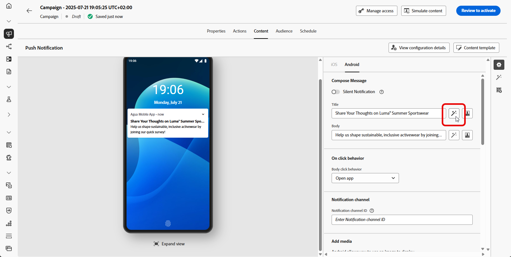
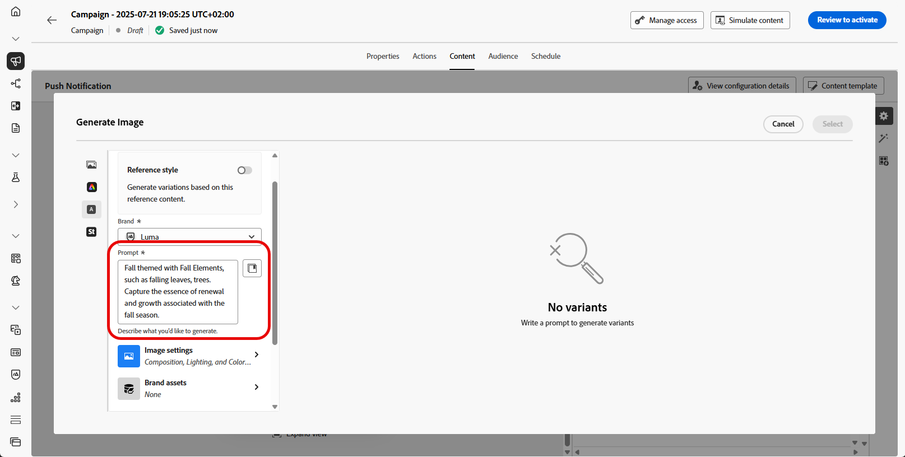

# Generación de imágenes con el asistente de IA {#generative-image}

>[!IMPORTANT]
>
>Antes de empezar a usar esta capacidad, lea las [Mecanismos de protecciones y limitaciones](gs-generative.md#generative-guardrails) relacionadas.
> 
>
>Debe aceptar un [acuerdo de usuario](https://www.adobe.com/legal/licenses-terms/adobe-dx-gen-ai-user-guidelines.html) para poder usar el Asistente de IA en Journey Optimizer. Para obtener más información, contacte con su representante de Adobe.

Utilice el asistente de IA en Journey Optimizer para generar contenido visual atractivo que mejore sus mensajes en correos electrónicos, web, páginas de aterrizaje y notificaciones push. El asistente de IA le ayuda a optimizar y mejorar sus recursos, lo que garantiza una experiencia más fácil de usar y atractiva para su audiencia.

## Para canales de correo electrónico y web {#email-web-channels}

El asistente de IA puede generar experiencias visuales completas para sus campañas de correo electrónico, experiencias web y páginas de aterrizaje. Esta capacidad le permite producir imágenes de marca y que llamen la atención y que resuenen con la audiencia en puntos de contacto digitales.

### Acceso y configuración {#access-configure}

Para empezar a generar imágenes con el asistente de IA, primero configure la campaña o el recorrido y abra el editor de contenido. Siga los pasos a continuación para preparar su espacio de trabajo y acceder al panel Asistente de IA.

1. Cree y configure su campaña o recorrido:
   * **Correo electrónico**: Después de crear y configurar tu campaña de correo electrónico, haz clic en **[!UICONTROL Editar contenido]**. [Más información](../email/create-email.md)
   * **Web**: después de crear y configurar la página web, haga clic en **[!UICONTROL Editar página web]**. [Más información](../web/create-web.md)
   * **Página de aterrizaje**: Después de crear y configurar la página de aterrizaje, haga clic en **[!UICONTROL Editar contenido]**. [Más información](../landing-pages/create-lp.md)

1. Seleccione el recurso que desea cambiar con el asistente de IA.

1. En el menú de la derecha, seleccione **[!UICONTROL Asistente de IA]** (o **[!UICONTROL Mostrar Asistente de IA]** para la web).

   {zoomable="yes"}

### Generar contenido {#generate-content}

Aprenda a crear indicadores eficaces y a configurar los ajustes de la imagen para generar imágenes visualmente atractivas con el asistente de IA. Personalice parámetros como la proporción de aspecto, la intensidad visual y la iluminación para crear imágenes que se alineen con los objetivos de su marca y campaña.

1. Habilite la opción **[!UICONTROL Estilo de referencia]** para que el Asistente de IA personalice el nuevo contenido en función del contenido de referencia. También puede cargar una imagen para añadir contexto a la variación.

1. Seleccione su **[!UICONTROL marca]** para asegurarse de que el contenido generado por IA se ajuste a las especificaciones de su marca. [Más información](brands.md) sobre marcas.

1. Ajuste el contenido describiendo lo que desea generar en el campo **[!UICONTROL Preguntar]**.

   Si está buscando ayuda para crear su mensaje, acceda a la **[!UICONTROL Biblioteca de mensajes]**, que proporciona una amplia gama de ideas para mejorar sus campañas.

   {zoomable="yes"}

1. Adapte el mensaje con la opción **[!UICONTROL Configuración de imagen]**:

   * **[!UICONTROL Proporción de aspecto]**: determina la anchura y la altura del recurso. Tiene la opción de elegir entre proporciones comunes como 16:9, 4:3, 3:2 o 1:1, o bien puede especificar un tamaño personalizado.
   * **[!UICONTROL Tipo de contenido]**: Esto categoriza la naturaleza del elemento visual, distinguiendo entre diferentes formas de representación visual como fotografías, gráficos o arte.
   * **[!UICONTROL Intensidad visual]**: puede controlar el impacto de la imagen ajustando su intensidad. Un ajuste inferior (2) creará una apariencia más suave y restringida, mientras que un ajuste superior (10) hará que la imagen sea más vibrante y visualmente potente.
   * **[!UICONTROL Color y tono]**: El aspecto general de los colores de una imagen y el estado de ánimo o atmósfera que transmite.
   * **[!UICONTROL Iluminación]**: hace referencia al relámpago presente en una imagen, que da forma a su atmósfera y resalta elementos específicos.
   * **[!UICONTROL Composición]**: hace referencia a la disposición de elementos dentro del marco de una imagen

   {zoomable="yes"}

1. En el menú **[!UICONTROL Recursos de marca]**, haga clic en **[!UICONTROL Cargar recurso de marca]** para agregar cualquier recurso de marca que contenga contenido que pueda proporcionar un asistente de IA de contexto adicional o seleccione uno cargado anteriormente.

   Los archivos cargados anteriormente están disponibles en la lista desplegable **[!UICONTROL Recursos de marca cargados]**. Simplemente, cambie los recursos que desee incluir en la generación.

1. Una vez que esté satisfecho con la configuración de la solicitud, haga clic en **[!UICONTROL Generar]**.

1. Examine **[!UICONTROL sugerencias de variación]** para encontrar el recurso deseado.

   Haz clic en **[!UICONTROL Vista previa]** para ver una versión en pantalla completa de la variación seleccionada o en **[!UICONTROL Aplicar]** para reemplazar el contenido actual.

1. Haga clic en el icono de porcentaje para ver su **[!UICONTROL puntuación de alineación de marca]** e identificar cualquier desalineación con su marca.

   Más información sobre [puntuación de alineación de marca](brands-score.md).

### Refinamiento y finalización {#refine-finalize}

Después de generar variaciones de imagen, puede revisar los resultados, comprobar la alineación de la marca, editar en Adobe Express y seleccionar la mejor opción para su contenido.

1. Vaya a la opción **[!UICONTROL Refinar]** en la ventana de **[!UICONTROL vista previa]** para obtener acceso a características de personalización adicionales:

   * **[!UICONTROL Generar]** similares para ver las imágenes relacionadas con esta variante.
   * **[!UICONTROL Edite en Adobe Express]** para personalizar aún más su recurso.

[Obtenga más información sobre la integración de Adobe Express](../integrations/express.md)

   * **[!UICONTROL Guardar]** para almacenar los recursos y poder acceder a ellos más adelante.

   {zoomable="yes"}

1. Haga clic en **[!UICONTROL Seleccionar]** cuando encuentre el contenido apropiado.

   También puede habilitar el experimento para el contenido. [Más información](generative-experimentation.md)

1. Después de definir el contenido del mensaje, haga clic en el botón **[!UICONTROL Simular contenido]** para controlar la representación y compruebe la configuración de personalización con perfiles de prueba. [Más información](../personalization/personalize.md)

1. Revise y active el contenido:
   * **Correo electrónico**: Una vez definido el contenido, la audiencia y la programación, ya puede preparar su campaña de correo electrónico. [Más información](../campaigns/review-activate-campaign.md)
   * **Web**: Una vez que haya definido la configuración de su campaña web y editado el contenido como desee, puede revisar y activar su campaña web. [Más información](../web/create-web.md#activate-web-campaign)
   * **Página de aterrizaje**: Una vez que la página de aterrizaje esté lista, puede publicarla para que esté disponible para usarla en un mensaje. [Más información](../landing-pages/create-lp.md#publish-landing-page)

## Para canales móviles {#mobile-channels}

El asistente de IA le permite generar imágenes atractivas para las notificaciones push, lo que le ayuda a crear comunicaciones móviles visualmente atractivas que capturan la atención y resuenan en su audiencia.

### Acceso y configuración {#mobile-access-configure}

Para utilizar el asistente de IA para notificaciones push, deberá configurar la entrega push y navegar al editor de contenido. Estos pasos le guiarán a través de la creación de su envío y el acceso a las funciones del asistente de IA.

1. Después de crear y configurar su entrega de notificaciones push, haga clic en **[!UICONTROL Editar contenido]**.

   Para obtener más información sobre la configuración de su envío push, consulte [esta página](../push/create-push.md).

1. Personalice la notificación push según sea necesario. [Más información](../push/design-push.md)

1. Acceda al menú **[!UICONTROL Mostrar asistente de IA]**.

   {zoomable="yes"}

### Generar contenido {#mobile-generate-content}

Después de acceder a AI Assistant, puede ajustar la configuración de generación para crear imágenes que se alineen con su marca y admitan sus objetivos de notificaciones push. Configure los parámetros de solicitud e imagen para generar imágenes optimizadas para pantallas móviles.

1. Habilite la opción **[!UICONTROL Estilo de referencia]** para que el Asistente de IA personalice el nuevo contenido en función del contenido de referencia. También puede cargar una imagen para añadir contexto a la variación.

1. Seleccione su **[!UICONTROL marca]** para asegurarse de que el contenido generado por IA se ajuste a las especificaciones de su marca. [Más información](brands.md) sobre marcas.

   Tenga en cuenta que la función Marcas se presenta como una versión beta privada y estará disponible de forma progresiva para todos los clientes en futuras versiones.

1. Ajuste el contenido describiendo lo que desea generar en el campo **[!UICONTROL Preguntar]**.

   Si está buscando ayuda para crear su mensaje, acceda a la **[!UICONTROL Biblioteca de mensajes]**, que proporciona una amplia gama de ideas para mejorar sus campañas.

   {zoomable="yes"}

1. Elija su **[!UICONTROL configuración de imagen]**:

   * **[!UICONTROL Tipo de contenido]**: Esto categoriza la naturaleza del elemento visual, distinguiendo entre diferentes formas de representación visual como fotografías, gráficos o arte.
   * **[!UICONTROL Intensidad visual]**: puede controlar el impacto de la imagen ajustando su intensidad. Un ajuste inferior (2) creará una apariencia más suave y restringida, mientras que un ajuste superior (10) hará que la imagen sea más vibrante y visualmente potente.
   * **[!UICONTROL Color y tono]**: El aspecto general de los colores de una imagen y el estado de ánimo o atmósfera que transmite.
   * **[!UICONTROL Iluminación]**: hace referencia al relámpago presente en una imagen, que da forma a su atmósfera y resalta elementos específicos.
   * **[!UICONTROL Composición]**: hace referencia a la disposición de elementos dentro del marco de una imagen

1. En el menú **[!UICONTROL Recursos de marca]**, haga clic en **[!UICONTROL Cargar recurso de marca]** para agregar cualquier recurso de marca que contenga contenido que pueda proporcionar un asistente de IA de contexto adicional o seleccione uno cargado anteriormente.

   Los archivos cargados anteriormente están disponibles en la lista desplegable **[!UICONTROL Recursos de marca cargados]**. Simplemente, cambie los recursos que desee incluir en la generación.

1. Una vez que la solicitud esté lista, haga clic en **[!UICONTROL Generar]**.

1. Examine las **[!UICONTROL variaciones]** generadas.

1. Haga clic en el icono de porcentaje para ver su **[!UICONTROL puntuación de alineación de marca]** e identificar cualquier desalineación con su marca.

   Más información sobre [puntuación de alineación de marca](brands-score.md).

### Refinamiento y finalización {#mobile-refine-finalize}

Después de generar variaciones de imagen para las notificaciones push, puede ajustar los resultados para asegurarse de que cumplan con sus requisitos exactos. Revise la alineación de la marca, edite en Adobe Express si es necesario y seleccione la mejor imagen para su campaña móvil.

1. Vaya a la opción **[!UICONTROL Refinar]** en la ventana de **[!UICONTROL vista previa]** para obtener acceso a características de personalización adicionales:

   * **[!UICONTROL Generar]** similares para ver las imágenes relacionadas con esta variante.
   * **[!UICONTROL Edite en Adobe Express]** para personalizar aún más su recurso.

[Obtenga más información sobre la integración de Adobe Express](../integrations/express.md)

   * **[!UICONTROL Guardar]** para almacenar los recursos y poder acceder a ellos más adelante.

   {zoomable="yes"}

1. Abra la pestaña **[!UICONTROL Alineación de marca]** para ver cómo se ajusta su contenido a las [directrices de marca](brands.md).

1. Haga clic en **[!UICONTROL Seleccionar]** cuando encuentre el contenido apropiado.

   También puede habilitar el experimento para el contenido. [Más información](generative-experimentation.md)

Una vez definido el contenido, la audiencia y la programación, estará listo para preparar la campaña push. [Más información](../campaigns/review-activate-campaign.md)

