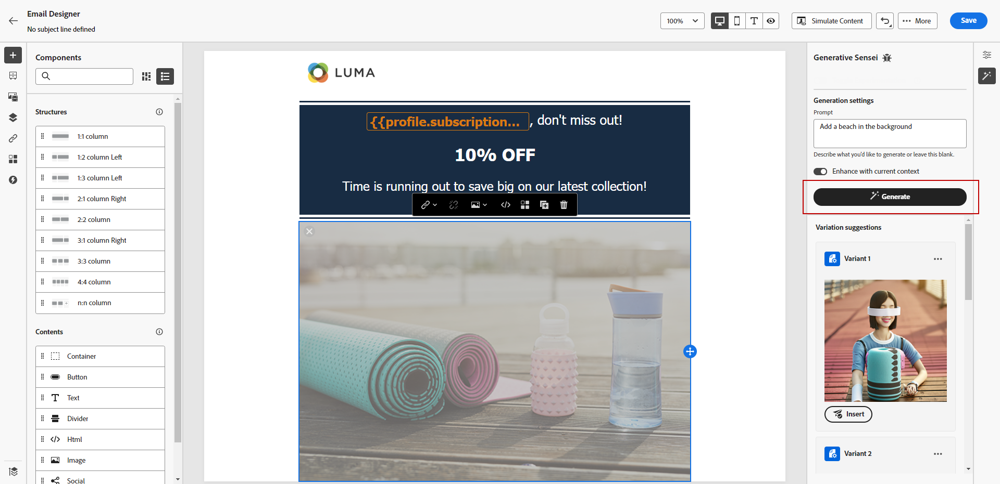

# Generación de imágenes con el asistente de contenido {#image-content-assistant}

>[!BEGINSHADEBOX]

**Tabla de contenido**

* [Introducción al Asistente de contenido](gs-generative.md)
* [Generación de texto con el Asistente de contenido](generative-content.md)
* **[Generación de imágenes con el Asistente de contenido](generative-image.md)**

>[!ENDSHADEBOX]

Una vez creados y personalizados los correos electrónicos o páginas web, lleve el contenido al siguiente nivel con el asistente de contenido. Esta potente herramienta le permite personalizar y mejorar su contenido sin esfuerzo.

En el siguiente ejemplo, aprenda a utilizar el asistente de contenido para actualizar y mejorar sus recursos y mejorar así la experiencia del usuario. Siga estos pasos:

1. Después de crear y configurar el mensaje, haga clic en **[!UICONTROL Creación de contenido]** y personalizarlo según sea necesario.

1. Seleccione el recurso que desea cambiar con el asistente de contenido.

1. En el menú derecho, seleccione **[!UICONTROL Generación de experiencias]**.

   

1. Añada un mensaje para ajustar mejor los resultados y haga clic en **[!UICONTROL Generar]**.

   Habilite la **[!UICONTROL Mejorar con contenido actual]** para que el asistente de contenido personalice nuevos recursos en función del mensaje, el nombre de la campaña y la audiencia seleccionada.

   

1. Examine la **[!UICONTROL Sugerencias de variación]** para encontrar el recurso deseado.

1. Una vez que haya elegido su **[!UICONTROL Variante]**, acceda al menú avanzado del recurso seleccionado.

   

1. Puede elegir **[!UICONTROL Hacer similar]** para generar más variantes basadas en la variante seleccionada.

1. Clic **[!UICONTROL Editar imagen]** para acceder a **[!UICONTROL Seleccionar nueva imagen]** menú.

1. Desde este menú, puede generar un nuevo recurso o elegir utilizar uno existente de sus carpetas de recursos.

   

1. Clic **[!UICONTROL Insertar]** para añadir el recurso generado al contenido.

   

1. Elija en qué carpeta desea guardar el recurso generado y haga clic en **[!UICONTROL Importar]**.

   

1. Después de definir el contenido del mensaje, haga clic en **[!UICONTROL Simular contenido]** para controlar el procesamiento y comprobar la configuración de personalización con perfiles de prueba. [Más información](../email/preview.md)

1. Cuando el mensaje esté listo, en la página de resumen de la campaña, puede hacer clic en **[!UICONTROL Revisar para activar]** para mostrar un resumen de la campaña. Las alertas se muestran si algún parámetro es incorrecto o falta.

1. Antes de iniciar la campaña, compruebe que todas las configuraciones sean correctas y haga clic en **[!UICONTROL Activar]**.

Después de configurar correctamente la experimentación y la campaña, puede realizar un seguimiento de la campaña en el informe de campaña. [Más información](../reports/campaign-global-report.md#experimentation-report)
