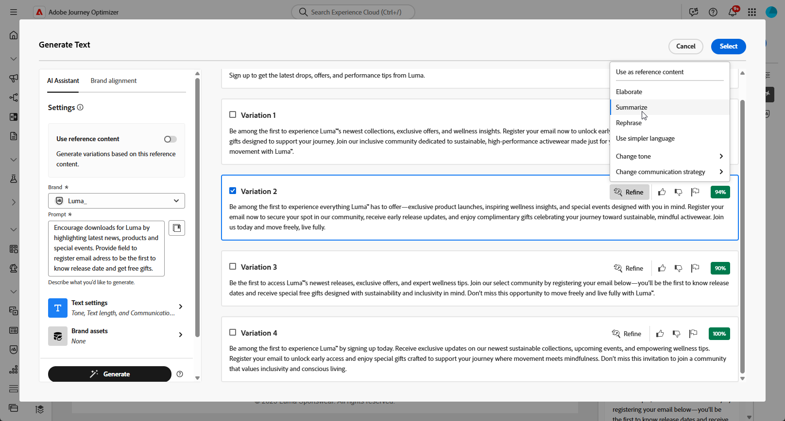
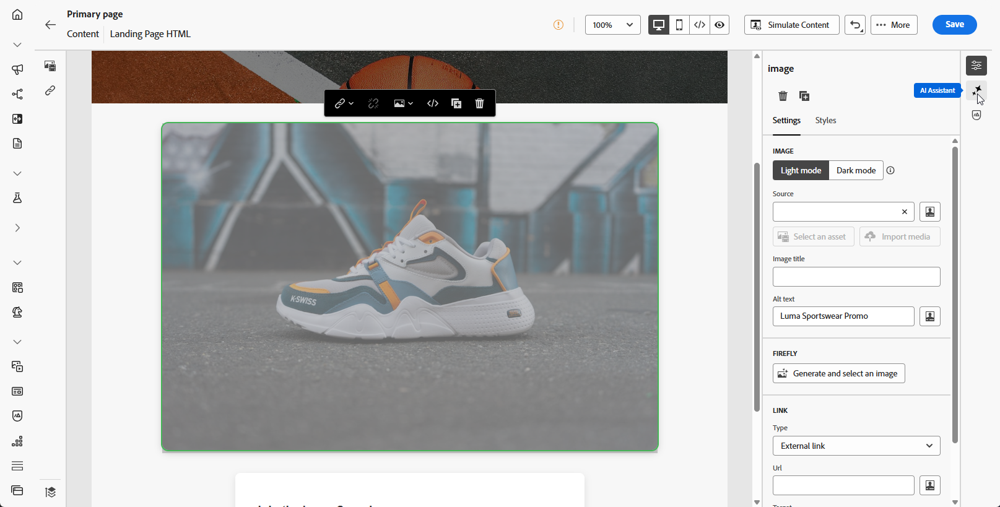

# Generación de la página de destino con el Asistente de IA {#generative-lp}

>[!IMPORTANT]
>
>* Antes de empezar a usar esta capacidad, lea las [Mecanismos de protecciones y limitaciones](gs-generative.md#generative-guardrails) relacionadas.
>
>
>* Debe aceptar el [acuerdo de usuario](https://www.adobe.com/legal/licenses-terms/adobe-dx-gen-ai-user-guidelines.html) para poder usar el Asistente de IA en Journey Optimizer. Para obtener más información, contacte con su representante de Adobe.

Transforme sus páginas de aterrizaje con el Asistente de IA en Journey Optimizer, con tecnología de IA generativa.

Cree contenido impactante sin esfuerzo, incluidas páginas completas, fragmentos de texto personalizados y elementos visuales personalizados que resuenen con su audiencia, lo que aumenta la participación y la interacción.

Explore las pestañas siguientes para aprender a utilizar el asistente de IA en Journey Optimizer.

>[!BEGINTABS]

>[!TAB Generación de página de aterrizaje completa]

En el siguiente ejemplo, utilizaremos el asistente de IA para refinar una plantilla de página de aterrizaje existente.

1. Después de crear y configurar la página de aterrizaje, haga clic en **[!UICONTROL Editar contenido]**.

   Para obtener más información sobre cómo configurar su página de aterrizaje, consulte [esta página](../landing-pages/create-lp.md).

1. Personalice el diseño según sea necesario y acceda al menú **[!UICONTROL Asistente de IA]**.

   {zoomable="yes"}

1. Habilite la opción **[!UICONTROL Usar contenido original]** para el asistente de IA a fin de personalizar el nuevo contenido en función del contenido seleccionado.

1. Ajuste el contenido describiendo lo que desea generar en el campo **[!UICONTROL Preguntar]**.

   Si está buscando ayuda para redactar el mensaje, acceda a la **[!UICONTROL Biblioteca de mensajes]**, que proporciona una amplia gama de ideas para mejorar su página de aterrizaje.

   {zoomable="yes"}

1. Adapte el mensaje con la opción **[!UICONTROL Configuración de texto]**:

   * **[!UICONTROL Estrategia de comunicación]**: elige el estilo de comunicación más adecuado para el texto generado.
   * **[!UICONTROL Idiomas]**: elige el idioma del contenido generado.
   * **[!UICONTROL Tono]**: el tono de la página de aterrizaje debería interesar a la audiencia. Tanto si desea sonar informativo, lúdico o persuasivo, el asistente de IA puede adaptar el mensaje en consecuencia.

   {zoomable="yes"}

1. Elija su **[!UICONTROL configuración de imagen]**:

   * **[!UICONTROL Tipo de contenido]**: Esto categoriza la naturaleza del elemento visual, distinguiendo entre diferentes formas de representación visual como fotografías, gráficos o arte.
   * **[!UICONTROL Intensidad visual]**: puede controlar el impacto de la imagen ajustando su intensidad. Un ajuste inferior (2) creará una apariencia más suave y restringida, mientras que un ajuste superior (10) hará que la imagen sea más vibrante y visualmente potente.
   * **[!UICONTROL Color y tono]**: El aspecto general de los colores de una imagen y el estado de ánimo o atmósfera que transmite.
   * **[!UICONTROL Iluminación]**: hace referencia al relámpago presente en una imagen, que da forma a su atmósfera y resalta elementos específicos.
   * **[!UICONTROL Composición]**: hace referencia a la disposición de elementos dentro del marco de una imagen

   {zoomable="yes"}

1. En el menú **[!UICONTROL Recursos de marca]**, haga clic en **[!UICONTROL Cargar recurso de marca]** para agregar cualquier recurso de marca que contenga contenido que pueda proporcionar un asistente de IA de contexto adicional o seleccione uno cargado anteriormente.

   Los archivos cargados anteriormente están disponibles en la lista desplegable **[!UICONTROL Recursos de marca cargados]**. Simplemente, cambie los recursos que desee incluir en la generación.

1. Una vez que la solicitud esté lista, haga clic en **[!UICONTROL Generar]**.

1. Examine las **[!UICONTROL variaciones]** generadas.

   Haga clic en **[!UICONTROL Vista previa]** para ver una versión en pantalla completa de la variación seleccionada o haga clic en **[!UICONTROL Aplicar]** para reemplazar el contenido actual.

1. Haga clic en el icono de porcentaje para ver su **[!UICONTROL puntuación de alineación de marca]** e identificar cualquier desalineación con su marca.

   Más información sobre [puntuación de alineación de marca](brands-score.md).

   {zoomable="yes"}

1. Vaya a la opción **[!UICONTROL Refinar]** en la ventana de **[!UICONTROL vista previa]** para obtener acceso a características de personalización adicionales:

   * **[!UICONTROL Reformular]**: el Ayudante de IA puede reformular el mensaje de diferentes maneras, lo que mantiene la escritura fresca y atractiva para diversas audiencias.

   * **[!UICONTROL Use un lenguaje más sencillo]**: aproveche el Asistente para IA a fin de simplificar su lenguaje y garantizar la claridad y accesibilidad para una audiencia más amplia.

   También puedes cambiar el **[!UICONTROL tono]** y la **[!UICONTROL estrategia de comunicación]** de tu texto.

   {zoomable="yes"}

1. Abra la pestaña **[!UICONTROL Alineación de marca]** para ver cómo se ajusta su contenido a las [directrices de marca](brands.md).

1. Haga clic en **[!UICONTROL Seleccionar]** cuando encuentre el contenido apropiado.

1. Inserte campos de personalización para personalizar el contenido de la página de aterrizaje en función de los datos de los perfiles. A continuación, haga clic en el botón **[!UICONTROL Simular contenido]** para controlar la renderización y compruebe la configuración de personalización con perfiles de prueba. [Más información](../personalization/personalize.md)

Una vez que la página de aterrizaje esté lista, puede publicarla para que esté disponible para usarla en un mensaje. [Más información](../landing-pages/create-lp.md#publish-landing-page)

>[!TAB Generación de solo texto]

En el siguiente ejemplo, utilizaremos el asistente de IA para mejorar el contenido de nuestra página de aterrizaje.

1. Después de crear y configurar la página de aterrizaje, haga clic en **[!UICONTROL Editar contenido]**.

   Para obtener más información sobre cómo configurar su página de aterrizaje, consulte [esta página](../landing-pages/create-lp.md).

1. Seleccione un **[!UICONTROL componente Texto]** para solamente segmentar un contenido específico. y acceder al menú **[!UICONTROL Asistente de IA]**.

   {zoomable="yes"}

1. Habilite la opción **[!UICONTROL Usar contenido original]** para el asistente de IA a fin de personalizar el nuevo contenido en función del contenido seleccionado.

1. Ajuste el contenido describiendo lo que desea generar en el campo **[!UICONTROL Preguntar]**.

   Si está buscando ayuda para redactar el aviso, acceda a la **[!UICONTROL Biblioteca del aviso]**, que proporciona una amplia gama de ideas para mejorar sus páginas de aterrizaje.

   {zoomable="yes"}

1. Adapte el mensaje con la opción **[!UICONTROL Configuración de texto]**:

   * **[!UICONTROL Estrategia de comunicación]**: elige el estilo de comunicación más adecuado para el texto generado.
   * **[!UICONTROL Idiomas]**: elige el idioma del contenido generado.
   * **[!UICONTROL Tono]**: el tono de la página de aterrizaje debería interesar a la audiencia. Tanto si desea sonar informativo, lúdico o persuasivo, el asistente de IA puede adaptar el mensaje en consecuencia.
   * **Longitud del texto**: utilice el control deslizante para seleccionar la longitud deseada del texto.

   {zoomable="yes"}

1. En el menú **[!UICONTROL Recursos de marca]**, haga clic en **[!UICONTROL Cargar recurso de marca]** para agregar cualquier recurso de marca que contenga contenido que pueda proporcionar un asistente de IA de contexto adicional o seleccione uno cargado anteriormente.

   Los archivos cargados anteriormente están disponibles en la lista desplegable **[!UICONTROL Recursos de marca cargados]**. Simplemente, cambie los recursos que desee incluir en la generación.

1. Una vez que la solicitud esté lista, haga clic en **[!UICONTROL Generar]**.

1. Examine las **[!UICONTROL variaciones]** generadas.

   Haga clic en **[!UICONTROL Vista previa]** para ver una versión en pantalla completa de la variación seleccionada o haga clic en **[!UICONTROL Aplicar]** para reemplazar el contenido actual.

1. Haga clic en el icono de porcentaje para ver su **[!UICONTROL puntuación de alineación de marca]** e identificar cualquier desalineación con su marca.

   Más información sobre [puntuación de alineación de marca](brands-score.md).

   {zoomable="yes"}

1. Vaya a la opción **[!UICONTROL Refinar]** en la ventana de **[!UICONTROL vista previa]** para obtener acceso a características de personalización adicionales:

   * **[!UICONTROL Usar como contenido de referencia]**: la variante elegida servirá como contenido de referencia para generar otros resultados.

   * **[!UICONTROL Elaborar]**: el Asistente de IA puede ayudarle a ampliar temas específicos y proporcionar detalles adicionales para una mejor comprensión y participación.

   * **[!UICONTROL Resumir]**: La información larga puede sobrecargar los destinatarios de la página de aterrizaje. Utilice el asistente de IA para condensar los puntos clave en resúmenes claros y concisos que llamen la atención y los animen a leer más.

   * El Asistente de inteligencia artificial de **[!UICONTROL Reformular]**:The puede reformular tu mensaje de diferentes maneras, manteniendo tu escritura fresca y atractiva para diversas audiencias.

   * **[!UICONTROL Use un lenguaje más sencillo]**: aproveche el Asistente para IA a fin de simplificar su lenguaje y garantizar la claridad y accesibilidad para una audiencia más amplia.

   También puedes cambiar el **[!UICONTROL tono]** y la **[!UICONTROL estrategia de comunicación]** de tu texto.

   {zoomable="yes"}

1. Abra la pestaña **[!UICONTROL Alineación de marca]** para ver cómo se ajusta su contenido a las [directrices de marca](brands.md).

1. Haga clic en **[!UICONTROL Seleccionar]** cuando encuentre el contenido apropiado.

1. Inserte campos de personalización para personalizar el contenido de la página de aterrizaje en función de los datos de los perfiles. A continuación, haga clic en el botón **[!UICONTROL Simular contenido]** para controlar la renderización y compruebe la configuración de personalización con perfiles de prueba. [Más información](../personalization/personalize.md)

Una vez que la página de aterrizaje esté lista, puede publicarla para que esté disponible para usarla en un mensaje. [Más información](../landing-pages/create-lp.md#publish-landing-page)

>[!TAB Generación solo de imagen]

En el siguiente ejemplo, aprenda a aprovechar el asistente de IA para optimizar y mejorar sus recursos, lo que garantiza una experiencia más fácil de usar.

1. Después de crear y configurar la página de aterrizaje, haga clic en **[!UICONTROL Editar contenido]**.

   Para obtener más información sobre cómo configurar su página de aterrizaje, consulte [esta página](../landing-pages/create-lp.md).

1. Seleccione el recurso que desea cambiar con el asistente de IA.

1. En el menú de la derecha, seleccione **[!UICONTROL Asistente de IA]**.

   {zoomable="yes"}

1. Habilite la opción **[!UICONTROL Estilo de referencia]** para que el Asistente de IA personalice el nuevo contenido en función del contenido de referencia. También puede cargar una imagen para añadir contexto a la variación.

1. Ajuste el contenido describiendo lo que desea generar en el campo **[!UICONTROL Preguntar]**.

   Si está buscando ayuda para redactar el aviso, acceda a la **[!UICONTROL Biblioteca del aviso]**, que proporciona una amplia gama de ideas para mejorar sus páginas de aterrizaje.

   {zoomable="yes"}

1. Adapte el mensaje con la opción **[!UICONTROL Configuración de imagen]**:

   * **[!UICONTROL Proporción de aspecto]**: determina la anchura y la altura del recurso. Tiene la opción de elegir entre proporciones comunes como 16:9, 4:3, 3:2 o 1:1, o bien puede especificar un tamaño personalizado.
   * **[!UICONTROL Tipo de contenido]**: Esto categoriza la naturaleza del elemento visual, distinguiendo entre diferentes formas de representación visual como fotografías, gráficos o arte.
   * **[!UICONTROL Intensidad visual]**: puede controlar el impacto de la imagen ajustando su intensidad. Un ajuste inferior (2) creará una apariencia más suave y restringida, mientras que un ajuste superior (10) hará que la imagen sea más vibrante y visualmente potente.
   * **[!UICONTROL Color y tono]**: El aspecto general de los colores de una imagen y el estado de ánimo o atmósfera que transmite.
   * **[!UICONTROL Iluminación]**: hace referencia al relámpago presente en una imagen, que da forma a su atmósfera y resalta elementos específicos.
   * **[!UICONTROL Composición]**: hace referencia a la disposición de elementos dentro del marco de una imagen

   {zoomable="yes"}

1. En el menú **[!UICONTROL Recursos de marca]**, haga clic en **[!UICONTROL Cargar recurso de marca]** para agregar cualquier recurso de marca que contenga contenido que pueda proporcionar un asistente de IA de contexto adicional o seleccione uno cargado anteriormente.

   Los archivos cargados anteriormente están disponibles en la lista desplegable **[!UICONTROL Recursos de marca cargados]**. Simplemente, cambie los recursos que desee incluir en la generación.

1. Una vez que esté satisfecho con la configuración de la solicitud, haga clic en **[!UICONTROL Generar]**.

1. Examine las **[!UICONTROL variaciones]** generadas.

   Haga clic en **[!UICONTROL Vista previa]** para ver una versión en pantalla completa de la variación seleccionada o haga clic en **[!UICONTROL Aplicar]** para reemplazar el contenido actual.

1. Haga clic en el icono de porcentaje para ver su **[!UICONTROL puntuación de alineación de marca]** e identificar cualquier desalineación con su marca.

   Más información sobre [puntuación de alineación de marca](brands-score.md).

   {zoomable="yes"}

1. Vaya a la opción **[!UICONTROL Refinar]** en la ventana de **[!UICONTROL vista previa]** para obtener acceso a características de personalización adicionales:

   * **[!UICONTROL Generar]** similares para ver las imágenes relacionadas con esta variante.
   * **[!UICONTROL Edite en Adobe Express]** para personalizar aún más su recurso.

[Obtenga más información sobre la integración de Adobe Express](../integrations/express.md)

   * **[!UICONTROL Guardar]** para almacenar los recursos y poder acceder a ellos más adelante.

   {zoomable="yes"}

1. Abra la pestaña **[!UICONTROL Alineación de marca]** para ver cómo se ajusta su contenido a las [directrices de marca](brands.md).

1. Haga clic en **[!UICONTROL Seleccionar]** cuando encuentre el contenido apropiado.

1. Después de definir el contenido del mensaje, haga clic en el botón **[!UICONTROL Simular contenido]** para controlar la representación y compruebe la configuración de personalización con perfiles de prueba. [Más información](../personalization/personalize.md)

Una vez que la página de aterrizaje esté lista, puede publicarla para que esté disponible para usarla en un mensaje. [Más información](../landing-pages/create-lp.md#publish-landing-page)

>[!ENDTABS]
