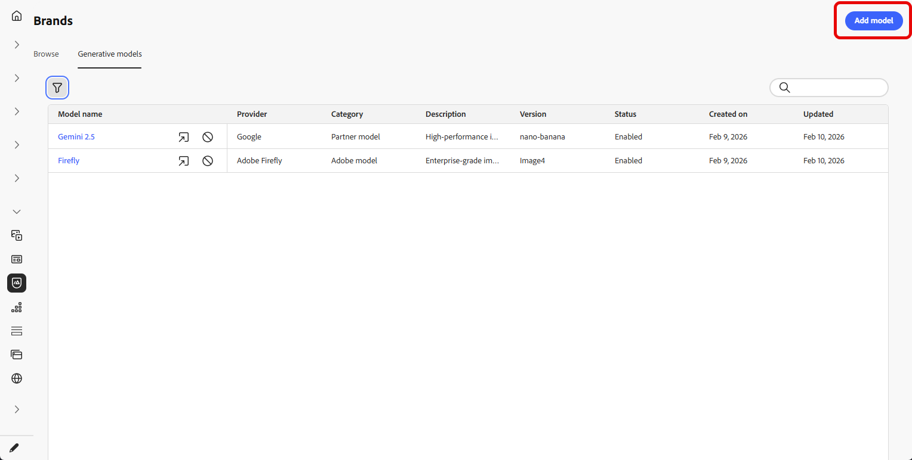
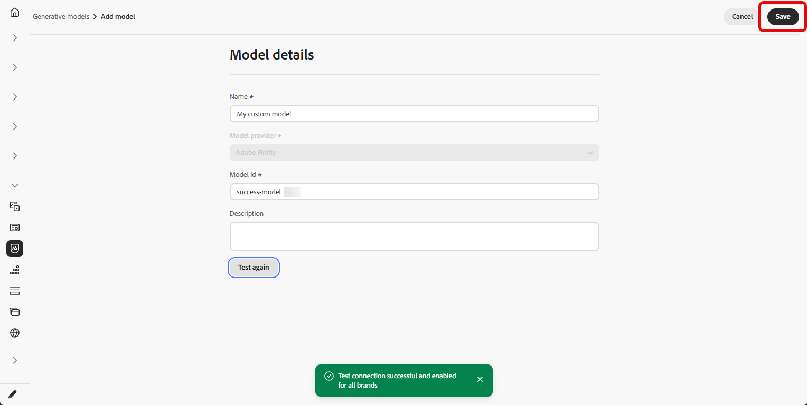

# Creación y administración de modelos generativos {#generative-models}

Amplíe sus capacidades de creación de imágenes de IA con modelos integrados, modelos de Firefly personalizados y proveedores de generación de imágenes de terceros para satisfacer sus necesidades específicas y mejorar la alineación de marca.

Elija el modelo adecuado para sus necesidades:

- El **[!UICONTROL modelo Adobe]** con tecnología Firefly Image Model 4 está listo para usarse y listo para usarse para generar imágenes inmediatamente sin necesidad de configuración adicional.
- **[!UICONTROL Modelo de socio]**, con tecnología Gemini 2.5 Flash, ofrece capacidades especializadas para casos de uso específicos. Para ver un flujo de trabajo paso a paso que usa **Gemini** con **superposiciones de texto** en imágenes en el asistente de IA, consulte [Usar Gemini como modelo generativo para la imagen de superposición de texto](generative-uc.md#generative-gemini).
- **[!UICONTROL Los modelos personalizados]** son modelos específicos de tu marca, entrenados en tus propios recursos y añadidos por tu organización.

  Obtenga más información sobre **[!UICONTROL modelos personalizados]** en [documentación de Adobe Firefly](https://helpx.adobe.com/es/firefly/web/work-with-enterprise-features/train-custom-models/custom-models-overview.html)

Una vez configurado, puede seleccionar cualquiera de los modelos generativos al crear imágenes en el contenido. [Más información acerca de la generación de imágenes](generative-image.md).

## Administración de modelos generativos

Administre sus modelos generativos desde una ubicación centralizada. Vea todos los modelos disponibles, filtre y busque para encontrar otros específicos y configure sus ajustes para sus marcas.

1. En el menú **[!UICONTROL Marcas]**, seleccione la pestaña **[!UICONTROL Modelos generativos]**.

   {zoomable="yes"}

1. Haga clic en el icono  para acceder al menú de filtros. Filtrar modelos por **[!UICONTROL tipo]** o **[!UICONTROL estado]**.

   {zoomable="yes"}

1. Utilice la barra de búsqueda para buscar un modelo generativo específico por nombre.

1. Haga clic en el icono  para acceder al menú avanzado, donde puede habilitar o deshabilitar el modelo, o eliminarlo.

   Tenga en cuenta que solo se pueden eliminar **[!UICONTROL modelos personalizados]**.

   {zoomable="yes"}

1. Haga clic en **[!UICONTROL Agregar modelo]** para crear un nuevo modelo generador desde cero.

Ahora puede seleccionar cualquiera de los modelos generativos al crear imágenes en el contenido. [Más información acerca de la generación de imágenes](generative-image.md).

## Añadir un modelo generativo

>[!IMPORTANT]
>
>La creación de modelos de Firefly personalizados requiere un acuerdo de Firefly ETLA.

Los modelos de Firefly personalizados son modelos de IA específicos de la marca formados en sus propios recursos, lo que le permite generar imágenes que se alinean con precisión con la identidad de su marca, el estilo y las directrices visuales.

Al crear proveedores de modelos de Firefly personalizados, puede ampliar las capacidades de IA más allá de los modelos predeterminados y garantizar que el contenido generado refleje de forma coherente la estética y los requisitos únicos de su marca.

➡️ [Aprenda a entrenar su modelo personalizado](https://helpx.adobe.com/es/firefly/web/work-with-enterprise-features/train-custom-models/train-firefly-custom-models.html)

1. Desde el menú **[!UICONTROL Marcas]**, accede a la pestaña **[!UICONTROL Modelos generativos]** y haz clic en **[!UICONTROL Agregar modelo]**.

   {zoomable="yes"}

1. Escriba un **[!UICONTROL Nombre]** para el modelo.

1. Escriba su **[!UICONTROL ID de modelo]**.

   +++ Búsqueda del ID de modelo de Firefly

   1. Acceda al sitio web de Firefly y vaya hasta sus modelos formados.
   1. Acceda al menú [Previsualizar y probar](https://helpx.adobe.com/es/firefly/web/work-with-enterprise-features/train-custom-models/train-firefly-custom-models.html#preview-and-test).
   1. En la dirección URL, busque el valor después de `customModelId=`. Copie este valor para utilizarlo como ID de modelo.

   Para obtener más información, consulte la [documentación de modelos personalizados de Firefly](https://helpx.adobe.com/es/firefly/web/work-with-enterprise-features/train-custom-models/manage-custom-models.html).

   {zoomable="yes"}

   +++

    

   {zoomable="yes"}

1. Opcionalmente, escriba **[!UICONTROL Descripción]** para ayudar a identificar el modelo.

1. Haga clic en **[!UICONTROL Probar conexión]** para comprobar la configuración del modelo.

1. Una vez que la prueba de conexión se haya realizado correctamente, haga clic en **[!UICONTROL Guardar]** para guardar la configuración del modelo.

   {zoomable="yes"}

1. Después de guardar, el modelo personalizado se agrega a la lista de modelos. Puede desactivarlo o eliminarlo en cualquier momento.

   {zoomable="yes"}

<!--
1. Once the connection test is successful, choose whether to enable the model for selected brands.

1. Enable or disable the option to connect the model to all brands.

    If disabled, select which brands this model should be applied to.
-->

Una vez configurado, puede seleccionar cualquiera de los modelos generativos personalizados al crear imágenes en el contenido. [Más información acerca de la generación de imágenes](generative-image.md).

{zoomable="yes"}
