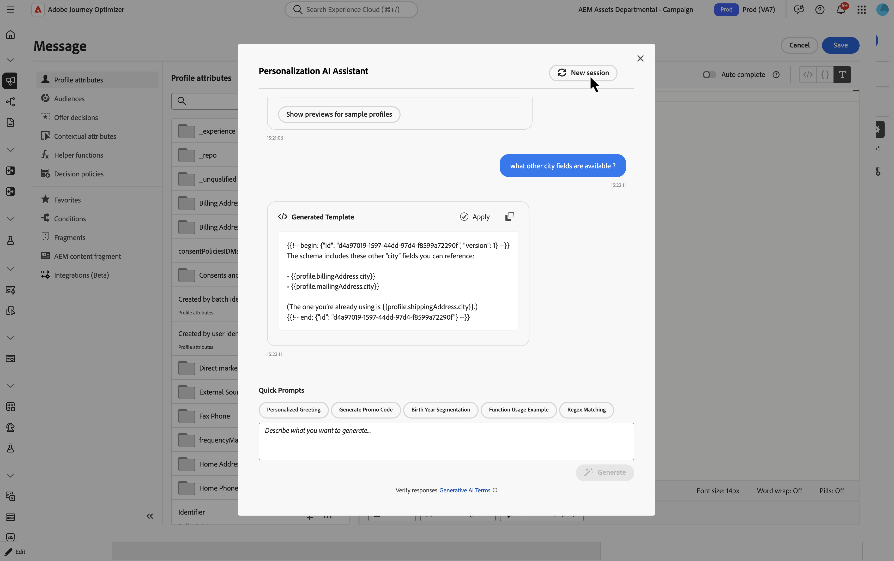
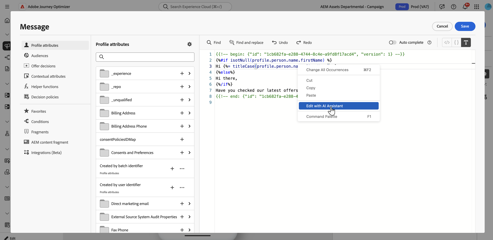

# El Asistente de IA para expresiones de personalización{#generative-personalization-expressions}

>[!BEGINSHADEBOX]

**En esta página:** Aprenda a utilizar el Asistente de IA en Adobe Journey Optimizer para generar, corregir y explicar expresiones de personalización a partir del lenguaje natural en el Editor de Personalization y en el Designer de correo electrónico.

>[!ENDSHADEBOX]

>[!IMPORTANT]
>
>Antes de empezar a usar esta capacidad, lea las [Mecanismos de protecciones y limitaciones](gs-generative.md#generative-guardrails) relacionadas.
>
>Debe aceptar un [acuerdo de usuario](https://www.adobe.com/legal/licenses-terms/adobe-dx-gen-ai-user-guidelines.html) para poder usar el Asistente de IA en Journey Optimizer. Para obtener más información, contacte con su representante de Adobe.

## Información general {#where-available}

[!UICONTROL Ayudante de IA] le ayuda a generar una nueva personalización a partir de un lenguaje sencillo, a explicar lo que hacen las expresiones existentes y a solucionar problemas en el código seleccionado, de modo que dedique menos tiempo a la sintaxis y a la detección manual de campos. También puede iterar en una selección o solicitar otros cambios en la conversación. Está disponible de dos maneras:

* **[!UICONTROL Editor de Personalization]**: siempre que el editor esté disponible en los canales (línea de asunto, cuerpo y otros campos que lo abran). Esta es la ruta general para la personalización asistida por IA. Para saber dónde y cómo abrir el editor, consulte [Agregar personalización](../personalization/personalization-build-expressions.md#where).
* **Barra de herramientas de Designer de correo electrónico**: cuando crea correos electrónicos en el Designer de correo electrónico, selecciona un componente y utiliza **[!UICONTROL Agregar expresión]** en la barra de herramientas contextual para abrir el asistente en una caja de herramientas sin abrir primero el editor completo. Este punto de entrada no está disponible fuera de la creación de correo electrónico. Ver [Generar desde el Designer de correo electrónico](#generate-email-designer).

Para obtener información sobre la configuración y los idiomas del Asistente de IA, consulte [Introducción al Asistente de IA](gs-generative.md). Para ver los conceptos de personalización, consulte [Introducción a la personalización](../personalization/personalize.md). Para escribir mensajes que produzcan expresiones utilizables, vea [Escribir mensajes efectivos para expresiones de personalización](#prompt-best-practices). Para obtener ideas rápidas de generación de contenido (tono, estilo, marca), consulte [Prácticas recomendadas de mensajes de IA](ai-assistant-prompting-guide.md).

Según el contexto de su campaña o recorrido, el asistente puede trabajar con datos y construir el [!UICONTROL Editor de Personalization] que ya expone, por ejemplo atributos de perfil, pertenencia a segmentos, funciones de ayuda y fuentes de personalización relacionadas.

>[!NOTE]
>
>El asistente mantiene el contexto alejado de los mensajes mientras [!UICONTROL AI Assistant] permanece abierto en esa sesión. Al cerrar el asistente o el editor, se borra la conversación; la próxima vez que abra el asistente, iniciará una nueva conversación.

## Generar expresiones de personalización {#generate}

Estos pasos cubren la generación de expresiones de personalización desde cero. Para trabajar con código que ya se encuentra en el editor, consulte [Editar, corregir o explicar el código existente](#edit-existing).

1. En el mensaje o el contenido, abra **[!UICONTROL Personalization Editor]**.

1. Coloque el cursor en el editor donde desee insertar el código de personalización generado y, a continuación, haga clic en el botón **[!UICONTROL Ayudante de IA]**.

   

1. En el campo de texto, describa la expresión personalizada que desee en lenguaje sin formato; por ejemplo, qué atributos de perfil, segmentos o lógica necesita y, a continuación, haga clic en **[!UICONTROL Generar]**.

   También puede usar indicadores listos para usar de la sección **[!UICONTROL Indicadores rápidos]**, como saludo personalizado, generación de código de promoción y más.

   

   >[!NOTE]
   >
   >Cualquier pregunta o petición de datos no relacionada devuelve un error fuera de ámbito. Ajuste el mensaje y haga una pregunta relevante acerca de la personalización que necesita.

1. Puede seguir hablando con el asistente en una conversación de varias vueltas: mantiene el contexto alejado de los mensajes para que pueda refinar la misma expresión paso a paso. Para volver a empezar, haga clic en el botón **[!UICONTROL Nueva sesión]**.

   

1. Después de generar una expresión, haga clic en **[!UICONTROL Mostrar vistas previas de perfiles de muestra]** para ver cómo se evalúa la expresión con **un** perfil de muestra sintético y para ver la carga útil asociada como JSON. La vista previa es una comprobación puntual de **single** para que puedas confiar en que tu código se resuelve como se espera — no simula **no** destinatarios múltiples, datos variados o cobertura total. Los datos de ejemplo no se guardan ni almacenan en su organización.

   Si necesita ajustar el ejemplo (por ejemplo, atributos diferentes enfatizados), describa lo que necesita en la conversación con el asistente e incluya la palabra clave **preview** en el mensaje.

   

   +++Previsualizar ejemplo

   

   >[!NOTE]
   >
   >No espere varias filas de vista previa o escenarios exhaustivos aquí. El control se limita intencionalmente a **una** evaluación de muestra para una comprobación rápida del código, no una cobertura parcial en muchos perfiles. Si se solicita un conjunto de previsualizaciones poco realista y grande, la solicitud puede fallar.

   +++

   >[!NOTE]
   >
   >Este control sirve para comprobar rápidamente el código personalizado en el editor, no para obtener una vista previa completa del mensaje del contenido. Para validar completamente la experiencia, utilice el flujo de simulación habitual. [Obtenga información sobre cómo obtener una vista previa y probar el contenido](../content-management/preview-test.md)

1. Para implementar el resultado en su expresión personalizada, haga clic en **[!UICONTROL Aplicar]**. La salida del asistente se inserta en la ubicación del cursor en el editor de personalización. Para reemplazar el código que ya está allí, selecciónelo primero en el editor y, a continuación, usa **[!UICONTROL Editar con el Asistente para IA]** (consulta [Editar, corregir o explicar el código existente](#edit-existing)).

   También puede copiar el resultado y pegarlo donde lo necesite utilizando el icono .

## Editar, corregir o explicar el código existente {#edit-existing}

Puede seleccionar una expresión de personalización existente y utilizar el Asistente de IA para solucionar problemas de personalización, explicar lo que hace el código o solicitar otros cambios.

1. Seleccione código de personalización existente en el editor.

1. Haga clic con el botón derecho en la selección y elija **[!UICONTROL Editar con el asistente de IA]** para que el asistente use su selección como contexto.

   

1. Se abre **[!UICONTROL Asistente de IA]**. En **[!UICONTROL Comandos rápidos]**, haga clic en **[!UICONTROL Explicar]** o **[!UICONTROL Corregir]**, o use el campo de texto para solicitar otros cambios e iniciar una conversación.

   

1. Cuando use **[!UICONTROL Corrección]**, haga clic en **[!UICONTROL Mostrar detalles de la corrección]** en la discusión para mostrar una explicación de la corrección y una línea por línea antes y después de la vista previa.

   

1. Al igual que cuando genera una expresión personalizada, haga clic en **[!UICONTROL Aplicar]** para implementar el resultado del asistente. Reemplaza el código seleccionado en el editor de personalización. Por ejemplo, si solicita una explicación del código, al aplicar se agregan comentarios en la expresión que describen lo que hace.

## Generar desde la barra de herramientas de Designer de correo electrónico {#generate-email-designer}

>[!NOTE]
>
>Esta sección se aplica solamente cuando edita el contenido de **email** en el Designer de correo electrónico. Para otros canales, usa **[!UICONTROL Personalization Editor]**.

En el Designer de correo electrónico, puede usar el [!UICONTROL Asistente de IA para expresiones de personalización] desde la barra de herramientas contextual sin abrir primero el [!UICONTROL Editor de Personalization] completo.

1. En el Designer de correo electrónico, seleccione el componente que desea personalizar y haga clic en la ubicación en la que desea insertar la expresión.

1. En la barra de herramientas contextual, haga clic en **[!UICONTROL Agregar expresión]**.

   

1. Se abrirá un cuadro de herramientas en el que puede solicitar al Ayudante de IA que lo personalice. Escriba lo que necesite en lenguaje sencillo, el asistente sugerirá campos de perfil y otros atributos que coincidan con el mensaje para que pueda crear la expresión más rápido.

1. El asistente genera la expresión.

   

   Se puede:

   * Valide el resultado de la expresión con un valor de muestra; use la ficha **[!UICONTROL Vista previa]**.
   * Generar otra sugerencia desde el mismo mensaje: use **[!UICONTROL Regenerar]**.
   * Borrar la discusión y comenzar de nuevo: usa **[!UICONTROL Restablecer]**.
   * Refine la expresión en el editor completo: haga clic en el icono  para abrir **[!UICONTROL Personalization Editor]**.

1. Cuando esté satisfecho con el resultado, haga clic en **[!UICONTROL Insertar]** para agregar la expresión al contenido.

## Escribir mensajes efectivos para expresiones de personalización {#prompt-best-practices}

Las solicitudes de expresiones de personalización difieren de las solicitudes de generación de contenido, que se centran en el tono, el estilo y la marca. Dado que el asistente crea una lógica de plantilla que se resuelve en función de los datos contextuales y de perfil, el mensaje debe describir esa lógica con precisión. Comience desde la experiencia del cliente que desea ofrecer y, a continuación, exprésela en términos que el asistente pueda traducir en una expresión.

Un aviso efectivo suele definir cuatro elementos:

* **Origen de datos**: el atributo de perfil, los datos de contexto, el segmento, la oferta u otro recurso que se va a evaluar. Incluya la ruta de campo exacta cuando la conozca, como `profile.person.name.firstName`.
* **Condición**: la lógica que se va a aplicar, por ejemplo, si un valor existe o coincide con un criterio específico.
* **Salida**: lo que se debe mostrar cuando se cumpla la condición, incluido cualquier formato requerido.
* **Reserva**: qué se debe mostrar cuando faltan datos o no se cumple la condición.

Por ejemplo, una solicitud para *tomar la fecha de renovación del cliente, agregar un año, aplicarle el formato dd/MM/aa y no mostrar nada cuando falte la fecha de renovación* proporciona una fuente de datos, una transformación, un formato de salida y una reserva: todo lo que el asistente necesita para producir una expresión utilizable.

### Recommendations {#prompt-recommendations}

Para obtener los resultados más relevantes:

* Mantenga cada mensaje centrado en una única regla de personalización en lugar de combinar varias reglas no relacionadas en una sola solicitud.
* Hacer referencia únicamente a los campos, fragmentos, ofertas y conjuntos de datos que existen en el entorno. El asistente trabaja con lo que expone el editor y no crea fuentes de datos.
* Describa el comportamiento de reserva para los datos opcionales o que puedan faltar, de modo que la expresión se resuelva correctamente para cada perfil.
* Indique la estructura de salida esperada explícitamente cuando importe; por ejemplo, las claves que una carga útil de oferta debe devolver como JSON.
* Cuando edite el código existente, proporcione solo la expresión relevante como contexto en lugar de un mensaje completo y use **[!UICONTROL Explain]** para comprender el código antes de aplicar **[!UICONTROL Fix]** u otro cambio.

## Requisitos de datos y configuración {#requirements}

El asistente genera expresiones a partir de los recursos que el [!UICONTROL Editor de Personalization] ya expone, por lo que los datos subyacentes deben estar configurados y disponibles. Si un mensaje no devuelve una expresión utilizable, confirme lo siguiente:

* el campo al que hace referencia pertenece a un esquema activo en su entorno,
* cualquier fragmento que desee reutilizar se publica,
* cualquier conjunto de datos utilizado para una búsqueda está habilitado para búsquedas, y
* la solicitud se relaciona con la personalización de plantillas en lugar de con otra tarea.

Cuando la configuración sea correcta, aclare el mensaje aclarando la fuente de datos, la condición, la salida y la reserva y, a continuación, vuelva a generar.
