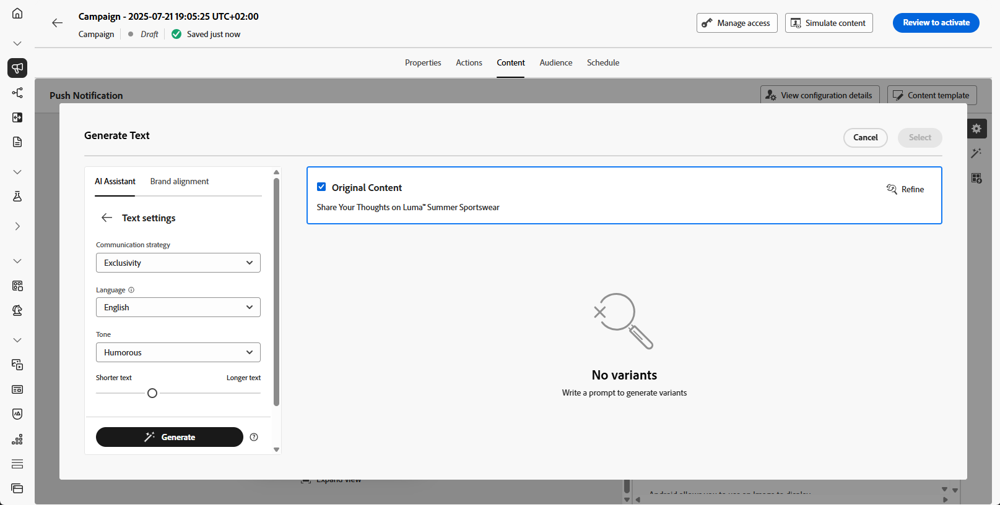
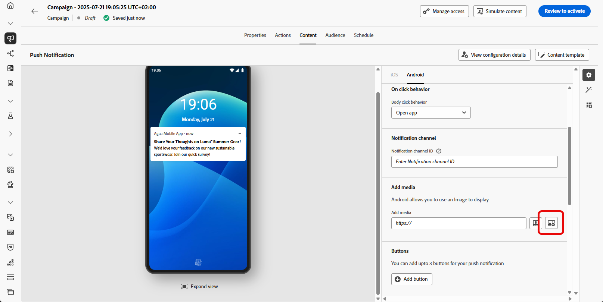

# Generación push con el asistente de IA {#generative-push}

>[!IMPORTANT]
>
>Antes de empezar a usar esta capacidad, lea las [Mecanismos de protecciones y limitaciones](gs-generative.md#generative-guardrails) relacionadas.
>&#x200B;> 
>
>Debe aceptar un [acuerdo de usuario](https://www.adobe.com/legal/licenses-terms/adobe-dx-gen-ai-user-guidelines.html) para poder usar el Asistente de IA en Journey Optimizer. Para obtener más información, contacte con su representante de Adobe.

Una vez que haya creado y personalizado sus mensajes, lleve el contenido de las notificaciones push al siguiente nivel con AI Assistant en Journey Optimizer.

Explore las pestañas siguientes para aprender a utilizar el asistente de IA en Journey Optimizer.

>[!BEGINTABS]

>[!TAB Generación de inserción completa]

En este ejemplo concreto, aprenda a enviar una notificación push atractiva mediante el asistente de IA en Journey Optimizer.

Siga estos pasos:

1. Después de crear y configurar su campaña de notificaciones push, haga clic en **[!UICONTROL Editar contenido]**.

   Para obtener más información sobre cómo configurar su campaña de notificaciones push, consulte [esta página](../push/create-push.md).

1. Complete **[!UICONTROL detalles básicos]** para su campaña. Una vez finalizado, haga clic en **[!UICONTROL Editar contenido]**.

1. Personalice la notificación push según sea necesario. [Más información](../push/design-push.md)

1. Acceda al menú **[!UICONTROL Mostrar asistente de IA]**.

   {zoomable="yes"}

1. Habilite la opción **[!UICONTROL Usar contenido original]** para el asistente de IA a fin de personalizar la nueva opción de contenido en función del contenido seleccionado.

1. Seleccione su **[!UICONTROL marca]** para asegurarse de que el contenido generado por IA se ajuste a las especificaciones de su marca. [Más información](brands.md) sobre marcas.

   Tenga en cuenta que la función Marcas se presenta como una versión beta privada y estará disponible de forma progresiva para todos los clientes en futuras versiones.

1. Ajuste el contenido describiendo lo que desea generar en el campo **[!UICONTROL Preguntar]**.

   Si está buscando ayuda para crear su mensaje, acceda a la **[!UICONTROL Biblioteca de mensajes]**, que proporciona una amplia gama de ideas para mejorar sus campañas.

   {zoomable="yes"}

1. Elija el campo que desea generar: **[!UICONTROL Título]**, **[!UICONTROL Mensaje]** o **[!UICONTROL Imagen]**.

1. Adapte el mensaje con la opción **[!UICONTROL Configuración de texto]**:

   * **[!UICONTROL Estrategia de comunicación]**: elige el estilo de comunicación más adecuado para el texto generado.
   * **[!UICONTROL Idiomas]**: las opciones de idiomas español, italiano, sueco y noruego se presentan como una versión beta privada y estarán disponibles de forma progresiva para todos los clientes en futuras versiones.
   * **[!UICONTROL Tono]**: el tono de las notificaciones push debería interesar a la audiencia. Tanto si desea sonar informativo, lúdico o persuasivo, el asistente de IA puede adaptar el mensaje en consecuencia.

   {zoomable="yes"}

1. Elija su **[!UICONTROL configuración de imagen]**:

   * **[!UICONTROL Tipo de contenido]**: Esto categoriza la naturaleza del elemento visual, distinguiendo entre diferentes formas de representación visual como fotografías, gráficos o arte.
   * **[!UICONTROL Intensidad visual]**: puede controlar el impacto de la imagen ajustando su intensidad. Un ajuste inferior (2) creará una apariencia más suave y restringida, mientras que un ajuste superior (10) hará que la imagen sea más vibrante y visualmente potente.
   * **[!UICONTROL Color y tono]**: El aspecto general de los colores de una imagen y el estado de ánimo o atmósfera que transmite.
   * **[!UICONTROL Iluminación]**: hace referencia al relámpago presente en una imagen, que da forma a su atmósfera y resalta elementos específicos.
   * **[!UICONTROL Composición]**: hace referencia a la disposición de elementos dentro del marco de una imagen

   {zoomable="yes"}

1. En el menú **[!UICONTROL Recursos de marca]**, haga clic en **[!UICONTROL Cargar recurso de marca]** para agregar cualquier recurso de marca que contenga contenido que pueda proporcionar un asistente de IA de contexto adicional o seleccione uno cargado anteriormente.

   Los archivos cargados anteriormente están disponibles en la lista desplegable **[!UICONTROL Recursos de marca cargados]**. Simplemente, cambie los recursos que desee incluir en la generación.

1. Una vez que la solicitud esté lista, haga clic en **[!UICONTROL Generar]**.

1. Examine las **[!UICONTROL variaciones]** generadas.

   Haga clic en **[!UICONTROL Vista previa]** para ver una versión en pantalla completa de la variación seleccionada o haga clic en **[!UICONTROL Aplicar]** para reemplazar el contenido actual.

1. Haga clic en el icono de porcentaje para ver su **[!UICONTROL puntuación de alineación de marca]** e identificar cualquier desalineación con su marca.

   Más información sobre [puntuación de alineación de marca](brands-score.md).

   {zoomable="yes"}

1. Vaya a la opción **[!UICONTROL Refinar]** en la ventana de **[!UICONTROL vista previa]** para obtener acceso a características de personalización adicionales:

   * **[!UICONTROL Usar como contenido de referencia]**: la variante elegida servirá como contenido de referencia para generar otros resultados.

   * **[!UICONTROL Reformular]**: el Ayudante de IA puede reformular el mensaje de diferentes maneras, lo que mantiene la escritura fresca y atractiva para diversas audiencias.

   * **[!UICONTROL Use un lenguaje más sencillo]**: aproveche el Asistente para IA a fin de simplificar su lenguaje y garantizar la claridad y accesibilidad para una audiencia más amplia.

   También puedes cambiar el **[!UICONTROL tono]** y la **[!UICONTROL estrategia de comunicación]** de tu texto.

   {zoomable="yes"}

1. Abra la pestaña **[!UICONTROL Alineación de marca]** para ver cómo se ajusta su contenido a las [directrices de marca](brands.md).

1. Haga clic en **[!UICONTROL Seleccionar]** cuando encuentre el contenido apropiado.

   También puede habilitar el experimento para el contenido. [Más información](generative-experimentation.md)

1. Inserte campos de personalización para personalizar el contenido de las notificaciones push en función de los datos de perfiles. A continuación, haga clic en el botón **[!UICONTROL Simular contenido]** para controlar la renderización y compruebe la configuración de personalización con perfiles de prueba. [Más información](../personalization/personalize.md)

Una vez definido el contenido, la audiencia y la programación, estará listo para preparar la campaña push. [Más información](../campaigns/review-activate-campaign.md)

>[!TAB Generación de solo texto]

En este ejemplo en particular, aprenda a utilizar el asistente de IA en Journey Optimizer para contenido específico. Siga estos pasos:

1. Después de crear y configurar su campaña de notificaciones push, haga clic en **[!UICONTROL Editar contenido]**.

   Para obtener más información sobre cómo configurar su campaña push, consulte [esta página](../push/create-push.md).

1. Complete **[!UICONTROL detalles básicos]** para su campaña. Una vez finalizado, haga clic en **[!UICONTROL Editar contenido]**.

1. Personalice la notificación push según sea necesario. [Más información](../push/design-push.md)

1. Acceda al menú **[!UICONTROL Editar texto con el asistente de IA]** junto a los campos **[!UICONTROL Título]** o **[!UICONTROL Mensaje]**.

   {zoomable="yes"}

1. Habilite la opción **[!UICONTROL Usar contenido de referencia]** para el asistente de IA a fin de personalizar el nuevo contenido en función del contenido seleccionado.

1. Seleccione su **[!UICONTROL marca]** para asegurarse de que el contenido generado por IA se ajuste a las especificaciones de su marca. [Más información](brands.md) sobre marcas.

   Tenga en cuenta que la función Marcas se presenta como una versión beta privada y estará disponible de forma progresiva para todos los clientes en futuras versiones.

1. Ajuste el contenido describiendo lo que desea generar en el campo **[!UICONTROL Preguntar]**.

   Si está buscando ayuda para crear su mensaje, acceda a la **[!UICONTROL Biblioteca de mensajes]**, que proporciona una amplia gama de ideas para mejorar sus campañas.

   {zoomable="yes"}

1. Adapte el mensaje con la opción **[!UICONTROL Configuración de texto]**:

   * **[!UICONTROL Estrategia de comunicación]**: elige el estilo de comunicación más adecuado para el texto generado.
   * **[!UICONTROL Idiomas]**: las opciones de idiomas español, italiano, sueco y noruego se presentan como una versión beta privada y estarán disponibles de forma progresiva para todos los clientes en futuras versiones.
   * **[!UICONTROL Tono]**: el tono de la notificación push debería interesar a la audiencia. Tanto si desea sonar informativo, lúdico o persuasivo, el asistente de IA puede adaptar el mensaje en consecuencia.
   * **[!UICONTROL Longitud]**: seleccione la longitud del contenido mediante el regulador de intervalo.

   {zoomable="yes"}

1. En el menú **[!UICONTROL Recursos de marca]**, haga clic en **[!UICONTROL Cargar recurso de marca]** para agregar cualquier recurso de marca que contenga contenido que pueda proporcionar un asistente de IA de contexto adicional o seleccione uno cargado anteriormente.

   Los archivos cargados anteriormente están disponibles en la lista desplegable **[!UICONTROL Recursos de marca cargados]**. Simplemente, cambie los recursos que desee incluir en la generación.

1. Una vez que la solicitud esté lista, haga clic en **[!UICONTROL Generar]**.

1. Examine las **[!UICONTROL variaciones]** generadas.

1. Haga clic en el icono de porcentaje para ver su **[!UICONTROL puntuación de alineación de marca]** e identificar cualquier desalineación con su marca.

   Más información sobre [puntuación de alineación de marca](brands-score.md).

   {zoomable="yes"}

1. Vaya a la opción **[!UICONTROL Refinar]** en la ventana de **[!UICONTROL vista previa]** para obtener acceso a características de personalización adicionales:

   * **[!UICONTROL Usar como contenido de referencia]**: la variante elegida servirá como contenido de referencia para generar otros resultados.

   * **[!UICONTROL Elaborar]**: el Asistente de IA puede ayudarle a ampliar temas específicos y proporcionar detalles adicionales para una mejor comprensión y participación.

   * **[!UICONTROL Resumir]**: La información larga puede sobrecargar a los destinatarios. Utilice el asistente de IA para condensar los puntos clave en resúmenes claros y concisos que llamen la atención y los animen a leer más.

   * El Asistente de inteligencia artificial de **[!UICONTROL Reformular]**:The puede reformular tu mensaje de diferentes maneras, manteniendo tu escritura fresca y atractiva para diversas audiencias.

   * **[!UICONTROL Use un lenguaje más sencillo]**: aproveche el Asistente para IA a fin de simplificar su lenguaje y garantizar la claridad y accesibilidad para una audiencia más amplia.

   También puedes cambiar el **[!UICONTROL tono]** y la **[!UICONTROL estrategia de comunicación]** de tu texto.

   {zoomable="yes"}

1. Abra la pestaña **[!UICONTROL Alineación de marca]** para ver cómo se ajusta su contenido a las [directrices de marca](brands.md).

1. Haga clic en **[!UICONTROL Seleccionar]** cuando encuentre el contenido apropiado.

   También puede habilitar el experimento para el contenido. [Más información](generative-experimentation.md)

1. Inserte campos de personalización para personalizar el contenido de las notificaciones push en función de los datos de perfiles. A continuación, haga clic en el botón **[!UICONTROL Simular contenido]** para controlar la renderización y compruebe la configuración de personalización con perfiles de prueba. [Más información](../personalization/personalize.md)

Una vez definido el contenido, la audiencia y la programación, estará listo para preparar la campaña push. [Más información](../campaigns/review-activate-campaign.md)

>[!TAB Generación solo de imagen]

1. Después de crear y configurar su campaña de notificaciones push, haga clic en **[!UICONTROL Editar contenido]**.

   Para obtener más información sobre cómo configurar su campaña de notificaciones push, consulte [esta página](../push/create-push.md).

1. Complete **[!UICONTROL detalles básicos]** para su campaña. Una vez finalizado, haga clic en **[!UICONTROL Editar contenido]**.

1. Personalice la notificación push según sea necesario. [Más información](../push/design-push.md)

1. Acceda al menú **[!UICONTROL Agregar medios]**.

   {zoomable="yes"}

1. Habilite la opción **[!UICONTROL Estilo de referencia]** para que el Asistente de IA personalice el nuevo contenido en función del contenido de referencia. También puede cargar una imagen para añadir contexto a la variación.

1. Seleccione su **[!UICONTROL marca]** para asegurarse de que el contenido generado por IA se ajuste a las especificaciones de su marca. [Más información](brands.md) sobre marcas.

   Tenga en cuenta que la función Marcas se presenta como una versión beta privada y estará disponible de forma progresiva para todos los clientes en futuras versiones.

1. Ajuste el contenido describiendo lo que desea generar en el campo **[!UICONTROL Preguntar]**.

   Si está buscando ayuda para crear su mensaje, acceda a la **[!UICONTROL Biblioteca de mensajes]**, que proporciona una amplia gama de ideas para mejorar sus campañas.

   {zoomable="yes"}

1. Elija su **[!UICONTROL configuración de imagen]**:

   * **[!UICONTROL Tipo de contenido]**: Esto categoriza la naturaleza del elemento visual, distinguiendo entre diferentes formas de representación visual como fotografías, gráficos o arte.
   * **[!UICONTROL Intensidad visual]**: puede controlar el impacto de la imagen ajustando su intensidad. Un ajuste inferior (2) creará una apariencia más suave y restringida, mientras que un ajuste superior (10) hará que la imagen sea más vibrante y visualmente potente.
   * **[!UICONTROL Color y tono]**: El aspecto general de los colores de una imagen y el estado de ánimo o atmósfera que transmite.
   * **[!UICONTROL Iluminación]**: hace referencia al relámpago presente en una imagen, que da forma a su atmósfera y resalta elementos específicos.
   * **[!UICONTROL Composición]**: hace referencia a la disposición de elementos dentro del marco de una imagen

1. En el menú **[!UICONTROL Recursos de marca]**, haga clic en **[!UICONTROL Cargar recurso de marca]** para agregar cualquier recurso de marca que contenga contenido que pueda proporcionar un asistente de IA de contexto adicional o seleccione uno cargado anteriormente.

   Los archivos cargados anteriormente están disponibles en la lista desplegable **[!UICONTROL Recursos de marca cargados]**. Simplemente, cambie los recursos que desee incluir en la generación.

1. Una vez que la solicitud esté lista, haga clic en **[!UICONTROL Generar]**.

1. Examine las **[!UICONTROL variaciones]** generadas.

1. Haga clic en el icono de porcentaje para ver su **[!UICONTROL puntuación de alineación de marca]** e identificar cualquier desalineación con su marca.

   Más información sobre [puntuación de alineación de marca](brands-score.md).

1. Vaya a la opción **[!UICONTROL Refinar]** en la ventana de **[!UICONTROL vista previa]** para obtener acceso a características de personalización adicionales:

   * **[!UICONTROL Generar]** similares para ver las imágenes relacionadas con esta variante.
   * **[!UICONTROL Edite en Adobe Express]** para personalizar aún más su recurso.

[Obtenga más información sobre la integración de Adobe Express](../integrations/express.md)

   * **[!UICONTROL Guardar]** para almacenar los recursos y poder acceder a ellos más adelante.

   {zoomable="yes"}

1. Abra la pestaña **[!UICONTROL Alineación de marca]** para ver cómo se ajusta su contenido a las [directrices de marca](brands.md).

1. Haga clic en **[!UICONTROL Seleccionar]** cuando encuentre el contenido apropiado.

   También puede habilitar el experimento para el contenido. [Más información](generative-experimentation.md)

Una vez definido el contenido, la audiencia y la programación, estará listo para preparar la campaña push. [Más información](../campaigns/review-activate-campaign.md)

>[!ENDTABS]
