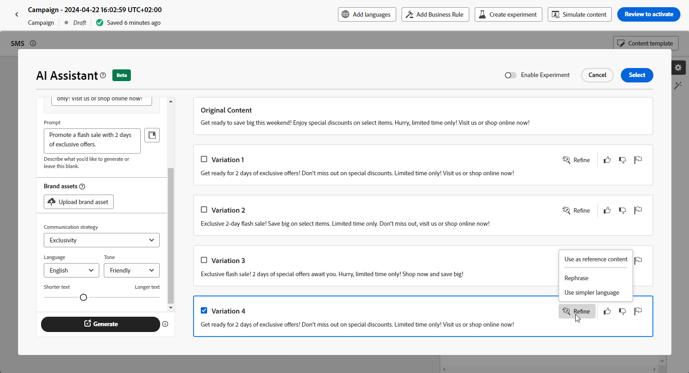

# Generación de SMS con el Asistente de IA {#generative-sms}

>[!BEGINSHADEBOX]

**Tabla de contenido**

* [Introducción al asistente de IA](gs-generative.md)
* [Generación de correo electrónico con el Asistente de IA](generative-email.md)
* Generación de SMS con el Asistente de IA
* [Generación de push con el asistente de IA](generative-push.md)
* [Experimento de contenido con el asistente de IA](generative-experimentation.md)

>[!ENDSHADEBOX]

Después de crear y adaptar los mensajes SMS para que coincidan con las preferencias de su audiencia, aumente su comunicación con el asistente de IA en Journey Optimizer.

Este recurso ofrece recomendaciones interesantes para ajustar el contenido, lo que ayuda a que los mensajes resuenen y promuevan la máxima participación.

Explore las pestañas siguientes para aprender a utilizar el asistente de IA en Journey Optimizer.

>[!NOTE]
>
>Antes de empezar a usar esta capacidad, lea [Protecciones y limitaciones](gs-generative.md#generative-guardrails) relacionadas.

>[!BEGINTABS]

>[!TAB Generación completa de SMS]

1. Después de crear y configurar tu campaña de SMS, haz clic en **[!UICONTROL Editar contenido]**.

   Para obtener más información sobre cómo configurar su campaña de SMS, consulte [esta página](../sms/create-sms.md).

1. Complete **[!UICONTROL detalles básicos]** para su campaña. Una vez finalizado, haga clic en **[!UICONTROL Editar contenido]**.

1. Personalice su mensaje SMS según sea necesario. [Más información](../sms/create-sms.md)

1. Acceda al menú **[!UICONTROL Mostrar asistente de IA]**.

   {zoomable="yes"}

1. Habilite la opción **[!UICONTROL Usar contenido original]** para el asistente de IA a fin de personalizar el nuevo contenido en función del contenido de la campaña, el nombre y la audiencia seleccionada.

   El mensaje siempre debe estar vinculado a un contexto específico.

1. Ajuste el contenido describiendo lo que desea generar en el campo **[!UICONTROL Preguntar]**.

   Si está buscando ayuda para crear su mensaje, acceda a la **[!UICONTROL Biblioteca de mensajes]**, que proporciona una amplia gama de ideas para mejorar sus campañas.

   {zoomable="yes"}

1. Seleccione **[!UICONTROL Cargar recurso de marca]** para agregar cualquier recurso de marca que contenga contenido que pueda proporcionar contexto adicional con el Ayudante de IA.

1. Adapte el indicador con las diferentes opciones:

   * **[!UICONTROL Estrategia de comunicación]**: seleccione el enfoque de comunicación que desee para el texto generado.
   * **[!UICONTROL Idioma]**: elige el idioma del contenido de la variante.
   * **[!UICONTROL Tono]**: Asegúrese de que el texto sea apropiado para su audiencia y propósito.
   * **[!UICONTROL Longitud]**: seleccione la longitud del contenido mediante el regulador de intervalo.

   {zoomable="yes"}

1. Una vez que la solicitud esté lista, haga clic en **[!UICONTROL Generar]**.

1. Examine las **[!UICONTROL variaciones]** generadas y haga clic en **[!UICONTROL Vista previa]** para ver una versión en pantalla completa de la variación seleccionada.

1. Vaya a la opción **[!UICONTROL Refinar]** dentro de la ventana de **[!UICONTROL Vista previa]** para acceder a características de personalización adicionales y ajustar la variación a sus preferencias:

   * **[!UICONTROL Usar como contenido de referencia]**: la variante elegida servirá como contenido de referencia para generar otros resultados.

   * **[!UICONTROL Reformular]**: el Asistente de IA puede reformular su mensaje de diferentes maneras, manteniendo su escritura fresca y atractiva para diversas audiencias.

   * **[!UICONTROL Use un lenguaje más sencillo]**: aproveche el asistente de IA para simplificar el lenguaje y garantizar la claridad y accesibilidad para una audiencia más amplia.

   {zoomable="yes"}

1. Haga clic en **[!UICONTROL Seleccionar]** cuando encuentre el contenido apropiado.

   También puede habilitar el experimento para el contenido. [Más información](generative-experimentation.md)

1. Inserte campos de personalización para personalizar el contenido de SMS en función de los datos de perfiles. [Más información sobre la personalización de contenido](../personalization/personalize.md)

1. Después de definir el contenido del mensaje, haga clic en el botón **[!UICONTROL Simular contenido]** para controlar la representación y compruebe la configuración de personalización con perfiles de prueba. [Más información](../personalization/personalize.md)

Una vez definido el contenido, la audiencia y la programación, estará listo para preparar la campaña de SMS. [Más información](../campaigns/review-activate-campaign.md)

>[!TAB Generación de texto]

1. Después de crear y configurar tu campaña de SMS, haz clic en **[!UICONTROL Editar contenido]**.

   Para obtener más información sobre cómo configurar su campaña de SMS, consulte [esta página](../sms/create-sms.md).

1. Complete **[!UICONTROL detalles básicos]** para su campaña. Una vez finalizado, haga clic en **[!UICONTROL Editar contenido]**.

1. Personalice su mensaje SMS según sea necesario. [Más información](../sms/create-sms.md)

1. Acceda al menú **[!UICONTROL Editar texto con el asistente de IA]** junto al campo **[!UICONTROL Mensaje]**.

   {zoomable="yes"}

1. Habilite la opción **[!UICONTROL Usar contenido de referencia]** para el asistente de IA a fin de personalizar el nuevo contenido en función del contenido de la campaña, el nombre y la audiencia seleccionada.

   El mensaje siempre debe estar vinculado a un contexto específico.

1. Ajuste el contenido describiendo lo que desea generar en el campo **[!UICONTROL Preguntar]**.

   Si está buscando ayuda para crear su mensaje, acceda a la **[!UICONTROL Biblioteca de mensajes]**, que proporciona una amplia gama de ideas para mejorar sus campañas.

   {zoomable="yes"}

1. Seleccione **[!UICONTROL Cargar recurso de marca]** para agregar cualquier recurso de marca que contenga contenido que pueda proporcionar contexto adicional con el Ayudante de IA.

1. Adapte el indicador con las diferentes opciones:

   * **[!UICONTROL Estrategia de comunicación]**: seleccione el enfoque de comunicación que desee para el texto generado.
   * **[!UICONTROL Idioma]**: elige el idioma del contenido de la variante.
   * **[!UICONTROL Tono]**: Asegúrese de que el texto sea apropiado para su audiencia y propósito.
   * **[!UICONTROL Longitud]**: seleccione la longitud del contenido mediante el regulador de intervalo.

   {zoomable="yes"}

1. Una vez que la solicitud esté lista, haga clic en **[!UICONTROL Generar]**.

1. Examine las **[!UICONTROL variaciones]** generadas y haga clic en **[!UICONTROL Vista previa]** para ver una versión en pantalla completa de la variación seleccionada.

1. Vaya a la opción **[!UICONTROL Refinar]** dentro de la ventana de **[!UICONTROL Vista previa]** para acceder a características de personalización adicionales y ajustar la variación a sus preferencias:

   * **[!UICONTROL Usar como contenido de referencia]**: la variante elegida servirá como contenido de referencia para generar otros resultados.

   * **[!UICONTROL Reformular]**: el Asistente de IA puede reformular su mensaje de diferentes maneras, manteniendo su escritura fresca y atractiva para diversas audiencias.

   * **[!UICONTROL Use un lenguaje más sencillo]**: aproveche el asistente de IA para simplificar el lenguaje y garantizar la claridad y accesibilidad para una audiencia más amplia.

   {zoomable="yes"}

1. Haga clic en **[!UICONTROL Seleccionar]** cuando encuentre el contenido apropiado.

   También puede habilitar el experimento para el contenido. [Más información](generative-experimentation.md)

1. Inserte campos de personalización para personalizar el contenido de SMS en función de los datos de perfiles. [Más información sobre la personalización de contenido](../personalization/personalize.md)

1. Después de definir el contenido del mensaje, haga clic en el botón **[!UICONTROL Simular contenido]** para controlar la representación y compruebe la configuración de personalización con perfiles de prueba.

Una vez definido el contenido, la audiencia y la programación, estará listo para preparar la campaña de SMS. [Más información](../campaigns/review-activate-campaign.md)

>[!ENDTABS]
