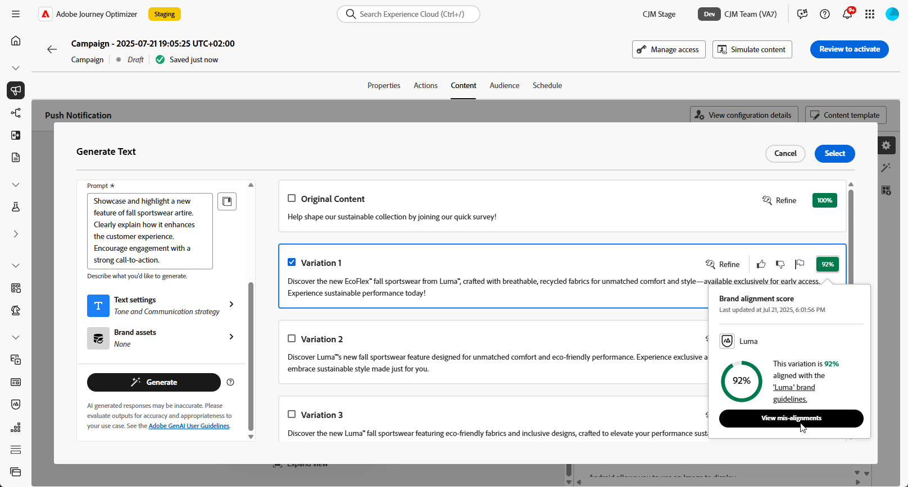

# Generación de texto con el Asistente de IA {#generative-text}

>[!IMPORTANT]
>
>Antes de empezar a usar esta capacidad, lea las [Mecanismos de protecciones y limitaciones](gs-generative.md#generative-guardrails) relacionadas.
> 
>
>Debe aceptar un [acuerdo de usuario](https://www.adobe.com/legal/licenses-terms/adobe-dx-gen-ai-user-guidelines.html) para poder usar el Asistente de IA en Journey Optimizer. Para obtener más información, contacte con su representante de Adobe.

Utilice el Asistente de IA en Journey Optimizer para generar contenido de texto atractivo que resuene con su audiencia. Tanto si necesita mejorar la copia del correo electrónico, crear contenido web atractivo, crear texto de página de aterrizaje persuasivo, escribir mensajes de notificación push o componer mensajes SMS, el asistente de IA le ayuda a ofrecer texto impactante.

## Para canales de correo electrónico y web {#email-web-channels}

El asistente de IA puede generar contenido de texto de alta calidad para sus campañas de correo electrónico, experiencias web y páginas de aterrizaje. Esta capacidad le permite crear mensajes atractivos y en la marca que se conectan con su audiencia en puntos de contacto digitales.

### Acceso y configuración {#access-configure}

Antes de empezar a generar contenido de texto con el asistente de IA, debe configurar la campaña o el recorrido y acceder al editor de contenido. Siga estos pasos para preparar su espacio de trabajo y abrir el panel Asistente de IA.

1. Cree y configure su campaña o recorrido:

   * **Correo electrónico**: Después de crear y configurar tu campaña de correo electrónico, haz clic en **[!UICONTROL Editar contenido]**. [Más información](../email/create-email.md)
   * **Web**: después de crear y configurar la página web, haga clic en **[!UICONTROL Editar página web]**. [Más información](../web/create-web.md)
   * **Página de aterrizaje**: después de crear y configurar la página de aterrizaje, haga clic en **[!UICONTROL Abrir diseñador]**. [Más información](../landing-pages/create-lp.md)

1. Seleccione un **[!UICONTROL componente Texto]** para segmentar únicamente un contenido específico y acceder al menú **[!UICONTROL Asistente de IA]** (o **[!UICONTROL Mostrar asistente de IA]** para la web).

   {zoomable="yes"}

### Generar contenido {#generate-content}

Aprenda a crear mensajes claros, ajustar la configuración y generar texto adaptado mediante el asistente de IA, lo que garantiza que los mensajes se ajusten a los objetivos de comunicación y de marca.

1. Habilite la opción **[!UICONTROL Usar contenido original]** para el asistente de IA a fin de personalizar el nuevo contenido en función del contenido seleccionado.

1. Seleccione su **[!UICONTROL marca]** para asegurarse de que el contenido generado por IA se ajuste a las especificaciones de su marca. [Más información](brands.md) sobre marcas.

1. Ajuste el contenido describiendo lo que desea generar en el campo **[!UICONTROL Preguntar]**.

   Si está buscando ayuda para crear su mensaje, acceda a la **[!UICONTROL Biblioteca de mensajes]**, que proporciona una amplia gama de ideas para mejorar sus campañas.

   {zoomable="yes"}

1. Adapte el mensaje con la opción **[!UICONTROL Configuración de texto]**:

   * **[!UICONTROL Estrategia de comunicación]**: elige el estilo de comunicación más adecuado para el texto generado.
   * **[!UICONTROL Idiomas]**: elige el idioma del contenido generado.
   * **[!UICONTROL Tono]**: el tono debería interesar a su audiencia. Tanto si desea sonar informativo, lúdico o persuasivo, el asistente de IA puede adaptar el mensaje en consecuencia.
   * **Longitud del texto**: utilice el control deslizante para seleccionar la longitud deseada del texto.

   {zoomable="yes"}

1. En el menú **[!UICONTROL Recursos de marca]**, haga clic en **[!UICONTROL Cargar recurso de marca]** para agregar cualquier recurso de marca que contenga contenido que pueda proporcionar un asistente de IA de contexto adicional o seleccione uno cargado anteriormente.

   Los archivos cargados anteriormente están disponibles en la lista desplegable **[!UICONTROL Recursos de marca cargados]**. Simplemente, cambie los recursos que desee incluir en la generación.

   {zoomable="yes"}

1. Una vez que la solicitud esté lista, haga clic en **[!UICONTROL Generar]**.

### Refinamiento y finalización {#refine-finalize}

Aprenda a revisar el texto generado, realizar refinamientos y aplicar personalizaciones para finalizar el contenido, creando mensajes atractivos y refinados listos para su envío.

1. Examine las **[!UICONTROL variaciones]** generadas.

   Haga clic en **[!UICONTROL Vista previa]** para ver una versión en pantalla completa de la variación seleccionada o haga clic en **[!UICONTROL Aplicar]** para reemplazar el contenido actual.

1. Haga clic en el icono de porcentaje para ver su **[!UICONTROL puntuación de alineación de marca]** e identificar cualquier desalineación con su marca.

   Más información sobre [puntuación de alineación de marca](brands-score.md).

   {zoomable="yes"}

1. Vaya a la opción **[!UICONTROL Refinar]** en la ventana de **[!UICONTROL vista previa]** para obtener acceso a características de personalización adicionales:

   * **[!UICONTROL Usar como contenido de referencia]**: la variante elegida servirá como contenido de referencia para generar otros resultados.

   * **[!UICONTROL Reformular]**: vuelva a escribir el mensaje conservando su significado. Esta opción le ayuda a generar frases alternativas, mejorar el flujo o ajustar el estilo sin cambiar el mensaje principal.

   * **[!UICONTROL Use un lenguaje más sencillo]**: aproveche el Asistente para IA a fin de simplificar su lenguaje y garantizar la claridad y accesibilidad para una audiencia más amplia.

   * **[!UICONTROL Cambiar tono]**: Ajuste el tono del mensaje para que coincida mejor con su estilo de comunicación, es decir, para que sea más amable, profesional, urgente o inspirador.

   * **[!UICONTROL Cambiar estrategia de comunicación]**: modifique el enfoque de mensajería en función de sus objetivos, como crear urgencia o enfatizar atractivo interesante.

   {zoomable="yes"}

1. Abra la pestaña **[!UICONTROL Alineación de marca]** para ver cómo se ajusta su contenido a las [directrices de marca](brands.md).

1. Haga clic en **[!UICONTROL Seleccionar]** cuando encuentre el contenido apropiado.

   También puede habilitar el experimento para el contenido. [Más información](generative-experimentation.md)

1. Inserte campos de personalización para personalizar el contenido en función de los datos de perfiles. A continuación, haga clic en el botón **[!UICONTROL Simular contenido]** para controlar la renderización y compruebe la configuración de personalización con perfiles de prueba. [Más información](../personalization/personalize.md)

1. Revise y active el contenido:
   * **Correo electrónico**: Una vez definido el contenido, la audiencia y la programación, ya puede preparar su campaña de correo electrónico. [Más información](../campaigns/review-activate-campaign.md)
   * **Web**: Una vez que haya definido la configuración de su campaña web y editado el contenido como desee, puede revisar y activar su campaña web. [Más información](../web/create-web.md#activate-web-campaign)
   * **Página de aterrizaje**: Una vez que la página de aterrizaje esté lista, puede publicarla para que esté disponible para usarla en un mensaje. [Más información](../landing-pages/create-lp.md#publish-landing-page)

## Para canales móviles {#mobile-channels}

El asistente de IA puede generar contenido de texto atractivo para sus notificaciones push y mensajes SMS, lo que le ayuda a crear comunicaciones móviles atractivas que resuenan con su audiencia en todos los puntos de contacto móviles.

### Acceso y configuración {#mobile-access-configure}

Antes de empezar a generar texto con el Asistente de IA para canales móviles, debe configurar la campaña y acceder al Asistente de IA. El método de acceso varía ligeramente entre notificaciones push y mensajes SMS.

1. Cree y configure su campaña móvil:
   * **Notificaciones push**: después de crear y configurar su campaña de notificaciones push, haga clic en **[!UICONTROL Editar contenido]**. [Más información](../push/create-push.md)
   * **SMS**: después de crear y configurar tu campaña de SMS, haz clic en **[!UICONTROL Editar contenido]**. [Más información](../sms/create-sms.md)

1. Complete **[!UICONTROL detalles básicos]** para su campaña. Una vez finalizado, haga clic en **[!UICONTROL Editar contenido]**.

1. Personalice el mensaje según sea necesario:
   * **Notificaciones push**: [Más información](../push/design-push.md)
   * **SMS**: [Más información](../sms/create-sms.md)

1. Acceder al asistente de IA:
   * **Para notificaciones push**: haz clic en el menú **[!UICONTROL Editar texto con el asistente de IA]** junto a tus campos **[!UICONTROL Título]** o **[!UICONTROL Mensaje]**. También puede acceder directamente al menú **Asistente de IA**.

     {zoomable="yes"}

   * **Para SMS**: haz clic en el menú **[!UICONTROL Editar texto con el asistente de IA]** que está junto a tu **[!UICONTROL mensaje]** o accede al menú **[!UICONTROL Mostrar asistente de IA]**.

     {zoomable="yes"}

### Generar contenido {#mobile-generate-content}

Una vez que haya accedido al asistente de IA, puede configurar los ajustes de generación para crear contenido móvil que coincida con sus objetivos de marca y campaña. Personalice los parámetros de texto, añada recursos de marca y proporcione indicadores para guiar a la IA en la generación de variaciones relevantes.

1. Seleccione su **[!UICONTROL marca]** para asegurarse de que el contenido generado por IA se ajuste a las especificaciones de su marca. [Más información](brands.md) sobre marcas.

   Tenga en cuenta que la función Marcas se presenta como una versión beta privada y estará disponible de forma progresiva para todos los clientes en futuras versiones.

1. Ajuste el contenido describiendo lo que desea generar en el campo **[!UICONTROL Preguntar]**.

   Si está buscando ayuda para crear su mensaje, acceda a la **[!UICONTROL Biblioteca de mensajes]**, que proporciona una amplia gama de ideas para mejorar sus campañas. [Más información sobre las prácticas recomendadas para los mensajes](ai-assistant-prompting-guide.md)

   {zoomable="yes"}

1. **Para la notificación push**, elija qué campo desea generar: Título y/o Mensaje.

1. Adapte el mensaje con la opción **[!UICONTROL Configuración de texto]**:

   * **[!UICONTROL Estrategia de comunicación]**: elige el estilo de comunicación más adecuado para el texto generado.
   * **[!UICONTROL Idiomas]**: elige el idioma del contenido generado.
   * **[!UICONTROL Tono]**: el tono debería interesar a su audiencia. Tanto si desea sonar informativo, lúdico o persuasivo, el asistente de IA puede adaptar el mensaje en consecuencia.

     {zoomable="yes"}

1. En el menú **[!UICONTROL Contenido de referencia]**, haga clic en **[!UICONTROL Cargar archivo]** para agregar cualquier recurso de marca que contenga contenido que pueda proporcionar un asistente de IA de contexto adicional o seleccione uno cargado anteriormente.

   Los archivos cargados anteriormente están disponibles en la lista desplegable **[!UICONTROL Contenido de referencia cargado]**. Simplemente, cambie los recursos que desee incluir en la generación.

1. Una vez que la solicitud esté lista, haga clic en **[!UICONTROL Generar]**.

### Refinamiento y finalización {#mobile-refine-finalize}

Después de generar variaciones de texto para los mensajes móviles, puede ajustar los resultados para asegurarse de que cumplen con los requisitos exactos. Revise la alineación de la marca, ajuste el tono y el idioma y prepare el contenido para su activación.

1. Después de la generación, examine **[!UICONTROL Variaciones]**.

1. Haga clic en el icono de porcentaje para ver su **[!UICONTROL puntuación de alineación de marca]** e identificar cualquier desalineación con su marca.

   Más información sobre [puntuación de alineación de marca](brands-score.md).

   {zoomable="yes"}

1. Haga clic en **[!UICONTROL Vista previa]** para ver una versión en pantalla completa de la variación seleccionada o haga clic en **[!UICONTROL Aplicar]** para reemplazar el contenido actual.

1. Vaya a la opción **[!UICONTROL Refinar]** en la ventana de **[!UICONTROL vista previa]** para obtener acceso a características de personalización adicionales:

   * **[!UICONTROL Usar como contenido de referencia]**: la variante elegida servirá como contenido de referencia para generar otros resultados.

   * **[!UICONTROL Reformular]**: vuelva a escribir el mensaje conservando su significado. Esta opción le ayuda a generar frases alternativas, mejorar el flujo o ajustar el estilo sin cambiar el mensaje principal.

   * **[!UICONTROL Use un lenguaje más sencillo]**: aproveche el Asistente para IA a fin de simplificar su lenguaje y garantizar la claridad y accesibilidad para una audiencia más amplia.

   * **[!UICONTROL Traducir]**: Simplifique su idioma para garantizar la claridad y accesibilidad para una audiencia más amplia.

   * **[!UICONTROL Cambiar tono]**: Ajuste el tono del mensaje para que coincida mejor con su estilo de comunicación, es decir, para que sea más amable, profesional, urgente o inspirador.

   * **[!UICONTROL Cambiar estrategia de comunicación]**: modifique el enfoque de mensajería en función de sus objetivos, como crear urgencia o enfatizar atractivo interesante.

     {zoomable="yes"}

1. Abra la pestaña **[!UICONTROL Alineación de marca]** para ver cómo se ajusta su contenido a las [directrices de marca](brands.md).

1. Haga clic en **[!UICONTROL Seleccionar]** cuando encuentre el contenido apropiado.

   También puede habilitar el experimento para el contenido. [Más información](generative-experimentation.md)

1. Inserte campos de personalización para personalizar el contenido en función de los datos de perfiles. A continuación, haga clic en el botón **[!UICONTROL Simular contenido]** para controlar la renderización y compruebe la configuración de personalización con perfiles de prueba. [Más información](../personalization/personalize.md)

Una vez definido el contenido, la audiencia y la programación, estará listo para preparar la campaña móvil. [Más información](../campaigns/review-activate-campaign.md)

