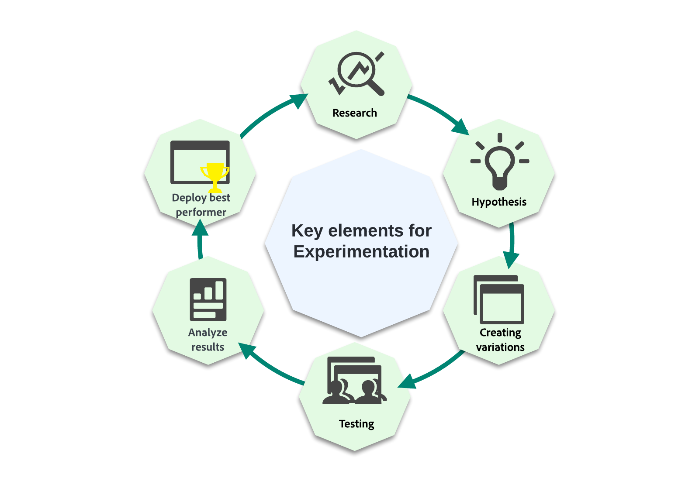
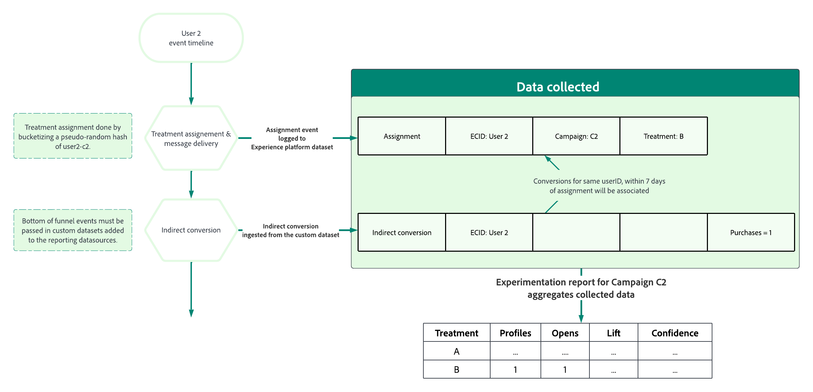

# Introducción a los experimentos de contenido {#get-started-experiment}

## ¿Qué es un experimento de contenido?

Los experimentos de contenido le permiten optimizar el contenido para las acciones de sus campañas.

Los experimentos son un conjunto de ensayos aleatorios, que en el contexto de las pruebas en línea, significa que algunos usuarios seleccionados al azar están expuestos a una variación determinada de un mensaje y otro conjunto de usuarios seleccionados al azar a otro tratamiento. Después de enviar el mensaje, puede medir las métricas de resultados que le interesen, por ejemplo, las aperturas de correos electrónicos o los clics.

➡️ En [esta sección](../experience-decisioning/experience-decisioning-uc.md) se presenta un caso de uso de extremo a extremo que muestra cómo usar experimentos de contenido para comparar las decisiones con el canal de experiencia basado en código.

## ¿Por qué ejecutar experimentos?

Los experimentos le permiten aislar los cambios que conducen a mejoras en las métricas. Como se ilustra en la imagen anterior: algunos usuarios seleccionados al azar están expuestos a cada grupo de tratamiento, lo que significa que, de media, los grupos compartirán las mismas características. Por lo tanto, cualquier diferencia en los resultados puede interpretarse como debida a las diferencias en los tratamientos recibidos, es decir, usted puede establecer un vínculo causal entre los cambios que usted hizo y los resultados en los que está interesado.

Esto le permite tomar decisiones basadas en datos al optimizar sus objetivos comerciales.

Para los experimentos de contenido en Adobe Journey Optimizer, puede probar ideas como:

* **Línea de asunto**: ¿Cuál podría ser el impacto de un cambio en el tono o en el grado de personalización de una línea de asunto?
* **Contenido del mensaje**: ¿Cambiar el diseño visual de un correo electrónico dará como resultado más clics en el correo electrónico?

## ¿Cómo funciona un experimento de contenido? {#content-experiment-work}

### Asignación aleatoria

La experimentación de contenido en Adobe Journey Optimizer utiliza un hash pseudoaleatorio de la identidad del visitante para realizar una asignación aleatoria de usuarios en el público de destino a uno de los tratamientos que ha definido. El mecanismo de hash garantiza que, en los casos en los que el visitante entra en una campaña varias veces, reciba el mismo tratamiento de forma determinada.

En detalle, el algoritmo de 32 bits MumurHash3 se usa para hash la cadena de identidad del usuario en uno de los 10 000 bloques. En un experimento de contenido con el 50 % del tráfico asignado a cada tratamiento, los usuarios que caigan en bloques de 1 a 5000 recibirán el primer tratamiento, mientras que los usuarios de los bloques de 5001 a 10 000 recibirán el segundo tratamiento. Dado que se utiliza un hash pseudoaleatorio, las divisiones de visitante que observe pueden no ser exactamente 50-50; sin embargo, la división será estadísticamente equivalente al porcentaje de división objetivo.

Tenga en cuenta que, como parte de la configuración de cada campaña con un experimento de contenido, debe elegir un espacio de nombres de identidad desde el que se seleccionará el Id de usuario para el algoritmo de aleatorización. Esto es independiente de las [direcciones de ejecución](../configuration/primary-email-addresses.md).

### Recopilación y análisis de datos

En el momento de la asignación, es decir, cuando el mensaje se envía en canales salientes o cuando el usuario introduce la campaña en canales entrantes, se registra un &quot;registro de asignación&quot; en el conjunto de datos del sistema correspondiente. Esto registrará a qué tratamiento se asignó el usuario, junto con identificadores de campaña y experimento.

Las métricas de objetivo se pueden agrupar en dos clases principales:

* Métricas directas, en las que el usuario reacciona directamente al tratamiento, por ejemplo, abriendo un correo electrónico o haciendo clic en un vínculo.
* Métricas indirectas o &quot;de fondo de canal&quot;, que se producen después de que el usuario haya sido expuesto al tratamiento.

Para las métricas de objetivo directo en las que Adobe Journey Optimizer realiza un seguimiento de los mensajes, los eventos de respuesta de los usuarios finales se etiquetan automáticamente con los identificadores de campaña y tratamiento, lo que permite la asociación directa de la métrica de respuesta con un tratamiento. [Más información sobre el seguimiento](../email/message-tracking.md).

Para objetivos indirectos o &quot;de fondo de canal&quot; como las compras, los eventos de respuesta de los usuarios finales no se etiquetan con identificadores de campaña y tratamiento, es decir, un evento de compra se produce después de la exposición a un tratamiento, no hay una asociación directa de esa compra con una asignación de tratamiento anterior. Para estas métricas, Adobe asociará el tratamiento con el evento de conversión del fondo de canal si:

* La identidad del usuario es la misma en el momento de la asignación y el evento de conversión.
* La conversión se produce dentro de los siete días siguientes a la asignación del tratamiento.

A continuación, Adobe Journey Optimizer utiliza métodos estadísticos avanzados &quot;en cualquier momento válidos&quot; para interpretar estos datos de informes sin procesar, lo que le permite interpretar sus informes de experimentación. Para obtener más información, consulte [esta página](../content-management/experiment-calculations.md).

## Sugerencias para ejecutar Experimentos

Al ejecutar Experimentos, es importante seguir determinadas prácticas recomendadas. A continuación, se ofrecen algunas sugerencias para ejecutar estos experimentos:

+++Aísle las variables que está intentando probar

Formule alguna hipótesis que desee probar y limite esta hipótesis a los pocos cambios posibles para determinar qué ha tenido un impacto en su envío.

Por ejemplo, una buena hipótesis puede ser si la personalización en líneas de asunto de correo electrónico impulsa mejores tasas de apertura. Sin embargo, añadir un cambio en el contenido del mensaje o en las imágenes puede resultar en una conclusión confusa.
+++

+++Asegúrese de que está utilizando la métrica correcta

Determine la métrica a la que desea dirigirse y si los cambios que está realizando pueden tener algún impacto directo en esta métrica.

Por ejemplo, es poco probable que el cambio de contenido del cuerpo del mensaje afecte a las tasas de apertura del correo electrónico.
+++

+++Ejecute la prueba en el tamaño de audiencia adecuado o durante el tiempo suficiente

Si realiza las pruebas durante más tiempo, podrá detectar diferencias menores en la métrica objetivo entre tratamientos. Sin embargo, si el valor de la línea de base de la métrica de objetivos es pequeño, necesitará muestras de mayor tamaño.
El número de usuarios que debe incluirse en el experimento depende del tamaño del efecto que desee detectar, la variación o propagación de la métrica de objetivos, así como la tolerancia de errores de falsos positivos y falsos negativos. En Experimentos clásicos, puede usar una [calculadora de tamaño de muestra](https://experienceleague.adobe.com/tools/calculator/testcalculator.html?lang=es){_blank} para determinar cuánto tiempo debe ejecutar la prueba.
+++ 

+++Comprender la incertidumbre estadística

Si está realizando un experimento en el que 1000 usuarios han visto un tratamiento y la tasa de conversión se establece en 5 %. ¿Sería esta la tasa de conversión real si se incluyeran a todos los usuarios? ¿Cuál sería la tasa de conversión verdadera?
Los métodos estadísticos nos dan una forma de formalizar esta incertidumbre. Uno de los conceptos más importantes que debe comprender a la hora de ejecutar experimentos en línea es que las tasas de conversión observadas son coherentes con una serie de tasas de conversión reales subyacentes, lo que significa que debe esperar hasta que esas estimaciones sean lo suficientemente precisas, antes de intentar llegar a una conclusión. Los intervalos de confianza y la confianza nos ayudan a cuantificar esta incertidumbre.
+++

+++Forme nuevas hipótesis y realice pruebas continuamente

Para obtener verdaderas perspectivas empresariales, debe limitarse a un solo experimento. En su lugar, realice un seguimiento de los experimentos, formulando nuevas hipótesis y ejecutando nuevas pruebas con diferentes cambios, en públicos distintos y examinando el impacto en varias métricas.
+++

## Interpretación de los resultados de los experimentos {#interpret-results}

>[!CONTEXTUALHELP]
>id="ajo_campaigns_content_experiment_summary"
>title="Widget Resumen"
>abstract="El widget Resumen proporciona información general acerca de los resultados del experimento, incluso si son concluyentes o no. Ofrece una forma rápida y sencilla de comprender el resultado de su experimento."

En esta sección se describen los informes de Experimento y cómo comprender las distintas cantidades estadísticas que se presentan.

Estas son algunas directrices para interpretar los resultados de su experimento de contenido.

Tenga en cuenta que una descripción completa de los resultados debe tener en cuenta todas las pruebas disponibles (es decir, el diseño de los experimentos, los tamaños de las muestras, las tasas de conversión, la confianza, etc.), y no solo la declaración de concluyente o no. Aunque resultado no sea aún concluyente, puede haber pruebas convincentes de que un tratamiento sea diferente de otro.

Para comprender los cálculos estadísticos, consulte esta [página](../content-management/experiment-calculations.md).

### &#x200B;1. Comparar métricas normalizadas {#normalized-metrics}

Al comparar el rendimiento de dos tratamientos, siempre debe comparar las métricas normalizadas para tener en cuenta cualquier diferencia en la cantidad de perfiles expuestos a cada tratamiento.

Por ejemplo, si el objetivo del experimento está establecido en **[!UICONTROL Aperturas únicas]**, y se ha mostrado  un tratamiento determinado a 10 000 perfiles con 200 aperturas únicas registradas, esto representa una **[!UICONTROL Tasa de conversión]** del 2 %. Para las métricas no únicas, como la métrica Aperturas, la métrica normalizada se muestra como una **[!UICONTROL Recuento por perfil]**, mientras que para las métricas continuas como Precio total, la métrica normalizada se muestra como un **[!UICONTROL Total por perfil]**.

### &#x200B;2. Centrarse en intervalos de confianza {#confidence-intervals}

Al ejecutar experimentos con muestras de perfiles, la tasa de conversión observada para un tratamiento determinado representa una estimación de la tasa de conversión subyacente real.

Por ejemplo, si el Tratamiento A tiene una **[!UICONTROL Tasa de conversión]** del 3 %, mientras que el tratamiento B ha observado una **[!UICONTROL Tasa de conversión]** del 2 %, ¿es el tratamiento A un mejor rendimiento que el tratamiento B? Para responder a esto, primero debemos cuantificar la incertidumbre en estas tasas de conversión observadas.

Los intervalos de confianza ayudan a cuantificar la cantidad de incertidumbre en las tasas de conversión estimadas, pero los intervalos de confianza más amplios implican más incertidumbre. A medida que se añadan más perfiles al experimento, los intervalos se reducirán para representar una estimación más precisa. El intervalo de confianza representa un rango de tasas de conversión compatibles con los datos observados.

Si los intervalos de confianza para dos tratamientos apenas se superponen, significa que los dos tratamientos tienen tasas de conversión diferentes. Pero, si hay mucha superposición entre los intervalos de confianza para dos tratamientos, entonces es más probable que los dos tratamientos tengan la misma tasa de conversión.

Adobe utiliza un 95 % cada vez que se usan intervalos de confianza válidos o secuencias de confianza, lo que significa que los resultados se pueden ver de forma segura en cualquier momento durante el experimento.

### &#x200B;3. Comprender el alza {#understand-lift}

El resumen del informe de experimento muestra el **[!UICONTROL Alza sobre la línea de base]**, que es una medida de la mejora porcentual en la tasa de conversión de un tratamiento determinado respecto a la línea de base. Definida con precisión, es la diferencia de rendimiento entre un tratamiento determinado y la línea de base, dividida por el rendimiento de la línea de base, expresada como porcentaje.

### &#x200B;3. Comprender la confianza {#understand-confidence}

Aunque debería centrarse principalmente en el **[!UICONTROL Intervalo de confianza]** del rendimiento de cada tratamiento, Adobe también muestra la confianza, que es una medida probabilística de la cantidad de evidencia que existe de que un tratamiento dado es el mismo que el tratamiento de la línea de base. Una mayor confianza indica menos evidencia para el supuesto de que los tratamientos de línea de base y de no línea de base tienen un rendimiento igual. Más concretamente, la confianza que se muestra es una probabilidad (expresada como porcentaje) de que habríamos observado una diferencia menor en las tasas de conversión entre un tratamiento determinado y la línea de base, si en realidad no hay diferencia en las tasas de conversión subyacentes reales. En términos de valores p, la confianza mostrada es 1 - valor p.

Adobe utiliza la confianza &quot;válida en cualquier momento&quot; y los valores p &quot;válidos en cualquier momento&quot;, que concuerdan con las secuencias de confianza descritas anteriormente.

### &#x200B;4. Relevancia estadística

Cuando se ejecutan Experimentos, un resultado se considera estadísticamente significativo si era muy poco probable que se hubiera observado teniendo en cuenta una hipótesis nula de que un tratamiento dado y la línea base tienen tasas/rendimiento de conversión subyacentes verdaderas idénticas.

Adobe declara que un Experimento es concluyente cuando la Confianza es superior al 95 %.

## Qué hacer después de ejecutar un Experimento

Después de ejecutar el Experimento, hay varias acciones de seguimiento posibles:

* **Implementar ideas ganadoras**

  Con un resultado inequívoco, puede implementar esta idea ganadora, ya sea introduciendo el tratamiento de mejor rendimiento en todos sus clientes o creando nuevas campañas en las que se replique la estructura del tratamiento de mejor rendimiento.
   Tenga en cuenta que en un entorno dinámico, lo que funciona bien en un momento dado, puede que no funcione bien más adelante.

* **Ejecutar pruebas de seguimiento**

  A veces los resultados de sus experimentos pueden no ser concluyentes, ya sea porque no se incluyeron suficientes perfiles para detectar cualquier diferencia en los tratamientos, o porque los tratamientos que definió no eran suficientemente diferentes.

  Si la hipótesis que probaba sigue siendo relevante, ejecutar una prueba de seguimiento en un público mayor o diferente, o modificar los tratamientos para que haya diferencias más claras puede ser la mejor acción de seguimiento.

* **Realizar análisis más profundos**

  El tratamiento que funciona bien para un público puede no ser a veces el mejor tratamiento para otro público. Realizar análisis más profundos sobre cómo se han comportado los tratamientos para diferentes públicos ayuda a generar ideas para nuevas pruebas.

  Del mismo modo, estudiar el rendimiento de cada tratamiento con distintas métricas también puede proporcionar una visión más completa de sus experimentos.

  >[!CAUTION]
  >
  >Más análisis significan una mayor probabilidad de detectar un efecto falso o un falso positivo.
