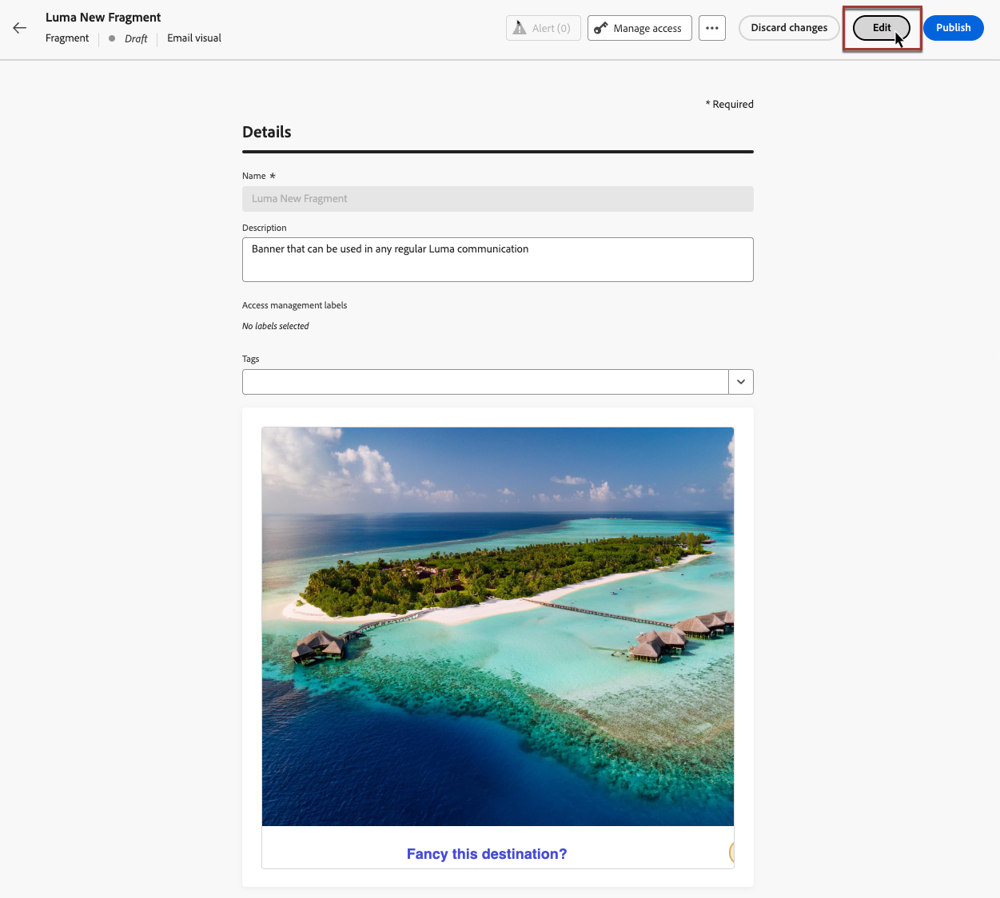

# Administrar fragmentos {#manage-fragments}

Para administrar los fragmentos, acceda a la lista de fragmentos desde el **[!UICONTROL Gestión de contenido]** > **[!UICONTROL Fragmentos]** menú izquierdo.

Todos los fragmentos creados en la zona protegida actual: o bien [desde el **[!UICONTROL Fragmentos]** menú](#create-fragments), ya sea con la variable [Guardar como fragmento](#save-as-fragment) opción - se muestran.

Puede filtrar fragmentos según sus características:

* Estado (Borrador o Activo)
* Tipo (visual o expresión)
* Fecha de creación o modificación
* Estado (archivado o no)
* Etiquetas

También puede elegir mostrar todos los fragmentos o solo los elementos que el usuario actual ha creado o modificado.

Desde el **[!UICONTROL Más acciones]** junto a cada fragmento, puede hacer lo siguiente:

* Duplique un fragmento.
* Utilice el **[!UICONTROL Explorar referencias]** para ver los recorridos, campañas o plantillas donde se utiliza. [Más información](#explore-references)
* Archivar un fragmento. [Más información](#archive-fragments)
* Edición de las etiquetas de un fragmento [Aprenda a trabajar con etiquetas unificadas](../start/search-filter-categorize.md#tags).

## Estados de los fragmentos

>[!CONTEXTUALHELP]
>id="ajo_fragment_statuses"
>title="Nuevos estados de fragmentos"
>abstract="Al haberse introducido el **borrador** y los estados **activos** con la versión de junio de Journey Optimizer, todos los fragmentos creados antes de esta versión tienen el estado “Borrador”, incluso si se utilizan en un recorrido o una campaña. Si realiza cualquier cambio en estos fragmentos, debe publicarlos para que estén “activos” y propagar los cambios a las campañas y recorridos asociados. También debe crear una nueva versión del recorrido/campaña y publicarla.  La publicación requiere lo siguiente <a href="https://experienceleague.adobe.com/en/docs/journey-optimizer/using/access-control/privacy/ootb-product-profiles#content-library-manage">Fragmento de Publish</a> permiso de usuario."
>additional-url="https://experienceleague.adobe.com/en/docs/journey-optimizer/using/access-control/privacy/ootb-product-profiles#content-library-manager" text="Más información sobre los permisos de fragmentos de contenido"

Los fragmentos pueden tener varios estados:

* **[!UICONTROL Borrador]**: el fragmento se está editando y no se ha aprobado.

* **[!UICONTROL Activo]**: el fragmento se ha aprobado y está activo. [Obtenga información sobre cómo publicar un fragmento](../content-management/create-fragments.md#publish)

  Cuando se edita un fragmento activo, aparece un icono específico junto a su estado. Haga clic en este icono para abrir la versión de borrador del fragmento.

* **[!UICONTROL Publicación]**: el fragmento se ha aprobado y se está publicando.
* **[!UICONTROL Archivado]**: se ha archivado el fragmento. [Obtenga información sobre cómo archivar fragmentos](#archive-fragments)

>[!CAUTION]
>
>Al haberse introducido el **borrador** y los estados **activos** con la versión de junio de Journey Optimizer, todos los fragmentos creados antes de esta versión tienen el estado “Borrador”, incluso si se utilizan en un recorrido o una campaña. Si realiza cualquier cambio en estos fragmentos, debe publicarlos para que estén “activos” y propagar los cambios a las campañas y recorridos asociados. También debe crear una nueva versión del recorrido/campaña y publicarla. La publicación requiere lo siguiente [Fragmento de Publish](../administration/ootb-product-profiles.md#content-library-manager) permiso de usuario.

## Editar fragmentos {#edit-fragments}

>[!CONTEXTUALHELP]
>id="ajo_fragments_update_campaigns"
>title="Actualización de fragmentos en campañas"
>abstract="Esta campaña no se actualizará si publica cambios en el fragmento. Requiere que se publique una nueva versión para que se pueda admitir la funcionalidad de actualización de fragmentos."

>[!CONTEXTUALHELP]
>id="ajo_fragments_update_journeys"
>title="Actualización de fragmentos en recorrido"
>abstract="Este recorrido no se actualizará si publica cambios en el fragmento. Requiere que se publique una nueva versión para que se pueda admitir la funcionalidad de actualización de fragmentos."

Para editar un fragmento, siga los pasos a continuación.

1. Haga clic en el fragmento deseado en **[!UICONTROL Fragmentos]** lista.

1. Las propiedades del fragmento se abren con una previsualización de su contenido.

1. Si el fragmento que se está editando tiene la variable **Activo** estado, haga clic en **Modificar** para crear una versión de borrador del fragmento. La versión actual del fragmento seguirá activa hasta que publique la versión de borrador.

1. Realice los cambios deseados en el fragmento. Para editar el contenido, haga clic en **Editar** a continuación, edite el contenido como lo haría al crear un fragmento desde cero. [Aprenda a crear un fragmento](#create-from-scratch)

   >[!NOTE]
   >
   >Al editar un fragmento de expresión, puede eliminar cualquier campo de personalización, pero no puede añadir nuevos al contenido del fragmento. Si desea agregar campos de personalización, duplique el fragmento para crear uno nuevo.

   También puede comprobar la lista de los recorridos, campañas y plantillas de contenido donde se está utilizando el fragmento seleccionando el **Referencias del explorador** opción. [Más información](#explore-references)

   

1. Una vez que los cambios estén listos, haga clic en **Publish** para activar las modificaciones.

Al editar un fragmento, los cambios se propagan automáticamente a todo el contenido mediante ese fragmento, incluidos los recorridos activos y las campañas, excepto en el contenido en el que se ha roto la herencia del fragmento original. Obtenga información sobre cómo interrumpir la herencia en [Añadir fragmentos visuales a los correos electrónicos](../email/use-visual-fragments.md#break-inheritance) y [Aprovechamiento de fragmentos de expresiones](../personalization/use-expression-fragments.md#break-inheritance) secciones.

## Explorar referencias {#explore-references}

Puede mostrar la lista de los recorridos, campañas y plantillas de contenido que están utilizando actualmente un fragmento. Para ello, seleccione **[!UICONTROL Explorar referencias]** ya sea desde el **[!UICONTROL Más acciones]** en la lista de fragmentos o en la pantalla de propiedades del fragmento.

Seleccione una pestaña para alternar entre recorridos, campañas, plantillas y fragmentos. Puede ver su estado y hacer clic en un nombre para redirigirlo al elemento correspondiente donde se hace referencia al fragmento.

>[!NOTE]
>
>Si el fragmento se utiliza en un recorrido, campaña o plantilla que tenga una etiqueta que le impida acceder a él, verá un mensaje de alerta sobre la pestaña seleccionada. [Obtenga más información sobre el Control de acceso de nivel de objeto (OLAC)](../administration/object-based-access.md)

## Archivar fragmentos {#archive-fragments}

Puede limpiar la lista de fragmentos de los elementos que ya no son relevantes para su marca.

Para ello, haga clic en el **[!UICONTROL Más acciones]** junto al fragmento deseado y seleccione. **[!UICONTROL Archivar]**. Desaparecerá de la lista de fragmentos, lo que impide que los usuarios lo utilicen en futuros correos electrónicos o plantillas.

>[!NOTE]
>
>Si archiva un fragmento que se utiliza en un contenido, <!--it will remain in the email or template, but you won't be able to select it from the fragment list to edit it-->dicho contenido no se verá afectado.

Para desarchivar un fragmento, filtre por la **[!UICONTROL Archivado]** elementos y seleccione **[!UICONTROL Desarchivar]** desde el **[!UICONTROL Más acciones]** menú. Ahora vuelve a ser accesible desde la lista de fragmentos y se puede utilizar en cualquier correo electrónico o plantilla.

