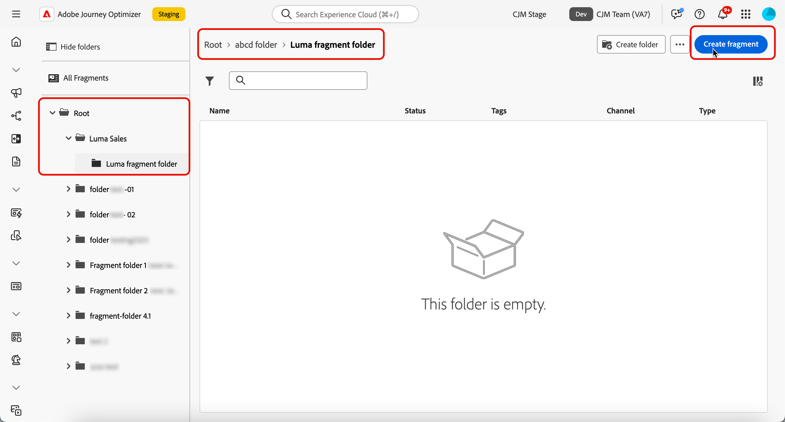

# Administración de fragmentos {#manage-fragments}

## Acceso a fragmentos {#access-fragments}

Para administrar los fragmentos, acceda a la lista de fragmentos desde el menú de la izquierda **[!UICONTROL Administración de contenido]** > **[!UICONTROL Fragmentos]**.

Se muestran todos los fragmentos que se crearon en la zona protegida actual: [del menú **[!UICONTROL Fragmentos]**](#create-fragments), o bien utilizando la opción [Guardar como fragmento](#save-as-fragment).

El panel de la izquierda le permite organizar fragmentos en carpetas. De forma predeterminada, se muestran todos los fragmentos. Al seleccionar una carpeta, solo se muestran los fragmentos y carpetas incluidos en la carpeta seleccionada. [Más información](#folders)

Para encontrar un elemento específico, empiece a escribir un nombre en el campo de búsqueda. Cuando se selecciona una [carpeta](#folders), la búsqueda se aplica a todos los fragmentos o carpetas del primer nivel de jerarquía de esa carpeta<!--(not nested items)-->.

Puede filtrar fragmentos según sus características:

* Estado (Borrador o Activo)
* Tipo (visual o expresión)
* Fecha de creación o modificación
* Estado (archivado o no)
* Etiquetas

{width="90%" align="left"}

También puede elegir mostrar todos los fragmentos o solo los elementos que el usuario actual ha creado o modificado.

Desde el botón **[!UICONTROL Más acciones]** situado junto a cada fragmento, puede:

* Añádalo a un paquete para exportarlo. [Más información](#export)
* Si se está editando un fragmento activo, abra la versión de borrador de este fragmento. [Más información](#edit-fragments)
* Duplique el fragmento.
* Use la opción **[!UICONTROL Explorar referencias]** para ver los recorridos, campañas o plantillas donde se usa. [Más información](#explore-references)
* Archivar el fragmento. [Más información](#archive-fragments)
* Edite las etiquetas del fragmento. [Aprenda a trabajar con etiquetas unificadas](../start/search-filter-categorize.md#tags)
* Mueva el fragmento a una carpeta. [Más información](#folders)

## Uso de carpetas para administrar fragmentos {#folders}

>[!CONTEXTUALHELP]
>id="ajo_fragments_folders"
>title="Organice sus fragmentos en carpetas"
>abstract="Utilice carpetas para clasificar y administrar sus fragmentos según las necesidades de su organización."

Para desplazarse fácilmente por los fragmentos, puede utilizar carpetas para organizarlos de forma más eficaz en una jerarquía estructurada. Esto le permite clasificar y administrar los elementos según las necesidades de su organización.

1. Haga clic en el botón **[!UICONTROL Todos los fragmentos]** para mostrar todos los elementos creados anteriormente sin la agrupación de carpetas.

1. Haga clic en la carpeta **[!UICONTROL Root]** para mostrar todas las carpetas creadas.

   >[!NOTE]
   >
   >Si aún no ha creado carpetas, se muestran todos los fragmentos.

1. Haga clic en cualquier carpeta dentro de la carpeta **[!UICONTROL Root]** para mostrar su contenido.

1. Al hacer clic en la carpeta **[!UICONTROL Root]** o en cualquier otra carpeta, se muestra el botón **[!DNL Create folder]**. Selecciónelo.

   

1. Escriba un nombre para la nueva carpeta y haga clic en **[!UICONTROL Guardar]**. La nueva carpeta se muestra en la parte superior de la lista de fragmentos dentro de la carpeta **[!UICONTROL Root]** o dentro de la carpeta seleccionada actualmente.

1. Puede hacer clic en el botón **[!UICONTROL Más acciones]** para cambiar el nombre de la carpeta o eliminarla.

   

1. Con el botón **[!UICONTROL Más acciones]**, también puede mover el fragmento a otra carpeta existente.

   <!---->

1. Ahora puede desplazarse a la carpeta que acaba de crear. Cada fragmento nuevo que [cree](create-fragments.md) desde aquí se guardará en la carpeta actual.

   

## Estados de los fragmentos {#fragments-statuses}

>[!CONTEXTUALHELP]
>id="ajo_fragment_statuses"
>title="Nuevos estados de fragmentos"
>abstract="Al haberse introducido los estados **Borrador** y **Activo** con la versión de junio de Journey Optimizer, todos los fragmentos creados antes de esta versión tendrán el estado **Borrador**, incluso si se utilizan en un recorrido o una campaña. Si realiza algún cambio en estos fragmentos, debe publicarlos para que tengan el estado **Activo** y propagarlos a las campañas y recorridos asociados. También debe crear una nueva versión del recorrido/campaña y publicarla.  La publicación requiere el permiso de usuario para <a href="https://experienceleague.adobe.com/es/docs/journey-optimizer/using/access-control/privacy/ootb-product-profiles#content-library-manage">Publicar fragmento</a>."
>additional-url="https://experienceleague.adobe.com/es/docs/journey-optimizer/using/access-control/privacy/ootb-product-profiles#content-library-manager" text="Más información sobre los permisos de fragmentos de contenido"

Los fragmentos pueden tener varios estados:

* **[!UICONTROL Borrador]**: el fragmento se está editando y no se ha aprobado.

* **[!UICONTROL Activo]**: el fragmento se aprobó y está activo. [Más información sobre cómo publicar un fragmento](../content-management/create-fragments.md#publish)

  Cuando se edita un fragmento activo, aparece un icono específico junto a su estado. Haga clic en este icono para abrir la versión de borrador del fragmento.

* **[!UICONTROL Publicación]**: el fragmento se aprobó y se está publicando.
* **[!UICONTROL Archivado]**: el fragmento se ha archivado. [Aprenda a archivar fragmentos](#archive-fragments)

>[!CAUTION]
>
>Al haberse introducido los estados **Borrador** y **Activo** con la versión de junio de Journey Optimizer, todos los fragmentos creados antes de esta versión tendrán el estado **Borrador**, incluso si se utilizan en un recorrido o una campaña. Si realiza algún cambio en estos fragmentos, debe publicarlos para que tengan el estado **Activo** y propagarlos a las campañas y recorridos asociados. También debe crear una nueva versión del recorrido/campaña y publicarla. La publicación requiere el permiso de usuario [Publicar fragmento](../administration/ootb-product-profiles.md#content-library-manager).

## Edición de un fragmento {#edit-fragments}

>[!CONTEXTUALHELP]
>id="ajo_fragments_update_campaigns"
>title="Actualización de fragmentos de las campañas"
>abstract="Esta campaña no se actualizará si publica cambios en el fragmento. Requiere que se publique una nueva versión para poder admitir la funcionalidad de actualización de fragmentos."

>[!CONTEXTUALHELP]
>id="ajo_fragments_update_journeys"
>title="Actualización de fragmentos de los recorridos"
>abstract="Este recorrido no se actualizará si publica cambios en el fragmento. Requiere que se publique una nueva versión para poder admitir la funcionalidad de actualización de fragmentos."

Para editar un fragmento, siga los pasos a continuación.

1. Haga clic en el fragmento deseado de la lista **[!UICONTROL Fragmentos]**. La pantalla de propiedades del fragmento se abre con una previsualización de su contenido.

1. Puede comprobar la lista de recorridos, campañas y plantillas de contenido en las que se está utilizando el fragmento en ese momento. Para ello, seleccione la opción **[!UICONTROL Explorar referencias]** del botón Más acción. [Más información](#explore-references)

1. Si el fragmento que se está editando tiene el estado **[!UICONTROL Activo]**, haga clic en el botón **[!UICONTROL Modificar]** para crear una versión de borrador del fragmento. Haga clic en **[!UICONTROL Confirmar]**.

   {width="70%" align="left"}

   >[!NOTE]
   >
   >La versión actual del fragmento seguirá activa hasta que publique la nueva versión actualizada.

1. Realice los cambios deseados en los detalles del fragmento si es necesario.

1. Para modificar el contenido del fragmento, haga clic en el botón **[!UICONTROL Editar]** y actualice el contenido como lo haría al crear un fragmento desde cero. [Aprenda a crear un fragmento](create-fragments.md#content)

   {width="70%" align="left"}

   >[!NOTE]
   >
   >Al editar un fragmento publicado, puede eliminar cualquier campo de personalización, pero no puede añadir nuevos al contenido del fragmento. Si desea agregar atributos personalizados, debe duplicar el fragmento. [Más información](#adding-new-attributes)

1. Una vez que los cambios estén listos, guárdelos y haga clic en el botón **[!UICONTROL Publicar]** para activar las modificaciones. [Más información](create-fragments.md#publish)

Al editar un fragmento, los cambios se propagan automáticamente a todo el contenido mediante ese fragmento, incluidos los recorridos activos y las campañas, excepto en el caso del contenido en el que se ha roto la herencia del fragmento original.

>[!NOTE]
>
>Aprenda a romper la herencia en las secciones [Agregar fragmentos visuales a los correos electrónicos](../email/use-visual-fragments.md#break-inheritance) y [Aprovechar fragmentos de expresiones](../personalization/use-expression-fragments.md#break-inheritance).

### Añadir nuevos atributos a un fragmento activo {#adding-new-attributes}

>[!WARNING]
>
>No se admite la adición de nuevos [atributos personalizados](../personalization/personalization-build-expressions.md) a un fragmento activo.

Una vez publicado un fragmento, el conjunto de atributos personalizados o contextuales se bloquea para todas las campañas y recorridos que hacen referencia a él.

Para incorporar atributos adicionales a un fragmento activo, siga los pasos a continuación.

1. Duplique el fragmento existente usando el botón **[!UICONTROL Más acciones]**.

   {width="70%" align="left"}

1. Seleccione el fragmento duplicado para abrirlo y haga clic en el botón **[!UICONTROL Editar]**.

1. [Agregue los nuevos atributos deseados](../personalization/personalization-build-expressions.md#add) al fragmento duplicado, como los campos de personalización.

   {width="70%" align="left"}

1. Guarde los cambios y publique el nuevo fragmento. [Descubra cómo](create-fragments.md#publish)

1. Actualice cualquier campaña o recorrido para hacer referencia al fragmento actualizado en el que se agregaron los nuevos atributos.

   * [Aprenda a utilizar fragmentos visuales](../email/use-visual-fragments.md)
   * [Aprenda a utilizar fragmentos de expresiones](../personalization/use-expression-fragments.md)

## Explorar referencias {#explore-references}

Puede mostrar la lista de los recorridos, campañas y plantillas de contenido que están utilizando actualmente un fragmento. Para ello, seleccione **[!UICONTROL Explorar referencias]** del menú **[!UICONTROL Más acciones]** en la lista de fragmentos o en la pantalla de propiedades de fragmentos.

{width="70%" align="left"}

Seleccione una pestaña para alternar entre recorridos, campañas, plantillas y fragmentos. Puede ver su estado y hacer clic en un nombre para redirigirlo al elemento correspondiente donde se hace referencia al fragmento.

{width="70%" align="left"}

>[!NOTE]
>
>Si el fragmento se utiliza en un recorrido, campaña o plantilla que tenga una etiqueta que le impida acceder a él, verá un mensaje de alerta sobre la pestaña seleccionada. [Más información acerca del Control de acceso de nivel de objeto (OLAC)](../administration/object-based-access.md)

## Archivar fragmentos {#archive-fragments}

Puede limpiar la lista de fragmentos de los elementos que ya no son relevantes para su marca.

Para ello, haga clic en el botón **[!UICONTROL Más acciones]** que está junto al fragmento deseado y seleccione **[!UICONTROL Archivar]**. Desaparecerá de la lista de fragmentos, lo que impide que los usuarios lo utilicen en futuros correos electrónicos o plantillas.

{width="70%" align="left"}

>[!NOTE]
>
>Si archiva un fragmento que se usa en un contenido, <!--it will remain in the email or template, but you won't be able to select it from the fragment list to edit it-->ese contenido no se verá afectado.

Para desarchivar un fragmento, filtre los **[!UICONTROL elementos archivados]** y seleccione **[!UICONTROL Desarchivar]** del menú **[!UICONTROL Más acciones]**. Ahora vuelve a ser accesible desde la lista de fragmentos y se puede utilizar en cualquier correo electrónico o plantilla.

{width="70%" align="left"}

## Exportar fragmentos a otra zona protegida {#export}

Journey Optimizer permite copiar un fragmento de una zona protegida a otra. Por ejemplo, puede copiar un fragmento del entorno de zona protegida de ensayo en la zona protegida de producción.

El proceso de copia se lleva a cabo mediante una **exportación e importación de paquetes** entre las zonas protegidas de origen y destino. Encontrará información detallada sobre cómo exportar objetos e importarlos en una zona protegida de destino en esta sección: [Copiar objetos en otra zona protegida](../configuration/copy-objects-to-sandbox.md).
