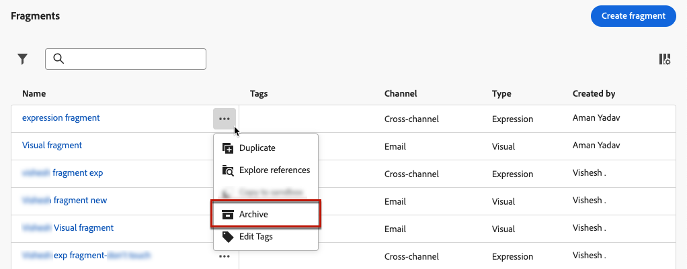

# Administrar fragmentos {#manage-fragments}

>[!CONTEXTUALHELP]
>id="ajo_fragment_statuses"
>title="Nuevos estados de fragmentos"
>abstract="Desde **Borrador** y **Activo** Los estados se han introducido con la versión de junio de Journey Optimizer, todos los fragmentos creados antes de esta versión tienen el estado Borrador, incluso si se utilizan en un recorrido o una campaña. Si realiza cualquier cambio en estos fragmentos, debe publicarlos para que estén &quot;activos&quot; y propagar los cambios a las campañas y recorridos asociados."

Para administrar los fragmentos, acceda a la lista de fragmentos desde el **[!UICONTROL Gestión de contenido]** > **[!UICONTROL Fragmentos]** menú izquierdo.

Todos los fragmentos creados en la zona protegida actual: o bien [desde el **[!UICONTROL Fragmentos]** menú](#create-fragments), ya sea con la variable [Guardar como fragmento](#save-as-fragment) opción - se muestran.

Puede filtrar fragmentos según sus características:

* Tipo: **[!UICONTROL Visual]** o **[!UICONTROL Expresión]**
* Etiquetas
* Fecha de creación o modificación

Puede elegir mostrar todos los fragmentos o solo los elementos que el usuario actual ha creado o modificado.

También puede mostrar el **[!UICONTROL Archivado]** fragmentos. [Más información](#archive-fragments)

Desde el **[!UICONTROL Más acciones]** junto a cada fragmento, puede hacer lo siguiente:

* Duplique un fragmento.

* Utilice el **[!UICONTROL Explorar referencias]** para ver los recorridos, campañas o plantillas donde se utiliza. [Más información](#explore-references)

* Archivar un fragmento. [Más información](#archive-fragments)

* Edición del contenido de un fragmento [etiquetas](../start/search-filter-categorize.md#tags).

## Editar fragmentos {#edit-fragments}

Para editar un fragmento, siga los pasos a continuación.

1. Haga clic en el elemento que desee en **[!UICONTROL Fragmentos]** lista.
1. En las propiedades del fragmento, puede hacer lo siguiente [explorar referencias](#explore-references), [administrar su acceso](../administration/object-based-access.md)y actualice los detalles del fragmento, incluido lo siguiente [etiquetas](../start/search-filter-categorize.md#tags).

   

1. Seleccione el botón correspondiente para editar el contenido como lo haría al crear un fragmento desde cero. [Más información](#create-from-scratch)

>[!NOTE]
>
>Al editar un fragmento, los cambios se propagan automáticamente a todo el contenido mediante ese fragmento, excepto al contenido utilizado en **[!UICONTROL Activo]** recorridos o campañas. También puede interrumpir la herencia del fragmento original. Obtenga más información en la [Añadir fragmentos visuales a los correos electrónicos](../email/use-visual-fragments.md#break-inheritance) y [Aprovechamiento de fragmentos de expresiones](../personalization/use-expression-fragments.md#break-inheritance) secciones.

## Explorar referencias {#explore-references}

Puede mostrar la lista de los recorridos, campañas y plantillas de contenido que están utilizando actualmente un fragmento.

Para ello, seleccione **[!UICONTROL Explorar referencias]** ya sea desde el **[!UICONTROL Más acciones]** en la lista de fragmentos o en la pantalla de propiedades del fragmento.

Seleccione una pestaña para alternar entre recorridos, campañas, plantillas y fragmentos. Puede ver su estado y hacer clic en un nombre para redirigirlo al elemento correspondiente donde se hace referencia al fragmento.

>[!NOTE]
>
>Si el fragmento se utiliza en un recorrido, campaña o plantilla que tenga una etiqueta que le impida acceder a él, verá un mensaje de alerta sobre la pestaña seleccionada. [Obtenga más información sobre el Control de acceso de nivel de objeto (OLAC)](../administration/object-based-access.md)

## Archivar fragmentos {#archive-fragments}

Puede limpiar la lista de fragmentos de los elementos que ya no son relevantes para su marca.

Para ello, haga clic en el **[!UICONTROL Más acciones]** junto al fragmento deseado y seleccione. **[!UICONTROL Archivar]**. Desaparecerá de la lista de fragmentos, lo que impide que los usuarios lo utilicen en futuros correos electrónicos o plantillas.

>[!NOTE]
>
>Si archiva un fragmento que se utiliza en un contenido, <!--it will remain in the email or template, but you won't be able to select it from the fragment list to edit it-->dicho contenido no se verá afectado.

Para desarchivar un fragmento, filtre por la **[!UICONTROL Archivado]** elementos y seleccione **[!UICONTROL Desarchivar]** desde el **[!UICONTROL Más acciones]** menú. Ahora vuelve a ser accesible desde la lista de fragmentos y se puede utilizar en cualquier correo electrónico o plantilla.

