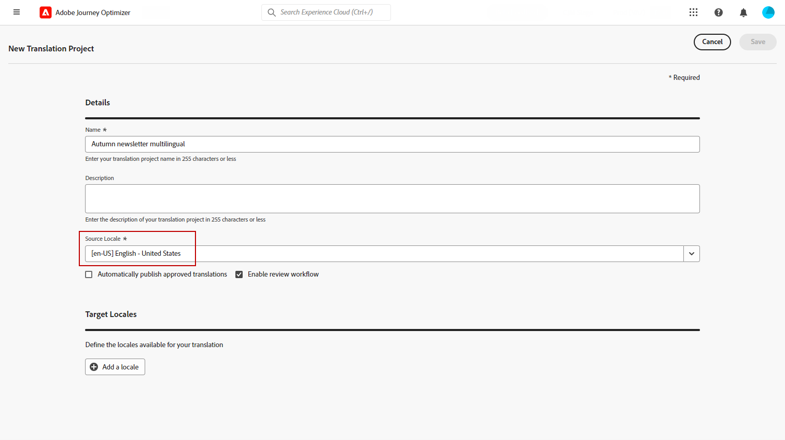
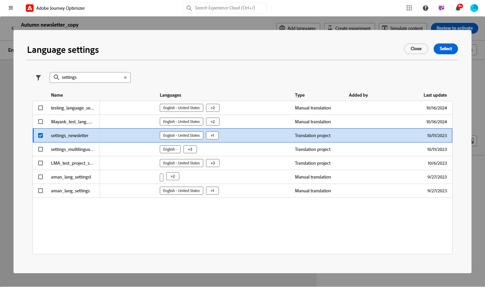
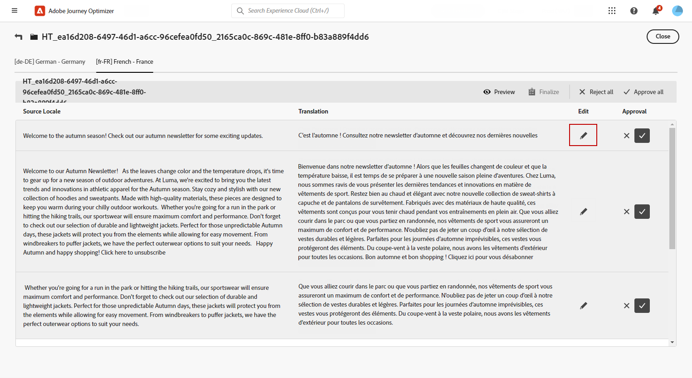
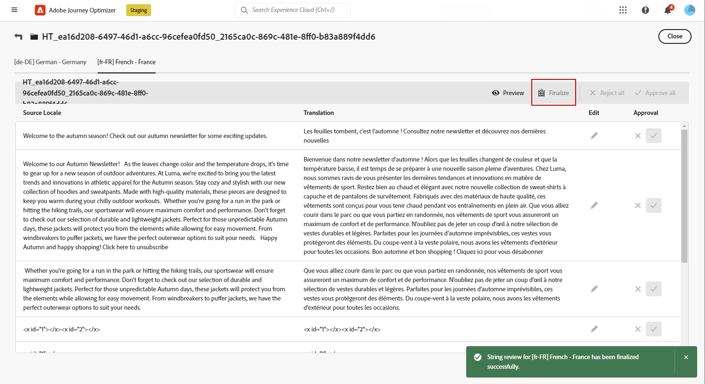

# Creación de contenido multilingüe con traducción automática {#multilingual-automated}

>[!BEGINSHADEBOX]

**Tabla de contenido**

* [Introducción al contenido multilingüe](multilingual-gs.md)
* [Creación de contenido multilingüe con traducción manual](multilingual-manual.md)
* **[Creación de contenido multilingüe con traducción automática](multilingual-automated.md)**
* [Informe de campaña multilingüe](multilingual-report.md)

>[!ENDSHADEBOX]

Con el flujo automatizado, simplemente puede seleccionar el idioma de destino y el proveedor de idioma. A continuación, el contenido se envía directamente a la traducción, listo para una revisión final una vez finalizado.

Siga estos pasos para crear contenido multilingüe mediante traducción automática:

1. [Cree su configuración regional](#create-locale).

1. [Creación de un proyecto de idioma](#create-translation-project).

1. [Crear configuración de idioma](#create-language-settings).

1. [Creación de una campaña multilingüe](#create-a-multilingual-campaign).

1. [Revise la tarea de traducción (opcional)](#review-translation-project).

## Crear configuración regional {#create-locale}

Al configurar los ajustes de idioma, tal como se describe en la sección [Cree la configuración de idioma](#language-settings) , si una configuración regional específica no está disponible para el contenido multilingüe, tiene la flexibilidad de crear tantas configuraciones regionales nuevas como sea necesario utilizando **[!UICONTROL Traducción]** menú.

1. Desde el **[!UICONTROL Administration]** menú, acceso **[!UICONTROL Canal]**.

   El menú de traducciones le permite acceder a la lista de configuraciones regionales activadas.

1. Desde el **[!UICONTROL Diccionario de configuración regional]** pestaña, haga clic en **[!UICONTROL Añadir configuración regional]**.

   

1. Seleccione el código de configuración regional en la **[!UICONTROL Idioma]** y la lista asociada **[!UICONTROL Región]**.

1. Clic **[!UICONTROL Guardar]** para crear su configuración regional.

   

## Crear proyecto de traducción {#translation-project}

Inicie el proyecto de traducción especificando la configuración regional de Target e indicando el idioma o la región específicos para el contenido. A continuación, puede elegir su proveedor de traducción.

1. Desde el **[!UICONTROL Proyectos de traducción]** menú debajo de **[!UICONTROL Gestión de contenido]**, haga clic en **[!UICONTROL Crear proyecto]**.

   

1. Tipo de entrada a **[!UICONTROL Nombre]** y **[!UICONTROL Descripción]**.

1. Seleccione el **[!UICONTROL Configuración regional de origen]**.

   

1. Seleccione si desea activar las siguientes opciones:

   * **[!UICONTROL Publicar automáticamente las traducciones aprobadas]**: una vez aprobadas las traducciones, se integran automáticamente en la campaña sin necesidad de intervención manual.
   * **[!UICONTROL Habilitar flujo de trabajo de revisión]**: solo se aplica a configuraciones regionales traducidas por humanos. Esto permite a un revisor interno evaluar y aprobar o rechazar de forma eficaz el contenido traducido. [Más información](#review-translation-project)

1. Clic **[!UICONTROL Añadir configuración regional]** para acceder al menú y definir los idiomas de su proyecto de traducción.

   Si un **[!UICONTROL Configuración regional]** falta, puede crearlo manualmente de antemano desde el **[!UICONTROL Traducción]** o por API. Consulte [Crear nueva configuración regional](#create-locale).

   

1. Seleccione en la lista su **[!UICONTROL Configuración regional(es) de destino]** y elija cuál **[!UICONTROL Proveedor de traducción]** que desee utilizar para cada configuración regional.

   **[!UICONTROL Proveedor de traducción]** se puede acceder a la configuración desde el **[!UICONTROL Traducción]** en el menú **[!UICONTROL Administration]** sección de menú.

   >[!NOTE]
   >
   >La administración de contratos con el proveedor de traducción está fuera del ámbito de esta función. Asegúrese de tener un contrato válido y activo con el socio de traducción designado.
   >
   > El proveedor de traducción es propietario de la calidad del contenido traducido.

1. Clic **[!UICONTROL Añadir una configuración regional]** cuando haya terminado de vincular la configuración regional de Target con el proveedor de traducción correcto. A continuación, haga clic en **[!UICONTROL Guardar]**.

   Tenga en cuenta que si un proveedor está atenuado para una configuración regional de destino, indica que el proveedor no admite esa configuración regional en particular.

   

1. Clic **[!UICONTROL Guardar]** cuando se configure el proyecto de traducción.

El proyecto de traducción se ha creado y se puede utilizar en una campaña multilingüe.

## Crear configuración de idioma {#language-settings}

En esta sección, puede establecer el idioma principal y sus configuraciones regionales asociadas para administrar el contenido multilingüe. También puede elegir el atributo que desea utilizar para buscar información relacionada con el idioma del perfil.

1. Desde el **[!UICONTROL Administration]** menú, acceso **[!UICONTROL Canal]**.

1. En el **[!UICONTROL Configuración de idioma]** , haga clic en **[!UICONTROL Crear configuración de idioma]**.

   

1. Escriba el nombre de su **[!UICONTROL Configuración de idioma]**.

1. Elija la **[!UICONTROL Proyecto de traducción]** opción.

1. Desde el **[!UICONTROL Proyecto de traducción]** , haga clic en **[!UICONTROL Editar]** y elija el creado anteriormente **[!UICONTROL Proyecto de traducción]**.

   Las configuraciones regionales configuradas anteriormente se importan automáticamente.

   

1. Desde el **[!UICONTROL Preferencia de envío]** , seleccione el atributo que desea buscar para encontrar información sobre los idiomas del perfil.

1. Clic **[!UICONTROL Editar]** junto a su **[!UICONTROL Configuración regional]** para personalizarlo aún más y para agregar **[!UICONTROL Preferencias de perfil]**.

   

1. Si su **[!UICONTROL Proyecto de traducción]** se ha actualizado, haga clic en **[!UICONTROL Actualizar]** para reflejar estos cambios en su **[!UICONTROL Configuración de idioma]**.

   

1. Clic **[!UICONTROL Enviar]** para crear su **[!UICONTROL Configuración de idioma]**.

<!--
1. Access the **[!UICONTROL Channel surfaces]** menu and create a new channel surface or select an existing one.

1. In the **[!UICONTROL Header parameters]** section, select the **[!UICONTROL Enable multilingual]** option.

1. Select your **[!UICONTROL Locales dictionary]** and add as many as needed.
-->

## Creación de una campaña multilingüe {#create-multilingual-campaign}

Una vez que haya configurado el proyecto de traducción y la configuración de idioma, estará listo para crear la campaña y personalizar el contenido para las diferentes configuraciones regionales.

1. Comience creando y configurando su campaña de notificaciones por correo electrónico, SMS o push según sus necesidades. [Más información](../campaigns/create-campaign.md)

1. Una vez creado el contenido principal, haga clic en **[!UICONTROL Guardar]** y vuelva a la pantalla de configuración de la campaña.

1. Clic **[!UICONTROL Añadir idiomas]**.  [Más información](#create-language-settings)

   

1. Seleccione el creado anteriormente **[!UICONTROL Configuración de idioma]**.

   

1. Ahora que las configuraciones regionales están importadas, haga clic en **[!UICONTROL Enviar para traducir]** para reenviar el contenido al proveedor de traducción seleccionado anteriormente.

   

1. Una vez enviado el contenido para su traducción, ya no se puede editar. Para realizar cambios en el contenido original, haga clic en el icono de candado.

   Tenga en cuenta que si desea realizar alguna modificación en este contenido, debe crear un nuevo proyecto de traducción y reenviarlo para su traducción.

   

1. Clic **[!UICONTROL Abrir traducción]** para acceder al proyecto de traducción y revisarlo.

   

1. En esta página, siga el estado del proyecto de traducción:

   * **[!UICONTROL Traducción en curso]**: su proveedor de servicios está trabajando activamente en la traducción.
   * **[!UICONTROL Listo para revisión]**: el proceso de revisión está listo para comenzar, lo que le permite acceder a la traducción y rechazarla o aprobarla.
   * **[!UICONTROL Revisado]**: la traducción se ha aprobado y está lista para enviarse a la campaña.
   * **[!UICONTROL Listo para publicar]**: la traducción automática se ha completado y ahora se puede enviar a la campaña.
   * **[!UICONTROL Completado]**: la traducción ya está disponible en la campaña.

   

1. Una vez finalizada la traducción, el contenido multilingüe está listo para enviarse.

   

1. Clic **[!UICONTROL Revisar para activar]** para mostrar un resumen de la campaña.

   El resumen le permite modificar la campaña si es necesario y comprobar si algún parámetro es incorrecto o falta.

1. Examine el contenido multilingüe para ver la renderización en cada idioma.

   

1. Compruebe que la campaña esté configurada correctamente y haga clic en **[!UICONTROL Activar]**.

La campaña está activada. El mensaje configurado en la campaña se envía inmediatamente o en la fecha especificada. Tenga en cuenta que, tan pronto como la campaña esté activa, no se puede modificar. Para reutilizar contenido, puede duplicar la campaña.

Una vez enviado, puede medir el impacto de las campañas en los informes de campañas.

## Administrar proyectos de traducción internos {#manage-ht-project}

Si seleccionó la traducción interna al configurar los ajustes de Idioma, puede traducir el contenido directamente en el proyecto de traducción.

1. De su **[!UICONTROL Proyecto de traducción]**, acceda al **[!UICONTROL Más acciones]** y seleccione **[!UICONTROL Traducción interna]**.

   

1. Puede exportar el archivo CSV para su traducción mediante un software de traducción externo. También puede volver a importar el archivo CSV en el proyecto de traducción haciendo clic en **[!UICONTROL Importar CSV]** botón.

   

1. Clic **[!UICONTROL Editar]** para añadir el contenido de traducción.

   

1. Si está listo para publicar el texto traducido, haga clic en **[!UICONTROL Finalizar]**.

## Revisión del proyecto de traducción {#review-translation-project}

Si seleccionó la **[!UICONTROL Habilitar flujo de trabajo de revisión]** en su **[!UICONTROL Proyecto de traducción]** Además, puede revisar la traducción directamente en Journey Optimizer una vez que el proveedor de traducción seleccionado la haya completado.

Tenga en cuenta que si esta opción está desactivada, una vez que el proveedor haya terminado la traducción, el estado de la tarea de traducción se establece automáticamente como **[!UICONTROL Revisado]**, lo que le permite continuar rápidamente haciendo clic en **[!UICONTROL Publish]**.

1. Una vez que su proveedor de servicios haya completado la traducción, puede acceder a la traducción para revisarla desde su **[!UICONTROL Proyecto de traducción]** o directamente desde su **[!UICONTROL Campaign]**.

   Desde el **[!UICONTROL Más acciones]** , haga clic en **[!UICONTROL Revisar]**.

   

1. En la ventana Revisar, examine el contenido traducido y acepte o rechace cada cadena de traducción.

   

1. Clic **[!UICONTROL Editar]** para cambiar el contenido de la cadena de traducción.

   

1. Introduzca la traducción actualizada y haga clic en **[!UICONTROL Confirmar]** cuando termine.

   

1. También puede elegir **[!UICONTROL Rechazar todo]** o **[!UICONTROL Aprobar todo]** directamente.

   Al seleccionar **[!UICONTROL Rechazar todo]**, añada un comentario y haga clic en **[!UICONTROL Rechazar]**.

1. Clic **[!UICONTROL Previsualizar]** para comprobar la renderización del contenido traducido en cada idioma.

1. Si está listo para publicar el texto traducido, haga clic en **[!UICONTROL Finalizar]**.

   

1. De su **[!UICONTROL Proyecto de traducción]**, seleccione uno del proyecto para acceder a más detalles. Si rechazó la traducción, puede elegir enviarla de nuevo a la traducción.

   

1. Una vez que **[!UICONTROL Proyecto de traducción]** Si el estado se establece en Revisado, puede enviarlo a su Campaña.

   Desde el **[!UICONTROL Más acciones]** , haga clic en **[!UICONTROL Publish]**.

   

1. En la campaña, compruebe que el estado de la traducción ha cambiado a **[!UICONTROL Traducción completa]**. Ahora puede enviar el contenido multilingüe; consulte el paso 10 en [esta sección](#create-multilingual-campaign).

   

<!--
# Create a multilingual journey {#create-multilingual-journey}

1. Create your journey with a Delivery and personalize your content as needed.
1. From your delivery action, click Edit content.
1. Click Add languages.

-->
