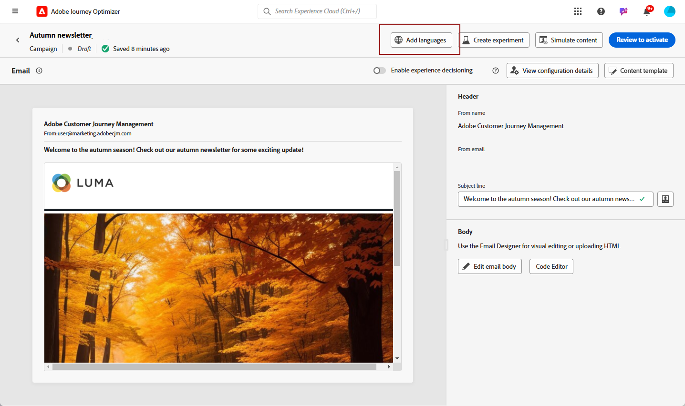

# Creación de contenido multilingüe con traducción automática {#multilingual-automated}

>[!CONTEXTUALHELP]
>id="ajo_multi_add_provider"
>title="Agregar proveedor"
>abstract="Añada proveedores de traducción y configuraciones regionales según sea necesario. Esto le permite administrar qué proveedores y configuraciones regionales están activos para el proyecto, lo que le ofrece la flexibilidad de ajustar recursos y audiencias de destino según los requisitos y el ámbito del proyecto actuales."

>[!CONTEXTUALHELP]
>id="ajo_multi_edit_provider"
>title="Editar proveedor"
>abstract="Modifique los proveedores de traducción existentes y añada configuraciones regionales según sea necesario. Esta funcionalidad le permite controlar qué proveedores y configuraciones regionales están activos para su proyecto, lo que le ofrece la flexibilidad de ajustar recursos y segmentar públicos específicos según sus necesidades actuales y los objetivos del proyecto."

>[!IMPORTANT]
>
>Para el flujo automatizado, los usuarios necesitan permisos relacionados con la capacidad **[!UICONTROL Servicio de traducción]**. [Más información sobre los permisos](../administration/permissions.md)

Con el flujo automatizado, simplemente puede seleccionar el idioma de destino y el proveedor de idioma. A continuación, el contenido se envía directamente a la traducción, listo para una revisión final una vez finalizado.

Siga estos pasos para crear contenido multilingüe mediante traducción automática:

1. [Añada su proveedor](multilingual-provider.md)

1. [Agregar configuraciones regionales (opcional)](multilingual-locale.md)

1. [Creación de un proyecto de idioma](#create-translation-project)

1. [Crear configuración de idioma](#create-language-settings)

1. [Creación de contenido multilingüe](#create-a-multilingual-campaign)

1. [Revise la tarea de traducción (opcional)](#review-translation-project)

## Creación del proyecto de traducción {#translation-project}

>[!CONTEXTUALHELP]
>id="ajo_multi_create_project"
>title="Crear proyecto"
>abstract="Para empezar a crear contenido multilingüe, inicie el proyecto de traducción identificando la configuración regional de destino y seleccionando el idioma o el dialecto regional adecuado para el público. Después, elija un proveedor de traducción que se ajuste a las necesidades del proyecto."

>[!CONTEXTUALHELP]
>id="ajo_multi_edit_project"
>title="Editar proyecto"
>abstract="Actualice el proyecto de traducción para incorporar configuraciones regionales adicionales, lo que le permite ampliar el contenido para llegar a un público más amplio."

Inicie el proyecto de traducción especificando la configuración regional de Target e indicando el idioma o la región específicos para el contenido. A continuación, puede elegir su proveedor de traducción.

1. En el menú **[!UICONTROL Traducción]** de **[!UICONTROL Administración de contenido]**, haga clic en **[!UICONTROL Crear proyecto]** en la pestaña **[!UICONTROL Proyectos]**.

   

1. Escriba un **[!UICONTROL Nombre]** y **[!UICONTROL Descripción]**.

1. Seleccione la **[!UICONTROL configuración regional de Source]**.

   

1. Seleccione si desea activar las siguientes opciones:

   * **[!UICONTROL Publicar automáticamente traducciones aprobadas]**: una vez aprobadas las traducciones, se integran automáticamente en la campaña sin necesidad de intervención manual.
   * **[!UICONTROL Habilitar flujo de trabajo de revisión]**: solo aplicable a configuraciones regionales traducidas por humanos. Esto permite a un revisor interno evaluar y aprobar o rechazar de forma eficaz el contenido traducido. [Más información](#review-translation-project)

1. Haga clic en **[!UICONTROL Agregar configuración regional]** para acceder al menú y definir los idiomas de su proyecto de traducción.

   Si falta una **[!UICONTROL configuración regional]**, puede crearla manualmente de antemano desde el menú **[!UICONTROL Traducción]** o por API. Consulte [Crear nueva configuración regional](#create-locale).

   

1. Seleccione en la lista sus **[!UICONTROL configuraciones regionales de destino]** y elija qué **[!UICONTROL proveedor de traducción]** desea usar para cada configuración regional.

   Se puede acceder a la configuración del **[!UICONTROL proveedor de traducción]** desde el menú **[!UICONTROL Traducción]** en la sección de menú **[!UICONTROL Administración]**.

   >[!NOTE]
   >
   >La administración de contratos con el proveedor de traducción está fuera del ámbito de esta función. Asegúrese de tener un contrato válido y activo con el socio de traducción designado.
   >
   ></br>El proveedor de traducción es propietario de la calidad del contenido traducido.

1. Haga clic en **[!UICONTROL Agregar configuración regional]** cuando termine de vincular la configuración regional de Target con el proveedor de traducción correcto. A continuación, haga clic en **[!UICONTROL Guardar]**.

   Tenga en cuenta que si un proveedor está atenuado para una configuración regional de destino, indica que el proveedor no admite esa configuración regional en particular.

   

1. Haga clic en **[!UICONTROL Guardar]** cuando su proyecto de traducción esté configurado.

El proyecto de traducción se ha creado y se puede utilizar en una campaña multilingüe.

## Crear configuración de idioma {#language-settings}

>[!CONTEXTUALHELP]
>id="ajo_multi_custom_conditional"
>title="Configuración condicional personalizada"
>abstract="La configuración condicional personalizada son conjuntos de reglas que determinan en qué configuración regional se mostrará el contenido, según criterios específicos. Esta configuración le permite controlar la visualización del contenido en función de factores como la ubicación del usuario, las preferencias de idioma u otros elementos contextuales."

>[!CONTEXTUALHELP]
>id="ajo_multi_fallback"
>title="Preferencias de reserva"
>abstract="Elegir una preferencia de reserva es crucial para mejorar la experiencia del usuario. Si no se selecciona ninguna reserva y un perfil no cumple los requisitos necesarios, el contenido no se envía. Al seleccionar una alternativa adecuada, se garantiza una entrega de contenido coherente, incluso cuando los perfiles no coinciden con los criterios iniciales."

En esta sección, puede establecer las distintas configuraciones regionales para administrar el contenido multilingüe. También puede elegir el atributo que desea utilizar para buscar información relacionada con el idioma del perfil.

1. Desde el menú **[!UICONTROL Administración]**, accede a **[!UICONTROL Canal]** > **[!UICONTROL Configuración general]**.

1. En el menú **[!UICONTROL Configuración de idioma]**, haga clic en **[!UICONTROL Crear configuración de idioma]**.

   

1. Escriba el nombre de su **[!UICONTROL configuración de idioma]** y elija **[!UICONTROL Proyecto de traducción]**.

1. En el campo **[!UICONTROL Proyecto de traducción]**, haga clic en **[!UICONTROL Editar]** y elija el **[!UICONTROL proyecto de traducción]** que creó anteriormente.

   Se importan automáticamente las **[!UICONTROL configuraciones regionales]** configuradas anteriormente.

1. Seleccione **[!UICONTROL Preferencias de reserva]** para definir una opción de copia de seguridad para cuando un perfil no cumpla los criterios necesarios para la entrega de contenido.

   Tenga en cuenta que si no se selecciona ninguna opción de reserva, la campaña o el recorrido no se envían.

   

1. Elija su preferencia de envío entre las siguientes opciones:

   * **[!UICONTROL Seleccionar atributos de preferencia de idioma de perfil]**
   * **[!UICONTROL Crear reglas condicionales personalizadas]**

1. Si selecciona **[!UICONTROL Seleccionar atributos de preferencia de idioma de perfil]**, elija el atributo correspondiente en el menú **[!UICONTROL Atributos de preferencia de idioma de perfil]** para buscar información de idioma de perfil.

   

1. Si selecciona **[!UICONTROL Crear reglas condicionales personalizadas]**, seleccione la configuración regional para la que desea crear condiciones. A continuación, genere reglas basadas en factores como la ubicación del usuario, las preferencias de idioma u otros elementos contextuales.

   

1. Comience a crear condiciones agregando un atributo, evento o audiencia para definir el grupo objetivo.

   >[!IMPORTANT]
   >
   >Los datos contextuales están disponibles exclusivamente para canales web, de aplicación, de experiencia basada en código y de tarjetas de contenido. Si se utiliza para canales de correo electrónico, SMS, notificaciones push o de correo directo, sin atributos adicionales, la campaña o el recorrido se envían en el idioma de la primera opción de la lista.

   

   +++Requisitos previos para utilizar eventos contextuales en las condiciones

   Cuando los usuarios muestran el contenido, se envía una solicitud de personalización junto con el evento de experiencia. Para aprovechar los datos contextuales en sus condiciones, debe adjuntar datos adicionales a la carga útil de la solicitud de personalización. Para ello, debe crear una regla en la recopilación de datos de Adobe Experience Platform para especificar: SI se envía una solicitud de personalización, adjunte datos adicionales a la solicitud, definiendo el atributo para que coincida con el campo de idioma del esquema.

   >[!NOTE]
   >
   >Estos requisitos previos solo son necesarios para los canales de tarjetas de contenido y en la aplicación.

   1. En Recopilación de datos de Adobe Experience Platform, acceda a sus Propiedades de etiquetas.

   1. Acceda al menú **[!UICONTROL Reglas]** y cree una regla nueva. Encontrará información detallada sobre cómo crear reglas en [!DNL Adobe Experience Platform] [Documentación de recopilación de datos](https://experienceleague.adobe.com/en/docs/experience-platform/collection/e2e#create-a-rule){target="_blank"}

   1. En la sección **[!UICONTROL IF]** de la regla, agregue un evento configurado de la siguiente manera:

      

      * Elija la **[!UICONTROL extensión]** con la que está trabajando.
      * En el campo **[!UICONTROL Tipo de evento]**, seleccione &quot;Evento de solicitud de AEP&quot;.
      * En el panel derecho, seleccione &quot;Tipo de evento XDM es igual a personalización.request&quot;
      * Haga clic en el botón **[!UICONTROL Conservar cambios]** para confirmar.

   1. En la sección **[!UICONTROL THEN]** de la regla, agregue una acción configurada de la siguiente manera:

      

      * Elija la **[!UICONTROL extensión]** con la que está trabajando.
      * En el campo **[!UICONTROL Tipo de acción]**, seleccione &quot;Adjuntar datos&quot;.
      * En la sección de carga útil JSON, asegúrese de que el atributo utilizado para recuperar el idioma que se va a utilizar (en el ejemplo siguiente &quot;idioma&quot;) coincida con el nombre del atributo especificado en el esquema al que está fluyendo el flujo de datos de recopilación de datos.

        ```JSON
        {
            "xdm":{
                "application":{
                    "_dc":{
                        "language":"{%%Language%%}"
                    }
                }
            }
        }
        ```

      * Haga clic en el botón **[!UICONTROL Conservar cambios]** para confirmar y guardar la regla.

   +++

1. Arrastre y suelte las configuraciones regionales para reordenarlas y administrar su prioridad en la lista.

1. Haz clic en **[!UICONTROL Enviar]** para crear tu **[!UICONTROL configuración de idioma]**.

Tenga en cuenta que después de configurar las preferencias de idioma, ya no tendrá la opción de editarlas.

<!--
1. Access the **[!UICONTROL channel configurations]** menu and create a new channel configuration or select an existing one.

1. In the **[!UICONTROL Header parameters]** section, select the **[!UICONTROL Enable multilingual]** option.


1. Select your **[!UICONTROL Locales dictionary]** and add as many as needed.
-->

## Creación de contenido multilingüe {#create-multilingual-campaign}

>[!AVAILABILITY]
>
> Actualmente, la vista previa del contenido de las experiencias basadas en código y las tarjetas de contenido no está disponible con el flujo automatizado.

Una vez que haya configurado el proyecto de traducción y la configuración de idioma, estará listo para crear la campaña o el recorrido y personalizar el contenido para las diferentes configuraciones regionales.

1. Comience creando y configurando su notificación por correo electrónico, SMS o push [campaign](../campaigns/create-campaign.md) o [recorrido](../building-journeys/journeys-message.md) según sus necesidades.

1. Una vez creado el contenido principal, haz clic en **[!UICONTROL Guardar]** y vuelve a la pantalla de configuración de la campaña.

1. Haga clic en **[!UICONTROL Agregar idiomas]**.  [Más información](#create-language-settings)

   

1. Seleccione la **[!UICONTROL configuración de idioma]** creada anteriormente.

   

1. Ahora que sus configuraciones regionales están importadas, haga clic en **[!UICONTROL Enviar para traducir]** para reenviar el contenido al proveedor de traducción seleccionado anteriormente.

   

1. Una vez enviado el contenido para su traducción, ya no se puede editar. Para realizar cambios en el contenido original, haga clic en el icono de candado.

   Tenga en cuenta que si desea realizar alguna modificación en este contenido, debe crear un nuevo proyecto de traducción y reenviarlo para su traducción.

   

1. Haga clic en **[!UICONTROL Abrir traducción]** para acceder a su proyecto de traducción y revisarlo.

   

1. En esta página, siga el estado del proyecto de traducción:

   * **[!UICONTROL Traducción en curso]**: su proveedor de servicios está trabajando activamente en la traducción.

     Si seleccionaste **Insourcing** al configurar tu **configuración de idioma**, puedes traducir el contenido directamente en tu proyecto de traducción. [Más información](#manage-ht-project)

   * **[!UICONTROL Listo para revisión]**: el proceso de revisión está listo para comenzar, lo que le permite tener acceso a la traducción y rechazarla o aprobarla.

     Si seleccionó **[!UICONTROL Habilitar flujo de trabajo de revisión]** en su **[!UICONTROL proyecto de traducción]**, puede revisar la traducción directamente en Journey Optimizer después de que el proveedor de traducción seleccionado la haya completado. [Más información](#review-translation-project)

   * **[!UICONTROL Revisado]**: la traducción se aprobó, está lista para publicarse y se enviará a la campaña.

   * **[!UICONTROL Listo para publicar]**: la traducción automática se completó y ahora se puede enviar a su campaña.

   * **[!UICONTROL Completado]**: la traducción ya está disponible en su campaña.

   

1. Una vez finalizada la traducción, el contenido multilingüe está listo para enviarse.

   

1. Haga clic en **[!UICONTROL Revisar para activar]** y mostrar un resumen de la campaña.

   El resumen le permite modificar la campaña si es necesario y comprobar si algún parámetro es incorrecto o falta.

1. Examine el contenido multilingüe para ver la renderización en cada idioma.

   

1. Compruebe que la campaña esté configurada correctamente y luego haga clic en **[!UICONTROL Activar]**.

   >[!IMPORTANT]
   >
   > Si la campaña está sujeta a una directiva de aprobación, debe solicitar la aprobación para poder enviar la campaña multilingüe. [Más información](../test-approve/gs-approval.md)

Ahora puede activar la campaña o el recorrido. Una vez enviada, puede medir el impacto del recorrido o la campaña multilingüe dentro de los informes.

## Administrar un proyecto de traducción externalizado {#manage-ht-project}

>[!CONTEXTUALHELP]
>id="ajo_multi_insourcing_project"
>title="Externalización de un proyecto de traducción"
>abstract="La externalización de un proyecto de traducción le permite administrar y ejecutar traducciones directamente en su proyecto de traducción, lo que optimiza el proceso y mantiene un mayor control sobre la calidad y la coherencia de la traducción."

Si seleccionó Insourcing al configurar el idioma, puede traducir el contenido directamente en el proyecto de traducción.

1. Desde tu **[!UICONTROL proyecto de traducción]**, accede al menú **[!UICONTROL Más acciones]** y selecciona **[!UICONTROL Insourcing]**.

   

1. Puede exportar el archivo CSV para su traducción mediante un software de traducción externo. También puede volver a importar el archivo CSV en su proyecto de traducción haciendo clic en el botón **[!UICONTROL Importar CSV]**.

   

1. Haga clic en **[!UICONTROL Editar]** para agregar el contenido de la traducción.

   

1. Si está listo para publicar el texto traducido, haga clic en **[!UICONTROL Finalizar]**.

## Revisión del proyecto de traducción {#review-translation-project}

>[!CONTEXTUALHELP]
>id="ajo_multi_review_project"
>title="Revisión del proyecto de traducción"
>abstract="Una vez que el proveedor de traducción elegido haya completado la traducción, puede revisar los resultados directamente en Journey Optimizer. Esto le permite evaluar la precisión y la calidad de la traducción, asegurándose de que se ajuste a sus expectativas y a los requisitos del proyecto antes de finalizarla."

>[!CONTEXTUALHELP]
>id="ajo_multi_preview_project"
>title="Previsualización del proyecto de traducción"
>abstract="La ventana de vista previa permite ver cómo aparece el contenido traducido en cada idioma. Esta función le ayuda a examinar el renderizado y a asegurarse de que el contenido se muestra correcta y eficazmente en todos los idiomas seleccionados."

Si seleccionó **[!UICONTROL Habilitar flujo de trabajo de revisión]** en su **[!UICONTROL proyecto de traducción]**, puede revisar la traducción directamente en Journey Optimizer después de que el proveedor de traducción seleccionado la haya completado.

Tenga en cuenta que si esta opción está deshabilitada, una vez que su proveedor haya finalizado la traducción, el estado de la tarea de traducción se establece automáticamente en **[!UICONTROL Revisado]**, lo que le permite continuar rápidamente haciendo clic en **[!UICONTROL Publicar]**.

1. Una vez que tu proveedor de servicios haya completado la traducción, puedes acceder a la traducción para revisarla desde tu **[!UICONTROL proyecto de traducción]** o directamente desde tu **[!UICONTROL Campaña]**.

   En el menú **[!UICONTROL Más acciones]**, haga clic en **[!UICONTROL Revisar]**.

   

1. En la ventana Revisar, examine el contenido traducido y acepte o rechace cada cadena de traducción.

   

1. Haga clic en **[!UICONTROL Editar]** para cambiar el contenido de la cadena de traducción.

   

1. Escriba la traducción actualizada y haga clic en **[!UICONTROL Confirmar]** cuando termine.

   

1. También puede elegir **[!UICONTROL Rechazar todo]** o **[!UICONTROL Aprobar todo]** directamente.

   Al seleccionar **[!UICONTROL Rechazar todo]**, agregue un comentario y haga clic en **[!UICONTROL Rechazar]**.

1. Haga clic en **[!UICONTROL Vista previa]** para comprobar la renderización del contenido traducido en cada idioma.

1. Si está listo para publicar el texto traducido, haga clic en **[!UICONTROL Finalizar]**.

   

1. Desde tu **[!UICONTROL proyecto de traducción]**, selecciona uno de tu proyecto para acceder a más detalles. Si rechazó la traducción, puede elegir enviarla de nuevo a la traducción.

   

1. Una vez que el estado de **[!UICONTROL proyecto de traducción]** se haya establecido en Revisado, puede enviarlo a su campaña.

   En el menú **[!UICONTROL Más acciones]**, haga clic en **[!UICONTROL Publicar]**.

   

1. En su campaña, compruebe que su estado de traducción haya cambiado a **[!UICONTROL Traducción completada]**. Ahora puede enviar su contenido multilingüe; consulte el paso 10 de [esta sección](#create-multilingual-campaign).

   

<!--
# Create a multilingual journey {#create-multilingual-journey}

1. Create your journey with a Delivery and personalize your content as needed.
1. From your delivery action, click Edit content.
1. Click Add languages.


-->
