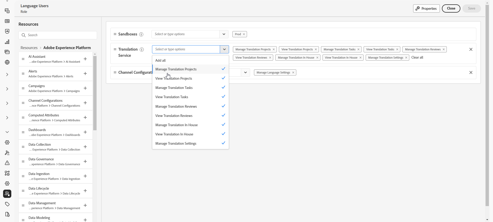
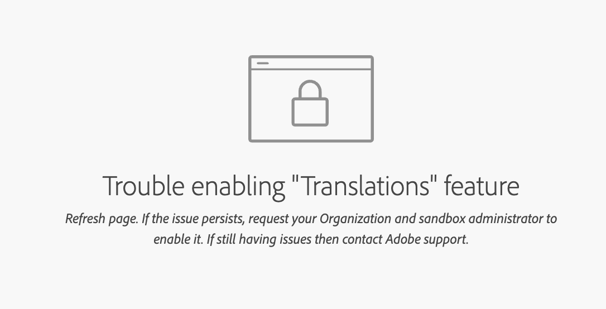

# Introducción al contenido multilingüe {#multilingual-gs}

>[!CONTEXTUALHELP]
>id="ajo_multi_translation_homepage"
>title="Traducciones"
>abstract="La función multilingüe le permite crear contenido sin esfuerzo en varios idiomas dentro de una misma campaña o recorrido. A través de la página Traducciones, puede configurar proyectos, seleccionar proveedores de traducción o administrar diccionarios específicos de la configuración regional"

La función multilingüe le permite crear contenido sin esfuerzo en varios idiomas dentro de una sola campaña o recorrido. Con esta función, puede cambiar entre idiomas al editar la campaña, lo que optimiza todo el proceso de edición y mejora la capacidad para administrar de forma eficaz el contenido multilingüe.

Con Journey Optimizer, puede crear contenido multilingüe mediante dos métodos distintos:

* **Traducción manual**: traduzca el contenido directamente en el Designer de correo electrónico o importe el contenido multilingüe existente. [Más información](multilingual-manual.md)

* **Traducción automática**: envía contenido a tu proveedor de idioma preferido para la traducción automática. [Más información](multilingual-automated.md)

 

## Requisitos previos {#prerequisites}

>[!CONTEXTUALHELP]
>id="ajo_multi_translation_error"
>title="Error de traducción"
>abstract="Si no puede acceder a la página de Traducción, es probable que se deba a que la función de Traducción no está activada. Para resolver este problema, debe asegurarse de que su organización y el administrador de la zona protegida activen la función de Traducción."

Adobe Journey Optimizer se integra actualmente con los proveedores de traducción, que ofrecen servicios de traducción de terceros (traducción automática o humana) independientes de Adobe Journey Optimizer.

Antes de agregar el proveedor de traducción seleccionado, debe crear una cuenta con ese proveedor correspondiente.

El uso de los servicios de traducción de un proveedor de traducción está sujeto a términos y condiciones adicionales de ese proveedor aplicable.  Como soluciones de terceros, los servicios de traducción están disponibles para los usuarios de Adobe Journey Optimizer a través de una integración.  Adobe no controla ni es responsable de los productos de terceros.

Para cualquier problema o solicitud de ayuda relacionada con sus traducciones, póngase en contacto con el proveedor de traducción correspondiente.

Para el contenido multilingüe, se debe definir la siguiente configuración:

* Para utilizar la función de traducción en Journey Optimizer, debe asignar la API a la función correspondiente. [Más información](https://experienceleague.adobe.com/es/docs/experience-platform/landing/platform-apis/api-authentication#assign-api-to-a-role)

* Para empezar a crear contenido multilingüe, los usuarios deben recibir el permiso **[!UICONTROL Administrar configuración de idioma]**. Para el flujo automatizado, los usuarios también necesitarán permisos relacionados con las capacidades del **[!UICONTROL servicio de traducción]**. [Más información sobre los permisos](../administration/permissions.md)

  +++ Aprenda a asignar permisos relacionados multilingües

   1. En el producto **Permisos**, vaya a la pestaña **Funciones** y seleccione la **Función** que desee.

   1. Haga clic en **Editar** para modificar los permisos.

   1. Agregue el recurso **Servicio de traducción** y, a continuación, seleccione los permisos multilingües adecuados en el menú desplegable.

      {zoomable="yes"}

   1. Haga clic en **Guardar** para aplicar los cambios.

      Los permisos de los usuarios que ya estén asignados a esta función se actualizarán automáticamente.

   1. Para asignar esta función a nuevos usuarios, vaya a la pestaña **Usuarios** en el panel de control **Funciones** y haga clic en **Añadir usuario**.

   1. Introduzca el nombre del usuario y su dirección de correo electrónico, o selecciónelo en la lista, y haga clic en **Guardar**.

   1. Si el usuario no estaba ya creado, consulte [esta documentación](https://experienceleague.adobe.com/es/docs/experience-platform/access-control/abac/permissions-ui/users).

  +++

* Si no puede acceder a la página de traducción, habilite la función de traducción y se le concederán permisos relacionados con el **[!UICONTROL servicio de traducción]**. [Más información](../administration/ootb-permissions.md)

  +++ Obtenga información sobre cómo habilitar la función de traducción

   1. Si está viendo la siguiente página de error, indica que la característica **[!UICONTROL Traducción]** aún no se ha habilitado. Póngase en contacto con el administrador de su organización y de la zona protegida para solicitar acceso.

  

   1. El administrador tendrá que navegar al menú **[!UICONTROL Traducción]** en la barra lateral izquierda.

      El sistema activará automáticamente la función de traducción.

   1. Una vez que la característica se haya habilitado correctamente, podrá obtener acceso a la página **[!UICONTROL Traducción]**, junto con las fichas **[!UICONTROL Proyectos]**, **[!UICONTROL Proveedores]** y **[!UICONTROL Configuración regional]**.

   1. Si este procedimiento ha fallado, seguirá viendo la misma página de error. En ese caso, póngase en contacto con su representante de Adobe para obtener más ayuda.

  +++

## Vídeo práctico {#video}

Aprenda a crear contenido en varios idiomas dentro de una sola campaña o recorrido.

>[!VIDEO](https://video.tv.adobe.com/v/3430921/)
