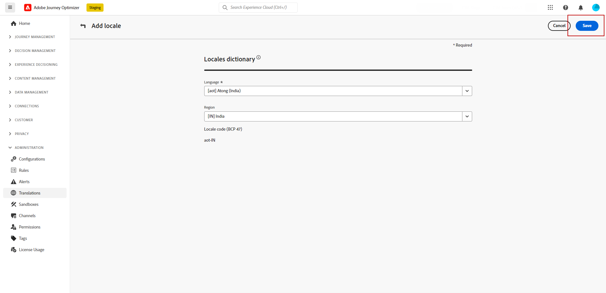

# Crear configuración regional {#multilingual-locale}

>[!CONTEXTUALHELP]
>id="ajo_multi_add_locale"
>title="Añadir configuración regional"
>abstract="Al configurar las preferencias de idioma, tiene la opción de crear configuraciones regionales adicionales si la configuración deseada no está disponible para el contenido multilingüe."

Al configurar los ajustes de idioma, como se describe en la sección [Crear la configuración de idioma](multilingual-manual.md#language-settings), si no hay una configuración regional específica disponible para el contenido multilingüe, tiene la flexibilidad de crear tantas configuraciones regionales nuevas como sea necesario mediante el menú **[!UICONTROL Traducción]**.

1. Desde el menú **[!UICONTROL Administración de contenido]**, accede a **[!UICONTROL Traducción]**.

1. En la ficha **[!UICONTROL Diccionario local]**, haga clic en **[!UICONTROL Agregar configuración regional]**.

   

1. Seleccione su código de configuración regional de la lista **[!UICONTROL Idioma]** y la **[!UICONTROL Región]** asociada.

1. Haga clic en **[!UICONTROL Guardar]** para crear su configuración regional.

   
