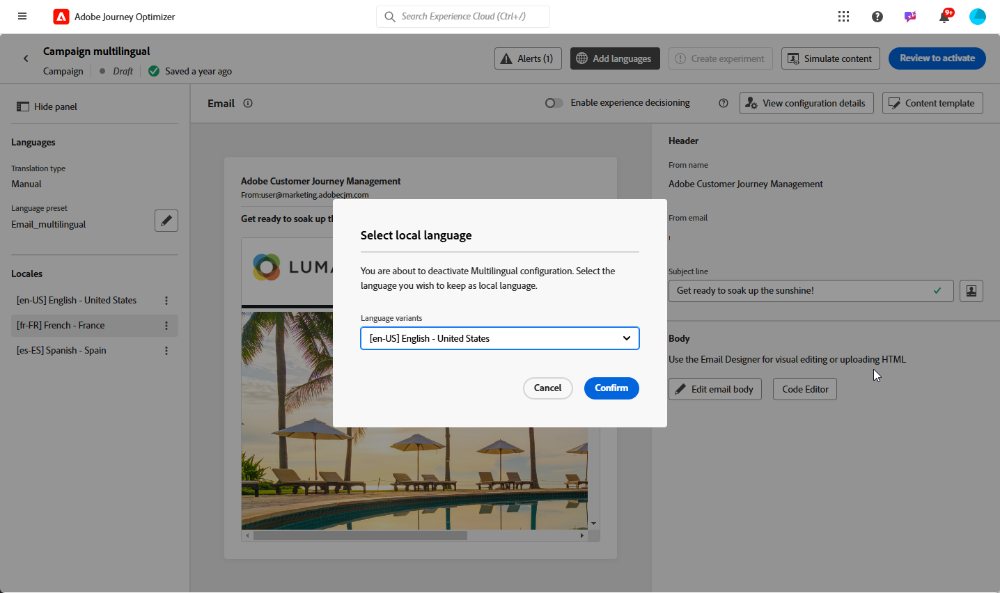

# Creación de contenido multilingüe con traducción manual {#multilingual-manual}

>[!IMPORTANT]
>
>Para el flujo manual, los usuarios deben recibir el permiso **[!UICONTROL Administrar configuración de idioma]**.

Con el flujo manual, puede traducir fácilmente su contenido directamente en sus campañas y recorridos, lo que le proporciona un control preciso y opciones de personalización para sus mensajes multilingües. Además, puede importar fácilmente contenido multilingüe preexistente con la opción Importar HTML.

Siga estos pasos para crear contenido multilingüe con traducción manual:

1. [Agregar el proveedor (opcional)](multilingual-provider.md)

1. [Agregar configuraciones regionales (opcional)](multilingual-locale.md)

1. [Crear configuración de idioma](#language-settings)

1. [Creación de contenido multilingüe](#create-multilingual-campaign)

## Crear configuración de idioma {#language-settings}

En esta sección, puede establecer las distintas configuraciones regionales para administrar el contenido multilingüe. También puede elegir el atributo que desee utilizar para buscar información relacionada con el idioma del perfil

1. Desde el menú **[!UICONTROL Administración]**, accede a **[!UICONTROL Canal]** > **[!UICONTROL Configuración general]**.

1. En el menú **[!UICONTROL Configuración de idioma]**, haga clic en **[!UICONTROL Crear configuración de idioma]**.

   

1. Escriba el nombre de su **[!UICONTROL configuración de idioma]** y elija **[!UICONTROL Traducción manual]**.

1. Seleccione las **[!UICONTROL configuraciones regionales]** asociadas a esta configuración. Puede agregar un máximo de 50 configuraciones regionales.

   Si falta una **[!UICONTROL configuración regional]**, puede crearla manualmente de antemano desde el menú **[!UICONTROL Traducción]** o por API. Consulte [Crear nueva configuración regional](multilingual-locale.md).

   

1. Seleccione **[!UICONTROL Preferencias de reserva]** para definir una opción de copia de seguridad para cuando un perfil no cumpla los criterios necesarios para la entrega de contenido.

   Tenga en cuenta que si no se selecciona ninguna opción de reserva, la campaña o el recorrido no se envían.

1. Elija su preferencia de envío entre las siguientes opciones:

   * **[!UICONTROL Seleccionar atributos de preferencia de idioma de perfil]**
   * **[!UICONTROL Crear reglas condicionales personalizadas]**

1. Si selecciona **[!UICONTROL Seleccionar atributos de preferencia de idioma de perfil]**, elija el atributo correspondiente en el menú **[!UICONTROL Atributos de preferencia de idioma de perfil]** para buscar información de idioma de perfil.

   

1. Si selecciona **[!UICONTROL Crear reglas condicionales personalizadas]**, seleccione la configuración regional para la que desea crear condiciones. A continuación, genere reglas basadas en factores como la ubicación del usuario, las preferencias de idioma u otros elementos contextuales.

   

1. Comience a crear condiciones agregando un atributo, evento o audiencia para definir el grupo objetivo.

   >[!IMPORTANT]
   >
   >Los datos contextuales están disponibles exclusivamente para canales web, de aplicación, de experiencia basada en código y de tarjetas de contenido. Si se utiliza para canales de correo electrónico, SMS, notificaciones push o de correo directo, sin atributos adicionales, la campaña o el recorrido se envían en el idioma de la primera opción de la lista.

   

   +++Requisitos previos para utilizar eventos contextuales en las condiciones

   Cuando los usuarios muestran el contenido, se envía una solicitud de personalización junto con el evento de experiencia. Para aprovechar los datos contextuales en sus condiciones, debe adjuntar datos adicionales a la carga útil de la solicitud de personalización. Para ello, debe crear una regla en la recopilación de datos de Adobe Experience Platform para especificar: SI se envía una solicitud de personalización, adjunte datos adicionales a la solicitud, definiendo el atributo para que coincida con el campo de idioma del esquema.

   >[!NOTE]
   >
   >Estos requisitos previos solo son necesarios para los canales de tarjetas de contenido y en la aplicación.

   1. En Recopilación de datos de Adobe Experience Platform, acceda al menú **[!UICONTROL Reglas]** y cree una regla nueva. Encontrará información detallada sobre cómo crear reglas en [!DNL Adobe Experience Platform] [Documentación de recopilación de datos](https://experienceleague.adobe.com/es/docs/experience-platform/collection/e2e#create-a-rule){target="_blank"}

   2. En la sección **[!UICONTROL IF]** de la regla, agregue un evento configurado de la siguiente manera:

      

      * Elija la **[!UICONTROL extensión]** con la que está trabajando.
      * En el campo **[!UICONTROL Tipo de evento]**, seleccione &quot;Evento de solicitud de AEP&quot;.
      * En el panel derecho, seleccione &quot;Tipo de evento XDM es igual a personalización.request&quot;
      * Haga clic en el botón **[!UICONTROL Conservar cambios]** para confirmar.

   3. En la sección **[!UICONTROL THEN]** de la regla, agregue una acción configurada de la siguiente manera:

      

      * Elija la **[!UICONTROL extensión]** con la que está trabajando.
      * En el campo **[!UICONTROL Tipo de acción]**, seleccione &quot;Adjuntar datos&quot;.
      * En la sección de carga útil JSON, asegúrese de que el atributo utilizado para recuperar el idioma que se va a utilizar (en el ejemplo siguiente &quot;idioma&quot;) coincida con el nombre del atributo especificado en el esquema al que está fluyendo el flujo de datos de recopilación de datos.

        ```JSON
        {
            "xdm":{
                "application":{
                    "_dc":{
                        "language":"{%%Language%%}"
                    }
                }
            }
        }
        ```

      * Haga clic en el botón **[!UICONTROL Conservar cambios]** para confirmar y guardar la regla.

   +++

1. Arrastre y suelte las configuraciones regionales para reordenarlas y administrar su prioridad en la lista.

1. Para eliminar una configuración regional, haga clic en el icono de la bandeja.

   

1. Haz clic en **[!UICONTROL Enviar]** para crear tu **[!UICONTROL configuración de idioma]**.

Tenga en cuenta que después de configurar las preferencias de idioma, ya no tendrá la opción de editarlas.

<!--
1. Access the **[!UICONTROL channel configurations]** menu and create a new channel configuration or select an existing one.


1. In the **[!UICONTROL Header parameters]** section, select the **[!UICONTROL Enable multilingual]** option.

1. Select your **[!UICONTROL Locales dictionary]** and add as many as needed.
-->

## Creación de contenido multilingüe {#create-multilingual-campaign}

Después de configurar el contenido multilingüe, está listo para crear la campaña o el recorrido y personalizar el contenido para cada una de las configuraciones regionales seleccionadas.

1. Comience creando y configurando su notificación por correo electrónico, SMS o push [campaign](../campaigns/create-campaign.md) o [recorrido](../building-journeys/journeys-message.md) según sus necesidades.

   >[!IMPORTANT]
   >
   >Se recomienda incluir solo un proyecto de traducción por recorrido.

1. Cree o importe el contenido original y personalícelo según sea necesario.

1. Una vez creado el contenido, haz clic en **[!UICONTROL Guardar]** y vuelve a la pantalla de configuración de la campaña.

   

1. Haga clic en **[!UICONTROL Agregar idiomas]** y seleccione la **[!UICONTROL configuración de idioma]** creada anteriormente. [Más información](#language-settings)

   

1. Elija la configuración regional que desee en el menú desplegable para aplicarla al contenido creado existente.

1. Acceda a la configuración avanzada del menú **[!UICONTROL Configuraciones regionales]** y seleccione **[!UICONTROL Copiar a todas las configuraciones regionales]**.

   

1. Ahora que el contenido está duplicado en las **[!UICONTROL configuraciones regionales]** seleccionadas, acceda a cada configuración regional y haga clic en **[!UICONTROL Editar cuerpo del correo electrónico]** para traducir el contenido.

   

1. Puede optar por deshabilitar o habilitar configuraciones regionales con el menú **[!UICONTROL Más acción]** de la configuración regional seleccionada.

   

1. Para desactivar la configuración multilingüe, haga clic en **[!UICONTROL Agregar idiomas]** y seleccione el idioma que desee conservar como idioma local.

   

1. Haga clic en **[!UICONTROL Revisar para activar]** y mostrar un resumen de la campaña.

   El resumen le permite modificar la campaña si es necesario y comprobar si algún parámetro es incorrecto o falta.

1. Examine el contenido multilingüe para ver la renderización en cada idioma.

   

Ahora puede activar la campaña o el recorrido. Una vez enviada, puede medir el impacto del recorrido o la campaña multilingüe dentro de los informes.

>[!IMPORTANT]
>
> Si la campaña está sujeta a una directiva de aprobación, debe solicitar la aprobación para poder enviar la campaña o el recorrido multilingüe. [Más información](../test-approve/gs-approval.md)

<!--
# Create a multilingual journey {#create-multilingual-journey}

1. Create your journey with a Delivery and personalize your content as needed.
1. From your delivery action, click Edit content.
1. Click Add languages.

-->
