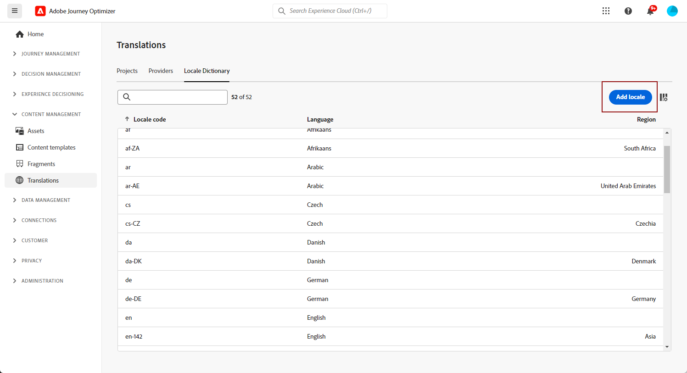

# Creación de contenido multilingüe con traducción manual {#multilingual-manual}

>[!AVAILABILITY]
>
>Actualmente, el contenido multilingüe solo está disponible para un conjunto de organizaciones (disponibilidad limitada). Para obtener acceso, póngase en contacto con su representante de Adobe.

Con el flujo manual, puede traducir fácilmente su contenido directamente en su campaña y recorrido de correo electrónico, notificaciones push o SMS, lo que le proporciona un control preciso y opciones de personalización para sus mensajes multilingües. Además, puede importar fácilmente contenido multilingüe preexistente con la opción Importar HTML.

Siga estos pasos para crear contenido multilingüe con traducción manual:

1. [Cree su configuración regional](#create-locale).

1. [Crear configuración de idioma](#create-language-settings).

1. [Creación de contenido multilingüe](#create-a-multilingual-campaign).

## Crear configuración regional {#create-locale}

Al configurar los ajustes de idioma, tal como se describe en la sección [Cree la configuración de idioma](#language-settings) , si una configuración regional específica no está disponible para el contenido multilingüe, tiene la flexibilidad de crear tantas configuraciones regionales nuevas como sea necesario utilizando **[!UICONTROL Traducción]** menú.

1. Desde el **[!UICONTROL Gestión de contenido]** menú, acceso **[!UICONTROL Traducción]**.

1. Desde el **[!UICONTROL Diccionario de configuración regional]** pestaña, haga clic en **[!UICONTROL Añadir configuración regional]**.

   

1. Seleccione el código de configuración regional en la **[!UICONTROL Idioma]** y la lista asociada **[!UICONTROL Región]**.

1. Clic **[!UICONTROL Guardar]** para crear su configuración regional.

   

## Crear configuración de idioma {#language-settings}

En esta sección, puede establecer el idioma principal y sus configuraciones regionales asociadas para administrar el contenido multilingüe. También puede elegir el atributo que desee utilizar para buscar información relacionada con el idioma del perfil

1. Desde el **[!UICONTROL Administration]** menú, acceso **[!UICONTROL Canal]**.

1. En el **[!UICONTROL Configuración de idioma]** , haga clic en **[!UICONTROL Crear configuración de idioma]**.

   

1. Escriba el nombre de su **[!UICONTROL Configuración de idioma]**.

1. Seleccione el **[!UICONTROL Configuraciones regionales]** asociadas a esta configuración. Puede agregar un máximo de 50 configuraciones regionales.

   Si un **[!UICONTROL Configuración regional]** falta, puede crearlo manualmente de antemano desde el **[!UICONTROL Traducción]** o por API. Consulte [Crear nueva configuración regional](#create-locale).

   

1. Desde el **[!UICONTROL Preferencia de envío]** , seleccione el atributo que desea buscar para encontrar información sobre los idiomas del perfil.

   

1. Clic **[!UICONTROL Editar]** junto a su **[!UICONTROL Configuración regional]** para personalizarlo aún más y para agregar **[!UICONTROL Preferencias de perfil]**.

   

1. Seleccionar otros **[!UICONTROL Configuraciones regionales]** en la lista desplegable Preferencias de perfil y haga clic en **[!UICONTROL Añadir perfiles]**.

1. Acceda al menú avanzado de su **[!UICONTROL Configuración regional]** para definir su **[!UICONTROL Configuración regional principal]**, es decir, el idioma predeterminado si no se especifica el atributo de perfil.

   También puede eliminar la configuración regional desde este menú avanzado.

   

1. Clic **[!UICONTROL Enviar]** para crear su **[!UICONTROL Configuración de idioma]**.

<!--
1. Access the **[!UICONTROL Channel surfaces]** menu and create a new channel surface or select an existing one.

1. In the **[!UICONTROL Header parameters]** section, select the **[!UICONTROL Enable multilingual]** option.

1. Select your **[!UICONTROL Locales dictionary]** and add as many as needed.
-->

## Creación de contenido multilingüe {#create-multilingual-campaign}

Después de configurar el contenido multilingüe, está listo para crear la campaña o el recorrido y personalizar el contenido para cada una de las configuraciones regionales seleccionadas.

1. Comience creando y configurando las notificaciones push, de correo electrónico o SMS [campaña](../campaigns/create-campaign.md) o [recorrido](../building-journeys/journeys-message.md) según sus necesidades.

   >[!AVAILABILITY]
   >
   >Se recomienda incluir solo un proyecto de traducción por recorrido.

1. Cree o importe el contenido original y personalícelo según sea necesario.

1. Una vez creado el contenido principal, haga clic en **[!UICONTROL Guardar]** y vuelva a la pantalla de configuración de la campaña.

   

1. Clic **[!UICONTROL Añadir idiomas]** y seleccione el creado anteriormente **[!UICONTROL Configuración de idioma]**. [Más información](#create-language-settings)

   

1. Acceda a la configuración avanzada de **[!UICONTROL Configuraciones regionales]** y seleccione **[!UICONTROL Copiar principal en todas las configuraciones regionales]**.

   

1. Ahora que el contenido principal está duplicado en el contenido seleccionado  **[!UICONTROL Configuraciones regionales]**, acceda a cada configuración regional y haga clic en **[!UICONTROL Editar cuerpo del correo electrónico]** para traducir el contenido.

   

1. Puede optar por deshabilitar o habilitar las configuraciones regionales con el **[!UICONTROL Más acción]** del menú de la Configuración regional seleccionada.

   

1. Para desactivar la configuración multilingüe, haga clic en **[!UICONTROL Añadir idiomas]** y seleccione el idioma que desee conservar como idioma local.

   

1. Clic **[!UICONTROL Revisar para activar]** para mostrar un resumen de la campaña.

   El resumen le permite modificar la campaña si es necesario y comprobar si algún parámetro es incorrecto o falta.

1. Examine el contenido multilingüe para ver la renderización en cada idioma.

   

Ahora puede activar la campaña o el recorrido. Una vez enviada, puede medir el impacto del recorrido o la campaña multilingüe dentro de los informes.

<!--
# Create a multilingual journey {#create-multilingual-journey}

1. Create your journey with a Delivery and personalize your content as needed.
1. From your delivery action, click Edit content.
1. Click Add languages.

-->
