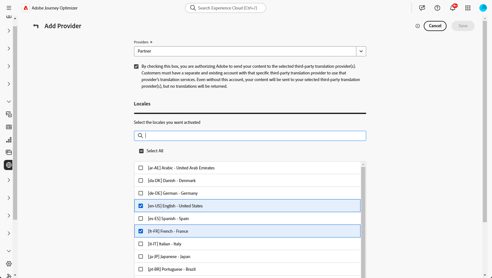

# Añadir proveedores de idioma {#multilingual-provider}

>[!IMPORTANT]
>
> El uso de los servicios de traducción de un proveedor de traducción está sujeto a términos y condiciones adicionales de ese proveedor aplicable. Como soluciones de terceros, los servicios de traducción están disponibles para los usuarios de Adobe Journey Optimizer a través de una integración. Adobe no controla ni es responsable de los productos de terceros.

Adobe Journey Optimizer se integra con proveedores de traducción de terceros que ofrecen servicios de traducción automática y humana, independientes de Adobe Journey Optimizer.

Antes de añadir el proveedor de traducción seleccionado, asegúrese de haber creado una cuenta con el proveedor correspondiente.

1. En el menú **[!UICONTROL Administración de contenido]**, vaya a **[!UICONTROL Traducción]**.

1. Acceda a la ficha **[!UICONTROL Proveedores]** y haga clic en **[!UICONTROL Agregar proveedor]**.

   

1. En la lista desplegable **[!UICONTROL Proveedores]**, elija el proveedor que desee.

   >[!NOTE]
   >
   >Para agregar un nuevo **proveedor** a la lista, puedes pedirle a tu **proveedor** que siga las instrucciones detalladas en [este documento](https://developer.adobe.com/gcs/partner/) para completar el proceso de incorporación.

   

1. Si usas Microsoft Translator como proveedor, escribe tu **[!UICONTROL clave de suscripción]** y **[!UICONTROL URL de punto de conexión]**.

   Haga clic en **[!UICONTROL Validar credenciales]** para probar la conexión.

   

1. Seleccione las **configuraciones regionales compatibles** aplicables.

   

1. Después de completar la configuración, haz clic en **[!UICONTROL Guardar]** para finalizar la instalación.
