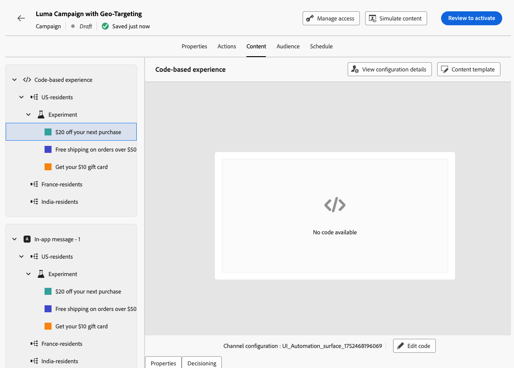

# Combinación de segmentación y experimentación {#combination}

Journey Optimizer también permite combinar objetivos y experimentos dentro de un solo recorrido o campaña para crear estrategias más sofisticadas.

De hecho, puede utilizar la segmentación para crear varias variantes y, para cada variante, utilizar la experimentación para optimizar aún más cada contenido. Esto garantiza que los experimentos sean específicos para cada regla de segmentación y no se extiendan entre variantes.

Por ejemplo, puede probar una &quot;promoción con un descuento del 50 %&quot; en comparación con una &quot;tarjeta de regalo de 50 dólares&quot; para clientes de Estados Unidos y realizar una prueba diferente para clientes de Europa, como &quot;envío gratuito en pedidos de más de 50 euros&quot; en comparación con &quot;20 % de descuento en su próxima compra&quot;.

Para combinar objetivos y experimentos en un recorrido o campaña, siga los pasos a continuación.

1. Cree un recorrido o una campaña donde defina varias reglas de segmentación. [Descubra cómo](optimization-targeting.md)

   {width=85%}

1. Cree un experimento para la primera regla de segmentación.

1. Diseñe y configure el experimento de contenido como desee. [Descubra cómo](../content-management/content-experiment.md)

   {width=85%}

   Una vez definida la experimentación, solo se aplica a la primera regla de segmentación.

1. En la ficha **[!UICONTROL Acciones]**, seleccione **[!UICONTROL Editar contenido]**.

1. Para el grupo definido por la primera regla de segmentación, puede definir un contenido específico para cada variante del experimento.

   Si agregó más de una acción entrante al recorrido o a la campaña, se aplica la misma combinación de direccionamiento y experimento a cada acción. Sin embargo, debe definir un contenido específico para cada variante de cada acción.

   {width=85%}

1. Continúe de forma similar para las demás reglas de segmentación y diseñe el contenido correspondiente para cada variante.

1. Guarde los cambios y [active](../campaigns/review-activate-campaign.md) su recorrido o campaña.

Una vez que el recorrido/campaña está activo, a los usuarios de cada grupo objetivo se les asignan aleatoriamente las diferentes variaciones de contenido definidas para el grupo al que pertenecen.

<!--
## Reporting on Message optimization

E.g. explaining how a marketer can look at the report to determine which treatment (e.g. which message content) is performing the best for the targeting audience
-->
