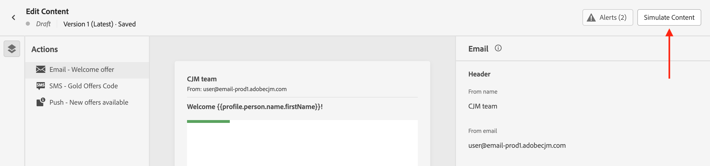

# Previsualización y prueba del contenido {#preview-test}

>[!CONTEXTUALHELP]
>id="ac_preview_testprofiles"
>title="Compruebe cómo se representa el contenido"
>abstract="Una vez definido el contenido, puede utilizar perfiles de prueba para previsualizarlo y comprobar si la representación es correcta según el canal que utilice."

>[!CONTEXTUALHELP]
>id="ajo_preview_simulate"
>title="Compruebe cómo se representa el contenido"
>abstract="Una vez definido el contenido, puede previsualizarlo y comprobar si la renderización es correcta según el canal que utilice."

Una vez definido el contenido, puede obtener una vista previa del mismo antes de enviar el mensaje. Es un paso crucial para garantizar que sea preciso, pero también que no haya errores, tanto en la configuración del contenido como de la personalización.

También puede realizar envíos de prueba de sus mensajes de correo electrónico a destinatarios o suscriptores específicos para realizar pruebas y validarlos, y comprobar cómo se representan en los clientes de escritorio, móviles y basados en web más conocidos.

Todas estas acciones se pueden realizar con el botón **[!UICONTROL Simular contenido]**, al que se puede acceder desde la pantalla de edición de contenido del mensaje, o desde el correo electrónico y los diseñadores web de los canales web y de correo electrónico.

## Pruebas usando datos de perfiles de prueba o datos de entrada de muestra {#methods}

Journey Optimizer proporciona dos experiencias para probar el contenido:

* **Prueba de contenido usando datos de perfiles de prueba**

  Puede utilizar perfiles de prueba para previsualizar el contenido, enviar pruebas de correo electrónico y comprobar el renderizado de correo electrónico. Si ha añadido campos personalizados, puede comprobar ahora cómo se muestran utilizando datos de perfil de prueba. Para obtener más información, consulte estas secciones:

  ➡️ [Seleccionar perfiles de prueba](test-profiles.md)
➡️ [Vista previa usando perfiles de prueba](preview.md)
➡️ [Enviar pruebas de correo electrónico](proofs.md)
➡️ [Comprobar procesamiento de correo electrónico](rendering.md)
➡️ [Previsualizar y revisar el correo electrónico (vídeo)](#video-preview)

* **Prueba de variaciones de contenido mediante datos de entrada de muestra**

  [!DNL Journey optimizer] permite obtener una vista previa y enviar pruebas de diferentes variaciones del contenido usando los datos de entrada de muestra cargados desde un archivo CSV o JSON o añadidos manualmente.

  El sistema detecta automáticamente todos los atributos de perfiles utilizados en el contenido para la personalización y los puede utilizar en las pruebas para crear varias variantes.

  ➡️ [Simulación de variaciones de contenido](../test-approve/simulate-sample-input.md)

## Lectura obligatoria

* **Permisos necesarios**: tenga en cuenta que necesita tener el permiso **[!DNL Manage Simulate Content]** incluido en el perfil de producto **[!DNL Content Library Manager]**. [Más información](../administration/ootb-product-profiles.md#content-library-manager).

  Para enviar pruebas, debe tener los permisos **Aprobar y publicar** para el recurso específico (campaña o recorrido) asociado al correo electrónico. Además, para enviar pruebas en un recorrido, también se requiere el permiso **Publicar recorrido**. [Obtenga más información sobre permisos](../administration/ootb-permissions.md).

* **Personalización con datos de contexto**: al obtener una vista previa de un mensaje o enviar pruebas, solo se muestran los datos de personalización del perfil. La personalización basada en datos de contexto, como la información del evento, solo se puede probar en el contexto de un recorrido. Obtenga más información en [este caso de uso](../personalization/personalization-use-case.md).

* **Previsualización del contenido con varias variantes condicionales**: al simular o procesar pruebas de correos electrónicos que contienen varias variantes condicionales, Journey Optimizer puede precisar de más tiempo de procesamiento. Si experimenta tiempos de espera o mensajes de error, considere la posibilidad de reducir la cantidad total de variantes o simplificar las reglas condicionales. Obtenga más información sobre el contenido condicional en [esta página](../personalization/dynamic-content.md).

## Vídeo práctico {#video-preview}

Aprenda a utilizar perfiles de prueba para probar el renderizado de correos electrónicos en varias bandejas de entrada, previsualizar los correos electrónicos personalizados con perfiles de prueba y enviar pruebas.

>[!VIDEO](https://video.tv.adobe.com/v/3425026?quality=12)
