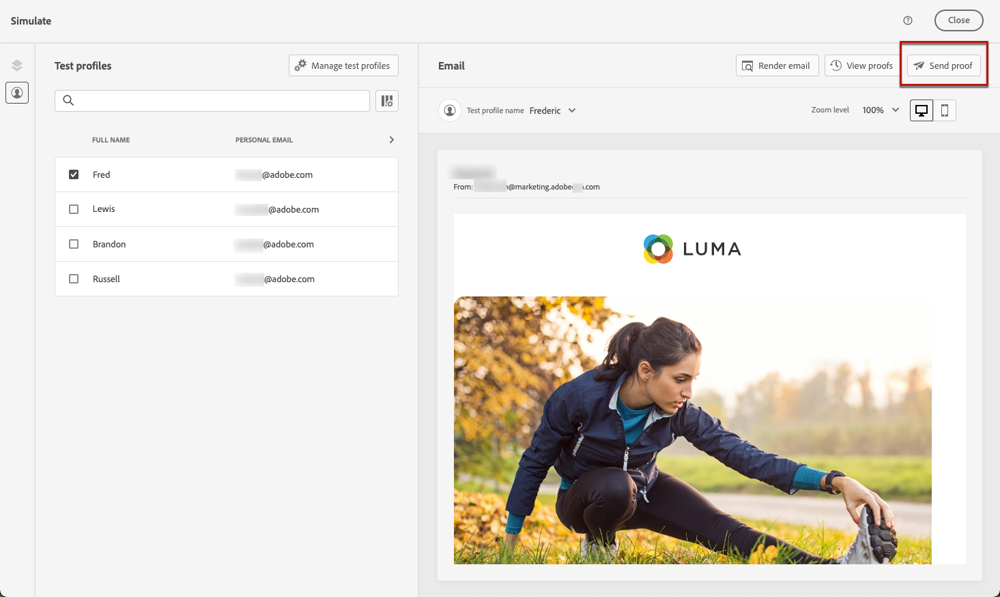
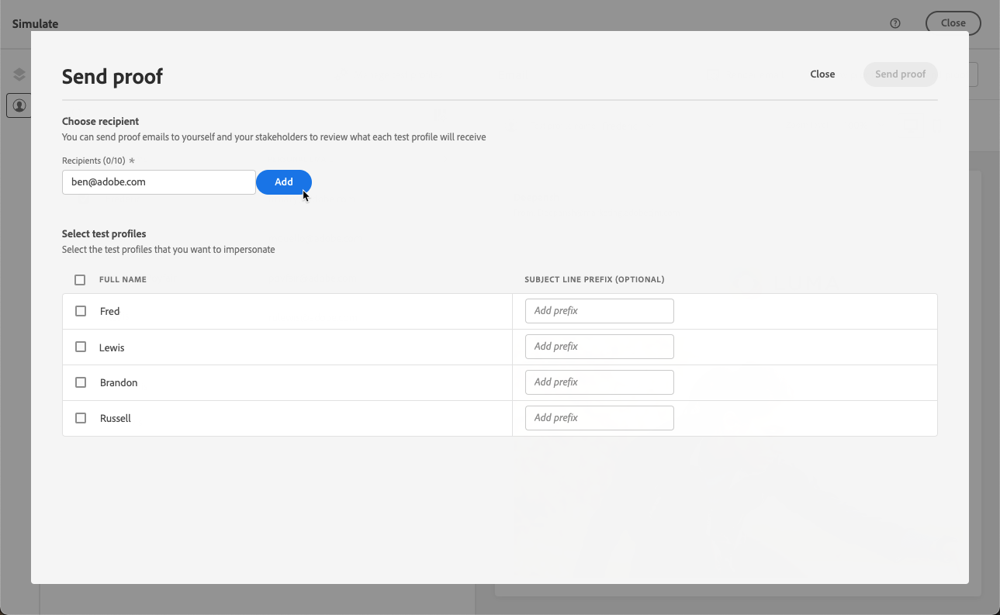
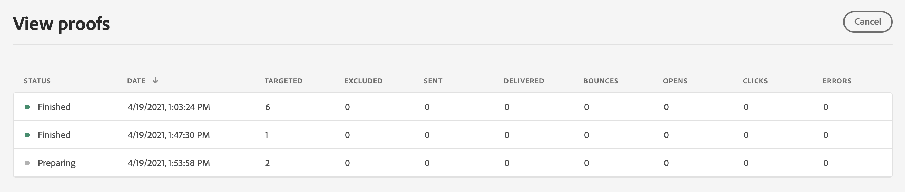

# Envío de pruebas mediante datos de perfiles de prueba {#send-proofs}

>[!BEGINSHADEBOX]

**En esta página:** Aprenda a enviar pruebas de correo electrónico mediante datos de perfil de prueba para que los destinatarios puedan revisar la representación, el contenido y la personalización antes de que el mensaje llegue a la audiencia principal.

>[!ENDSHADEBOX]

Una prueba es un mensaje específico que le permite probar un mensaje antes de enviarlo al público principal. Los destinatarios de la prueba se encargan de aprobar el mensaje: procesamiento, contenido, valores de ajuste de personalización, configuración.

Puede enviar pruebas utilizando cualquiera de los métodos de simulación:

* Haga clic en **[!UICONTROL Simular contenido]** y, a continuación, seleccione **[!UICONTROL Simular contenido (perfiles de AEP)]** en el menú desplegable para enviar pruebas con perfiles de prueba.
* Haga clic en **[!UICONTROL Simular contenido]** para enviar pruebas de las variaciones de contenido creadas con datos de entrada de muestra o con la generación automática de IA. [Aprenda a simular variaciones de contenido](../test-approve/simulate-sample-input.md#proofs)

## Lectura obligatoria {#must-read}

**Reglas de límite de frecuencia**: todas las reglas de límite de frecuencia existentes se aplican a las pruebas. Si ha establecido [reglas de límite de frecuencia](../conflict-prioritization/channel-capping.md) (por ejemplo, envíos máximos por perfil), estos límites también se aplican al enviar pruebas. Si un perfil de prueba ya ha alcanzado el límite de frecuencia, las pruebas se mostrarán como finalizadas, pero no se enviará ningún correo electrónico. Para las pruebas repetidas, considere la posibilidad de utilizar perfiles de prueba únicos o ajustar los límites de frecuencia para los escenarios de prueba según sea necesario.

**Página espejo**: en la prueba enviada, el vínculo a la página espejo no está activo. Solo se activa en los mensajes finales.

**Assets** - Assets e imágenes tienen reglas de accesibilidad específicas:

* Se puede acceder a las imágenes o Assets en el contenido enviado o de prueba durante un máximo de 2 años (730 días) desde su primera publicación en cualquier fragmento o mensaje en línea.
* Se requiere volver a publicar después de este período de caducidad (en cualquier momento después de 730 días) para mantenerlos accesibles durante otros 2 años.
* Cualquier republicación realizada dentro de los 730 días posteriores a la primera publicación no extenderá la caducidad de los activos/imágenes a los próximos 730 días.

## Envío de pruebas {#send-proofs-steps}

Para enviar pruebas de correo electrónico utilizando datos de perfiles de prueba, primero debe seleccionar [perfiles de prueba](test-profiles.md). A continuación, siga estos pasos:

1. En la pantalla **[!UICONTROL Simular]**, haga clic en el botón **[!UICONTROL Enviar revisión]**.

   

1. En la ventana **[!UICONTROL Enviar prueba]**, escribe el correo electrónico del destinatario y haz clic en **[!UICONTROL Agregar]** para enviarte la prueba a ti mismo o a los miembros de tu organización.

   Tenga en cuenta que puede añadir hasta diez destinatarios para la entrega de prueba.

   

1. Seleccione los **perfiles de prueba** que se usarán para personalizar el contenido del mensaje.

   Cada destinatario de la prueba recibe tantos mensajes como el número de perfiles de prueba seleccionados. Por ejemplo, si ha añadido cinco correos electrónicos de destinatario y ha seleccionado diez perfiles de prueba, enviará cincuenta mensajes de prueba. Cada destinatario recibe diez de ellos.

1. Si es necesario, puede añadir un prefijo a la línea de asunto de la prueba. Solo caracteres alfanuméricos y caracteres especiales como . - _ ( ) [ ] se permiten como prefijo en la línea de asunto.

1. Haga clic en **[!UICONTROL Enviar revisión]**.

   

1. En la pantalla **[!UICONTROL Simular]**, haga clic en el botón **[!UICONTROL Ver pruebas]** para comprobar el estado.

   

Se recomienda enviar pruebas después de cada modificación al contenido del mensaje.
