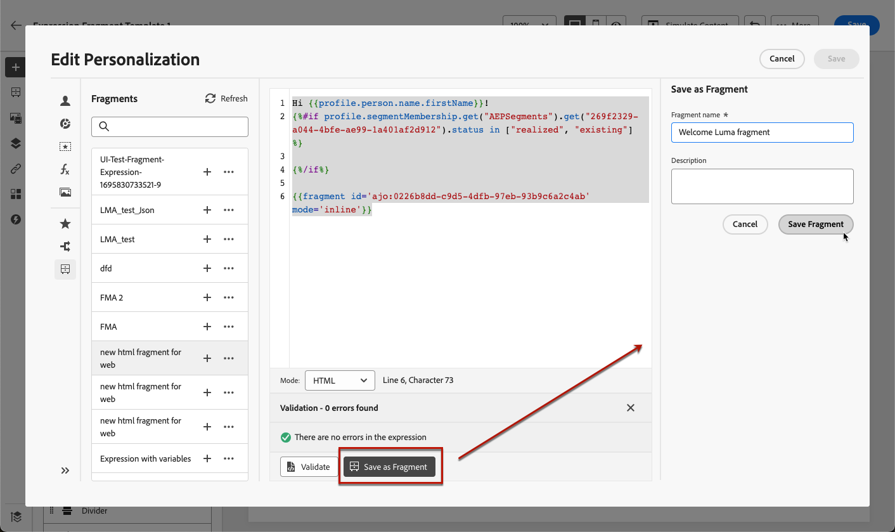

# Guardar contenido como fragmento {#save-as-fragment}

Al editar contenido en [!DNL Journey Optimizer], puede guardar todo o parte del contenido como fragmento para su reutilización futura. Puede guardar contenido como fragmento [desde el Designer de correo electrónico](#save-as-visual-fragment) o [desde el editor de expresiones](#save-as-expression-fragment).

>[!NOTE]
>
>Cuando el seguimiento está habilitado en un recorrido o una campaña, si agrega vínculos a un fragmento y este se utiliza en un correo electrónico, se realiza el seguimiento de estos vínculos, como todos los demás vínculos incluidos en el mensaje. [Más información sobre vínculos y seguimiento](../email/message-tracking.md)

## Guardar como fragmento visual {#save-as-visual-fragment}

Para guardar contenido del Designer de correo electrónico como fragmento, siga estos pasos:

1. En [Email Designer](../email/get-started-email-design.md), haga clic en los puntos suspensivos en la parte superior derecha de la pantalla.

1. Seleccione **[!UICONTROL Guardar como fragmento]** en el menú desplegable.

   

   >[!NOTE]
   >
   >Los fragmentos visuales no pueden superar los 100 KB.

1. Se muestra la pantalla **[!UICONTROL Guardar como fragmento]**. Seleccione los elementos que desee incluir en el fragmento, incluidos los campos de personalización y el contenido dinámico. Tenga en cuenta que los atributos contextuales no son compatibles con los fragmentos.

   

   >[!CAUTION]
   >
   >Solo se pueden seleccionar secciones adyacentes entre sí. No puede seleccionar una estructura vacía u otro fragmento.

1. Haga clic en **[!UICONTROL Crear]** y rellene el nombre y la descripción del fragmento (si es necesario).

1. Para asignar etiquetas de uso de datos principales o personalizadas al fragmento, haga clic en el botón **[!UICONTROL Administrar acceso]** en la sección superior de la pantalla. [Obtenga más información acerca del Control de acceso de nivel de objeto (OLAC)](../administration/object-based-access.md).

1. Seleccione o cree etiquetas Adobe Experience Platform en el campo **Etiquetas** para categorizar la plantilla y mejorar la búsqueda. [Más información](../start/search-filter-categorize.md#tags)

1. Haga clic en **[!UICONTROL Crear]**. El fragmento se agrega a la [lista de fragmentos](#access-manage-fragments) con el estado **Borrador**. Se convierte en un fragmento independiente que se puede utilizar como cualquier otro fragmento visual de esa lista.

   >[!NOTE]
   >
   >Cualquier cambio en ese nuevo fragmento no se propaga al correo electrónico o a la plantilla de los que proviene. Del mismo modo, cuando el contenido original se edita dentro de ese correo electrónico o plantilla, el nuevo fragmento no se modifica.

1. Para poder utilizar el fragmento en sus recorridos y campañas, debe habilitarlo. [Obtenga información sobre cómo obtener una vista previa y publicar un fragmento](../content-management/create-fragments.md#publish)

## Guardar como fragmento de expresión {#save-as-expression-fragment}

>[!CONTEXTUALHELP]
>id="ajo_perso_library"
>title="Guardar como fragmento de expresión"
>abstract="El Editor de personalización de [!DNL Journey Optimizer] permite guardar contenido como fragmentos de expresiones. Estas expresiones están disponibles para crear contenido personalizado."

El Editor de personalización de [!DNL Journey Optimizer] permite guardar contenido como fragmentos de expresiones. Estas expresiones están disponibles para crear contenido personalizado.

Para guardar contenido como un fragmento de expresión, siga los pasos a continuación.

1. En la interfaz de [editor de personalización](../personalization/personalization-build-expressions.md), cree una expresión y haga clic en **[!UICONTROL Guardar como fragmento]**.

   >[!NOTE]
   >
   >Las expresiones no pueden superar los 200 KB.

1. En el panel derecho, escriba un nombre y una descripción para la expresión con el fin de ayudar a los usuarios a encontrarla más fácilmente.

   

1. Haga clic en **[!UICONTROL Guardar fragmento]**.

   <!--An expression fragment cannot be nested inside another fragment.-->

1. El fragmento se agrega a la [lista de fragmentos](#access-manage-fragments) con el estado **Borrador**. Se convierte en un fragmento independiente que se puede utilizar como cualquier otro fragmento de expresión de esa lista.

1. Para poder utilizar el fragmento en sus recorridos y campañas, debe habilitarlo. [Obtenga información sobre cómo obtener una vista previa y publicar un fragmento](../content-management/create-fragments.md#publish)
