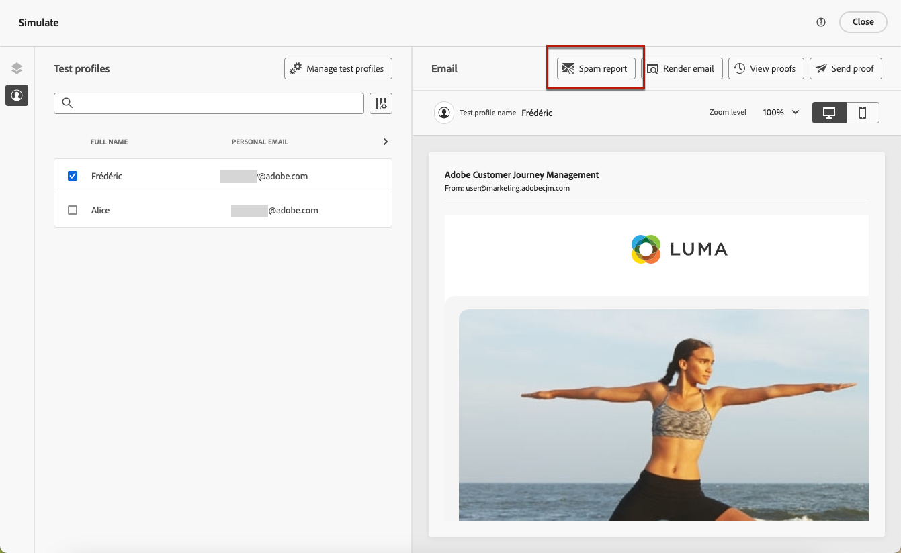

# Informe sobre correo electrónico spam {#spam-report}

>[!CONTEXTUALHELP]
>id="ajo_simulate_spam_report"
>title="Informe sobre correo electrónico spam"
>abstract="El informe Spam permite comprobar la puntuación de spam del contenido del correo electrónico. Esta puntuación indica si los ISP o proveedores de buzones de correo considerarán su mensaje como spam o no. Cuanto más baja sea la puntuación, mejor. Si la puntuación del contenido del correo electrónico es superior a 2, debe considerar la posibilidad de corregir los problemas que causan que las pruebas fallen."

Puede comprobar la puntuación de correo no deseado del contenido del correo electrónico en un informe de correo no deseado específico. Con [SpamAssassin](https://spamassassin.apache.org/){target="_blank"}, Adobe Journey Optimizer puede probar el contenido del correo electrónico y asignarle una puntuación para indicar si los ISP o los proveedores de buzones de correo lo considerarán como correo no deseado o no.

Al editar o previsualizar el contenido del correo electrónico, el botón **[!UICONTROL Informe de correo no deseado]** proporciona una puntuación y consejos para mejorar las puntuaciones de cada elemento individual de la lista.

Esta capacidad le permite determinar si las herramientas de filtrado de correo no deseado utilizadas durante la recepción pueden considerar un mensaje como no deseado y, en ese caso, realizar acciones. Muchos proveedores de bandejas de entrada de correo electrónico utilizan herramientas como parte de su proceso de filtrado de correo no deseado. El envío de correos electrónicos con una mala puntuación puede afectar gravemente a la capacidad de entrega.

Para acceder al **[!UICONTROL informe de correo no deseado]**, siga los pasos a continuación.

1. En la pantalla **[!UICONTROL Simular]**, haga clic en el botón **[!UICONTROL Informe de spam]**.

   

<!--
    You can also open the [Email Designer](../email/content-from-scratch.md), click the **[!UICONTROL More]** button and select **[!UICONTROL Check spam score]** from the menu.

    
-->

1. Se realiza automáticamente una comprobación de correo no deseado y la ventana **[!UICONTROL Informe de correo no deseado]** muestra los resultados. Muestra el rendimiento del contenido en términos de diseño del cuerpo, estructura, tamaño de la imagen, palabras de déclencheur de spam, si las hay, etc.

   

1. Compruebe las puntuaciones y descripciones de cada elemento.

   Cuanto más baja sea la puntuación, mejor. Si la puntuación es mayor de 5, se muestra una advertencia: indica que algunos mensajes pueden bloquearse o marcarse como correo no deseado cuando se reciben. La práctica recomendada es tener una puntuación inferior a 2.

   >[!NOTE]
   >
   >La puntuación de spam se deriva a través de [SpamAssassin](https://spamassassin.apache.org/){target="_blank"}, y las reglas no son propiedad de Adobe. Para obtener más información sobre estas reglas, consulte la documentación de SpamAssassin.
   >

1. En función de esa puntuación, si considera que algunos elementos se pueden mejorar, edite el contenido en el [Designer de correo electrónico](../email/content-from-scratch.md) y realice las actualizaciones necesarias.

1. Una vez que haya realizado los cambios, vuelva a la pantalla **[!UICONTROL Informe de spam]** para asegurarse de que haya mejorado su puntuación.

   

<!--
You can also check the message's alerts for warnings on potential risk of spam detection. Follow the steps below.

1. Click the **[!UICONTROL Alerts]** button on top right of the screen. [Learn more about email alerts](../email/create-email.md#check-email-alerts)

1. If **[!UICONTROL Spam checker alert]** is displayed, you should check your content for a potential risk of spam using the **[!UICONTROL Spam report]** feature as detailed above.

    
-->
