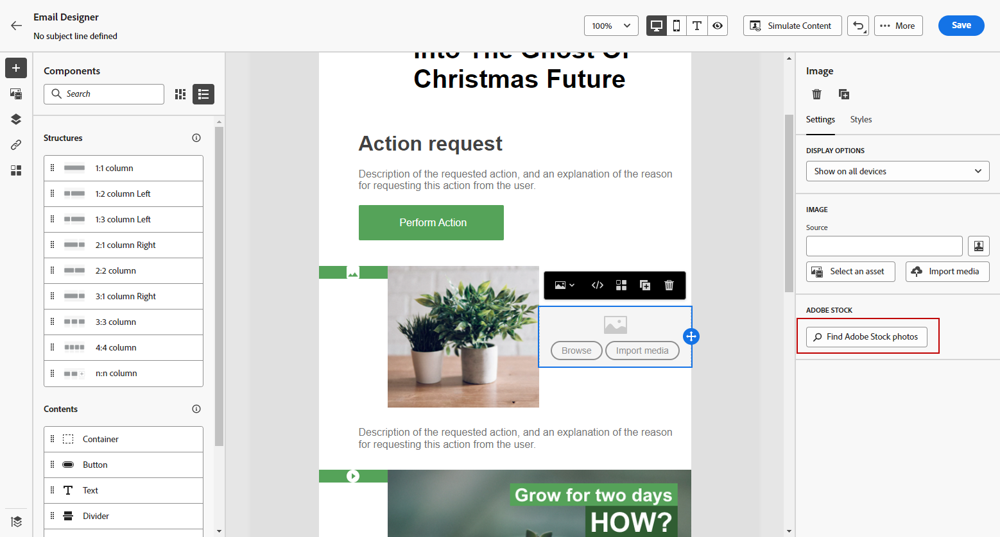

# Uso de [!DNL Adobe Stock] imágenes {#stock}

## Introducción a [!DNL Adobe Stock] {#get-started-stock}

El plugin de integración de [!DNL Adobe Stock] y [!DNL Adobe Journey Optimizer] Diseñador de correos electrónicos proporciona a los clientes una forma sencilla de navegar, obtener licencias y guardar imágenes para utilizarlas en la creación de mensajes.

[Adobe Stock](https://helpx.adobe.com/stock/get-started.html){target="_blank"} proporciona acceso a millones de fotografías, vídeos, ilustraciones y gráficos vectoriales de alta calidad, depurados y libres de derechos de autor. Puede optar por adquirir un paquete de crédito para obtener la licencia de los recursos o adquirir solo una licencia estándar o ampliada para el recurso necesario. Adobe Stock también proporciona una colección gratuita de recursos.

Con [!DNL Adobe Journey Optimizer], puede cargar imágenes en sus correos electrónicos directamente desde [!DNL Adobe Stock] y agregarlos a su carpeta **[!UICONTROL Recursos]** usando la opción **[!UICONTROL Buscar fotos de Adobe Stock]**. Además, la variable **[!UICONTROL Buscar fotos de Stock similares]** le ayuda a encontrar imágenes que coincidan con el contenido, el color y la composición del recurso utilizado en el envío.

## Permisos{#stock-permissions}

El **[!UICONTROL Buscar fotos de Adobe Stock]** y **[!UICONTROL Buscar imagen similar]** Las opciones de están disponibles para los usuarios con acceso a un perfil de producto de AEM Assets Essentials.

Para obtener más información, consulte [Documentación esencial de Assets](https://experienceleague.adobe.com/docs/experience-manager-assets-essentials/help/get-started-admins/deploy-administer.html#add-users-to-essentials){target="_blank"}.

## Inserción de una imagen desde [!DNL Adobe Stock] {#add-stock-image}

Para agregar imágenes desde [!DNL Adobe Stock] Para crear su contenido, siga los pasos a continuación:

1. Desde el **[!UICONTROL Componentes de contenido]** de la sección Diseñador de correo electrónico, arrastre y suelte una **Imagen**.

1. Haga clic en **[!UICONTROL Buscar fotos de Adobe Stock]** en la parte izquierda del Diseñador de correo electrónico.

   

1. Navegue por la biblioteca o introduzca un término en el campo de búsqueda.

   

1. Seleccione la imagen elegida y haga clic en **[!UICONTROL Guardar]**.

   Si la imagen seleccionada no tiene licencia, debe [obtener la licencia](#license-stock-image).

## Buscar fotos similares {#similar-stock-image}

Puede reemplazar cualquier imagen existente en el contenido del correo electrónico por una foto de [!DNL Adobe Stock]. Tenga en cuenta que esta opción está disponible para todas las imágenes: imágenes de Stock con licencia o sin licencia e imágenes de la carpeta Recursos.

Para examinar fotos similares, siga los pasos a continuación:

1. Seleccione la imagen que desea reemplazar.
1. Haga clic en **[!UICONTROL Buscar fotografías similares de Stock]** para mostrar los recursos en [!DNL Adobe Stock] que coinciden con el contenido, el color y la composición de la imagen.

   

1. Seleccione la imagen elegida y haga clic en **[!UICONTROL Guardar]**.

   

   Si la imagen seleccionada no tiene licencia, debe [obtener la licencia](#license-stock-image).

1. Personalice la imagen, si es necesario, con **[!UICONTROL Configuración]** y **[!UICONTROL Estilos]** pestañas. [Más información sobre la configuración de componentes](../email/content-components.md).

## Obtener la licencia de [!DNL Adobe Stock] {#license-stock-image}

Si la imagen ya tiene licencia, se representa mediante la variable  icono. Si no, debe obtener una licencia.

Para obtener una licencia y descargar la imagen, siga los pasos a continuación:

1. Selecciónelo y haga clic en el botón **[!UICONTROL Imagen de Adobe Stock de licencia]** icono.

   

   A continuación, se le redirigirá a [!DNL Adobe Stock] sitio web para comprar la licencia.

   

1. Desde el [!DNL Adobe Stock] sitio web, debe adquirir el recurso para poder descargar la imagen y eliminar la marca de agua.

   Esta compra depende de su plan o suscripción de Adobe Stock. Tenga en cuenta que si tiene varias cuentas de Adobe Stock, se le redirigirá al último ID de Stock utilizado. En este caso, asegúrese de haber iniciado sesión en la cuenta correcta antes de autorizar el recurso.

   Para obtener más información sobre los planes de Adobe Stock y los precios en [Documentación de Adobe Stock](https://stock.adobe.com/plans){target="_blank"}.

   >[!WARNING]
   > Si se envía un correo electrónico que incluye una imagen sin licencia, la imagen mantiene su formulario sin licencia con la marca de agua.

1. Una vez completada la compra, ahora puede volver a su correo electrónico en [!DNL Adobe Journey Optimizer] y seleccione **[!UICONTROL Importar imagen de stock]** para importar la imagen con licencia en los recursos.

   

1. Seleccione en qué carpeta almacenar el recurso. Para obtener más información sobre [!DNL Assets Essentials], consulte esta [página](assets-essentials.md#get-started-assets-essentials).

## Temas relacionados{#stock-related-topics}

* [Diseño de correo electrónico en Journey Optimizer](../email/get-started-email-design.md)
* [Configuración de componentes para el diseño de correo electrónico](../email/content-components.md)
* [Introducción a Adobe Stock](https://helpx.adobe.com/stock/get-started.html){target="_blank"}.

