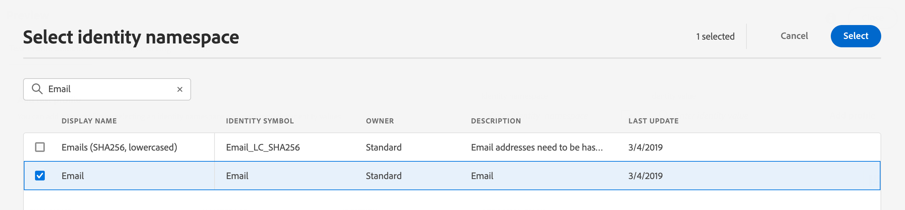

# Seleccionar perfiles de prueba {#select-test-profiles}

>[!BEGINSHADEBOX]

**En esta página:** Aprenda a seleccionar perfiles de prueba por área de nombres de identidad en Adobe Journey Optimizer para que pueda obtener una vista previa y probar el contenido con diferentes variantes de datos de perfil.

>[!ENDSHADEBOX]

>[!CONTEXTUALHELP]
>id="ajo_preview_test_profiles"
>title="Utilice perfiles de prueba para comprobar el contenido"
>abstract="Utilice perfiles de prueba para previsualizar y probar el contenido. Si ha añadido campos personalizados, puede comprobar cómo se muestran utilizando los datos del perfil de prueba."

Los perfiles de prueba son destinatarios adicionales que no coinciden con los criterios de objetivo definidos. [Más información sobre cómo crear perfiles de prueba](../audience/creating-test-profiles.md)

Antes de seleccionar perfiles de prueba, asegúrese de que el área de nombres de identidad que planea usar coincida con el área de nombres en la que se almacenan los perfiles de prueba en Adobe Experience Platform (por ejemplo, **Correo electrónico** o **Teléfono**). Una discrepancia impide que los perfiles de prueba se resuelvan correctamente en el campo de búsqueda.

Antes de usar perfiles de prueba para probar el contenido, primero debe seleccionarlos. Para ello, siga estos pasos:

1. En la pantalla Editar contenido del mensaje o en el Designer de correo electrónico, haga clic en **[!UICONTROL Simular contenido]** y, a continuación, seleccione **[!UICONTROL Simular contenido (perfiles de AEP)]** en el menú desplegable.

1. Haga clic en el botón **[!UICONTROL Administrar perfiles de prueba]** y, a continuación, seleccione el área de nombres que se utilizará para identificar los perfiles de prueba haciendo clic en el icono de selección **[!UICONTROL Área de nombres de identidad]**. [Obtenga más información acerca de áreas de nombres de identidad de Adobe Experience Platform](../audience/get-started-identity.md).

   En el ejemplo siguiente, utilizamos el área de nombres **Email**.

   

1. Utilice el campo de búsqueda para encontrar el área de nombres, selecciónela y haga clic en **[!UICONTROL Seleccionar]**

   

1. En el campo **[!UICONTROL Valor de identidad]**, ingrese el valor (aquí la dirección de correo electrónico) para identificar el perfil de prueba y haga clic en **[!UICONTROL Agregar perfil]**.

   <!---->

1. Si ha añadido personalización al mensaje, agregue otros perfiles para poder probar distintas variantes del mensaje según los datos del perfil. Una vez añadidos, los perfiles se enumeran en los campos seleccionados.

   

   En función de los elementos de personalización de mensajes, esta lista muestra los datos de cada perfil de prueba en las columnas relacionadas.

>[!NOTE]
>
>Además de los perfiles de prueba, [!DNL Journey optimizer] también le permite probar distintas variantes del contenido mediante la vista previa y el envío de pruebas utilizando datos de entrada de muestra cargados desde un archivo CSV/JSON, o agregados manualmente. [Aprenda a simular variaciones de contenido](../test-approve/simulate-sample-input.md)
