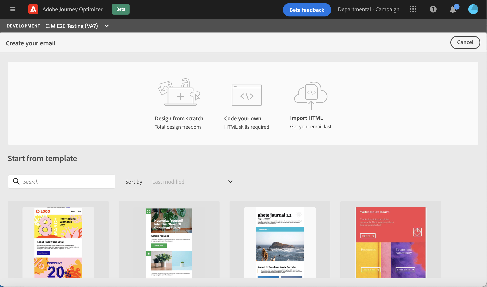
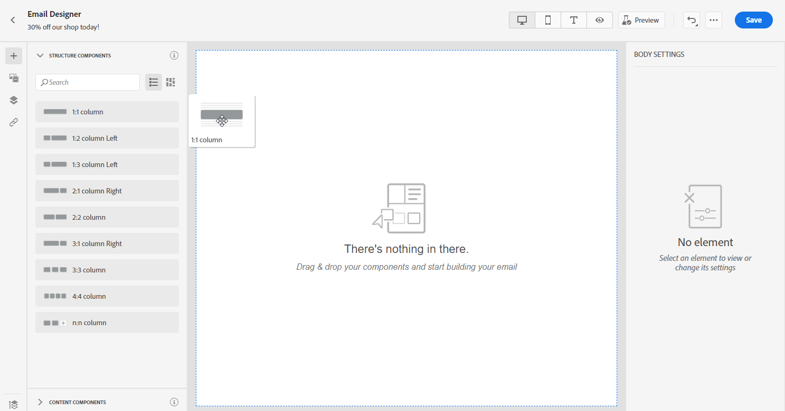
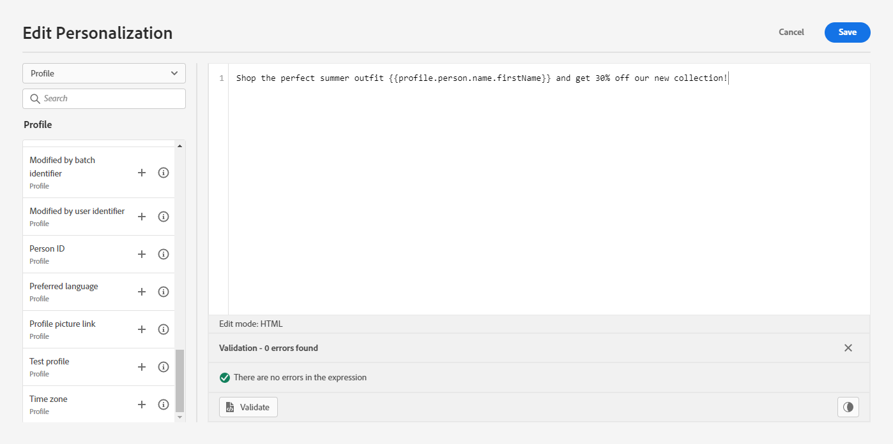
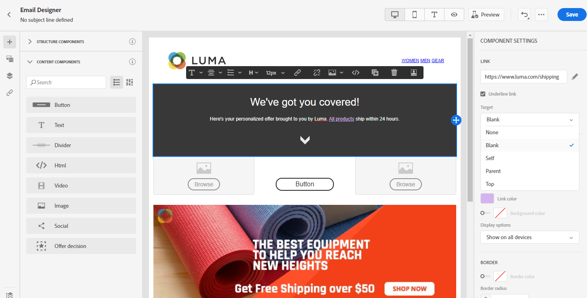

# Diseño del contenido del correo electrónico en la interfaz de usuario {#create-email-content}

Una vez que haya [crear el mensaje](create-message.md), puede empezar a crear su contenido de correo electrónico.

1. En el mensaje recién creado, seleccione **[!UICONTROL Email designer]** en el **[!UICONTROL Body]** para obtener más información.

   

1. En la página de inicio del Diseñador de correo electrónico, elija cómo desea diseñar el correo electrónico desde las siguientes opciones:

   * Select **[!UICONTROL Design from scratch]** para utilizar las capacidades del diseñador de correo electrónico para crear su contenido de correo electrónico. [Más información](#design-scratch)

   * Select **[!UICONTROL Start from template]** para crear su correo electrónico a partir de una lista integrada de plantillas. Tenga en cuenta que no puede crear otras plantillas.

   * Select **[!UICONTROL Code your own]** para introducir o pegar código sin procesar del HTML. [Más información](existing-content.md#import-raw-html-code).

   * Select **[!UICONTROL Import HTML]** para importar un archivo HTML o una carpeta .zip. [Más información](existing-content.md#import-html-content-from-file).

   

## Diseño desde cero {#design-scratch}

>[!CONTEXTUALHELP]
>id="ac_structure_components"
>title="Acerca de los componentes de estructura"
>abstract="Los componentes de estructura definen el diseño del correo electrónico."

>[!CONTEXTUALHELP]
>id="ac_edition_columns"
>title="Definición de columnas de correo electrónico"
>abstract="El Diseñador de correo electrónico permite definir fácilmente el diseño del correo electrónico definiendo la estructura de columnas."

El Diseñador de correo electrónico le permite definir fácilmente la estructura del correo electrónico. Al agregar y mover elementos estructurales con simples acciones de arrastrar y soltar, puede diseñar la forma de su correo electrónico en cuestión de segundos.

Para empezar a crear el contenido del correo electrónico con el diseñador de correo electrónico, siga los pasos a continuación:

1. Después de seleccionar la variable **[!UICONTROL Design from scratch]** para diseñar el contenido del correo electrónico, arrastre y suelte **[!UICONTROL Structure components]** para definir el diseño del correo electrónico.

   >[!NOTE]
   >
   >Tenga en cuenta que la pila de columnas no es compatible con todos los programas de correo electrónico. Cuando no se admita, las columnas no se apilarán.
   >
   >Una vez colocados en el correo electrónico, no puede mover ni eliminar los componentes a menos que ya haya un componente de contenido o un fragmento colocado en él.

   

1. Agregar tantos **[!UICONTROL Structure components]** según sea necesario.

   Seleccione el **[!UICONTROL n:n column]** para definir el número de columnas que elija (entre 3 y 10). También puede definir el ancho de cada columna moviendo las flechas en la parte inferior de cada columna.

   >[!NOTE]
   >
   >Cada tamaño de columna no puede ser inferior al 10 % de la anchura total del componente de estructura. No se puede quitar una columna que no esté vacía.

1. En el **[!UICONTROL Content components]** , puede agregar **[!UICONTROL Content components]** según sus necesidades en el componente de estructura. [Descubra más información sobre los componentes de contenido](content-components.md).

   

1. Cada componente se puede personalizar aún más con el **[!UICONTROL Component settings]** para obtener más información. Por ejemplo, puede cambiar el estilo del texto, el relleno o el margen del componente. [Obtenga más información sobre la alineación y el relleno](#adjusting-vertical-alignment-and-padding).

   

1. En el **[!UICONTROL Assets picker]**, puede añadir directamente los recursos almacenados en la variable **[!UICONTROL Assets library]** a su correo electrónico. [Obtenga más información sobre la administración de recursos](assets-essentials.md).

   Haga doble clic en la carpeta que contiene los recursos y arrastre y suelte el recurso que desea agregar al correo electrónico.

   

1. Agregue campos de personalización para personalizar el contenido de los datos de perfil. [Descubra más información sobre la personalización del contenido](personalization/personalize.md).

   

1. En el **[!UICONTROL Links]** en el panel izquierdo, compruebe la lista de todas las direcciones URL del contenido que se rastrearán. Puede modificar sus **[!UICONTROL Tracking Type]**, **[!UICONTROL Label]** y **[!UICONTROL Tags]** si es necesario.

   

   >[!NOTE]
   >
   >Obtenga más información sobre los vínculos y el seguimiento de mensajes en [esta página](message-tracking.md).

1. Si es necesario, puede cambiar al editor de código para personalizar aún más el correo electrónico haciendo clic en **[!UICONTROL Switch to code editor]** en el menú avanzado. Para obtener más información sobre el editor de código, consulte esta [página](existing-content.md#import-raw-html-code).

   >[!NOTE]
   >
   >No podrá utilizar el diseñador visual para este correo electrónico después de cambiar al editor de código.

   

1. Haga clic en **[!UICONTROL Show preview]** para comprobar la renderización del correo electrónico. Puede elegir la vista de escritorio o la vista móvil.

   Para obtener más información sobre la vista previa del correo electrónico, consulte [Previsualizar y probar los mensajes](preview.md).

   

1. Cuando el correo electrónico esté listo, haga clic en **[!UICONTROL Save & Close]**.

El contenido del correo electrónico ahora se puede utilizar en un mensaje. [Obtenga información sobre cómo enviar un mensaje](publish-manage-message.md).

## Creación de la versión de texto de un correo electrónico {#generate-text-version}

Se recomienda crear una versión de texto del cuerpo del correo electrónico, que se utiliza cuando no se puede mostrar el contenido del HTML.

De forma predeterminada, el Diseñador de correo electrónico crea un **[!UICONTROL Plain text]** versión del correo electrónico, incluidos los campos de personalización. Esta versión se genera y sincroniza automáticamente con la versión HTML del contenido.

Si prefiere usar un contenido diferente para la versión de texto sin formato, siga los pasos a continuación:

1. En el correo electrónico, seleccione **[!UICONTROL Plain text]** pestaña .

   

1. Utilice la variable **[!UICONTROL Sync with HTML]** para desactivar la sincronización.

   

1. Haga clic en la marca de verificación para confirmar su elección.

   

1. A continuación, puede editar la versión de texto sin formato como desee.

>[!CAUTION]
>
>* Cambios realizados en **[!UICONTROL Plain text]** la vista no se refleja en la vista del HTML.
>
>* Si vuelve a habilitar la variable **[!UICONTROL Sync with HTML]** después de actualizar el contenido de texto sin formato, se perderán los cambios y se reemplazarán con el contenido de texto generado a partir de la versión del HTML.

## Uso de un encabezado previo {#preheader}

>[!CONTEXTUALHELP]
>id="ac_edition_preheader"
>title="Uso de un encabezado previo"
>abstract="El encabezado previo le permite configurar un breve texto de resumen que le ayudará a rastrear y personalizar mejor sus correos electrónicos."

>[!NOTE]
>
>Tenga en cuenta que los encabezados previos no son compatibles con todos los clientes de correo electrónico. Cuando no se admite, el encabezado previo no se muestra.

Un encabezado previo es un breve texto de resumen que sigue la línea del asunto cuando se visualiza un correo electrónico desde su cliente de correo electrónico. El encabezado previo puede ayudarle a rastrear y personalizar mejor sus correos electrónicos.

1. En el Diseñador de correo electrónico, agregue una **[!UICONTROL Structure components]** para empezar a diseñar el correo electrónico.

   

1. En el **[!UICONTROL Body settings]** panel derecho, haga clic en **Editar** junto a la variable **[!UICONTROL Preheader]** para añadir contenido.

   

1. Añada el encabezado previo. Puede personalizarlo aún más haciendo clic en el **[!UICONTROL Add personalization]** icono.

   

1. En el **[!UICONTROL Edit Personalization]** ventana, puede añadir **[!UICONTROL Content block]**, **[!UICONTROL Dynamic content]** o **[!UICONTROL Personalization fields]**.

1. Haga clic en **[!UICONTROL Validate]** para comprobar la sintaxis de personalización.

   

1. Haga clic en **[!UICONTROL Save]**.

El encabezado previo ya está configurado para el correo electrónico.

## Configuración de fondo {#about-backgrounds}

>[!CONTEXTUALHELP]
>id="ac_edition_backgroundimage"
>title="Configuración de fondo"
>abstract="El diseñador de correo electrónico le permite personalizar el color de fondo o la imagen de fondo del contenido. Tenga en cuenta que la imagen de fondo no es compatible con todos los clientes de correo electrónico."
>additional-url="https://docs.google.com/spreadsheets/d/1TLo62YKm3tThUWDOIliCQFWs3dpNjpDfw6DdTr1oGOw/edit#gid=0" text="Información adicional"

En cuanto a la configuración de fondos con el Diseñador de correo electrónico, Adobe recomienda lo siguiente:

1. Aplique un color de fondo al cuerpo del correo electrónico si lo requiere el diseño.
1. En la mayoría de los casos, defina los colores de fondo en el nivel de columna.
1. Intente no utilizar colores de fondo en componentes de imagen o texto, ya que son difíciles de administrar.

A continuación se muestran los ajustes de fondo disponibles que puede utilizar.

* Configure un **[!UICONTROL Background color]** para todo el correo electrónico. Asegúrese de seleccionar la configuración de cuerpo en el árbol de navegación accesible desde la paleta izquierda.

* Establezca el mismo color de fondo para todos los componentes de estructura seleccionando **[!UICONTROL Viewport background color]**. Esta opción le permite seleccionar una configuración diferente del color de fondo.

* Defina un color de fondo diferente para cada componente de estructura. Seleccione una estructura del árbol de navegación accesible desde la paleta izquierda para aplicar un color de fondo específico solo a esa estructura.

   Asegúrese de no establecer un color de fondo de ventanilla móvil, ya que podría ocultar los colores de fondo de la estructura.

* Configure un **[!UICONTROL Background image]** para el contenido de un componente de estructura.

   >[!NOTE]
   >
   >Algunos programas de correo electrónico no admiten imágenes de fondo. Cuando no se admita, se utilizará el color de fondo de fila. Asegúrese de seleccionar un color de fondo alternativo adecuado en caso de que la imagen no se pueda mostrar.

* Establezca un color de fondo en el nivel de columna.

   >[!NOTE]
   >
   >Este es el caso de uso más común. Adobe recomienda configurar los colores de fondo en el nivel de columna, ya que esto permite una mayor flexibilidad al editar todo el contenido del correo electrónico.

   También puede establecer una imagen de fondo en el nivel de columna, pero esto no se suele utilizar.

## Ajustar alineación vertical y relleno {#adjusting-vertical-alignment-and-padding}

En este ejemplo, ajustaremos el relleno y la alineación vertical dentro de un componente de estructura compuesto por tres columnas.

1. Seleccione el componente de estructura directamente en el correo electrónico o utilizando el **[!UICONTROL Navigation tree]** disponible en el menú de la izquierda.

   

1. En la barra de herramientas, haga clic en **[!UICONTROL Select a column]** y elija el que desea editar. También puede seleccionarlo en el árbol de estructura.

   Los parámetros editables de esa columna se muestran en la sección **[!UICONTROL Column settings]** para abrir el Navegador.

   

1. En **[!UICONTROL Vertical alignment]**, seleccione **[!UICONTROL Bottom]**.

   El componente de contenido se desplaza a la parte inferior de la columna.

   

1. En **[!UICONTROL Padding]**, defina el relleno superior dentro de la columna . Haga clic en el icono de candado para romper la sincronización con el relleno inferior.

   Defina el relleno izquierdo y derecho para esa columna.

   

1. Proceda de forma similar para ajustar la alineación y el relleno de las demás columnas.

1. Guarde los cambios.

## Definición de un estilo para los vínculos {#about-styling-links}

Puede subrayar un vínculo y seleccionar su color y destino en el Diseñador de correo electrónico.

1. En un texto **[!UICONTROL Content component]** donde se inserta un vínculo, seleccione el vínculo .

1. En el **[!UICONTROL Component settings]** menú, marque **[!UICONTROL Underline link]** para subrayar el texto de la etiqueta del vínculo.

   

1. Elija cómo se redirigirá a su audiencia con la variable **[!UICONTROL Target]** lista desplegable:

   * **[!UICONTROL None]**: abre el vínculo en el mismo marco en el que se hizo clic (predeterminado).
   * **[!UICONTROL Blank]**: abre el vínculo en una nueva ventana o pestaña.
   * **[!UICONTROL Self]**: abre el vínculo en el mismo marco en el que se hizo clic.
   * **[!UICONTROL Parent]**: abre el vínculo en el marco principal.
   * **[!UICONTROL Top]**: abre el vínculo en todo el cuerpo de la ventana.

   

1. Para cambiar el color del vínculo, haga clic en **[!UICONTROL Link color]**.

   

1. Elija el color que necesite.

1. Guarde los cambios.

## Añadir atributos de estilo en línea {#adding-inline-styling-attributes}

En la interfaz del Diseñador de correo electrónico, al seleccionar un elemento y mostrar su configuración en el panel lateral, puede personalizar los atributos en línea y su valor para ese elemento específico.

1. Seleccione un elemento en el contenido.
1. En el panel lateral, busque el **[!UICONTROL Styles Inline]** configuración.

1. Modifique los valores de los atributos existentes o agregue otros nuevos utilizando la variable **+** botón. Puede añadir cualquier atributo y valor que sea compatible con CSS.

A continuación, el estilo se aplica al elemento seleccionado. Si los elementos secundarios no tienen atributos de estilo específicos definidos, se hereda el estilo del elemento principal.
