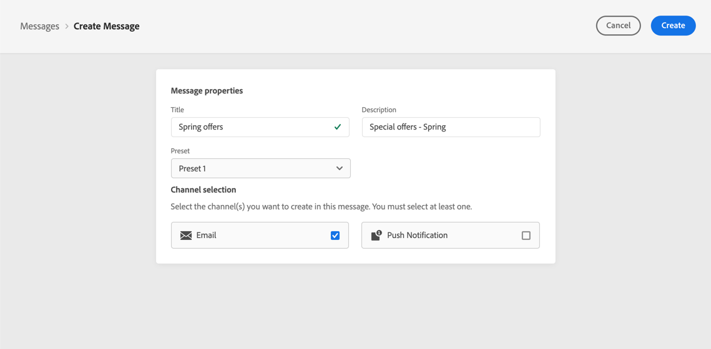
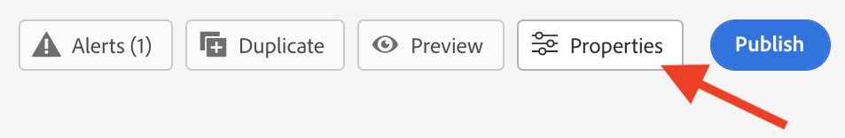
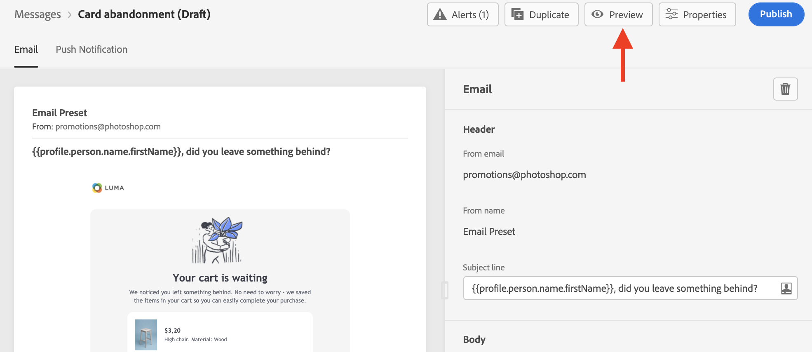

# Creación de un mensaje  {#create-message}

Los mensajes están disponibles en el **[!UICONTROL Messages]** en el panel de navegación izquierdo. Todos los mensajes se enumeran, ordenados por fecha de publicación (para mensajes publicados) o fecha de creación (para borradores de mensajes).

>[!NOTE]
>
>Los usuarios pueden acceder, crear, editar o publicar mensajes según su perfil de producto. Obtenga más información sobre los permisos de usuario [en esta sección](../using/administration/permissions.md).

Utilice la variable **[!UICONTROL Show recents]** alterne para añadir vínculos directos a los mensajes a los que ha accedido en los últimos 5 días.

Utilice el icono de filtro para mostrar solo los mensajes redactados, publicados o que se están publicando. También puede buscar en una etiqueta de mensaje, como se muestra a continuación:

## Crear un nuevo mensaje

Para crear un nuevo mensaje, siga los pasos a continuación:

1. Acceda a la lista de mensajes y haga clic en **[!UICONTROL Create Message]**.

1. Defina las propiedades del mensaje.

   

   * Escriba un **[!UICONTROL Title]** (obligatorio) y **[!UICONTROL Description]**.

   * Seleccione el **[!UICONTROL Preset]** para usar en el mensaje.

      Los ajustes preestablecidos incluyen todos los parámetros necesarios para enviar un correo electrónico o una notificación push según la marca. [Obtenga más información sobre los ajustes preestablecidos](../using/configuration/message-presets.md).

   * Seleccione los canales que desee utilizar para ese mensaje: Notificación por correo electrónico o push . Debe seleccionar al menos un canal para poder crear el mensaje.
   Tenga en cuenta que puede acceder al título, la descripción y el ajuste preestablecido del mensaje y modificarlos en cualquier momento mediante la función **[!UICONTROL Properties]** en la interfaz de mensajes.

   

1. Haga clic en **[!UICONTROL Create]** para confirmar la creación del mensaje. El mensaje se añade en la lista de mensajes, en la **[!UICONTROL Draft]** estado.

   Hay una pestaña disponible para cada canal seleccionado. Utilice estas pestañas para configurar el contenido de cada canal. Puede quitar una pestaña seleccionándola y haciendo clic en el botón **[!UICONTROL Delete channel]** a la derecha.

   

   Ahora puede crear el contenido del mensaje y adaptar la configuración. Encontrará información detallada sobre la configuración del correo electrónico y las notificaciones push en las secciones siguientes:

   * [Crear un correo electrónico](create-email.md)
   * [Creación de notificaciones push](create-push.md)

   >[!NOTE]
   >   
   >Puede personalizar los mensajes mediante los datos de los perfiles mediante el Editor de expresiones. Para obtener más información sobre personalización, consulte [esta sección](personalization/personalize.md).

1. Controle la renderización de los mensajes y compruebe la configuración de personalización con perfiles de prueba mediante la sección de previsualización de la izquierda. Para obtener más información, consulte [esta sección](preview.md).

   

1. Compruebe las alertas en la sección superior del editor.  Algunas son simples advertencias, pero otras pueden impedir que publique el mensaje. Obtenga más información en [esta sección](alerts.md).

1. Ahora puede publicar el mensaje haciendo clic en el botón **[!UICONTROL Publish]** o manténgalo como borrador y publíquelo más adelante. Para obtener más información sobre cómo publicar mensajes, consulte [esta sección](publish-manage-message.md).

## Duplicar un mensaje

Para crear un mensaje a partir de uno existente, use el **[!UICONTROL Duplicate]** de la interfaz de mensajes. Todos los ajustes y configuraciones se copiarán en el nuevo mensaje

Puede cambiar el nombre del mensaje antes de confirmar la duplicación.

Una vez creado el nuevo mensaje, aparece un mensaje de confirmación en la parte inferior de la ventana.

También puede duplicar un mensaje de la lista de mensajes mediante el icono dedicado.

Se aplica el mismo proceso de confirmación.
