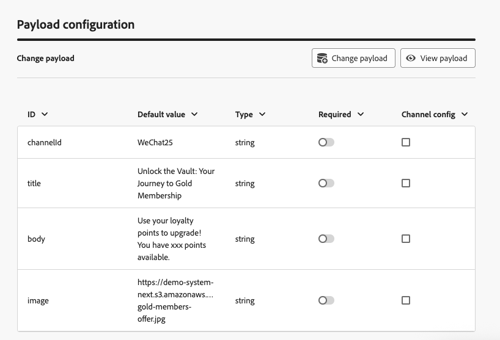
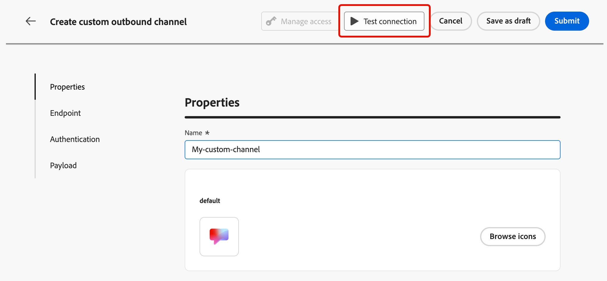

# Configuración de un canal personalizado {#create-custom-channel}

>[!CONTEXTUALHELP]
>id="ajo_custom_channel_settings"
>title="Acerca de los canales personalizados"
>abstract="Un canal personalizado permite a Adobe Journey Optimizer enviar mensajes personalizados a un sistema externo a través de su propio extremo de API. Defina las propiedades generales, el punto de conexión, la autenticación y la carga útil, y luego pruebe y active su nuevo canal personalizado. Una vez finalizado, puede utilizarlo al crear una configuración de canal para que los especialistas en marketing puedan utilizarlo en recorridos y campañas."
>additional-url="" text="Introducción a los canales personalizados"

<!--Contextual help final location TBC (here or in Settings subsection-->

Para poder utilizar un canal personalizado en campañas y recorridos, un administrador debe crear primero el canal. Esto implica definir el punto de conexión, la autenticación, la política de regulación y la estructura de carga útil de mensajes.

La sección **Generador de canales** es la interfaz central para definir nuevos canales personalizados. <!--It is accessible to users with the **[!UICONTROL Administrator]** role. -->Le permite crear y configurar canales personalizados, pero también administrar credenciales de API y delegar subdominios.

>[!IMPORTANT]
>
>Para acceder al Generador de canales, crear y administrar canales personalizados, debes tener concedidos los permisos de **Ver canales personalizados** y **Administrar canales personalizados**. <!--[Learn more](../administration/high-low-permissions.md)--> Obtenga información sobre cómo administrar permisos en [esta sección](../administration/permissions.md).

## Acceso y administración de canales personalizados {#access-channel-builder}

Para acceder al **Generador de canales** y administrar tus canales personalizados, sigue los pasos a continuación.

1. Vaya a **[!UICONTROL Administración]** > **[!UICONTROL Canales]** en el carril de navegación izquierdo.

1. Seleccione **[!UICONTROL Canales personalizados]** en la sección **[!UICONTROL Generador de canales]**.

   {width="70%"}

1. El inventario enumera todos los canales personalizados de la zona protegida, incluido su estado actual y el tipo de autenticación utilizado para conectarse al extremo externo.

1. Puede filtrar los canales personalizados por estado (**Borrador**, **Activo** o **Archivado**), quién los creó y buscar por nombre.

1. Para editar un canal, haga clic en su nombre en el inventario, realice los cambios y guarde los cambios. Para los canales activos, solamente puede editar ciertos campos: [más información](#test-activate).

   >[!CAUTION]
   >
   >La modificación de la configuración de restricción o reintento en un canal activo surte efecto inmediatamente para todas las ejecuciones en curso y futuras.

1. Para archivar un canal, ábralo desde el inventario y haga clic en **[!UICONTROL Archivar]**.

   El archivado de un canal activo lo elimina de todos los desplegables de selección: selector de acciones de campaña, paleta de acciones de recorrido, lista de canales de campañas orquestadas, configuraciones de canal y plantillas de contenido. Los recorridos y campañas existentes que ya usan el canal siguen funcionando normalmente.

## Crear un canal personalizado {#create-channel}

Para crear un nuevo canal personalizado, siga los pasos a continuación.

1. Haga clic en el botón **[!UICONTROL Crear canal personalizado]** para abrir el formulario de creación de canales. Comience por definir la configuración general del canal personalizado.

   {width="70%"}

1. En la sección **[!UICONTROL Propiedades]**, escribe un **[!UICONTROL Nombre]** para tu canal personalizado. Este nombre aparecerá en el lienzo de recorridos, en el selector de acciones de campaña y en la lista de canales de campañas orquestadas.

   >[!NOTE]
   >
   >El nombre debe ser único, comenzar por una letra (A-Z), incluir solo caracteres alfanuméricos o caracteres especiales ( _, ., -) y debe ser mayor que 1 carácter.

1. Puede seleccionar un icono de la biblioteca de iconos predeterminada o seleccionar un archivo SVG del equipo.

   >[!NOTE]
   >
   >El archivo no debe superar los 150 KB.

   Este icono se muestra junto al nombre del canal en el lienzo de recorrido. Si no se carga ningún icono, se utiliza el icono predeterminado.

1. Escriba una **[!UICONTROL descripción]** opcional.

<!--
1. Optionally, assign **[!UICONTROL Access labels]** to restrict access to this channel based on data usage policies. Learn more
-->

## Establecer la configuración del extremo {#endpoint-configuration}

Debe configurar el punto de conexión, que es la URL HTTP del sistema de mensajería externo. [!DNL Journey Optimizer] envía una petición POST a este extremo con la carga útil personalizada cuando un perfil cumple los requisitos de una campaña o recorrido.

{width="70%"}

1. En la sección **[!UICONTROL Configuración de extremo]**, escriba la **[!UICONTROL URL]** de host de su sistema de mensajería externo.

   <!--The HTTP method to is currently set to **POST**.-->

   >[!IMPORTANT]
   >El sistema de mensajería externa debe exponer un extremo HTTPS al que [!DNL Journey Optimizer] puede llamar a través de HTTP POST. El punto final debe:
   >
   >* Acepte el formato de carga útil que define su canal (JSON).
   >* Admitir uno de los métodos de autenticación disponibles en el Generador de canales. [Más información](#authentication-settings)
   >* Devuelva una respuesta HTTP 2xx para confirmar que la solicitud se ha recibido correctamente.

1. Agregue **[!UICONTROL Encabezados]** según sea necesario. Los encabezados son pares de clave-valor que se transmiten en el nivel de solicitud HTTP. Se envían junto con cada solicitud al extremo y se utilizan generalmente para tokens de autenticación, especificación de tipo de contenido o cualquier otro metadato requerido por el sistema externo.

   <!--At minimum, `Content-Type` and `Charset` are available as default headers.-->

   

   Para cada encabezado, puede definir si su valor es:

   * **[!UICONTROL Constante]**: valor estático establecido una vez e incluido en cada solicitud. Por ejemplo, puede definir el parámetro `Content-Type`con el valor `application/json` o el parámetro `Charset` con el valor `UTF-8`.
   * **[!UICONTROL Variable]**: si se escribe un valor predeterminado aquí, se usa a menos que se anule en la configuración del canal. Por ejemplo, puede definir una variable para el ID de usuario que se resuelve durante la ejecución. [Más información](custom-channel-configuration.md) <!--From Custom actions section: For these parameters, you can define where to get this information (example: events, data sources), pass values manually or use the advanced expression editor for advanced use cases. Advanced uses cases can be data manipulation and other function usage. Refer to this [page](expression/expressionadvanced.md).-->

1. Opcionalmente, agregue **[!UICONTROL parámetros de consulta]** utilizando el mismo patrón constante/variable. Los parámetros de consulta se anexan a la dirección URL del punto de conexión en el momento de la entrega. Los parámetros constantes siempre se añaden con el mismo valor; los parámetros variables se resuelven en el momento del envío, por ejemplo para pasar un identificador de usuario desde el perfil.

   {width="70%"}

1. En la sección **[!UICONTROL Configuración de directiva]**, defina cómo [!DNL Journey Optimizer] administra el rendimiento de las solicitudes y los errores. Esto es importante para garantizar que el sistema externo pueda gestionar el volumen de solicitudes y evitar saturarlo.

   

   * **[!UICONTROL Habilitar regulación]** - Deshabilitado de forma predeterminada. Establezca el número máximo de solicitudes por segundo (predeterminado: **5,000c**). Una vez alcanzado el límite, las solicitudes se ponen en cola y se envían lo antes posible.
   * **[!UICONTROL Habilitar reintento]** - Habilitado de forma predeterminada. Establezca el número máximo de reintentos (predeterminado: **3**, intervalo configurable: 0-10) para las solicitudes con errores. Esto ayuda a evitar saturar el extremo durante errores transitorios.
   * **[!UICONTROL Tiempo de espera]** - Predeterminado: **5.000 milisegundos**. Establezca el tiempo máximo de espera para una respuesta del extremo antes de considerar que la solicitud ha fallado.
     <!--* **[!UICONTROL Enable cache]** – Disabled by default. Set the caching duration (default TTL: **600 seconds**). After the TTL (Time To Live) expires, the next request is sent to the endpoint. Caching is useful for endpoints that return the same response for identical requests, reducing load and improving performance.-->

## Configuración de autenticación {#authentication-settings}

>[!CONTEXTUALHELP]
>id="ajo_custom_channel_authentication"
>title="Definición del tipo de autenticación"
>abstract="La autenticación garantiza que solo se envíen solicitudes autorizadas al sistema de mensajería externo. Puede elegir entre varios métodos de autenticación, incluidos API Key, Basic Auth y OAuth 2.0. Tras la activación, Adobe Journey Optimizer genera automáticamente un conjunto inicial de credenciales de API para el canal, que se pueden administrar en el inventario de credenciales de API. Sin embargo, aunque pueda cambiar las credenciales más adelante, debe proporcionar los detalles de autenticación aquí para probar la conexión con el extremo antes de activar el canal."
>additional-url="" text="Más información sobre las credenciales de API"

Seleccione el **[!UICONTROL tipo de autenticación]** que necesita usar para este canal. Las opciones disponibles dependen de los métodos de autenticación admitidos por el sistema de mensajería externo.

{width="70%"}

Proporcione los detalles de autenticación según lo requiera el punto de conexión.

* **[!UICONTROL Ninguno]** - La solicitud se envía sin credenciales.
* **[!UICONTROL Clave API]**: proporcione el nombre de clave, el valor y la ubicación (parámetro de consulta o encabezado).
* **[!UICONTROL Autenticación básica]** - Proporcione un nombre de usuario y una contraseña.
* **[!UICONTROL OAuth 2.0]**: configure la carga para la autenticación OAuth 2.0.
  <!--* **[!UICONTROL Custom]** – Define the authentication configuration using a JSON payload.-->

Cuando el tipo de autenticación es cualquier otro que **None**, [!DNL Journey Optimizer] genera automáticamente un conjunto inicial de credenciales de API para este canal cuando se activa. Puede cambiar estas credenciales y crear otras nuevas en el inventario de credenciales de API. [Más información](custom-channel-api-credentials.md) <!--TBC-->

Sin embargo, los detalles de autenticación son necesarios aquí para probar la conexión con el punto de conexión antes de activar el canal. Hay disponible un botón **[!UICONTROL Probar conexión]** para validar la configuración de autenticación. [Más información](#test-activate)

## Configuración de carga útil {#payload-configuration}

>[!CONTEXTUALHELP]
>id="ajo_custom_channel_payload_config"
>title="Habilitar campo para configuración de canal"
>abstract="Si está activado, los campos de esta columna aparecen en la configuración del canal, lo que permite a los administradores definir distintos valores por configuración (por ejemplo, un ID de remitente diferente por marca o región). Esto resulta útil para campos que pueden variar según el contexto de la campaña o el recorrido, como la información del remitente o las plantillas de mensajes."
>additional-url="" text="Configure parámetros dinámicos en la configuración de canal personalizada"

<!--Create a page on Custom channel config to explain how to use the payload in a channel configuration.-->

La carga útil se envía al extremo cuando un perfil cumple los requisitos de una campaña o recorrido.

En la configuración de carga útil, defina la estructura de la carga útil del mensaje y los campos que los especialistas en marketing pueden crear y personalizar.

1. Haga clic en **[!UICONTROL Definir carga útil]** y elija cómo definir la carga útil:

   * **[!UICONTROL Pegar carga útil JSON de muestra]**: pegue un objeto JSON representativo y [!DNL Journey Optimizer] infiere automáticamente un esquema de él.
   * **[!UICONTROL Importar esquema JSON]** (próximamente): cargue un archivo de esquema JSON completo.

     >[!AVAILABILITY]
     >
     >Esta capacidad aún no está disponible. Se añadirá en una versión futura.

1. Una vez generado el esquema, [!DNL Journey Optimizer] muestra todos los campos detectados en una vista de formulario.

   

1. Para cada campo, configure las siguientes opciones:

   | Configuración | Descripción |
   | --- | --- |
   | **[!UICONTROL Valor predeterminado]** | Opcional. Se utiliza si no se proporciona ningún valor personalizado en el momento de la creación. |
   | **[!UICONTROL Tipo]** | De solo lectura, derivado de la carga útil. Tipos admitidos: `string`, `integer`, `decimal`, `boolean`, `dateTime`, `dateTimeOnly`, `dateOnly`, `listObject`, `listString`, `listInteger`, `listDecimal`, `listBoolean`, `listDateTime`, `listDateTimeOnly`, `listDateOnly`. |
   | **[!UICONTROL Requerido]** | Si se habilita, el campo debe tener un valor cuando el canal se utilice en una campaña o recorrido. La falta de campos obligatorios déclencheur un error de validación que impide la activación. |
   | **[!UICONTROL Configuración de canal]** | Si está activado, el campo aparece en la configuración del canal, lo que permite a los administradores definir diferentes valores por configuración (por ejemplo, un ID de remitente diferente por marca o región). [Descubra cómo](custom-channel-configuration.md) |

   Los campos anidados se representan con notación de puntos (por ejemplo, `image.id`).<!--TBC-->

## Prueba y activación {#test-activate}

Mientras el canal se encuentra en estado **[!UICONTROL Borrador]**, use el botón **[!UICONTROL Probar conexión]** en la parte superior de la pantalla para enviar una solicitud de prueba al extremo y validar la conexión de extremo a extremo.

{width="70%"}

Compruebe los registros del sistema externo para confirmar que la solicitud se recibió con la autenticación y la carga útil esperadas.

Una vez realizada la prueba, puede guardar o activar el canal.

* Haga clic en **[!UICONTROL Guardar como borrador]** para guardar el progreso sin que el canal esté disponible.
* Haga clic en **[!UICONTROL Activar]** para que el canal esté disponible para su uso en configuraciones de canal, campañas y recorridos.

>[!IMPORTANT]
>
>Una vez activado un canal, solo permanecen editables los siguientes campos: nombre, descripción, icono, regulación y configuración de reintento. La dirección URL de extremo, los encabezados, los parámetros de consulta, la autenticación y la estructura de carga útil están bloqueados.<!--TBC-->

<!--TBC: An activated channel can be **archived** (hidden from all selection drop-downs while existing journeys and campaigns continue to function), but it cannot be **deleted**. Deletion is only possible while the channel is in **[!UICONTROL Draft]** status.TBC-->

## Próximos pasos {#next-steps}

Se creará el canal personalizado. Complete la configuración siguiendo los pasos restantes:

* [Configurar credenciales de API](custom-channel-api-credentials.md) (si el canal utiliza autenticación)
* [Delegar un subdominio](custom-channel-subdomains.md) (opcional: necesario para el seguimiento de vínculos)
* [Creación de una configuración de canal](custom-channel-configuration.md)
