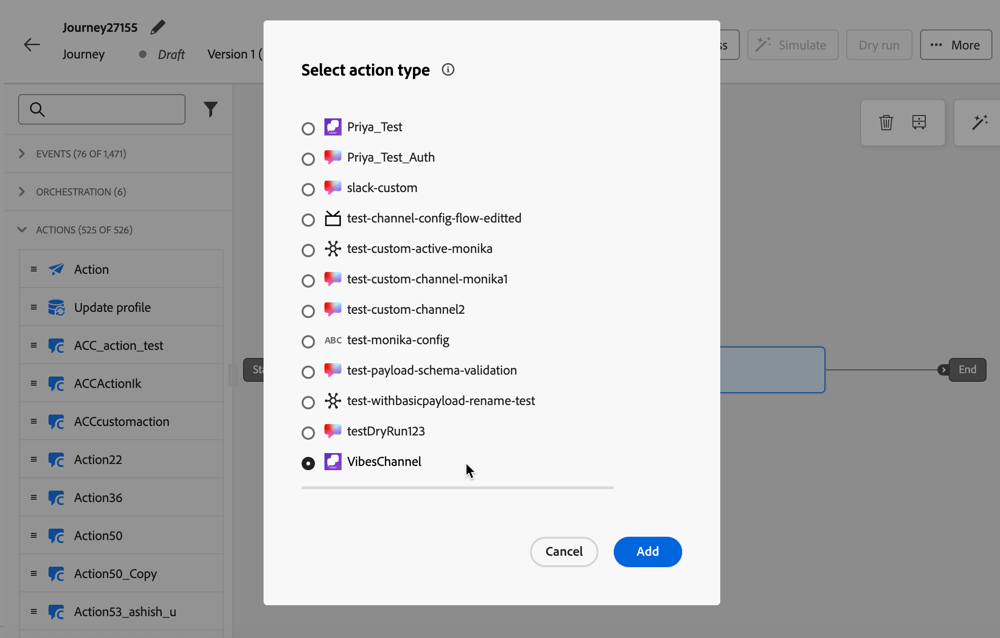

# Crear experiencias de canal personalizadas {#create-custom-channel}

>[!AVAILABILITY]
>
>Esta funcionalidad tiene disponibilidad limitada. Póngase en contacto con su representante de Adobe para obtener acceso.

En [!DNL Journey Optimizer], puede enviar mensajes mediante canales personalizados en campañas, recorridos y campañas organizadas. Siga los pasos a continuación para configurar su experiencia de canal personalizada.

>[!NOTE]
>
>Antes de crear una experiencia de canal personalizado, asegúrese de que el administrador haya configurado un canal personalizado. [Más información](configure-custom-channel.md)

## Añadir una acción personalizada mediante un recorrido o una campaña {#create-custom-channel-experience}

>[!CONTEXTUALHELP]
>id="ajo_journey_action_custom_channel"
>title="Acción de canal personalizado"
>abstract="Una acción de canal personalizado envía un mensaje a los perfiles cuando llegan a este paso del recorrido. La etiqueta identifica la actividad en el lienzo de recorrido y la acción hace referencia a una configuración de canal personalizada que define el punto de conexión, la carga útil y las credenciales utilizadas para enviar el mensaje. La sección **Optimization** puede incluir experimentos de contenido o reglas de segmentación, y la sección **Timeout o error** puede definir una ruta alternativa si la acción falla."
>additional-url="https://experienceleague.adobe.com/es/docs/journey-optimizer/using/orchestrate-journeys/about-journey-building/journey-action#add-action" text="Introducción a los canales personalizados"


>[!BEGINTABS]

>[!TAB Agregar un canal personalizado a un recorrido]

Los canales personalizados aparecen en la sección **[!UICONTROL Acciones]** de la paleta de lienzo de recorrido, enumerados por su nombre para mostrar y el icono personalizado definido en el Generador de canales.

Para agregar una acción de canal personalizado a un recorrido:

1. [Crear un recorrido](../building-journeys/journey-gs.md).

1. Inicie el recorrido con una actividad [Event](../building-journeys/general-events.md) o [Read Audience](../building-journeys/read-audience.md).

1. Arrastre y suelte una actividad **[!UICONTROL Action]** desde la sección **[!UICONTROL Actions]** de la paleta. Más información sobre la [actividad de acción](../building-journeys/journey-action.md).

1. En la lista desplegable **[!UICONTROL Acción]**, seleccione el canal personalizado que desee usar. Los canales personalizados se enumeran por el nombre y el icono asignados en el Generador de canales.

   {width="80%"}

1. Agregue una etiqueta a su acción, haga clic en **[!DNL Configure action]** en el panel derecho y seleccione la **[!UICONTROL configuración del canal]** que quiera usar. [Aprenda a crear una configuración de canal personalizada](custom-channel-configuration.md#create-channel-config)

1. En la sección **[!UICONTROL Mensaje]**, haga clic en **[!UICONTROL Editar contenido]** para abrir el editor de carga útil y crear su mensaje. [Aprenda a crear contenido](#author-content)

1. Complete el flujo de recorrido añadiendo pasos adicionales según sea necesario y publicando el recorrido. [Más información](../building-journeys/journey-gs.md)

>[!TAB Crear una campaña de canal personalizado]

Para utilizar un canal personalizado en una campaña:

1. [Crear una campaña](../campaigns/create-campaign.md).

1. Seleccione el tipo de campaña:

   * **[!UICONTROL Programado - Marketing]** - Ejecutado inmediatamente o en una fecha especificada. Diseñado para mensajes de marketing, configurado desde la interfaz de usuario de
   * **[!UICONTROL Activado por API - Marketing/Transaccional]** - Ejecutado a través de una llamada de API. Diseñado para mensajes activados por eventos (por ejemplo, confirmaciones de pedidos o restablecimientos de contraseñas). [Más información](../campaigns/api-triggered-campaigns.md)

1. Complete la configuración de la campaña: propiedades de la campaña, [audiencia](../audience/about-audiences.md) y [programación](../campaigns/create-campaign.md#schedule).

1. En la sección **[!UICONTROL Acciones]**, seleccione el canal personalizado del selector de canal. Todos los canales personalizados configurados en la zona protegida aparecen junto a los canales nativos.

   {width="80%"}

1. Seleccione o cree la **[!UICONTROL configuración de canal]** que quiera usar. [Aprenda a crear una configuración de canal](custom-channel-configuration.md#create-channel-config)

1. De forma opcional, habilita **[!UICONTROL Seguimiento de acciones]** para que realice un seguimiento automático de los vínculos incluidos en la carga útil del mensaje (requiere un subdominio configurado para canales personalizados). [Aprenda a delegar un subdominio para canales personalizados](custom-channel-subdomains.md#subdomain-delegation)

1. En la sección **[!UICONTROL Optimización]**, puede:

   * **[!UICONTROL Cree reglas de segmentación]** para enviar mensajes diferentes a segmentos diferentes de su audiencia. [Más información](../campaigns/create-campaign.md#targeting)
   * Haga clic en **[!UICONTROL Crear experimento]** para ejecutar pruebas A/B en los mensajes de canal personalizados. [Más información](../campaigns/create-campaign.md#content-experiment)

1. Haga clic en **[!UICONTROL Editar contenido]** para abrir el editor de carga útil y crear el mensaje. [Aprenda a crear contenido](#author-content)

1. Revise y active la campaña. [Más información](../campaigns/create-campaign.md)

<!--
>[!TAB Add a custom channel to an orchestrated campaign]

Custom channels appear in the channel selection list in the orchestrated Campaigns canvas, below the native channels, with their custom icon and display name.

To add a custom channel in an orchestrated campaign:

1. Open or create an orchestrated campaign.

1. In the canvas, add a channel action node and select your custom channel from the list.

1. Select the **[!UICONTROL Channel configuration]** to use. Ensure the configuration includes the **[!UICONTROL Execution details]** section required for orchestrated campaigns.

1. Click **[!UICONTROL Edit content]** to open the payload editor and author your message. [Learn how to author content](#author-content)
-->

>[!ENDTABS]

## Creación del contenido de su canal personalizado {#author-content}

El editor de contenido refleja la estructura de carga útil definida al configurar el canal personalizado. Haga clic en **[!UICONTROL Editar código]** para abrir el editor de carga útil e introducir el contenido del mensaje.

{width="80%"}

Se muestran los campos que puede crear y personalizar. Puede aprovechar el editor de personalización [!DNL Journey Optimizer] con todas sus capacidades de personalización y creación. [Más información](../personalization/personalization-build-expressions.md)

>[!NOTE]
>
>Solo se admiten cargas JSON. Si la carga útil del canal personalizado no es JSON, puede utilizar un contenedor JSON para encapsular el contenido. Por ejemplo, si la carga útil es XML, puede envolverla en un objeto JSON como este:
>
>```json
>{
>   "payload": "<xml>...</xml>"
>}
>```

### Personalizar la carga útil {#personalize}

Las funcionalidades de personalización completas de [!DNL Journey Optimizer] están disponibles en el editor de carga útil:

* **Atributos de perfil**: inserte cualquier atributo de perfil XDM, como `{{profile.person.name.firstName}}` o una identidad personalizada, como un ID de usuario de plataforma de mensajería, almacenado en un área de nombres personalizada.
* **Atributos contextuales**: use atributos de evento de recorrido o datos contextuales de campaña resueltos en el momento del envío.
* **Funciones de ayuda**: dé formato a los valores mediante funciones integradas de cadena, fecha o aritmética. [Más información](../personalization/functions/helpers.md)
* **Fragmentos de expresiones**: reutilice la lógica de personalización compartida en varios canales y campañas. [Más información](../content-management/customizable-fragments.md)

>[!CAUTION]
>
>Actualmente no hay ninguna validación de la carga útil en el momento de la creación. Puede usar la característica **[!UICONTROL Simular contenido]** para validar que la carga útil es JSON con el formato correcto y que todas las expresiones de personalización se resuelven correctamente en los perfiles de prueba. [Más información](test-custom-channel.md#simulate-content)

### Ejemplo de carga útil {#example-payload}

El siguiente ejemplo muestra una carga útil JSON con personalización de perfil para un canal de mensajería personalizado <!--(to be replaced with a meaningful realistic example)-->:

```json
{
  "recipient_id": "{{profile.mobilePhone.number}}",
  "message_text": "Hello {{profile.person.name.firstName}}, your order {{context.journey.events.0.commerce.order.purchaseID}} has been confirmed.",
  "channel": "my-custom-channel",
  "image": {
    "id": "{{profile.preferences.imageId | default('default-image-001')}}"
  }
}
```

### Seguimiento de vínculos en la carga útil {#track-links}

Para incluir un vínculo rastreado en la carga útil del canal personalizado (de modo que los clics se rastreen automáticamente y sean visibles en los paneles de informes del canal), ajuste la URL con la siguiente sintaxis de manillar:

```
{{url trackedUrl='' originalUrl='https://example.com/' type='TRACKED'}}
```

* `originalUrl`: la dirección URL de destino a la que desea redirigir al destinatario.
* `trackedUrl` - Deje esto vacío; [!DNL Journey Optimizer] lo rellena automáticamente con la URL de redireccionamiento habilitada para seguimiento en el momento del envío.
* `type` - Debe establecerse en `TRACKED`.

>[!NOTE]
>
>El seguimiento de vínculos requiere un subdominio configurado para canales personalizados. [Aprenda a delegar un subdominio para canales personalizados](custom-channel-subdomains.md#subdomain-delegation)

**Ejemplo: vínculo rastreado en una carga útil LINE:**

```json
{
  "to": "{{profile.mobilePhone.number}}",
  "messages": [
    {
      "type": "text",
      "text": "Hello! Check out our latest offer: {{url trackedUrl='' originalUrl='https://example.com/' type='TRACKED'}}"
    }
  ]
}
```

<!--
### Strict JSON mode {#strict-json}

The editor supports a **[!UICONTROL Strict JSON]** toggle:

* **Strict JSON: Off (default)** – The editor accepts any payload content, including personalization helpers and functions that may temporarily produce non-JSON syntax. A warning is displayed at the **Review to Activate** step if the payload is not well-formed JSON, prompting you to simulate and proof before publishing.
* **Strict JSON: On** – The editor validates that the payload is well-formed JSON as you type. At the **Review to Activate** step, [!DNL Journey Optimizer] validates the payload against the channel schema and flags missing required fields or type mismatches as errors that must be resolved before activation.
-->

## Activar la experiencia de canal personalizada {#activate}

>[!IMPORTANT]
>
>Previsualice y pruebe la carga útil del canal personalizado antes de activarlo. [Descubra cómo](test-custom-channel.md)
>
>Si la campaña o el recorrido están sujetos a una directiva de aprobación, debe solicitar la aprobación antes de la activación. [Más información](../test-approve/gs-approval.md)

* **Desde un recorrido** - Haga clic en **[!UICONTROL Publicar]** en el área superior derecha. El recorrido se activa y comienza a llamar al extremo externo para calificar perfiles.
* **Desde una campaña** - Haz clic en **[!UICONTROL Revisar para activar]**, revisa tu configuración y luego haz clic en **[!UICONTROL Activar]**. La campaña adquiere el estado **[!UICONTROL Activo]** (o **[!UICONTROL Programado]** si se ha definido una fecha de inicio futura).
