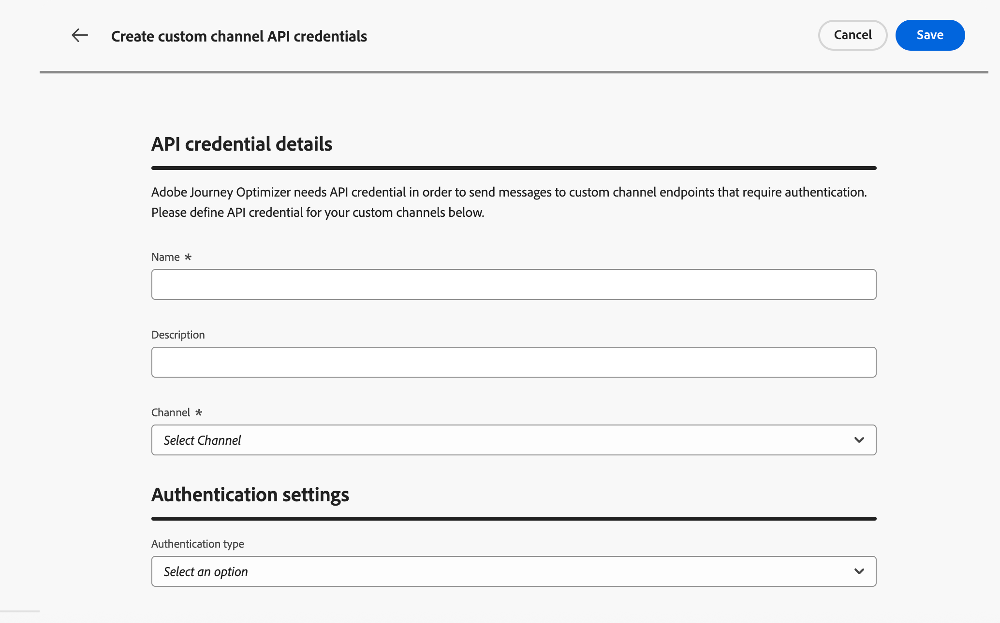

# Administrar credenciales de API {#api-credentials}

Cuando se crea un canal personalizado con un tipo de autenticación distinto de **None**, se genera automáticamente un conjunto inicial de credenciales de API cuando se activa el canal.

Puede ver, administrar y editar credenciales desde **[!UICONTROL Administración]** > **[!UICONTROL Canales]** > **[!UICONTROL Generador de canales]** > **[!UICONTROL Credenciales de API]**.

{width="100%"}

Tener varias credenciales para el mismo canal permite adjuntar valores de autenticación diferentes a configuraciones de canal diferentes (por ejemplo, para diferentes marcas o casos de uso) sin duplicar la definición de canal.

Para editar un conjunto de credenciales existente, haga clic en un artículo de la lista de inventario. Todos los campos son editables.

Para crear credenciales adicionales para el mismo canal, siga los pasos a continuación.

1. En la lista **[!UICONTROL credenciales de API]**, haga clic en **[!UICONTROL Crear credenciales de API]**.

1. Proporcione un nombre y una descripción.

   {width="100%"}

1. Seleccione el **[!UICONTROL canal]** para el que está creando las credenciales.

   >[!NOTE]
   >
   >En la lista desplegable solo se muestran los canales personalizados activados con un tipo de autenticación distinto de **None**.

1. Seleccione **[!UICONTROL Authentication type]** de la lista.
1. Rellene los campos específicos de autenticación:
   * **[!UICONTROL Clave API]**: proporcione el nombre de clave, el valor y la ubicación (parámetro de consulta o encabezado).
   * **[!UICONTROL Autenticación básica]** - Proporcione un nombre de usuario y una contraseña.
   * **[!UICONTROL OAuth 2.0]**: configure la carga para la autenticación OAuth 2.0.
1. Haga clic en **[!UICONTROL Save]**.

## Próximos pasos {#next-steps}

* [Delegar un subdominio](custom-channel-subdomains.md) (opcional: necesario para el seguimiento de vínculos)
* [Creación de una configuración de canal](custom-channel-configuration.md)
