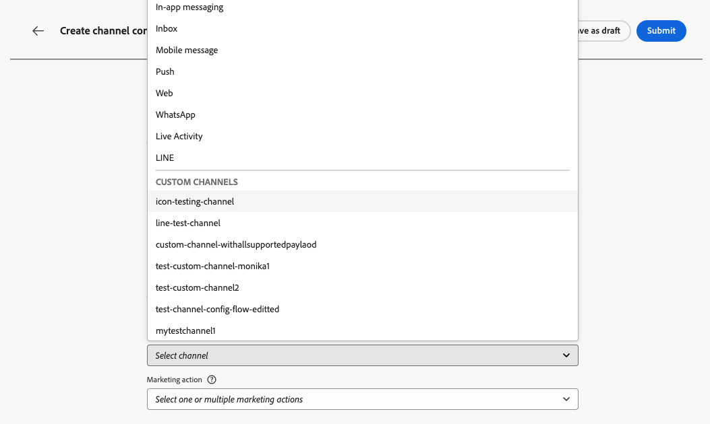
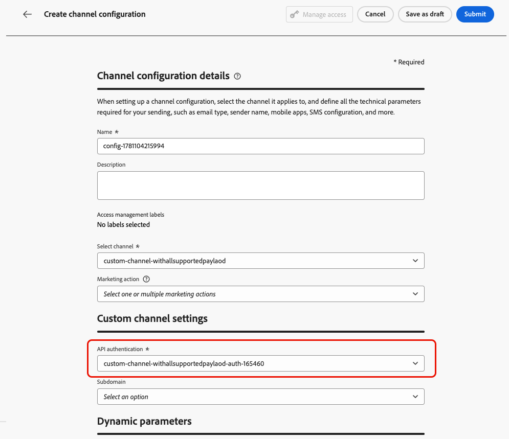
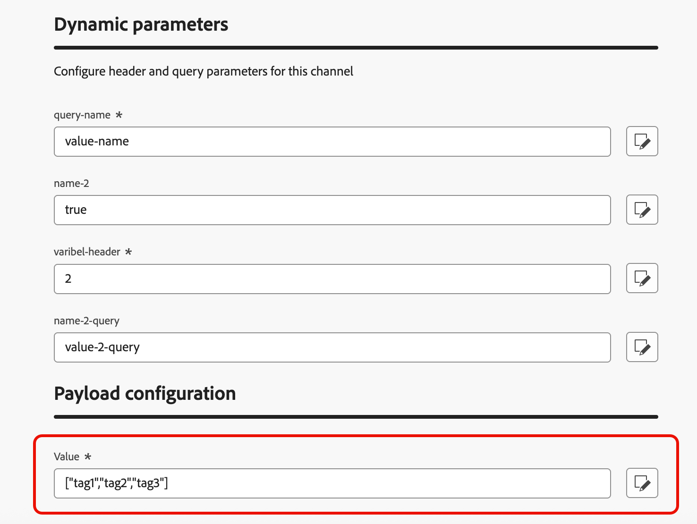

# Creación de una configuración de canal {#create-channel-config}

Una configuración de canal vincula el canal personalizado con un ajuste preestablecido con nombre y reutilizable que los especialistas en marketing seleccionan al crear campañas y recorridos.

Para crear una configuración de canal para un canal personalizado, siga los pasos a continuación.

1. Vaya a **[!UICONTROL Administración]** > **[!UICONTROL Canales]** > **[!UICONTROL Configuraciones de canal]** y haga clic en **[!UICONTROL Crear configuración de canal]**. Más información sobre [creación de una configuración de canal](../configuration/channel-surfaces.md).

1. En la lista desplegable **[!UICONTROL Seleccionar canal]**, selecciona uno de los canales personalizados activados.

   {width="100%"}

1. Si el canal seleccionado utiliza autenticación (el tipo no es **None**), aparecerá el campo **[!UICONTROL Credenciales de API]**. Seleccione las credenciales que se utilizarán para esta configuración. [Más información sobre las credenciales de la API](custom-channel-api-credentials.md)

   {width="100%"}

1. Si ha configurado subdominios para canales personalizados en [!DNL Journey Optimizer], puede seleccionar un subdominio delegado para utilizarlo para rastrear los vínculos presentes en la carga útil de esta configuración. [Aprenda a delegar un subdominio](custom-channel-subdomains.md)

1. Si el canal seleccionado tiene encabezados o parámetros de consulta [definidos como variable](create-custom-channel.md#endpoint-configuration) para la dirección URL del extremo, aparecerá la sección **[!UICONTROL Parámetros dinámicos]**.

   Introduzca el valor de cada parámetro. Puede utilizar el editor de personalización para insertar valores dinámicos (por ejemplo, un identificador de usuario resuelto desde el perfil). Esto permite personalizar la solicitud de cada destinatario en función de sus datos de perfil.

   {width="100%"}

1. Si el canal personalizado tiene campos de carga útil con la casilla de verificación **[!UICONTROL Configuración del canal]** habilitada, esos campos aparecerán en la sección **[!UICONTROL Configuración de carga útil]**. [Más información](create-custom-channel.md#payload-configuration)

   {width="100%"}

   Configure un valor para cada campo según corresponda para esta configuración. Esto resulta útil para campos que pueden variar según el contexto de la campaña o el recorrido, como la información del remitente o las plantillas de mensajes.

1. Para las campañas orquestadas, complete la sección **[!UICONTROL Detalles de ejecución]** para asignar dimensiones de perfil y especificar la dirección de ejecución.

   {width="80%"}

1. Haga clic en **[!UICONTROL Enviar]** para guardar y activar la configuración del canal.

<!--
>[!CAUTION]
>
>If your organization uses approval policies, you may need to request approval before activating journeys or campaigns that use this channel configuration. [Learn more](../test-approve/gs-approval.md)
-->

## Próximos pasos {#next-steps}

El canal personalizado ya está completamente configurado. Los especialistas en marketing pueden empezar a utilizarlo para crear experiencias para los clientes:

* [Crear experiencias de canal personalizadas](create-custom-experience.md)
* [Prueba del canal personalizado](test-custom-channel.md)
* [Monitorización de canales personalizados](configure-custom-channel.md)
