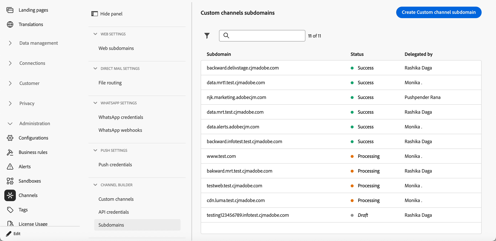

# Configurar subdominios de canal personalizado {#custom-channel-subdomains}

>[!BEGINSHADEBOX]

**En esta página:** Aprenda a configurar subdominios de canal personalizados en Adobe Journey Optimizer para habilitar el seguimiento de vínculos en sus mensajes, ya sea mediante un subdominio delegado existente o configurando uno nuevo con un registro DNS.

>[!ENDSHADEBOX]

>[!CONTEXTUALHELP]
>id="ajo_admin_subdomain_custom_channel"
>title="Delegar un subdominio de canal personalizado"
>abstract="Debe configurar un subdominio para utilizarlo en los mensajes de canal personalizados, ya que necesita este subdominio para crear una configuración de canal personalizada. Seleccione entre los subdominios ya delegados a Adobe o configure un nuevo subdominio."
>additional-url="https://experienceleague.adobe.com/en/docs/journey-optimizer/using/custom-channel/custom-channel-configuration" text="Configuración de un canal personalizado"

>[!CONTEXTUALHELP]
>id="ajo_admin_config_custom_channel_subdomain"
>title="Seleccionar un subdominio de canal personalizado"
>abstract="Para poder crear una configuración de canal personalizada, asegúrese de haber configurado previamente al menos un subdominio de canal personalizado para elegir de la lista Nombre de subdominio."
>additional-url="https://experienceleague.adobe.com/en/docs/journey-optimizer/using/custom-channel/custom-channel-configuration" text="Configuración de un canal personalizado"

## Introducción a los subdominios de canal personalizado {#gs-custom-channel-subdomains}

Para habilitar el seguimiento de vínculos en los mensajes de canal personalizado, debe configurar el subdominio que seleccionará al [crear una configuración de canal personalizado](custom-channel-configuration.md#subdomain-delegation).

Puede utilizar un subdominio que ya se haya delegado a Adobe o configurar otro subdominio. Obtenga más información acerca de la delegación de subdominios a Adobe en [esta sección](../configuration/delegate-subdomain.md).

La configuración del subdominio de canal personalizado se comparte entre todos los entornos. Por lo tanto, cualquier modificación en un subdominio de canal personalizado también afecta a otros entornos limitados de producción.

<!--
TBC
>[!NOTE]
>
>To access and edit custom channel subdomains, you must have the **[!UICONTROL Manage Custom Channel Subdomains]** permission on the production sandbox. Learn more about permissions in [this section](../administration/high-low-permissions.md).
-->
## Usar un subdominio existente {#custom-channel-use-existing-subdomain}

Para utilizar un subdominio que ya se haya delegado a Adobe, siga los pasos a continuación.

1. Vaya al menú **[!UICONTROL Administración]** > **[!UICONTROL Canales]** y seleccione **[!UICONTROL Generador de canales]** > **[!UICONTROL Subdominios]**.

   {width="100%"}

1. Haga clic en **[!UICONTROL Crear subdominio de canal personalizado]**.

1. Seleccione **[!UICONTROL Usar subdominio delegado]** de la sección **[!UICONTROL Tipo de configuración]**.

   {width="100%"}

1. Introduzca el prefijo que se mostrará en la URL de su canal personalizado. Solo se permiten caracteres alfanuméricos y guiones.

   El prefijo se utiliza para crear un subdominio único para este canal personalizado. Por ejemplo, si escribe `promo` y selecciona el subdominio `luma.com`, el subdominio resultante será `promo.luma.com`.

   >[!CAUTION]
   >
   >No use los prefijos `cdn` o `data`, ya que están reservados para uso interno. También deben evitarse otros prefijos restringidos o reservados como `dmarc` o `spf`.

1. Seleccione un subdominio delegado de la lista.

   No puede seleccionar un subdominio que ya se esté usando como subdominio de canal personalizado.

   >[!CAUTION]
   >
   >Si selecciona un dominio delegado a Adobe mediante el [método CNAME](../configuration/delegate-subdomain.md#cname-subdomain-setup), debe crear el registro DNS en su plataforma de alojamiento. Para generar el registro DNS, el proceso es el mismo que al configurar un nuevo subdominio de canal personalizado. Aprenda en [esta sección](#custom-channel-configure-new-subdomain).

1. Haga clic en **[!UICONTROL Enviar]**.

1. Una vez enviado, el subdominio se muestra en la lista con el estado **[!UICONTROL Procesando]**. Para obtener más información sobre los estados de los subdominios, consulte [esta sección](../configuration/delegate-subdomain.md#access-delegated-subdomains).

   Antes de poder usar ese subdominio para enviar mensajes, debe esperar hasta que Adobe realice las comprobaciones necesarias, que pueden tardar **hasta 4 horas**.

1. Una vez que las comprobaciones son correctas, el subdominio obtiene el estado **[!UICONTROL Success]**. Está listo para utilizarse para crear configuraciones de canal personalizadas.

## Configuración de un nuevo subdominio {#custom-channel-configure-new-subdomain}

>[!CONTEXTUALHELP]
>id="ajo_admin_custom_channel_subdomain_dns"
>title="Generar el registro DNS coincidente"
>abstract="Para configurar un nuevo subdominio de canal personalizado, debe copiar la información del servidor de nombres de Adobe que se muestra en la interfaz de Journey Optimizer y pegarla en la solución de alojamiento de dominios para generar el registro DNS correspondiente. Una vez realizadas las comprobaciones correctamente, el subdominio está listo para utilizarse para crear configuraciones de canal personalizadas."

Para configurar un nuevo subdominio, siga los pasos a continuación.

1. Vaya al menú **[!UICONTROL Administración]** > **[!UICONTROL Canales]** y, a continuación, seleccione **[!UICONTROL Generador de canales]** > **[!UICONTROL Subdominios]**.

1. Haga clic en **[!UICONTROL Crear subdominio de canal personalizado]**.

1. Seleccione **[!UICONTROL Agregar su propio dominio]** de la sección **[!UICONTROL Tipo de configuración]**.

   {width="70%"}

1. Especifique el subdominio que desea delegar.

   >[!CAUTION]
   >
   >* No se puede usar un subdominio de canal personalizado existente.
   >
   >* No se permiten mayúsculas en los subdominios.

   No se permite delegar un subdominio no válido a Adobe. Asegúrese de introducir un subdominio válido que sea propiedad de su organización, como marketing.yourcompany.com.

   Se admiten subdominios de varios niveles (del mismo dominio principal). Por ejemplo, puede utilizar &quot;custom.marketing.yourcompany.com&quot;.

1. Se muestra el registro que se va a colocar en los servidores DNS. Copie este registro o descargue un archivo CSV y, a continuación, vaya a la solución de alojamiento de dominios para generar el registro DNS correspondiente.

1. Asegúrese de que se ha generado un registro DNS en la solución de alojamiento de dominios. Si todo está configurado correctamente, marque la casilla &quot;Confirmo...&quot; y luego haga clic en **[!UICONTROL Enviar]**.

   

   Al configurar un nuevo subdominio de canal personalizado, siempre apunta a un registro CNAME.

1. Una vez enviada la delegación del subdominio, este se muestra en la lista con el estado **[!UICONTROL Procesando]**. Para obtener más información sobre los estados de los subdominios, consulte [esta sección](../configuration/delegate-subdomain.md#access-delegated-subdomains).

Antes de utilizar un subdominio para enviar mensajes de canal personalizados, debe esperar hasta que Adobe realice las comprobaciones necesarias, que pueden tardar hasta cuatro horas. Una vez que las comprobaciones son correctas, el subdominio obtiene el estado **[!UICONTROL Success]**. Está listo para utilizarse para crear configuraciones de canal personalizadas.

Tenga en cuenta que el subdominio se marcará como **[!UICONTROL Error]** si no crea el registro de validación en la solución de alojamiento.

<!--

Any specific guardrails to add? If so, can we link to email subdomain guardrails? journey-optimizer.en/help/using/configuration/delegate-subdomain.md#guardrails

Otherwise use the following from SMS subdomains?

## Guardrails {#guardrails}

Currently, the [!DNL Journey Optimizer] user interface does not support the deletion or undelegation of custom channel subdomains once they have been set up.

However, when testing features within [!DNL Journey Optimizer], it may be necessary to create a custom channel subdomain. Once the testing is complete, this can lead to cluttered environments with unnecessary configurations as the UI does not allow for removing or undelegating custom channel subdomains.

Here are some recommended steps and considerations:

* As a best practice, maintain a tidy environment by only creating necessary components and configurations.
* In situations where there is a business impact, contact your Adobe representative who may be able to assist with the removal/undelegation of the custom channel subdomain. [Learn more](#undelegate-subdomain)
* If further assistance is required, reach out to Adobe for guidance on managing your instance effectively.

## Undelegate a subdomain {#undelegate-subdomain}

If you wish to undelegate a custom channel subdomain, reach out to your Adobe representative with the subdomain you want to undelegate.

If the custom channel subdomain points to a CNAME record, you can delete the CNAME DNS record that you created for the custom channel subdomain from your hosting solution (but do not delete the original email subdomain if any).

>[!NOTE]
>
>A custom channel subdomain can point to a CNAME record because it was either an [existing subdomain](#custom-channel-use-existing-subdomain) delegated to Adobe using the [CNAME method](../configuration/delegate-subdomain.md#cname-subdomain-setup), or a [new custom channel subdomain](#custom-channel-configure-new-subdomain) that you configured.

After your request is handled by Adobe, the undelegated domain is no longer displayed on the subdomain inventory page.
-->

## Próximos pasos {#next-steps}

* [Cree una configuración de canal](custom-channel-configuration.md) para vincular su canal personalizado a un subdominio, a las credenciales y a los valores predeterminados de carga útil que los especialistas en marketing seleccionarán en las campañas y recorridos.
