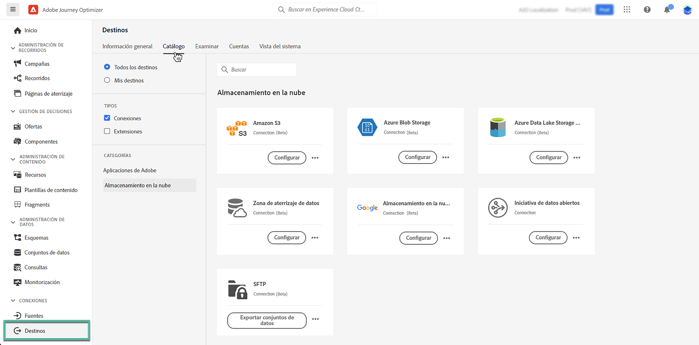
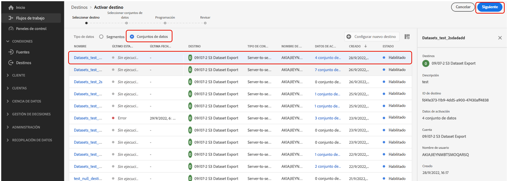
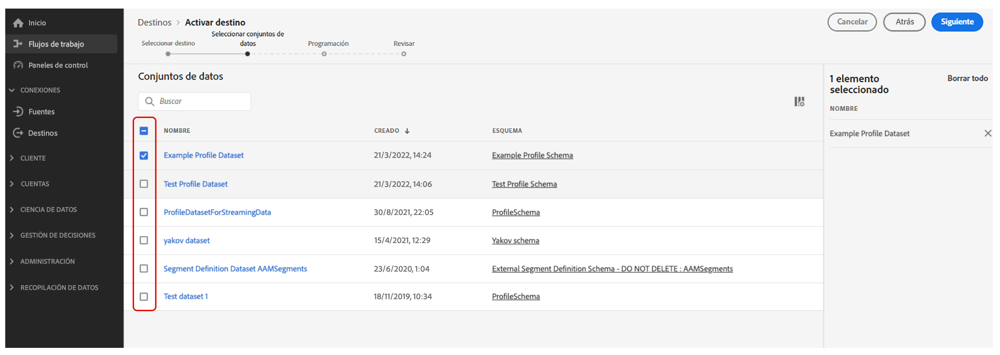

# Exportación de conjuntos de datos a ubicaciones de almacenamiento en la nube {#export-datasets}

Journey Optimizer le permite establecer una conexión activa con ubicaciones de almacenamiento en la nube para exportar el contenido de sus conjuntos de datos.

Al exportar periódicamente los datos, puede asegurarse de que dispone de un registro completo y actualizado de las interacciones de los clientes, lo que lo hace fácilmente disponible para fines de creación de informes, archivado o análisis de datos.

## Destinos de almacenamiento en la nube disponibles {#destinations}

Puede exportar conjuntos de datos a 6 destinos de almacenamiento en la nube a los que se puede acceder desde el menú **[!UICONTROL Destinos]**, en la pestaña **[!UICONTROL Catálogo]**.

Encontrará información detallada sobre cada destino en la documentación de Adobe Experience Platform:

* [Amazon S3](https://experienceleague.adobe.com/docs/experience-platform/destinations/catalog/cloud-storage/amazon-s3.html){target="_blank"}
* [blob de Azure](https://experienceleague.adobe.com/docs/experience-platform/destinations/catalog/cloud-storage/azure-blob.html){target="_blank"}
* [Azure Data Lake Gen 2](https://experienceleague.adobe.com/docs/experience-platform/destinations/catalog/cloud-storage/adls-gen2.html){target="_blank"}
* [Zona de aterrizaje de datos](https://experienceleague.adobe.com/docs/experience-platform/destinations/catalog/cloud-storage/data-landing-zone.html){target="_blank"}
* [Almacenamiento en la nube de Google](https://experienceleague.adobe.com/docs/experience-platform/destinations/catalog/cloud-storage/google-cloud-storage.html){target="_blank"}
* [SFTP](https://experienceleague.adobe.com/docs/experience-platform/destinations/catalog/cloud-storage/sftp.html){target="_blank"}.

## Requisitos previos {#prerequisites}

Para exportar conjuntos de datos, necesita los [permisos de control de acceso](https://experienceleague.adobe.com/docs/experience-platform/access-control/home.html#permissions){target="_blank"} que se indican a continuación. Lea la [descripción general del control de acceso](https://experienceleague.adobe.com/docs/experience-platform/access-control/ui/overview.html){target="_blank"} o póngase en contacto con el administrador del producto para obtener los permisos necesarios.

| Categoría | Permiso |
|--|--|
| Destinos | Administrar y activar destinos de conjuntos de datos |
| Administración de datos | Ver conjuntos de datos |
| Destinos | Ver destinos |

## Pasos clave para exportar conjuntos de datos {#main-steps}

Los pasos principales para exportar un conjunto de datos a una ubicación de almacenamiento en la nube son los siguientes:

Encontrará información detallada sobre cada paso en [Documentación de Adobe Experience Platform](https://experienceleague.adobe.com/docs/experience-platform/destinations/ui/activate/export-datasets.html){target="_blank"}.

1. **Configure su destino de almacenamiento en la nube**. Si aún no lo ha hecho, conéctese a un destino de almacenamiento en la nube desde el catálogo de destinos. Aprenda a crear una nueva conexión de destino en [Documentación de Adobe Experience Platform](https://experienceleague.adobe.com/docs/experience-platform/destinations/ui/connect-destination.html#setup){target="_blank"}.

   <!---->

1. **Seleccione el destino de almacenamiento en la nube** donde desee exportar los conjuntos de datos. En el catálogo de destinos, haga clic en el botón **[!UICONTROL Exportar conjuntos de datos]** de la tarjeta deseada y seleccione la conexión que desea utilizar.

   <!---->

   >[!NOTE]
   >
   >Si usa Adobe Journey Optimizer junto con perfiles de clientes en tiempo real, las tarjetas de destino mostrarán un botón **Activar**, que le permitirá exportar conjuntos de datos y activar audiencias para este destino, según los permisos que haya habilitado.

1. **Seleccione los conjuntos de datos** que desea exportar al destino seleccionado. [Obtenga más información acerca de los conjuntos de datos de Journey Optimizer disponibles para exportar](#datasets)

   <!---->

1. **Programe la exportación** de su conjunto de datos. Especifique cuándo debe iniciarse la exportación y con qué frecuencia debe producirse.

   <!---->

1. **Revise y confirme la exportación** comprobando el resumen que aparece al final de la configuración.

   <!---->

Una vez completada la exportación, el contenido del conjunto de datos se deposita en la ubicación de almacenamiento en la nube según la programación configurada. [Obtenga información sobre cómo verificar la exportación correcta del conjunto de datos](https://experienceleague.adobe.com/docs/experience-platform/destinations/ui/activate/export-datasets.html#verify){target="_blank"}.

## Conjuntos de datos disponibles para exportar {#datasets}

Comprenda, a partir de la tabla siguiente, qué conjuntos de datos de Journey Optimizer puede exportar.

| Conjunto de datos | Descripción |
| ------- | ------- | 
| Conjunto de datos de evento de comentarios BCC de AJO | Conjunto de datos de evento de comentarios BCC de AJO |
| Conjunto de datos de clasificación AJO | Conjunto de datos para la ingesta de eventos de comentarios de aplicaciones push y de correo electrónico desde Journey Optimizer. Creado mediante SDK. |
| Conjunto de datos del servicio de consentimiento AJO | Almacena la información de consentimiento de un perfil. |
| Conjunto de datos de evento de experiencia de seguimiento de correo electrónico AJO | Registros de interacción del canal de correo electrónico que se utilizan para fines de creación de informes y audiencias.  |
| Conjunto de datos de entidad AJO | Conjunto de datos para almacenar metadatos de entidad para mensajes enviados al usuario final.  |
| Conjunto de datos de evento de actividad entrante de AJO | Conjunto de datos para canales web e inApp de Journey Optimizer para eventos de envío e interacción. |
| Conjunto de datos del perfil de mensajería interactiva de AJO | Almacena perfiles creados para admitir campañas activadas por API |
| Conjunto de datos de evento de comentarios de mensajes AJO | Registros de envío de mensajes. Información sobre el envío de mensajes desde Journey Optimizer con fines de creación de informes y públicos. Los comentarios de los ISP de correo electrónico sobre las devoluciones también se registran en este conjunto de datos. Este conjunto de datos incluye eventos para todos los canales, SMS/MMS, correo directo, etc., excepto para correo electrónico. |
| Extensión de contadores de perfil de AJO | Contiene un mapa de objetos que contienen counter_value y expiryDate, escrito por counter_id |
| Conjunto de datos del perfil push de AJO | Almacena tokens push de un perfil. |
| Conjunto de datos de evento de experiencia de seguimiento push de AJO | Registros de interacción del canal push que se utilizan para fines de creación de informes y audiencias.  |
| Conjunto de datos de AJO Surfaces | Conjunto de datos vacío relacionado con el esquema de superficies entrantes de Journey Optimizer |
| AOOutputForUPSDataset | Contiene todas las pertenencias a audiencias de AO que se van a escribir en UPS |
| Conjunto de datos del perfil de Audience Orchestration | Generado por composición de audiencia para audiencias de composición de audiencia. Contiene todas las audiencias de composición de audiencias, sus atributos y datos de enriquecimiento |
| Repositorio de objetos de decisión: actividades | también se conoce como Decisiones en la interfaz de usuario. Pero estos son los objetos que crea un usuario que reúne todos los componentes, incluida la lógica de toma de decisiones. Por ejemplo, para una ubicación concreta (ubicación), qué ofertas deben considerarse (colección de ofertas) y qué método de clasificación utilizar en esas ofertas. |
| Repositorio de objetos de decisión: ofertas de reserva | este es el repositorio para el otro tipo de oferta que crea un usuario. Específicamente, si no cumplen los requisitos para ver una oferta personalizada y necesitan ver algo, al menos verán la oferta de reserva. Este conjunto de datos contiene los atributos para este tipo de oferta |
| Repositorio de objetos de decisión: ofertas personalizadas | este es el repositorio de un tipo de oferta que crea un usuario. Por lo tanto, este conjunto de datos contiene los atributos sobre este tipo de oferta |
| Repositorio de objetos de decisión: ubicaciones | este es el repositorio de objetos que definen la ubicación de donde debe mostrarse una oferta. |
| Eventos de paso de recorrido | Registra todos los eventos de experiencia de los pasos de Recorrido generados desde Journey Optimizer que deben consumir servicios como Creación de informes. |
| Recorridos | Información del alojamiento del conjunto de datos de metadatos de cada paso en un recorrido |
| ODE DecisionEvents: toma de decisiones de producción | Cada vez que tomamos una decisión basada en una solicitud, la consideramos un evento de decisión |