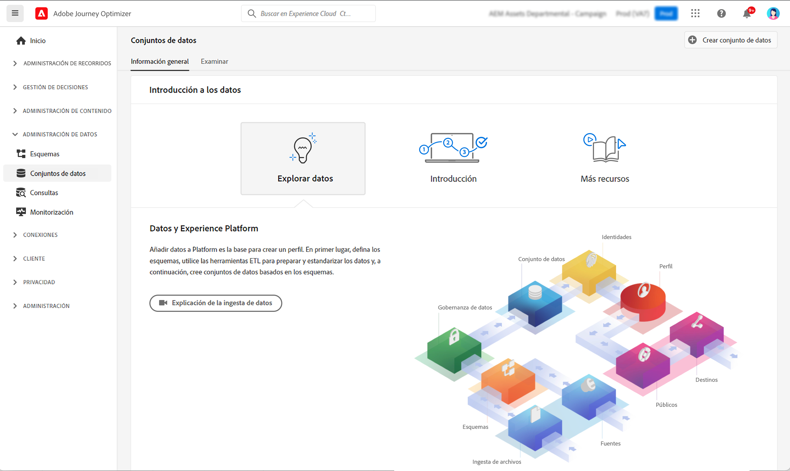
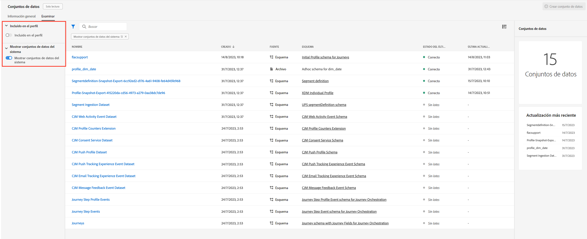
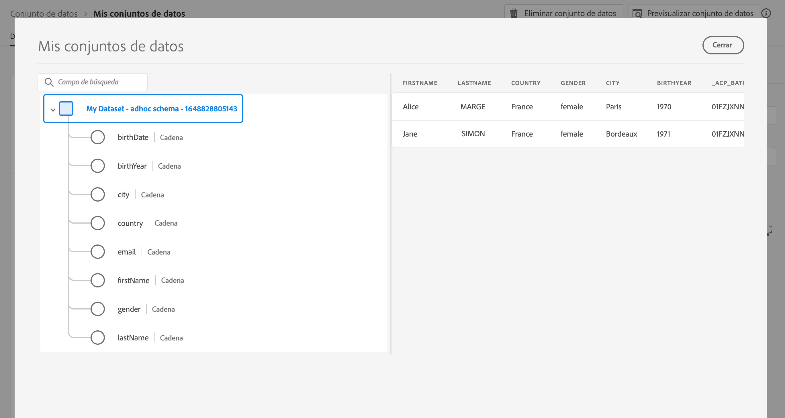

# Introducción a los conjuntos de datos {#datasets-gs}

Todos los datos que se incorporan a Adobe Experience Platform se conservan dentro del lago de datos como conjuntos de datos. Un conjunto de datos es una construcción de almacenamiento y administración para una colección de datos, normalmente una tabla, que contiene un esquema (columnas) y campos (filas).

## Protecciones y limitaciones

* A partir del 1 de noviembre de 2024, la segmentación de streaming ya no admite eventos de envío y apertura de conjuntos de datos de seguimiento y comentarios [!DNL Journey Optimizer]. Para implementar la restricción de frecuencia o la administración de fatiga, utilice reglas empresariales en su lugar. Puede encontrar más detalles en [esta sección](../conflict-prioritization/rule-sets.md), incluyendo una explicación de caso de uso para el límite diario [aquí](https://experienceleaguecommunities.adobe.com/t5/journey-optimizer-blogs/elevate-customer-experience-with-daily-frequency-capping-in-ajo/ba-p/761510){target="_blank"}.

* A partir de febrero de 2025, se implementará una protección de tiempo de vida (TTL) en los conjuntos de datos generados por el sistema de Journey Optimizer. [Más información](datasets-ttl.md)

## Acceso a conjuntos de datos {#access}

El espacio de trabajo **Conjuntos de datos** en la interfaz de usuario de [!DNL Adobe Journey Optimizer] le permite explorar datos y crear conjuntos de datos. Para abrir el panel de control Conjuntos de datos, seleccione **Conjuntos de datos** en el panel de navegación izquierdo.

Seleccione la pestaña **Examinar** para mostrar la lista de todos los conjuntos de datos disponibles para su organización. Se muestran los detalles de cada conjunto de datos enumerado, incluido su nombre, el esquema al que se adhiere el conjunto de datos y el estado de la ejecución de ingesta más reciente. De forma predeterminada, solo se muestran los conjuntos de datos que ha introducido. Si desea ver los conjuntos de datos generados por el sistema, habilite el conmutador **Mostrar conjuntos de datos del sistema** desde el filtro.

Seleccione el nombre de un conjunto de datos para acceder a su pantalla de actividad de conjunto de datos y ver los detalles del conjunto de datos seleccionado. La pestaña actividad incluye un gráfico que visualiza la tasa de consumo de los mensajes, así como una lista de lotes correctos y fallidos.

Para previsualizar un conjunto de datos, seleccione **Previsualizar conjunto de datos** junto a la esquina superior derecha de la pantalla para obtener una vista previa del lote más reciente procesado correctamente en este conjunto de datos. Cuando un conjunto de datos está vacío, el vínculo de previsualización se desactiva.

## [!DNL Journey Optimizer] conjuntos de datos del sistema {#system-datasets}

Esta sección enumera los conjuntos de datos del sistema utilizados por [!DNL Journey Optimizer]. Para ver la lista completa de campos y atributos para cada esquema, consulte el [diccionario del esquema de Journey Optimizer](https://experienceleague.adobe.com/tools/ajo-schemas/schema-dictionary.html?lang=es){target="_blank"}.

>[!CAUTION]
>
> Los conjuntos de datos del sistema **no se debe modificar**. Cualquier cambio se revierte automáticamente con cada actualización de producto.

* Creación de informes

   * _Informes: conjunto de datos del evento de comentarios de mensajes_: registros de envío de mensajes. Información sobre el envío de mensajes desde Journey Optimizer con fines de creación de informes y públicos. Los comentarios de los ISP de correo electrónico sobre los rechazos también se registran en este conjunto de datos.
   * _Creación de informes: conjunto de datos de evento de experiencia de seguimiento del correo electrónico_: registros de interacción para el canal de correo electrónico que se utiliza para la creación de informes y públicos. La información almacenada se refiere a las acciones realizadas por el usuario final en el correo electrónico (aperturas, clics, etc.).
   * _Creación de informes: conjunto de datos de evento de experiencia de seguimiento push_: registros de interacción para canales push que se utilizan con fines de creación de informes y públicos. La información almacenada informa sobre las acciones realizadas por el usuario final en las notificaciones push.
   * _Informes: evento de paso de recorrido_: captura todos los eventos de experiencia de los pasos de Recorrido generados desde Journey Optimizer para que los consuman servicios como Informes. También es fundamental para crear informes en Customer Journey Analytics para análisis YoY. Vinculado a metadatos de recorrido.
   * _Informes: recorridos_: información sobre el alojamiento del conjunto de datos de metadatos de cada paso de un recorrido.
   * _Informes - CCO_: conjunto de datos del evento de comentarios que almacena los registros de envío de los correos electrónicos CCO. Se utilizarán para elaborar informes.

* Consentimiento

  _Conjunto de datos del servicio de consentimiento_: almacena información de consentimiento de un perfil.

* Exportación de mensajes

  _Conjunto de datos de exportación de mensajes AJO_: almacena el contenido de los mensajes SMS y de correo electrónico enviados con fines de exportación. Los registros se conservan durante 7 días naturales a partir de la ingesta. Disponible solo para organizaciones que han adquirido el complemento Exportación de mensajes. [Más información](../configuration/message-export.md)

* Servicios inteligentes

  _Puntuaciones de optimización del tiempo de envío/Puntuaciones de participación_: resultados de inteligencia artificial aplicada a la trayectoria.

## Crear conjuntos de datos{#create-datasets}

Añadir datos a [!DNL Adobe Experience Platform] es la base para crear un perfil. A continuación, podrá aprovechar los perfiles en [!DNL Adobe Journey Optimizer]. En primer lugar, defina esquemas, utilice herramientas de ETL para preparar y estandarizar sus datos y, a continuación, cree conjuntos de datos basados en sus esquemas.

Puede crear un conjunto de datos a partir de un esquema o un archivo CSV. Encontrará información detallada sobre cómo crear conjuntos de datos en la documentación de [!DNL Adobe Experience Platform]:

* [Crear un conjunto de datos con un esquema existente](https://experienceleague.adobe.com/es/docs/experience-platform/catalog/datasets/user-guide#schema){target="_blank"}
* [Asignar un archivo CSV a un esquema XDM existente](https://experienceleague.adobe.com/es/docs/experience-platform/ingestion/tutorials/map-csv/existing-schema){target="_blank"}

Obtenga información sobre cómo crear un conjunto de datos, asignarlo a un esquema, añadirle datos y confirmar que estos se han introducido.

>[!VIDEO](https://video.tv.adobe.com/v/334293?quality=12)

## Gobernanza de datos

En un conjunto de datos, examine la pestaña **Gobernanza de datos** para comprobar las etiquetas en el conjunto de datos y en el nivel de campo. La gobernanza de datos categoriza los datos según el tipo de políticas que se apliquen.

Una de las funciones principales de [!DNL Adobe Experience Platform] es reunir los datos de varios sistemas empresariales para permitir que los especialistas en marketing identifiquen, comprendan e interactúe mejor con los clientes. Estos datos pueden estar sujetos a restricciones de uso definidas por su organización o por la normativa legal. Por lo tanto, es importante asegurarse de que sus operaciones de datos cumplan las políticas de uso de los datos.

[!DNL Adobe Experience Platform Data Governance] le permite administrar los datos de los clientes y garantizar el cumplimiento de las regulaciones, restricciones y políticas aplicables al uso de los datos. Desempeña un papel clave dentro de Experience Platform en varios niveles, incluida la catalogación, el linaje de datos, el etiquetado del uso de los datos, las políticas de uso de los datos y el control del uso de los datos para las acciones de marketing.

Obtenga más información sobre la gobernanza de datos y etiquetas de uso de datos en la [documentación de la gobernanza de datos](https://experienceleague.adobe.com/docs/experience-platform/data-governance/labels/user-guide.html?lang=es){target="_blank"}.

## Ejemplos y casos de uso {#samples}

* [Tutorial: Ingestar datos en Adobe Experience Platform](https://experienceleague.adobe.com/docs/experience-platform/ingestion/tutorials/ingest-batch-data.html?lang=es){target="_blank"}
* [Caso de uso de extremo a extremo](../audience/creating-test-profiles.md): crear un esquema, un conjunto de datos e ingerir datos para añadir perfiles de prueba en [!DNL Adobe Journey Optimizer]
* [Ejemplos de consultas](../data/datasets-query-examples.md): conjuntos de datos de [!DNL Adobe Journey Optimizer] y casos de uso relacionados.

>[!MORELIKETHIS]
>
>* [Documentación de conjuntos de datos](https://experienceleague.adobe.com/docs/experience-platform/catalog/datasets/overview.html?lang=es){target="_blank"}
>* [Documentación de ingesta de datos](https://experienceleague.adobe.com/docs/experience-platform/ingestion/home.html?lang=es){target="_blank"}.
>* [Prácticas recomendadas de asignación de licencias para administración de datos](https://experienceleague.adobe.com/es/docs/experience-platform/landing/license/data-management-best-practices#data-management-best-practices){target="_blank"}
