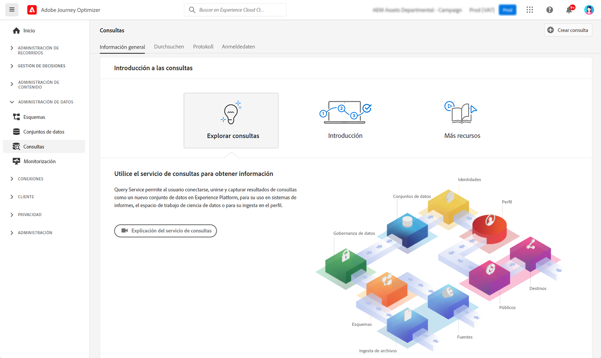

# Introducción a las consultas {#queries-gs}

El Editor de consultas es una herramienta interactiva que proporciona el servicio de consultas de Adobe Experience Platform, que le permite escribir, validar y ejecutar consultas para los datos de experiencia del cliente en la interfaz de usuario [!DNL Adobe Journey Optimizer].

El Editor de consultas admite el desarrollo de consultas para análisis y exploración de datos, y permite ejecutar consultas interactivas con fines de desarrollo, así como consultas no interactivas para rellenar [conjuntos de datos](get-started-datasets.md).

Aprenda a utilizar el Editor de consultas en [esta documentación](https://experienceleague.adobe.com/docs/experience-platform/query/ui/user-guide.html?lang=es){target="_blank"}.

**Consulte también**

* [Documentación del servicio de consultas](https://experienceleague.adobe.com/docs/experience-platform/query/home.html?lang=es){target="_blank"}
* [Información general del servicio de consultas de vídeo](https://experienceleague.adobe.com/docs/platform-learn/tutorials/queries/understanding-query-service.html?lang=es){target="_blank"}
