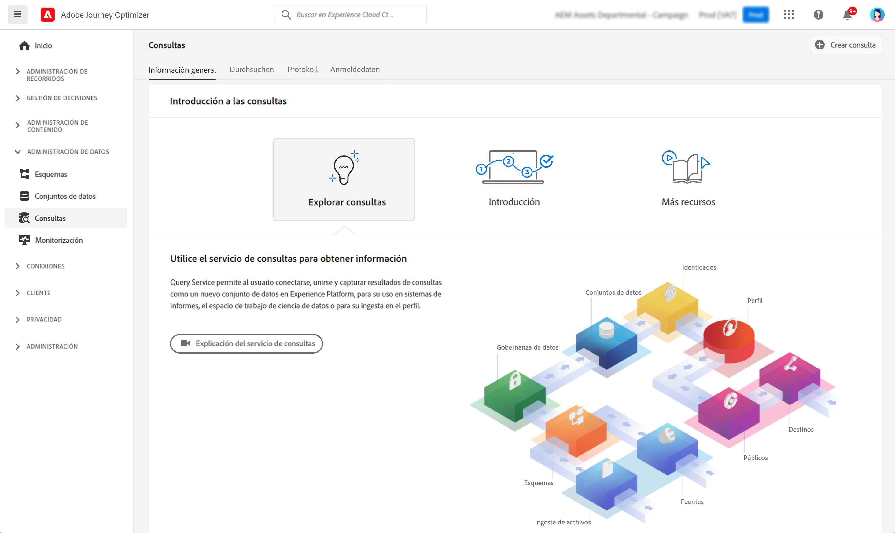

# Introducción a las consultas {#queries-gs}

>[!BEGINSHADEBOX]

**En esta página:** use el editor de consultas con tecnología del servicio de consultas de Adobe Experience Platform para poder escribir, validar y ejecutar consultas en los datos de la experiencia del cliente para el análisis y la exploración de datos en Adobe Journey Optimizer.

>[!ENDSHADEBOX]

El Editor de consultas es una herramienta interactiva que proporciona el Servicio de consultas de Adobe Experience Platform, que le permite escribir, validar y ejecutar consultas para los datos de experiencia del cliente en la interfaz de usuario [!DNL Adobe Journey Optimizer].

El Editor de consultas admite el desarrollo de consultas para análisis y exploración de datos, y permite ejecutar consultas interactivas con fines de desarrollo, así como consultas no interactivas para rellenar [conjuntos de datos](get-started-datasets.md).

Aprenda a utilizar el Editor de consultas en [esta documentación](https://experienceleague.adobe.com/docs/experience-platform/query/ui/user-guide.html?lang=es){target="_blank"}.

>[!MORELIKETHIS]
>
>* [Documentación del Servicio de consultas](https://experienceleague.adobe.com/docs/experience-platform/query/home.html?lang=es){target="_blank"}
>* [Vídeo resumen del Servicio de consultas](https://experienceleague.adobe.com/docs/platform-learn/tutorials/queries/understanding-query-service.html?lang=es){target="_blank"}

{{$include /help/_includes/do-not-localize/data/ai-augmented-get-started-queries.md}}
