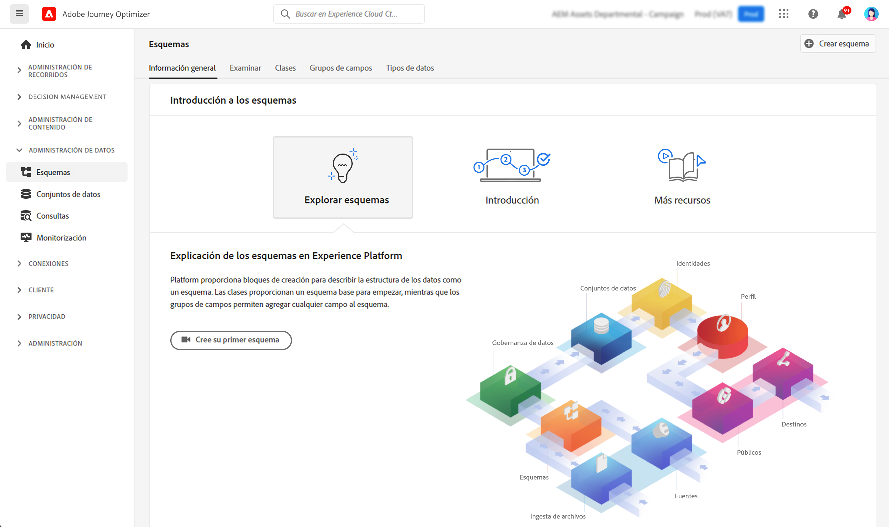

# Introducción a los esquemas {#schemas-gs}

Los esquemas son la forma estándar de describir los datos en Experience Platform, lo que permite reutilizar en una organización todos los datos que se ajustan a esquemas, o incluso compartirlos entre varias organizaciones.

➡️ [Descubra cómo crear y configurar un esquema en este vídeo](#video-schema) (vídeo)

Un esquema es un conjunto de reglas que representan y validan la estructura y el formato de los datos. En un nivel superior, los esquemas proporcionan una definición abstracta de un objeto del mundo real (como una persona) y describen qué datos deben incluirse en cada instancia de ese objeto (como nombre, apellido, cumpleaños, etc.).  

Obtenga información sobre cómo crear esquemas en [esta documentación](https://experienceleague.adobe.com/docs/experience-platform/xdm/schema/composition.html?lang=es){target="_blank"}

El espacio de trabajo **Esquemas** en la interfaz de usuario de [!DNL Adobe Journey Optimizer] le permite administrar los recursos del modelo de datos de Experience (XDM), incluidos esquemas, clases, grupos de campos de esquema y tipos de datos. Puede ver y explorar los recursos principales proporcionados por Adobe y crear esquemas y recursos personalizados para su organización.

Información sobre cómo utilizar la interfaz de usuario de Esquemas en [esta documentación](https://experienceleague.adobe.com/docs/experience-platform/xdm/ui/overview.html?lang=es){target="_blank"}

La documentación paso a paso para crear un esquema con el Editor de esquemas está disponible en [esta página](https://experienceleague.adobe.com/docs/experience-platform/xdm/tutorials/create-schema-ui.html?lang=es){target="_blank"}

Para ver la lista completa de campos y atributos para cada esquema, consulte el [Diccionario de esquema de Journey Optimizer](https://experienceleague.adobe.com/tools/ajo-schemas/schema-dictionary.html?lang=es){target="_blank"}.

## Vídeo explicativo{#video-schema}

Obtenga información sobre cómo crear un esquema, añadir grupos de campos, crear y configurar grupos de campos personalizados.

>[!VIDEO](https://video.tv.adobe.com/v/334461?quality=12)

**Consulte también**

* [Creación de un esquema y un conjunto de datos, e introducción de datos para añadir perfiles de prueba en Journey Optimizer](../audience/creating-test-profiles.md)
* [Información general del sistema XDM](https://experienceleague.adobe.com/docs/experience-platform/xdm/home.html?lang=es){target="_blank"}
* [Prácticas recomendadas para el modelo de datos](https://experienceleague.adobe.com/docs/experience-platform/xdm/schema/best-practices.html?lang=es){target="_blank"}
* [Creación de un esquema con la API del registro de esquemas](https://experienceleague.adobe.com/docs/experience-platform/xdm/tutorials/create-schema-api.html?lang=es).{target="_blank"}
* [Definición de una relación entre dos esquemas con el Editor de esquemas](https://experienceleague.adobe.com/docs/experience-platform/xdm/tutorials/relationship-ui.html?lang=es){target="_blank"}
