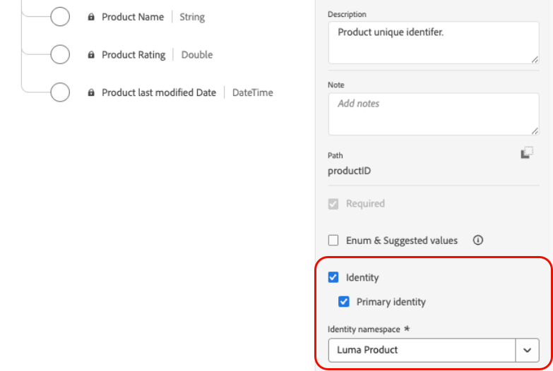

# Usar datos de Adobe Experience Platform {#aep-data}

>[!CONTEXTUALHELP]
>id="lookup-aep-data"
>title="Habilitar para búsqueda"
>abstract="Al habilitar un conjunto de datos para la búsqueda, puede aprovechar sus datos dentro de las funciones de personalización, toma de decisiones y orquestación de recorrido de Journey Optimizer."

Journey Optimizer le permite aprovechar los datos de Adobe Experience Platform con funciones de personalización, toma de decisiones y orquestación de recorrido. Para ello, los conjuntos de datos basados en registros necesarios para la personalización de la búsqueda deben habilitarse primero para el servicio de búsqueda como se describe a continuación.

## Lectura obligatoria

### Protecciones y directrices {#guidelines}

Antes de empezar, revise las siguientes restricciones y directrices:

* Los conjuntos de datos habilitados para la búsqueda no deben contener información de identificación personal (PII).
* Los conjuntos de datos habilitados para la búsqueda y utilizados en la personalización no están protegidos frente a la eliminación. Depende de usted realizar un seguimiento de qué conjuntos de datos se están utilizando para la personalización a fin de asegurarse de que no se eliminen ni se eliminen.
* Los conjuntos de datos deben asociarse con un esquema que NO sea del tipo Perfil o Evento.
* La ingesta de datos de streaming es compatible con conjuntos de datos habilitados para búsqueda. Tenga en cuenta que el procesamiento de la ingesta debe completarse antes de que los datos estén disponibles para la personalización o la toma de decisiones.

### Derecho al servicio de búsqueda

| Componente de función | Límites | Notas |
| ------- | ------- | ------- |
| Conjuntos de datos de búsqueda habilitados | Máx. 10 por organización | Número máximo de conjuntos de datos que se pueden configurar para la búsqueda en un momento determinado. Este límite se aplica al número total combinado de conjuntos de datos de búsqueda en los entornos limitados de producción y desarrollo de la instancia del cliente. |
| Recuento de registros de conjuntos de datos | Hasta 2 millones de registros por conjunto de datos | Número máximo de registros permitidos en un único conjunto de datos, calculado como el recuento total en todos los lotes dentro de ese conjunto de datos. |
| Tamaño de registro | Hasta 2 KB por registro | Se admite el tamaño máximo de registro predeterminado. |
| Tamaño del conjunto de datos | Hasta 4 GB | El tamaño máximo de un conjunto de datos individual, no el tamaño combinado en todos los conjuntos de datos de una zona protegida. Los límites de recuento de registros y tamaño del conjunto de datos son protecciones independientes; ambas deben cumplirse. |
| Actualizaciones de frecuencia de conjuntos de datos | Hasta 5 actualizaciones al día por conjunto de datos | Frecuencia máxima de operaciones de actualización permitidas para un único conjunto de datos por día. |

>[!NOTE]
>
>Si se necesitan volúmenes adicionales más allá de las protecciones enumeradas anteriormente, póngase en contacto con su representante de Adobe.

## Habilitar un conjunto de datos para la búsqueda de datos {#enable}

Para aprovechar los datos del conjunto de datos para la personalización, debe habilitar el conjunto de datos para la búsqueda.

### Requisitos previos {#prerequisites-enable}

El esquema asociado con el conjunto de datos que desea habilitar para la búsqueda debe ser del tipo registro. El esquema NO debe ser de perfil ni de clase de evento.

+++Ejemplo


+++

El esquema debe tener una identidad principal definida.

+++Ejemplo



+++

Si aún no se ha definido un área de nombres personalizada, asegúrese de que la identidad sea un identificador que no sea una persona.

+++Ejemplo


+++

### Habilitar el conjunto de datos para la búsqueda en la interfaz de administración de conjuntos de datos

En la interfaz de usuario de administración de conjuntos de datos, utilice la opción para habilitar el conjunto de datos para la búsqueda.


>[!NOTE]
>
>Se recomienda que el conjunto de datos NO también esté habilitado para el perfil, ya que esto puede provocar un aumento en la riqueza de perfiles y no es necesario para realizar las búsquedas.

### Método de API

Siga las instrucciones detalladas en [esta documentación](https://developer.adobe.com/journey-optimizer-apis/references/authentication/) para configurar su entorno y enviar comandos de API.

#### Requisitos previos

* El proyecto de desarrollador debe tener las API de Adobe Journey Optimizer y Adobe Experience Platform añadidas a su proyecto.

  

* Debe tener permiso para administrar conjuntos de datos como parte de la función.

* El esquema en el que se basa el conjunto de datos debe contener una identidad principal que pueda actuar como clave de búsqueda.

#### Estructura de llamadas API

```shell
curl -s -XPATCH "https://platform.adobe.io/data/core/entity/lookup/dataSets/${DATASET_ID}/${ACTION}" \ -H "Authorization: Bearer ${ACCESS_TOKEN}" \ -H "x-api-key: ${API_KEY}" \ -H "x-gw-ims-org-id: ${IMS_ORG}" \ -H "x-sandbox-name: ${SANDBOX_NAME}" 
```

Donde:

* La URL es `https://platform.adobe.io/data/core/entity/lookup/dataSets/${DATASET_ID}/${ACTION}`
* El ID del conjunto de datos es el conjunto de datos para el que desea habilitar.
* La acción está habilitada O deshabilitada.
* El token de acceso se puede recuperar de Developer Console.
* La clave de API se puede recuperar de Developer Console.
* El ID de organización de IMS es su organización de Adobe.
* Nombre de zona protegida es el nombre de la zona protegida en la que se encuentra el conjunto de datos (es decir, prod, dev, etc.).

>[!NOTE]
>
>Si aparece el siguiente error al intentar realizar una llamada a una API para habilitar conjuntos de datos, intente eliminar las API de Adobe Journey Optimizer de su proyecto de consola del desarrollador y, a continuación, vuelva a agregarlas:
>
>`"error_code": "403003",`
>`"message": "Api Key is invalid"`

## Monitorización de conjuntos de datos

Una vez que un conjunto de datos se haya habilitado para la búsqueda, puede revisar el estado de la ingesta en el servicio de búsqueda. Para ello, vaya al menú **[!UICONTROL Supervisión]** y seleccione la pestaña **[!UICONTROL Journey Optimizer]**.

Este indicador de proceso ayuda a comprender cuándo están disponibles nuevos lotes de datos en el servicio de búsqueda.


## Próximos pasos

Una vez habilitado un conjunto de datos para la búsqueda mediante una llamada de API, puede utilizar los datos con las capacidades de personalización y toma de decisiones de [!DNL Journey Optimizer]. Para obtener más información, consulte estas secciones:

* [Uso de datos de Adobe Experience Platform para la personalización](../personalization/aep-data-perso.md)
* [Uso de datos de Adobe Experience Platform para las decisiones](../experience-decisioning/aep-data-exd.md)
* [Usar datos de Adobe Experience Platform para la orquestación de recorrido](../building-journeys/dataset-lookup.md)
