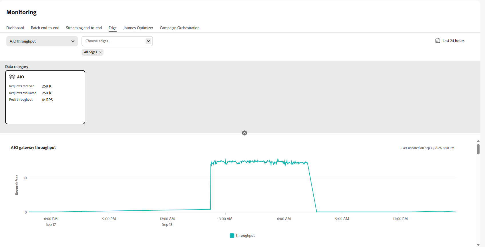
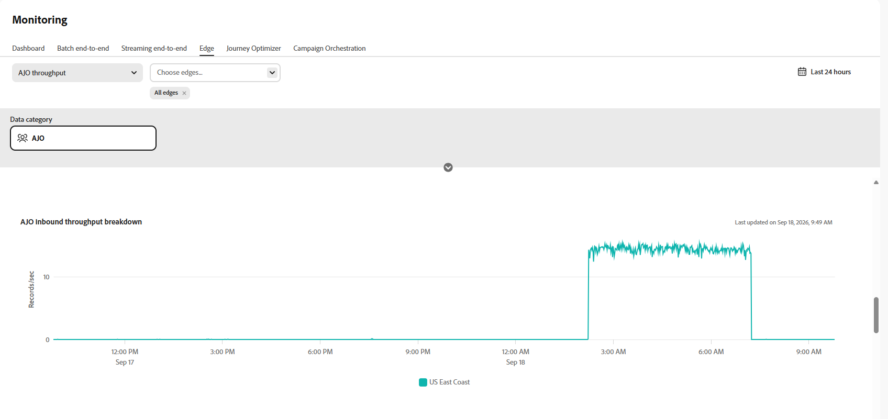
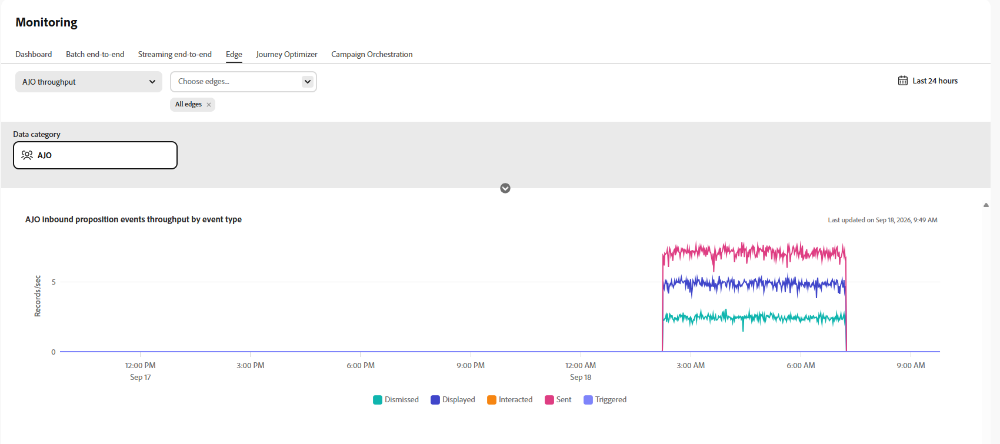

# Monitorización de datos entrantes{#monitoring-edge}

>[!BEGINSHADEBOX]

**En esta página:** Supervise el estado de los datos de entrada en [!DNL Adobe Journey Optimizer] con los gráficos disponibles en **[!UICONTROL Administración de datos]** > **[!UICONTROL Supervisión]** > **[!UICONTROL Edge]**.

>[!ENDSHADEBOX]

El área de trabajo **[!UICONTROL Supervisión]** incluye las siguientes fichas:

| Tabulación | Descripción | Documentación |
|---|---|---|
| **[!UICONTROL Tablero]** | Revise la actividad y el estado del flujo de datos en sus flujos de datos. | [Panel de monitorización de flujo de datos](https://experienceleague.adobe.com/en/docs/experience-platform/dataflows/ui/monitor){target="_blank"} |
| **[!UICONTROL Lote de extremo a extremo]** | Monitorice el flujo de extremo a extremo y la calidad de los datos ingeridos por lotes. | [Ingesta de datos de extremo a extremo por lotes](https://experienceleague.adobe.com/en/docs/experience-platform/ingestion/quality/monitor-data-ingestion#monitor-batch-end-to-end-data-ingestion){target="_blank"} |
| **[!UICONTROL Transmisión de extremo a extremo]** | Monitorice el flujo de extremo a extremo y la calidad de los datos ingeridos por streaming. | [Transmisión de ingesta de datos de extremo a extremo](https://experienceleague.adobe.com/en/docs/experience-platform/ingestion/quality/monitor-data-ingestion#monitor-streaming-end-to-end-data-ingestion){target="_blank"} |
| **[!UICONTROL Edge]** | Monitorizar los datos enviados a Edge Network. Esta página documenta los gráficos específicos de Journey Optimizer disponibles en esta pestaña. | [Supervisar flujos de datos de Edge](https://experienceleague.adobe.com/en/docs/experience-platform/dataflows/ui/monitor-edge){target="_blank"} |

## Monitorización de datos de Journey Optimizer en Edge

Los siguientes gráficos están disponibles en **[!UICONTROL Administración de datos]** > **[!UICONTROL Supervisión]** > **[!UICONTROL Edge]**.

En el menú desplegable, seleccione **[!UICONTROL Rendimiento de AJO]**.

### Rendimiento de AJO Gateway {#gateway-throughput}

El gráfico **[!UICONTROL Rendimiento Global de Puerta de Enlace de AJO]** muestra el número total de registros procesados por la puerta de enlace de Journey Optimizer por segundo a lo largo del tiempo. Utilice esta métrica para monitorizar el volumen general de solicitudes entrantes gestionadas por la puerta de enlace.

### Rendimiento de entrada de AJO {#inbound-throughput}

El gráfico **[!UICONTROL Rendimiento entrante de AJO]** muestra el número total de registros entrantes recibidos por segundo a lo largo del tiempo. Esta métrica mide la velocidad a la que los registros entrantes llegan al servicio de Edge. Utilice este gráfico para revisar el volumen de datos de entrada e identificar los cambios en los niveles de tráfico.

### Desglose del rendimiento entrante de AJO {#inbound-throughput-breakdown}

El gráfico **[!UICONTROL Desglose del rendimiento de entrada de AJO]** muestra los registros de entrada recibidos por segundo a lo largo del tiempo, desglosados por ubicación. Esta métrica mide la tasa de registros entrantes para cada ubicación. Utilice este gráfico para comparar el tráfico entrante entre ubicaciones e identificar una ubicación con un aumento o una disminución inusuales del volumen.

### Latencia de entrada de AJO {#inbound-latency}

El gráfico de latencia entrante de **[!UICONTROL AJO]** muestra el tiempo necesario para procesar las solicitudes entrantes, medido en milisegundos. Esta métrica se presenta como una distribución de los valores de latencia, incluidos percentiles como P50 y P90. Utilice estos valores para comprender la latencia típica de la solicitud e identificar solicitudes de mayor latencia.

### Rendimiento de eventos de propuesta entrante de AJO {#inbound-proposition-events-throughput}

El gráfico **[!UICONTROL Rendimiento Global de Eventos de Propuesta de Entrada de AJO]** muestra el rendimiento de los eventos de propuesta a lo largo del tiempo. Esta métrica mide las señales de seguimiento generadas cuando un usuario interactúa con una oferta personalizada, la visualiza o la déclencheur.

### Rendimiento de eventos de propuesta entrante de AJO por canal {#inbound-proposition-events-throughput-channel}

El gráfico **[!UICONTROL Rendimiento global de eventos de propuesta entrante de AJO por canal]** muestra el rendimiento de eventos de propuesta por canal entrante. Esta métrica mide la actividad de evento de la propuesta agrupada por canal. Los canales disponibles incluyen CBE, en la aplicación y tarjetas de contenido. Utilice este gráfico para comparar la actividad de los canales entrantes.

### Rendimiento de eventos de propuesta entrante de AJO por tipo de evento {#inbound-proposition-events-throughput-event-type}

El gráfico **[!UICONTROL Rendimiento global de eventos de propuesta de entrada de AJO por tipo de evento]** muestra el rendimiento global de eventos de propuesta por tipo de evento. Esta métrica mide la actividad de evento de la propuesta agrupada por resultado. Los tipos de evento disponibles incluyen descartado, suprimido, mostrado, activado, interactuado y enviado. Utilice este gráfico para identificar qué resultados de propuesta-evento contribuyen a la actividad general.

{{$include /help/_includes/do-not-localize/data/ai-augmented-monitoring.md}}