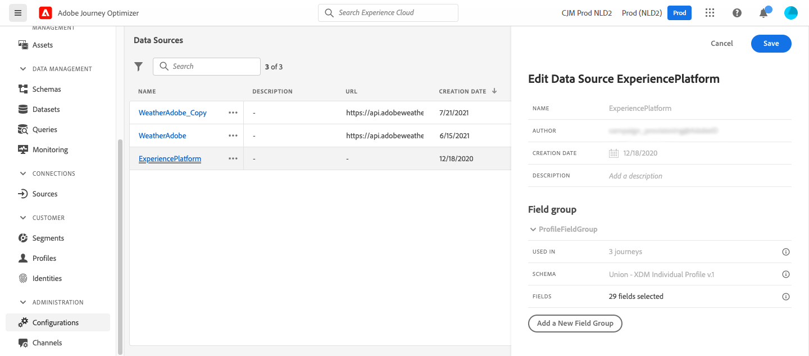

# Fuente de datos de Adobe Experience Platform {#adobe-experience-platform-data-source}

>[!CONTEXTUALHELP]
>id="ajo_journey_data_source_built_in"
>title="Fuente de datos de Adobe Experience Platform"
>abstract="La fuente de datos de Adobe Experience Platform define la conexión con el perfil del cliente en tiempo real de Adobe. Esta fuente de datos está integrada y preconfigurada, y no se puede eliminar. Se ha diseñado para recuperar y utilizar datos del servicio del perfil del cliente en tiempo real; por ejemplo, comprobar si la persona que ha entrado un recorrido es una mujer."

La fuente de datos de Adobe Experience Platform define la conexión con el perfil del cliente en tiempo real de Adobe. Esta fuente de datos está integrada y preconfigurada, y no se puede eliminar. Esta fuente de datos está diseñada para recuperar y utilizar datos del servicio Perfil del cliente en tiempo real (por ejemplo, comprobar si la persona que ha introducido un recorrido es una mujer). Para obtener más información sobre el perfil del cliente en tiempo real de Adobe, consulte [Documentación de Adobe Experience Platform](https://experienceleague.adobe.com/docs/experience-platform/profile/home.html?lang=es){target="_blank"}.

Para permitir la conexión al servicio Perfil del cliente en tiempo real, debemos utilizar una clave para identificar a una persona y un área de nombres que contextualice la clave. Como resultado, solo puede utilizar este origen de datos si los recorridos comienzan con un evento que contiene una clave y un área de nombres. [Más información](../building-journeys/journey.md).

Puede editar el grupo de campos preconfigurado denominado &quot;ProfileFieldGroup&quot;, añadir otros nuevos y eliminar los que no se utilizan en ningún recorrido en borrador o activo. [Más información](../datasource/configure-data-sources.md#define-field-groups).

>[!CAUTION]
>
>No se admite el uso de eventos de experiencia en expresiones/condiciones de recorrido. Si su caso de uso requiere el uso de eventos de experiencia, considere métodos alternativos. [Más información](../building-journeys/exp-event-lookup.md)

A continuación se detallan los pasos principales para agregar grupos de campos a la fuente de datos integrada:

1. En la lista de orígenes de datos, seleccione el origen de datos integrado **Adobe Experience Platform**.

   Se abre el panel de configuración de la fuente de datos en el lado derecho de la pantalla.

   

1. Seleccione **[!UICONTROL Agregar un nuevo grupo de campos]** para definir una [nueva serie de campos que recuperar](../datasource/configure-data-sources.md#define-field-groups).

   

1. Seleccione un esquema de la lista desplegable **[!UICONTROL Esquema]**. La creación de esquemas se realiza en Adobe Experience Platform, no en Adobe Journey Optimizer.

   >[!NOTE]
   >
   >Solo se admiten esquemas basados en perfiles individuales de XDM en la configuración de Data Source [!DNL Journey Optimizer]. Para obtener más información, consulte [Clase de perfil individual de XDM](https://experienceleague.adobe.com/es/docs/experience-platform/xdm/classes/individual-profile){target="_blank"}.

1. Seleccione los campos que desea utilizar y guarde los cambios.

>[!TIP]
>
>Pase el ratón sobre el nombre de un grupo de campos para ver dos iconos a la derecha. Use esto para **duplicar** o **eliminar** el grupo de campos. Tenga en cuenta que el icono **[!UICONTROL Delete]** solo está disponible si el grupo de campos no se usa en ningún recorrido de **Live**, **Draft** o **Finished**. Consulte el campo **[!UICONTROL Utilizado en]** para comprobar si este es el caso.
