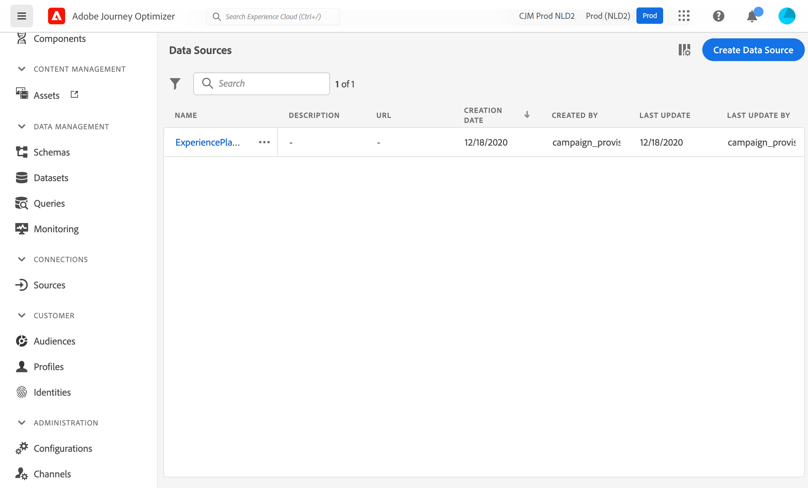

# Configuración de una fuente de datos {#configure-data-source}

Estos son los pasos principales de la configuración de la fuente de datos:

>[!NOTE]
>
>La configuración de la fuente de datos siempre la realiza un **usuario técnico**.

1. En la sección del menú ADMINISTRACIÓN , seleccione **[!UICONTROL Configurations]**. En el  **[!UICONTROL Data Sources]** , haga clic en **[!UICONTROL Manage]**. Se muestra la lista de las fuentes de datos. Consulte [esta página](../start/user-interface.md) para obtener más información sobre la interfaz.

   

1. A continuación, puede agregar grupos de campos a la fuente de datos integrada (consulte [esta página](../datasource/adobe-experience-platform-data-source.md)) o crear una nueva fuente de datos externa (consulte [esta página](../datasource/external-data-sources.md)) y grupos de campos asociados (consulte [esta página](../datasource/configure-data-sources.md#define-field-groups)).

   

1. Haga clic en **[!UICONTROL Save]**.

   La fuente de datos está ahora configurada y lista para utilizarse en sus recorridos.

## Define field groups {#define-field-groups}

Los grupos de campos son conjuntos de campos que se pueden recuperar de un origen de datos y utilizar en un recorrido.

For each data source, you can define several field groups.

For example, you can create a field group with the telephone number, the email, the first name and the address of the profile. A continuación, podrá utilizar estos datos en el recorrido para crear condiciones. For example, you can decide to send an SMS only if the profile&#39;s telephone number is not empty. Si está vacío, puede enviar un correo electrónico.

Aunque se añada automáticamente un nombre predeterminado, le recomendamos que asigne un nombre al grupo de campos. Indeed, the field group name will be visible to other users in [!DNL Journey Optimizer]. Giving a relevant name to field groups is a best practice.

When a data source field is used in a journey, the system will retrieve all the fields defined for that field group. Por lo tanto, es recomendable seleccionar solo los campos que necesita para sus recorridos. Esto reducirá la latencia de las solicitudes en los recorridos, lo que aumenta el rendimiento. Tenga en cuenta que puede agregar fácilmente más campos en grupos de campos más adelante.

El número de recorridos que utilizan un grupo de campos se muestra en la variable **[!UICONTROL Used in]** campo . You can click the **[!UICONTROL View journeys]** button to display the list of journeys using this field group.

>[!NOTE]
>
>Tenga en cuenta que si un grupo de campos no tiene ningún campo, no se mostrará en el editor de expresiones.

## Ciclo de vida del grupo de campos {#field-group-lifecycle}

You can add or remove fields from a field group that is not used in any draft or live journey.

You can add but you cannot remove a field from a field group used in one or more draft or live journeys. Esto evitará romper recorridos.

Para eliminar un campo de un grupo de campos utilizado en uno o varios recorridos, siga estos pasos. Veamos un ejemplo de un grupo de campos denominado &quot;Grupo de campos A&quot;.

1. In the list of field groups, place the cursor on “Field Group A” and click on the **[!UICONTROL Duplicate]** icon located on the right. Asigne un nombre al grupo de campos duplicado &quot;Grupo de campos B&quot;, por ejemplo.
1. In &quot;Field Group B”, remove the fields you no longer want.
1. In &quot;Field Group A”, check where this field group is used. This information is displayed in the **[!UICONTROL Used in]** field.
1. Open all the journeys which use &quot;Field Group A”.
1. Cree nuevas versiones de cada uno de estos recorridos. Edite todas las actividades utilizando &quot;Grupo de campos A&quot; y seleccione &quot;Grupo de campos B&quot;.
1. Detenga las versiones anteriores de los recorridos que utilizan &quot;Grupo de campos A&quot;. Por lo tanto, no debe tener ningún recorrido usando &quot;Grupo de campos A&quot;.
1. Elimine &quot;Grupo de campos A&quot; porque ya no se utiliza.
