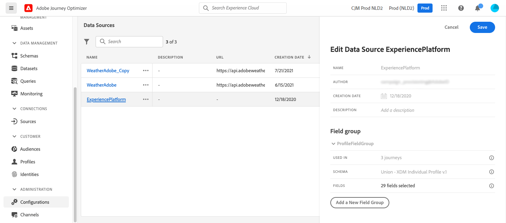

# Configuración de una fuente de datos {#configure-data-source}

>[!NOTE]
>
>La configuración de la fuente de datos siempre la realiza un **usuario técnico**.

Para configurar una fuente de datos, siga los pasos a continuación:

1. En la sección del menú ADMINISTRACIÓN, seleccione **[!UICONTROL Configuraciones]**. En la sección **[!UICONTROL Fuentes de datos]**, haga clic en **[!UICONTROL Administrar]**. Se muestra la lista de las fuentes de datos. Consulte [esta página](../start/user-interface.md) para obtener más información sobre la interfaz.

   

1. A continuación, puede agregar grupos de campos al origen de datos integrado (vea [esta página](../datasource/adobe-experience-platform-data-source.md)) o crear un nuevo origen de datos externo (vea [esta página](../datasource/external-data-sources.md)) y grupos de campos asociados (vea [esta página](../datasource/configure-data-sources.md#define-field-groups)).

   

1. Haga clic en **[!UICONTROL Guardar]**.

   La fuente de datos está ahora configurada y lista para utilizarse en sus recorridos.

## Definir grupos de campos {#define-field-groups}

Los grupos de campos son conjuntos de campos que se pueden recuperar de una fuente de datos y utilizar en un recorrido.

Para cada fuente de datos, se pueden definir varios grupos de campos.

Por ejemplo, puede crear un grupo de campos con el número de teléfono, el correo electrónico, el nombre y la dirección del perfil. A continuación, podrá utilizar estos datos en su recorrido para crear condiciones. Por ejemplo, puede decidir enviar una notificación push solo si el cliente ha instalado la aplicación móvil. Si está vacío, puede enviar un correo electrónico.

Aunque se añada automáticamente un nombre predeterminado, le recomendamos que asigne un nombre al grupo de campos. De hecho, el nombre del grupo de campos será visible para otros usuarios en [!DNL Journey Optimizer]. Se recomienda asignar un nombre relevante a los grupos de campos.

Cuando se utiliza un campo de fuente de datos en un recorrido, el sistema recupera todos los campos definidos para ese grupo de campos. Por lo tanto, se recomienda seleccionar solo los campos que necesite para sus recorridos. Esto reducirá la latencia de la solicitud en los recorridos y, por lo tanto, aumentará el rendimiento. Tenga en cuenta que puede agregar fácilmente más campos en grupos de campos más adelante.

El número de recorridos que utilizan un grupo de campos se muestra en el campo **[!UICONTROL Utilizado en]**. Puede hacer clic en el botón **[!UICONTROL Ver recorridos]** para mostrar la lista de recorridos usando este grupo de campos.

>[!NOTE]
>
>Tenga en cuenta que si un grupo de campos no tiene ningún campo, no se muestra en el editor de expresiones.

## Ciclo de grupo de campos {#field-group-lifecycle}

Puede agregar o quitar campos de un grupo de campos que no se utilicen en ningún recorrido en borrador o activo.

Si el grupo de campos se utiliza en uno o varios recorridos en borrador o activos, puede añadir gradualmente nuevos campos desde el esquema seleccionado, pero no puede anular la selección, eliminar ni modificar los campos que ya se han seleccionado. No se permiten las actualizaciones de un grupo de campos si se modifican campos de esquema existentes que ya utilizan los borradores o los recorridos activos; por ejemplo, al cambiar el tipo de datos de un campo. Esto evitará romper los recorridos

Para eliminar un campo de un grupo de campos utilizado en uno o varios recorridos, siga estos pasos. Veamos un ejemplo de un grupo de campos denominado &quot;Grupo de campos A&quot;.

1. En la lista de grupos de campos, coloque el cursor en &quot;Grupo de campos A&quot; y haga clic en el icono **[!UICONTROL Duplicate]** ubicado a la derecha. Asigne al grupo de campos duplicado el nombre &quot;Grupo de campos B&quot;, por ejemplo.
1. En &quot;Grupo de campos B&quot;, elimine los campos que ya no desee.
1. En &quot;Grupo de campos A&quot;, compruebe dónde se utiliza este grupo de campos. Esta información se muestra en el campo **[!UICONTROL Utilizado en]**.
1. Abra todos los recorridos que utilicen &quot;Grupo de campos A&quot;.
1. Cree nuevas versiones de cada uno de estos recorridos. Edite todas las actividades utilizando &quot;Grupo de campos A&quot; y seleccione &quot;Grupo de campos B&quot;.
1. Detenga las versiones antiguas de los recorridos que utilizan &quot;Grupo de campos A&quot;. Entonces no debería tener ningún recorrido usando &quot;Grupo de campos A&quot;.
1. Elimine &quot;Grupo de campos A&quot; porque ya no se utiliza.
