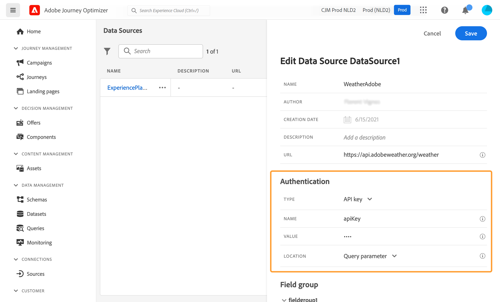

# Fuentes de datos externas {#external-data-sources}

>[!CONTEXTUALHELP]
>id="ajo_journey_data_source_custom"
>title="Fuentes de datos externas"
>abstract="Las fuentes de datos externas le permiten definir una conexión a sistemas de terceros, por ejemplo, si utiliza un sistema de reserva de hoteles para comprobar si la persona ha reservado una habitación. A diferencia de la fuente de datos integrada de Adobe Experience Platform, puede crear tantas fuentes de datos externas como necesite."

## Trabajo con fuentes de datos externas {#gs-ext-data-sources}

Las fuentes de datos externas le permiten definir una conexión a sistemas de terceros, por ejemplo, si utiliza un sistema de reserva de hoteles para comprobar si la persona ha reservado una habitación. A diferencia de la fuente de datos integrada de Adobe Experience Platform, puede crear tantas fuentes de datos externas como necesite.

>[!NOTE]
>
>* Las protecciones al trabajar con sistemas externos se enumeran en [esta página](../configuration/external-systems.md).
>
>* Como las respuestas ahora son compatibles, debe utilizar acciones personalizadas en lugar de fuentes de datos para casos de uso de fuentes de datos externas. Para obtener más información sobre las respuestas, consulte esta [sección](../action/action-response.md)

Las API de REST que utilizan POST o GET y arrojan JSON son compatibles. Se admiten los modos de autenticación básica y personalizada de la clave de API.

Veamos el ejemplo de un servicio de API meteorológica que quiero usar para personalizar el comportamiento de mi recorrido según los datos del tiempo real.

Estos son dos ejemplos de llamada API:

* _https://api.adobeweather.org/weather?city=London,uk&amp;appid=1234_
* _https://api.adobeweather.org/weather?lat=35&amp;lon=139&amp;appid=1234_

La llamada se compone de una dirección URL principal (_https://api.adobeweather.org/weather_), dos conjuntos de parámetros (&quot;ciudad&quot; para la ciudad y &quot;lat/long&quot; para la latitud y longitud) y la clave de API (appid).

>[!TIP]
>
>Se recomienda dejar al menos un minuto de búfer entre el período de caducidad del token de la API externa y la configuración de Journey Optimizer [`cacheDuration` ](#custom-authentication-access-token), especialmente en cargas de trabajo pesadas, para evitar discrepancias de caducidad y errores 401.

## Creación y configuración de una fuente de datos externa {#create-ext-data-sources}

A continuación se muestran los pasos principales para crear y configurar una nueva fuente de datos externa:

1. En la lista de orígenes de datos, haga clic en **[!UICONTROL Crear Source de datos]** para crear un nuevo origen de datos externo.

   

   Se abre el panel de configuración de la fuente de datos en el lado derecho de la pantalla.

   

1. Escriba un nombre para la fuente de datos.

Solo se permiten caracteres alfanuméricos y guiones bajos. La longitud máxima es de 30 caracteres.

1. Añada una descripción a la fuente de datos. Este paso es opcional.
1. Añada la dirección URL del servicio externo. En nuestro ejemplo: _https://api.adobeweather.org/weather_.

   >[!CAUTION]
   >
   >Recomendamos encarecidamente utilizar HTTPS por motivos de seguridad. Tenga en cuenta también que no permitimos el uso de direcciones de Adobe que no están disponibles para el público ni de direcciones IP.

   

1. Configure la autenticación según la configuración del servicio externo: **[!UICONTROL Sin autenticación]**, **[!UICONTROL Básico]**, **[!UICONTROL Personalizado]** o **[!UICONTROL Clave de API]**.

   Para el modo de autenticación básico, debe introducir un nombre de usuario y una contraseña.

   >[!NOTE]
   >
   >* Cuando se realiza la llamada de autenticación, se agrega la cadena `<username>:<password>`, codificada en base64, en el encabezado Autenticación.
   >
   >* Adobe Journey Optimizer cifra automáticamente los secretos definidos en las acciones personalizadas. Las claves de cifrado de cada organización se administran de forma segura en un almacén dedicado vinculado a su organización. Cuando las credenciales se muestran en la interfaz de, se enmascaran de forma predeterminada para evitar una exposición accidental.


   Para obtener más información acerca del modo de autenticación personalizada, vea [esta sección](../datasource/external-data-sources.md#custom-authentication-mode). En nuestro ejemplo, elegimos el modo de autenticación de clave de API, como se muestra a continuación:

   * **[!UICONTROL Tipo]**: &quot;clave de API&quot;
   * **[!UICONTROL Nombre]**: &quot;appid&quot; (el nombre del parámetro de clave de API)
   * **[!UICONTROL Valor]**: &quot;1234&quot; (el valor de nuestra clave de API)
   * **[!UICONTROL Ubicación]**: &quot;Parámetro de consulta&quot; (la clave de API se encuentra en la dirección URL)

     

1. Agregue un nuevo grupo de campos para cada conjunto de parámetros de API haciendo clic en **[!UICONTROL Agregar nuevo grupo de campos]**. El nombre del grupo de campos solo puede contener caracteres alfanuméricos y guiones bajos. La longitud máxima es de 30 caracteres. En nuestro ejemplo, necesitamos crear dos grupos de campos, uno para cada conjunto de parámetros (city y long/lat).

Para el conjunto de parámetros &quot;long/lat&quot;, creamos un grupo de campos con la siguiente información:

* **[!UICONTROL Utilizado en]**: muestra el número de recorridos que utilizan un grupo de campos. Puede hacer clic en el icono **[!UICONTROL Ver recorridos]** para mostrar la lista de recorridos usando este grupo de campos.
* **[!UICONTROL Método]**: seleccione el método POST o GET. En nuestro caso, seleccionamos el método GET.
* **[!UICONTROL Valores dinámicos]**: escriba los diferentes parámetros separados por coma, &quot;long,lat&quot; en nuestro ejemplo. Dado que los valores de parámetro dependen del contexto de ejecución, se definirán en los recorridos. [Más información](../building-journeys/expression/expressionadvanced.md)
* **[!UICONTROL Carga de respuesta]**: haga clic dentro del campo **[!UICONTROL Carga útil]** y pegue un ejemplo de la carga útil devuelta por la llamada. Para nuestro ejemplo, hemos utilizado una carga útil encontrada en un sitio web de la API meteorológica. Compruebe que los tipos de campo son correctos. Cada vez que se llama a la API, el sistema recupera todos los campos incluidos en el ejemplo de carga útil. Tenga en cuenta que puede hacer clic en **[!UICONTROL Pegar una nueva carga útil]** si desea cambiar la carga útil que se pasa actualmente.
* **[!UICONTROL Carga útil enviada]**: este campo no aparece en nuestro ejemplo. Solo está disponible si selecciona el método POST. Pegue la carga útil que se enviará al sistema de terceros.

En el caso de una llamada de GET que requiera parámetros, ingrese los parámetros en el campo **[!UICONTROL Valores dinámicos]** y se agregarán automáticamente al final de la llamada. En caso de una llamada POST, debe hacer esto:

* enumera los parámetros que se pasarán en el momento de la llamada en el campo **[!UICONTROL Valores dinámicos]** (en el ejemplo siguiente: &quot;identificador&quot;).
* Especificarlos también con la misma sintaxis en el cuerpo de la carga útil enviada. Para ello, debe agregar: &quot;param&quot;: &quot;nombre del parámetro&quot; (en el ejemplo siguiente: &quot;identificador&quot;). Siga esta sintaxis:

```json
{"id":{"param":"identifier"}}
```


Una vez guardados los cambios, la fuente de datos está configurada y lista para utilizarse en los recorridos, por ejemplo en las condiciones o para personalizar un correo electrónico. Si la temperatura es superior a 30 °C, puede decidir enviar una comunicación específica.

## Modo de autenticación personalizado {#custom-authentication-mode}

>[!CONTEXTUALHELP]
>id="jo_authentication_payload"
>title="Acerca de la autenticación personalizada"
>abstract="El modo de autenticación personalizada se utiliza en la autenticación compleja para llamar a protocolos de ajuste de API como OAuth2. La ejecución de la acción es un proceso de dos pasos. En primer lugar, se realiza una llamada al punto final para generar el token de acceso. A continuación, el token de acceso se inserta en la petición HTTP de la acción."

El modo de autenticación personalizado se utiliza para la autenticación compleja, utilizada frecuentemente para llamar a protocolos de ajuste de API como OAuth2, para recuperar un token de acceso que se va a insertar en la petición HTTP real de la acción.

Cuando configure la autenticación personalizada, use **[!UICONTROL Haga clic para comprobar el botón de autenticación]** y controlar si la carga de autenticación personalizada está configurada correctamente.


Cuando la prueba se realiza correctamente, el botón se vuelve verde.


Con este modo de autenticación, la ejecución de la acción es un proceso de dos pasos:

1. Llame al extremo para generar el token de acceso.
1. Llame a la API de REST mediante la inyección adecuada del token de acceso.


>[!NOTE]
>
>**Esta autenticación consta de dos partes.**

### Definición del extremo al que se va a llamar para generar el token de acceso{#custom-authentication-endpoint}

* `endpoint`: dirección URL que se utilizará para generar el extremo
* método de la petición HTTP en el extremo (`GET` o `POST`)
* `headers`: pares clave-valor que se insertarán como encabezados en esta llamada si es necesario
* `body`: describe el cuerpo de la llamada si el método es POST. Apoyamos una estructura de cuerpo limitada, definida en bodyParams (pares clave-valor). bodyType describe el formato y la codificación del cuerpo en la llamada:
   * `form`: lo que significa que el tipo de contenido será application/x-www-form-urlencoded (charset UTF-8) y que los pares clave-valor se serializarán tal cual: key1=value1&amp;key2=value2&amp;...
   * `json`: lo que significa que el tipo de contenido será application/json (charset UTF-8) y que los pares clave-valor se serializarán como un objeto json tal cual: _{ &quot;key1&quot;: &quot;value1&quot;, &quot;key2&quot;: &quot;value2&quot;, ...}_

### Definición de la forma en que se debe insertar el token de acceso en la petición HTTP de la acción{#custom-authentication-access-token}

* **authorizationType**: define cómo se debe insertar el token de acceso generado en la llamada HTTP para la acción. Los valores posibles son:

   * `bearer`: indica que el token de acceso debe inyectarse en el encabezado Autorización, como: _Autorización: Portador &lt;token de acceso>_
   * `header`: indica que el token de acceso debe insertarse como encabezado, el nombre del encabezado definido por la propiedad `tokenTarget`. Por ejemplo, si `tokenTarget` es `myHeader`, el token de acceso se insertará como un encabezado como: _myHeader: &lt;token de acceso>_
   * `queryParam`: indica que el token de acceso debe insertarse como queryParam, el nombre del parámetro de consulta definido por la propiedad tokenTarget. Por ejemplo, si tokenTarget es myQueryParam, la dirección URL de la llamada de acción será: _&lt;url>?myQueryParam=&lt;token de acceso>_

* **tokenInResponse**: indica cómo extraer el token de acceso de la llamada de autenticación. Esta propiedad puede ser:
   * `response`: indica que la respuesta HTTP es el token de acceso
   * un selector en un json (suponiendo que la respuesta es un json, no se admiten otros formatos como XML). El formato de este selector es _json://&lt;ruta a la propiedad token de acceso>_. Por ejemplo, si la respuesta de la llamada es: _{ &quot;access_token&quot;: &quot;theToken&quot;, &quot;timestamp&quot;: 12323445656 }_, tokenInResponse será: _json: //access_token_

El formato de esta autenticación es:

```json
{
    "type": "customAuthorization",
    "endpoint": "<URL of the authentication endpoint>",
    "method": "<HTTP method to call the authentication endpoint, in 'GET' or 'POST'>",
    (optional) "headers": {
        "<header name>": "<header value>",
        ...
    },
    (optional, mandatory if method is 'POST') "body": {
        "bodyType": "<'form'or 'json'>,
        "bodyParams": {
            "param1": value1,
            ...
        }
    },
    "tokenInResponse": "<'response' or json selector in format 'json://<field path to access token>'",
    "cacheDuration": {
        (optional, mutually exclusive with 'duration') "expiryInResponse": "<json selector in format 'json://<field path to expiry>'",
        (optional, mutually exclusive with 'expiryInResponse') "duration": <integer value>,
        "timeUnit": "<unit in 'milliseconds', 'seconds', 'minutes', 'hours', 'days', 'months', 'years'>"
    },
    "authorizationType": "<value in 'bearer', 'header' or 'queryParam'>",
    (optional, mandatory if authorizationType is 'header' or 'queryParam') "tokenTarget": "<name of the header or queryParam if the authorizationType is 'header' or 'queryParam'>",
}
```

>[!NOTE]
>
>Encode64 es la única función disponible en la carga útil de autenticación.

Puede cambiar la duración de caché del token para una fuente de datos de autenticación personalizada. A continuación se muestra un ejemplo de una carga útil de autenticación personalizada. La duración de la caché se define en el parámetro `cacheDuration`. Especifica la duración de retención del token generado en la caché. La unidad puede ser milisegundos, segundos, minutos, horas, días, meses, años.

Este es un ejemplo del tipo de autenticación del portador:

```json
{
    "type": "customAuthorization",
    "endpoint": "https://<your_auth_endpoint>/epsilon/oauth2/access_token",
    "method": "POST",
    "headers": {
      "Authorization": "Basic EncodeBase64(<epsilon Client Id>:<epsilon Client Secret>)"
    },
    "body": {
      "bodyType": "form",
      "bodyParams": {
        "scope": "cn mail givenname uid employeeNumber",
        "grant_type": "password",
        "username": "<epsilon User Name>",
        "password": "<epsilon User Password>"
      }
    },
    "tokenInResponse": "json://access_token",
    "cacheDuration": {
      "duration": 5,
      "timeUnit": "minutes"
    },
  },
```

>[!NOTE]
>
>* El token de autenticación se almacena en caché por recorrido: si dos recorridos utilizan la misma acción personalizada, cada recorrido tiene su propio token en caché. Ese token no se comparte entre esos recorridos.
>
>* La duración de la caché ayuda a evitar demasiadas llamadas a los extremos de autenticación. La retención del token de autenticación se almacena en caché en los servicios, no hay persistencia. Si se reinicia un servicio, se inicia con una caché limpia. La duración de la caché de forma predeterminada es de 1 hora. En la carga útil de autenticación personalizada, se puede adaptar especificando otra duración de retención.
>

Este es un ejemplo del tipo de autenticación de encabezado:

```json
{
  "type": "customAuthorization",
  "endpoint": "https://myapidomain.com/v2/user/login",
  "method": "POST",
  "headers": {
    "x-retailer": "any value"
  },
  "body": {
    "bodyType": "form",
    "bodyParams": {
      "secret": "any value",
      "username": "any value"
    }
  },
  "tokenInResponse": "json://token",
  "cacheDuration": {
    "expiryInResponse": "json://expiryDuration",
    "timeUnit": "minutes"
  },
  "authorizationType": "header",
  "tokenTarget": "x-auth-token"
} 
```

A continuación, se muestra un ejemplo de la respuesta de la llamada de API de inicio de sesión:

```json
{
  "token": "xDIUssuYE9beucIE_TFOmpdheTqwzzISNKeysjeODSHUibdzN87S",
  "expiryDuration" : 5
}
```

>[!CAUTION]
>
>Al configurar la autenticación personalizada para una acción personalizada, tenga en cuenta que se admiten `bodyParams`objetos JSON anidados (por ejemplo, subobjetos dentro de **)**.