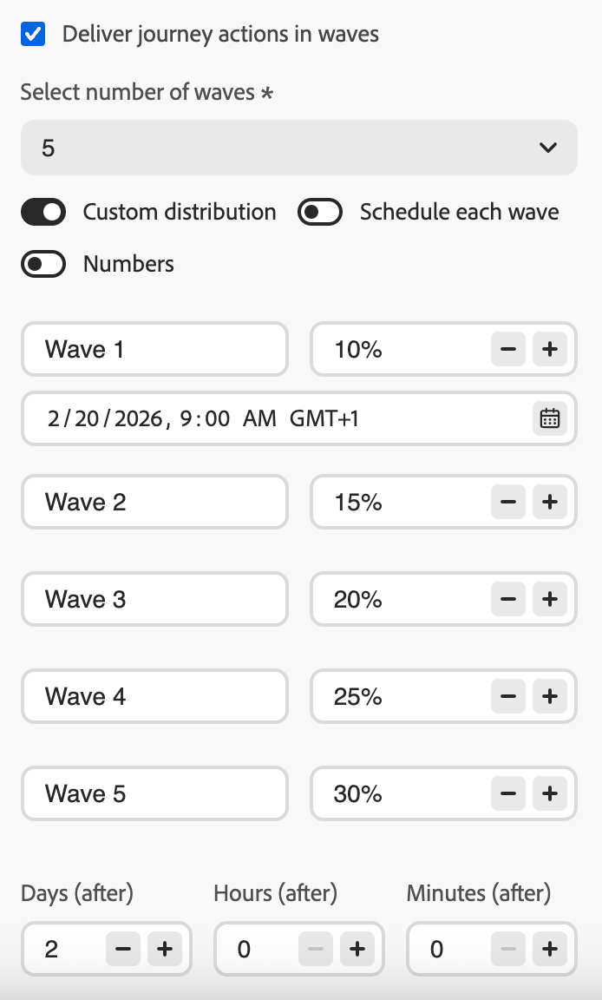

# Envío mediante olas {#send-using-waves}

>[!BEGINSHADEBOX]

**En esta página:** Aprenda a dividir el envío de mensajes salientes en lotes programados, llamados olas, para equilibrar la carga, proteger la reputación del remitente y mejorar la capacidad de envío. El envío de ondas está disponible en recorridos de lectura-audiencia, campañas de acción y campañas orquestadas.

>[!ENDSHADEBOX]

En lugar de enviar todos los mensajes a la vez, puede programar el envío en lotes controlados llamados **waves**. El envío de ondas le ayuda a:

* Equilibre la carga y proteja los sistemas descendentes (como centros de llamadas o páginas de aterrizaje) para que no se vean saturados
* Compatibilidad con la capacidad de entrega y la reputación del remitente, especialmente para envíos de gran volumen
* Aumente progresivamente el volumen de envío al calentar una nueva IP o plataforma

Se define el número de olas, su tamaño (como porcentaje de la audiencia o como números absolutos) y cuándo se ejecuta cada ola.

## Limitaciones y barreras {#limitations-guardrails}

Las siguientes limitaciones se aplican al envío de ondas en cualquier contexto:

* El envío de ondas solo se aplica a **canales salientes** (correo electrónico, SMS, push, correo directo).
* Debe definir al menos **2 olas** y puede agregar **10 ondas**.
* El intervalo mínimo entre el inicio de dos olas es de **30 minutos**.
* No se puede establecer un inicio de ola en el pasado.

Se aplican restricciones adicionales específicas del contexto:

>[!BEGINTABS]

>[!TAB Leer recorridos de audiencia]

* El envío de ondas solo está disponible para recorridos de audiencia de lectura con los tipos de programador **[!DNL As soon as possible]** y **[!UICONTROL Once]**. [Más información sobre el horario de recorrido](../building-journeys/read-audience.md#schedule).
* El envío de ondas no está disponible para recorridos recurrentes, activados por eventos, de evento empresarial, de modo de prueba o de ejecución en seco.
* No se puede iniciar una ola antes del inicio del recorrido.
* Dividir la audiencia en olas puede tardar hasta 1 hora. Es posible que los perfiles no entren en el recorrido hasta que se complete la división.
* Dentro de una sola versión de recorrido, dos olas nunca se ejecutan al mismo tiempo. La siguiente ola comienza solo después de que haya finalizado la anterior. Por ejemplo, si las olas se programan con una diferencia de 1 hora, pero la primera ola se ejecuta durante 2 horas, la segunda ola se inicia cuando termina la primera, no en su hora programada originalmente.
* Los inicios de ola se pueden retrasar cuando la plataforma aplica límites de cuota o cuando la capacidad del sistema está bajo una carga pesada.

>[!TAB Campañas de acción]

* No se puede iniciar una ola antes del inicio de la campaña.

>[!TAB Campañas orquestadas]

* El envío de ondas se configura en el **nivel de actividad de canal**, de forma independiente para cada actividad de canal en la campaña.

>[!ENDTABS]

## Configurar el envío de olas {#configure-wave-sending}

>[!CONTEXTUALHELP]
>id="ajo_wave_sending"
>title="Envío mediante olas"
>abstract="Divida la entrega de mensajes en lotes programados (olas) para controlar el volumen a lo largo del tiempo. Puede definir hasta 10 olas con intervalos y tamaños iguales o personalizados."

>[!CONTEXTUALHELP]
>id="ajo_orchestration_wave_sending"
>title="Envío mediante olas"
>abstract="Divida la entrega de mensajes en lotes programados (olas) para controlar el volumen a lo largo del tiempo. Puede definir hasta 10 olas con intervalos y tamaños iguales o personalizados."

Los pasos para habilitar el envío de ondas dependen del contexto: recorrido de lectura-audiencia o campaña de acción. Seleccione la pestaña correspondiente a continuación y consulte la sección [Tamaño y temporización de la onda](#wave-options) para finalizar la configuración.

>[!BEGINTABS]

>[!TAB Leer recorridos de audiencia]

1. Inicie el recorrido con una actividad [Leer audiencia](../building-journeys/read-audience.md).

1. Haga doble clic en la actividad **[!UICONTROL Leer audiencia]** para abrir sus propiedades y seleccione la opción **[!UICONTROL Enviar acción de recorrido en olas]**.

   {width="100%"}

1. Establezca el **número de olas** (por ejemplo, 4).

   {width="80%"}

   >[!NOTE]
   >
   >Se deben definir al menos 2 olas y se pueden añadir hasta 10.

1. Elige cómo definir el tamaño y el tiempo de la onda como se detalla en la sección [Tamaño y tiempo de la onda](#wave-options) a continuación.

>[!TAB Campañas de acción]

1. Cree o abra una [campaña de acción](../campaigns/create-campaign.md) que contenga una acción saliente (correo electrónico, SMS, push o correo directo).

1. En la ficha **[!UICONTROL Programar]** de la campaña, seleccione **[!UICONTROL Enviar acciones de campaña en olas]**.

   {width="100%"}

   >[!NOTE]
   >
   >La opción **[!UICONTROL Enviar acciones de campaña en olas]** solo se muestra cuando se selecciona una acción saliente en la pestaña **[!UICONTROL Acciones]** de la campaña. [Más información](../campaigns/campaign-action.md)

1. Defina el número de olas (por ejemplo, 4).

   >[!NOTE]
   >
   >Se deben definir al menos 2 olas y se pueden añadir hasta 10.

1. Elige cómo definir el tamaño y el tiempo de la onda como se detalla en la sección [Tamaño y tiempo de la onda](#wave-options) a continuación.

>[!TAB Campañas orquestadas]

1. Abra una actividad de canal (correo electrónico, SMS, push o correo postal) en el lienzo de la campaña orquestada.

1. Vaya a la pestaña **[!UICONTROL Programar]** de la actividad del canal.

1. En **[!UICONTROL Programación de olas]**, habilite la opción **[!UICONTROL Enviar en olas]**.

   {width="90%"}

1. Defina el número de olas utilizando la lista desplegable **[!UICONTROL Seleccionar número de olas]**.

   >[!NOTE]
   >
   >Se deben definir al menos 2 olas y se pueden añadir hasta 10.

1. Elige cómo definir el tamaño y el tiempo de la onda como se detalla en la sección [Tamaño y tiempo de la onda](#wave-options) a continuación.

>[!ENDTABS]

## Tamaño y tiempo de onda {#wave-options}

Una vez establecido el número de olas, defina cómo se distribuye la audiencia entre ellas y cuándo se ejecuta cada ola. Hay tres opciones disponibles:

* [Olas iguales](#equal-waves): divida la audiencia en partes de igual tamaño con un intervalo fijo entre inicios de ola. Ideal para envíos directos y con tiempo variable.
* [Distribución personalizada](#custom-distribution): establezca manualmente el tamaño de cada ola como un porcentaje o un número absoluto de perfiles. Es ideal para ampliaciones progresivas o divisiones de audiencia desiguales.
* [Programación personalizada](#custom-schedule): asigne una fecha y hora de inicio específicas a cada ola. Es mejor cuando necesita una sincronización precisa que no siga un intervalo regular.

### Olas iguales {#equal-waves}

De forma predeterminada, la audiencia se divide en olas de igual tamaño. Establezca un intervalo fijo entre el inicio de cada ola (por ejemplo, 2 horas). A continuación, el sistema programa automáticamente las olas siguientes: por ejemplo, la primera ola a las 9:00 a.m., la segunda a las 11:00 a.m., la tercera a las 1:00 p.m. y la cuarta a las 3:00 p.m.

{width="80%"}

>[!NOTE]
>
>El intervalo mínimo entre el inicio de dos olas es de **30 minutos**.

### Distribución personalizada {#custom-distribution}

Seleccione la opción **[!UICONTROL Distribución personalizada]** para definir el tamaño de cada ola como un porcentaje de la audiencia total (por ejemplo, 15%, 20%, 25%, 40%).

{width="80%"}

Seleccione **[!UICONTROL Números]** para definir el tamaño de cada ola como un número absoluto de perfiles (por ejemplo, 10 000; 50 000).

{width="80%"}

>[!NOTE]
>
>* Al utilizar porcentajes, todas las olas deben sumar el 100%. Si no es así, se muestra una advertencia.
>
>* Cuando se usan números, el sistema no valida la cobertura total; asegúrese de que los tamaños de ola cubran la audiencia deseada. [Más información](#faq)

### Programación personalizada {#custom-schedule}

Seleccione **[!UICONTROL Programar cada ola]** para definir una fecha y hora de inicio específicas para cada ola. No es necesario espaciar uniformemente las olas (por ejemplo, 9:00, 11:00, 17:00, 20:30).

{width="80%"}

>[!NOTE]
>
>El intervalo mínimo entre el inicio de dos olas es de **30 minutos**.

## Casos de uso {#use-cases}

El envío de ondas le ayuda a controlar cuándo y cuántos mensajes se emiten, lo que mejora la capacidad de envío, protege la reputación del remitente y alinea los envíos con su capacidad operativa. Considere la posibilidad de utilizar olas en estos escenarios:

* **Centro de llamadas o administración de respuestas:** Limite la cantidad de mensajes que se emiten por día o por hora para que los equipos intermedios (por ejemplo, el servicio de atención al cliente) puedan gestionar las respuestas a una velocidad manejable.

  {width="30%"}

* **Gran volumen y capacidad de entrega:** Evite enviar una audiencia muy grande de una sola vez. La propagación de la entrega a lo largo del tiempo ayuda a mantener la reputación del remitente y reduce el riesgo de ser marcado como correo no deseado.

  {width="30%"}

* **calentamiento de IP:** Al usar una nueva plataforma o dirección IP, aumente progresivamente el volumen (por ejemplo, 10% en la primera ola, luego 15%, 20%, etc.) para generar gradualmente la reputación de envío.

  {width="30%"}

## Preguntas frecuentes {#faq}

+++ ¿Qué sucede si la suma de los tamaños de onda no es igual a la audiencia total?

* Si la suma **supera** la audiencia (por ejemplo, se programan 100 000 en la primera ola para una audiencia de 80 000), la primera ola envía a la audiencia completa y las olas restantes no tienen perfiles restantes; no se ejecutan.
* Si la suma **es menor que la audiencia (por ejemplo, define cuatro olas que suman un total de 40 000 perfiles para una audiencia de 100 000), solo los perfiles incluidos en esas olas recibirán el mensaje.** Los perfiles restantes no reciben la comunicación y no se vuelven a intentar en olas posteriores.

+++

+++ ¿Puedo asignar diferentes segmentos de contenido o audiencia a olas individuales?

No. Solo se puede definir el tamaño y el tiempo de cada ola. La misma audiencia y el mismo contenido de mensaje se aplican a todas las olas: no puede segmentar segmentos diferentes ni utilizar contenido diferente por ola.

+++

+++ ¿Se vuelve a evaluar la audiencia antes de cada ola o se fija en el momento de la activación?

La audiencia se **evalúa una vez** en la activación (cuando se activa el recorrido o se inicia la campaña o actividad). En ese momento se toma una instantánea de los perfiles aptos que se utiliza en todas las olas (la pertenencia a la audiencia no se vuelve a evaluar antes de cada ola subsiguiente).

Sin embargo, **los atributos de perfil se leen en el momento en que se procesa cada ola**, no en la activación. Esto significa que para las olas se extienden a lo largo de varios días:

* Los atributos de Personalization (por ejemplo, el nombre o el nivel de fidelidad de un perfil) reflejan el estado del perfil en el momento en que se ejecuta la oleada.
* **Las comprobaciones de consentimiento y supresión se vuelven a aplicar a la hora de envío para cada ola.** Si un perfil se excluye entre dos olas, no recibirá mensajes en olas posteriores.

En resumen: *who* se incluye es un problema corregido por adelantado, pero *los datos utilizados para personalizar y enviar a esos perfiles* reflejan su estado actual cuando se procesa su ola.

+++

+++ ¿Funciona el envío de ondas con los canales entrantes?

No. El envío de ondas solo se aplica a las **acciones salientes** del canal: correo electrónico, SMS, notificaciones push y correo directo. Los canales entrantes (como las experiencias web, en la aplicación o basadas en código) no se ven afectados por la configuración del envío de ondas.

+++

## Consulte también {#see-also}

* [Usar una audiencia en un recorrido](../building-journeys/read-audience.md): configure la actividad Leer audiencia
* [Programar una campaña de acción](../campaigns/campaign-schedule.md): establezca la fecha de inicio, la fecha de finalización y la frecuencia
* [Actividades de canal en campañas orquestadas](../orchestrated/activities/channels.md): configure actividades de canal en el lienzo orquestado

+++ Referencia de conocimientos de AI

Esta sección contiene conocimientos estructurados destinados a apoyar la interpretación, la recuperación y la respuesta a preguntas relacionadas con este tema.

Para una comprensión completa, esta información debe combinarse con la documentación de esta página. Ninguna de las fuentes pretende ser independiente; la página describe la función, mientras que esta sección proporciona contexto adicional que ayuda a desambiguar la terminología, la intención, la aplicabilidad y las restricciones.

* **TL;DR:** En esta página se explica cómo configurar el envío de oleadas en Adobe Journey Optimizer para que entregue mensajes salientes en lotes controlados a lo largo del tiempo, lo que mejora la capacidad de envío y protege la reputación del remitente. El envío de ondas está disponible en recorridos de lectura-audiencia, campañas de acción y campañas orquestadas.

**Intenciones:**

* Habilite el envío de ondas en un recorrido Leer audiencia, una campaña de acción o una actividad de canal de campaña orquestada
* Configurar ondas iguales con un intervalo fijo entre cada ola
* Definir tamaños de onda personalizados como porcentajes o recuentos de perfiles absolutos
* Programar cada ola con una fecha y hora de inicio específicas
* Controle el volumen de entrega para proteger la reputación del remitente o alinearlo con la capacidad operativa

**Glosario:**

* **Envío de ondas**: Modo de envío que divide la audiencia en lotes (olas) y envía mensajes a cada lote a intervalos programados en lugar de todos a la vez *(específico del producto)*
* **Olas iguales**: Una configuración en la que la audiencia se divide en partes de igual tamaño con un intervalo fijo entre inicios de ola *(específico del producto)*
* **Distribución personalizada**: Una configuración en la que el tamaño de cada ola se define manualmente como porcentaje o número absoluto de perfiles *(específicos del producto)*
* **Programación personalizada**: Una configuración en la que cada ola tiene una fecha y hora de inicio específicas, lo que permite un espaciado no uniforme *(específico del producto)*

**Contextos donde el envío de ondas está disponible:**

* Leer recorridos de audiencia (&quot;Lo antes posible&quot; o solo programador &quot;Una vez&quot;, no para recorridos recurrentes, activados por eventos, de evento empresarial, de prueba o de ejecución en seco)
* Campañas de acción (solo acciones de canal saliente)
* Campañas organizadas (solo actividades de canal saliente, configuradas por actividad de canal)

**Protecciones comunes (todos los contextos):**

* Mínimo 2 olas, máximo 10 olas
* Mínimo de 30 minutos entre el inicio de dos olas consecutivas
* El inicio de la ola no puede ser del pasado
* La distribución personalizada basada en porcentajes debe sumar el 100 %
* La distribución personalizada basada en números no valida automáticamente la cobertura total

**protecciones específicas del Recorrido:**

* El inicio de ola no puede ser antes del inicio del recorrido
* La división de audiencias puede tardar hasta 1 hora; los perfiles pueden retrasarse
* Dos olas nunca se ejecutan simultáneamente dentro de la misma versión de recorrido
* Los inicios de ola se pueden retrasar por los límites de cuota de plataforma o la carga pesada del sistema

**PREGUNTAS MÁS FRECUENTES:**

* **Q: ¿El envío de ondas se aplica a los canales entrantes?** — No; solo de salida (correo electrónico, SMS, push, correo directo).
* **Q: ¿Puedo asignar contenido diferente a olas individuales?** — No; la misma audiencia y contenido para todas las olas. Solo pueden diferir el tamaño y el tiempo.
* **Q: ¿Cuál es el tiempo mínimo entre dos olas?** — 30 minutos entre el inicio de dos olas consecutivas.
* **Q: ¿Qué sucede si el tamaño de las olas supera o no alcanza la audiencia?** — Exceso: la primera ola envía a la audiencia completa, las olas restantes no se ejecutan. Escasez: solo los perfiles de las olas definidas reciben el mensaje; el resto no se vuelve a intentar.
* **Q: ¿Se reevalúa la audiencia por ola?** — No; la audiencia se captura al activarse. Los atributos de perfil (personalización, consentimiento) se leen en el momento del procesamiento de la ola.

+++
