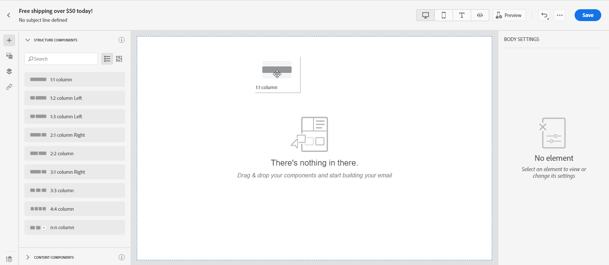

# Empezar desde cero {#create-email-content}

>[!CONTEXTUALHELP]
>id="ac_structure_components"
>title="Acerca de los componentes de estructura"
>abstract="Los componentes de estructura definen el diseño del correo electrónico."

>[!CONTEXTUALHELP]
>id="ac_edition_columns"
>title="Definición de columnas de correo electrónico"
>abstract="El Diseñador de correo electrónico permite definir fácilmente el diseño del correo electrónico definiendo la estructura de columnas."

El Diseñador de correo electrónico le permite definir fácilmente la estructura del correo electrónico. Al agregar y mover elementos estructurales con simples acciones de arrastrar y soltar, puede diseñar la forma de su correo electrónico en cuestión de segundos.

Para empezar a crear el contenido del correo electrónico con el diseñador de correo electrónico, siga los pasos a continuación:

1. En la página de inicio del Diseñador de correo electrónico, seleccione la opción **[!UICONTROL Design from scratch]** .

   

1. Empiece a diseñar el contenido del correo electrónico arrastrando y soltando **[!UICONTROL Structure components]** para definir el diseño del correo electrónico.

   >[!NOTE]
   >
   >Tenga en cuenta que la pila de columnas no es compatible con todos los programas de correo electrónico. Cuando no se admita, las columnas no se apilarán.
   >
   >Una vez colocados en el correo electrónico, no puede mover ni eliminar los componentes a menos que ya haya un componente de contenido o un fragmento colocado en él.

   

1. Agregar tantos **[!UICONTROL Structure components]** según sea necesario.

   Seleccione el **[!UICONTROL n:n column]** para definir el número de columnas que elija (entre 3 y 10). También puede definir el ancho de cada columna moviendo las flechas en la parte inferior de cada columna.

   >[!NOTE]
   >
   >Cada tamaño de columna no puede ser inferior al 10 % de la anchura total del componente de estructura. No se puede quitar una columna que no esté vacía.

1. En el **[!UICONTROL Content components]** , puede agregar **[!UICONTROL Content components]** según sus necesidades en el componente de estructura. [Descubra más información sobre los componentes de contenido](content-components.md).

   

1. Cada componente se puede personalizar aún más con el **[!UICONTROL Component settings]** para obtener más información. Por ejemplo, puede cambiar el estilo del texto, el relleno o el margen del componente. [Obtenga más información sobre la alineación y el relleno](adjusting-vertical-alignment-and-padding.md).

   

1. En el **[!UICONTROL Assets picker]**, puede añadir directamente los recursos almacenados en la variable **[!UICONTROL Assets library]** a su correo electrónico. [Obtenga más información sobre la administración de recursos](assets-essentials.md).

   Haga doble clic en la carpeta que contiene los recursos y arrastre y suelte el recurso que desea agregar al correo electrónico.

   

1. Agregue campos de personalización para personalizar el contenido de los datos de perfil. [Descubra más información sobre la personalización del contenido](../personalization/personalize.md).

   

1. En el **[!UICONTROL Links]** en el panel izquierdo, compruebe la lista de todas las direcciones URL del contenido que se rastrearán. Puede modificar sus **[!UICONTROL Tracking Type]**, **[!UICONTROL Label]** y **[!UICONTROL Tags]** si es necesario.

   

   >[!NOTE]
   >
   >Obtenga más información sobre los vínculos y el seguimiento de mensajes en [esta página](message-tracking.md).

1. Si es necesario, puede cambiar al editor de código para personalizar aún más el correo electrónico haciendo clic en **[!UICONTROL Switch to code editor]** en el menú avanzado. Para obtener más información sobre el editor de código, consulte [esta página](code-content.md#).

   >[!NOTE]
   >
   >No podrá utilizar el diseñador visual para este correo electrónico después de cambiar al editor de código.

   

1. Haga clic en **[!UICONTROL Show preview]** para comprobar la renderización del correo electrónico. Puede elegir la vista de escritorio o la vista móvil.

   Para obtener más información sobre la vista previa del correo electrónico, consulte [esta página](preview.md).

   

1. Cuando el correo electrónico esté listo, haga clic en **[!UICONTROL Save & Close]**.

