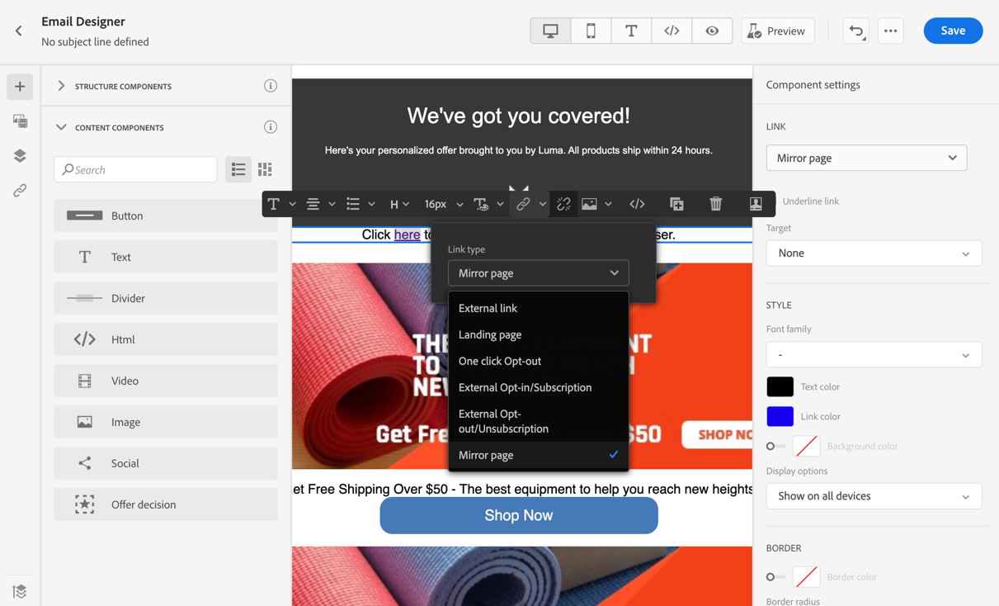

# Adición de vínculos y seguimiento de mensajes {#tracking}

Uso [!DNL Journey Optimizer] para añadir vínculos al contenido y realizar un seguimiento de los mensajes enviados para controlar el comportamiento de los destinatarios.

## Habilitar el seguimiento {#enable-tracking}

Puede habilitar el seguimiento a nivel de mensaje de correo electrónico comprobando la variable **[!UICONTROL Aperturas de correo electrónico]** y/o **[!UICONTROL Haga clic en el correo electrónico]** opciones [crear el mensaje](../messages/get-started-content.md).

>[!NOTE]
>
>Ambas opciones están habilitadas de forma predeterminada.

Esto le permite hacer un seguimiento del comportamiento de sus destinatarios a través de:

* **[!UICONTROL Aperturas de correo electrónico]**: Mensajes que se han abierto.
* **[!UICONTROL Haga clic en el correo electrónico]**: Haga clic en los vínculos de un correo electrónico.

## Insertar vínculos {#insert-links}

Al diseñar un mensaje, puede agregar vínculos al contenido.

>[!NOTE]
>
>When [el seguimiento está habilitado](#enable-tracking), se rastrearán todos los vínculos incluidos en el contenido del mensaje.

Para insertar vínculos en el contenido del correo electrónico, siga los pasos a continuación:

1. Seleccione un elemento y haga clic en **[!UICONTROL Insertar vínculo]** de la barra de herramientas contextual.

   

1. Elija el tipo de vínculo que desea crear:

   * **[!UICONTROL Vínculo externo]**: Inserte un vínculo a una URL externa.

   * **[!UICONTROL Página de aterrizaje]**: Inserte un vínculo a una página de aterrizaje. Obtenga más información en [esta sección](../landing-pages/get-started-lp.md)

   * **[!UICONTROL Opción de exclusión de un clic]**: Inserte un vínculo para permitir a los usuarios cancelar rápidamente la suscripción a sus comunicaciones sin necesidad de confirmar la exclusión. Obtenga más información en [esta sección](../privacy/opt-out.md#one-click-opt-out).

   * **[!UICONTROL Inclusión/suscripción externa]**: Inserte un vínculo para aceptar la recepción de comunicaciones de su marca.

   * **[!UICONTROL Exclusión/baja externa]**: Inserte un vínculo para cancelar la suscripción a la recepción de comunicaciones de su marca. Obtenga más información sobre la administración de exclusiones en [esta sección](../privacy/opt-out.md#opt-out-management).

   * **[!UICONTROL Página espejo]**: Inserte un vínculo para mostrar el contenido del correo electrónico en un explorador web. Obtenga más información en [esta sección](#mirror-page).

   

1. Puede personalizar los vínculos. Obtenga más información sobre las URL personalizadas en [esta sección](../personalization/personalization-syntax.md#perso-urls).

1. Guarde los cambios.

1. Una vez creado el vínculo, puede modificarlo desde el **[!UICONTROL Configuración de componentes]** a la derecha.

   * Puede editar el vínculo y cambiar su tipo.
   * Puede elegir subrayar el vínculo o no marcando la opción correspondiente.

   

>[!NOTE]
>
>Los mensajes de correo electrónico de tipo de marketing deben incluir un [vínculo de no participación](../privacy/opt-out.md#opt-out-management), que no es necesario para los mensajes transaccionales. La categoría del mensaje (**[!UICONTROL Marketing]** o **[!UICONTROL Transaccional]**) se define en el nivel de [superficie de canal](../configuration/channel-surfaces.md#email-type) (es decir, ajuste preestablecido de mensaje) y durante la [creación del mensaje](../messages/get-started-content.md#create-new-message).

## Vínculo a una página espejo {#mirror-page}

La página espejo es una página HTML accesible en línea mediante un navegador web. Su contenido es idéntico al del correo electrónico.

Para añadir un vínculo a una página espejo en el correo electrónico, [insertar un vínculo](#insert-links) y seleccione **[!UICONTROL Página espejo]** como tipo de vínculo.

La página espejo se crea automáticamente.

>[!IMPORTANT]
>
>Los vínculos de páginas espejo se generan automáticamente y no se pueden editar. Contienen todos los datos personalizados cifrados necesarios para procesar el correo electrónico original. Como resultado, el uso de atributos personalizados con valores grandes puede generar direcciones URL de páginas espejo largas, lo que puede impedir que el vínculo funcione en exploradores web que tengan una longitud máxima de direcciones URL.

Una vez enviado el correo electrónico, cuando los destinatarios hacen clic en el vínculo de la página espejo, el contenido del correo electrónico se muestra en su navegador web predeterminado.

>[!NOTE]
>
>En el [prueba](preview.md#send-proofs) enviado a los perfiles de prueba, el vínculo a la página espejo no está activo. Solo se activa en los mensajes finales.

El período de retención de una página espejo es de 60 días. Después de ese retraso, la página espejo ya no estará disponible.

## Administrar seguimiento {#manage-tracking}

La variable [Diseñador de correo electrónico](create-email-content.md) le permite administrar las direcciones URL rastreadas, como editar el tipo de seguimiento para cada vínculo.

1. Haga clic en el **[!UICONTROL Vínculos]** del panel izquierdo para mostrar la lista de todas las direcciones URL del contenido de las que se realizará un seguimiento.

   Esta lista permite tener una vista centralizada y localizar cada URL en el contenido del correo electrónico.

1. Para editar un vínculo, haga clic en el icono de lápiz correspondiente.

   

1. Puede modificar el **[!UICONTROL Tipo de seguimiento]** si es necesario:

   

   Para cada URL rastreada, puede establecer el modo de seguimiento en uno de estos valores:

   * **[!UICONTROL Seguimiento]**: Activa el seguimiento en esta dirección URL.
   * **[!UICONTROL Exclusión]**: Considera esta URL como una URL de exclusión o de baja.
   * **[!UICONTROL Página espejo]**: Considera que esta URL es una URL de página espejo.
   * **[!UICONTROL Nunca]**: Nunca activa el seguimiento de esta dirección URL. <!--This information is saved: if the URL appears again in a future message, its tracking is automatically deactivated.-->

Los informes de aperturas y clics están disponibles en la [Informe activo](../reports/live-report.md) y en el [Informe global](../reports/global-report.md).
